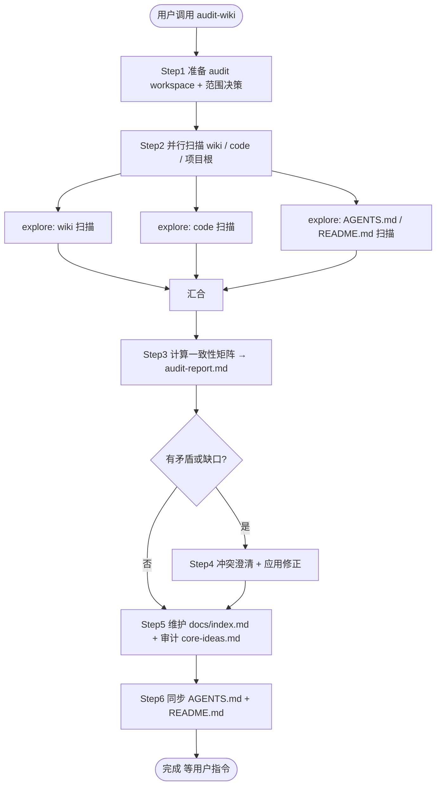

# audit-wiki

## 概述

本 skill 负责把**全量 wiki**、**当前 src 代码**、**项目级上下文**（`AGENTS.md` / `README.md`）三者**对齐**，并维护 `docs/index.md` 索引页。

**核心边界**：

- **只审计与对齐，不发明**：与 `organize-wiki` 一样，本 skill 不引入策划案 / wiki / 代码中都没有的设计决策。
- **不动 `src/` 代码**：发现 wiki↔code 矛盾时，最多把矛盾**记录**为 TODO 留给后续 coding agent，**或**经用户确认后修改 wiki；本 skill 不会修改任何 `.ts` / `.tsx` / `.css` 文件。
- **与 `organize-wiki` 互补**：`organize-wiki` 处理「策划案 → wiki」的合入；本 skill 处理「wiki ↔ code」「wiki ↔ wiki」「项目根上下文 ↔ 当前文档体系」的对齐。
- **冲突先问**：每一处矛盾都用 question tool 提问，不要静默改写 wiki。
- **可回滚**：所有被修改的文件（wiki / index / AGENTS.md / README.md）写入前先备份到本轮 audit workspace。

## 何时调用

- 一份策划案刚通过 `organize-wiki` 合入 wiki，且对应代码也已实施完毕
- 一段较大的 src 改动落地，担心 wiki 与代码出现漂移
- 长期未审计、文档体系出现增量后，需要重生成 `docs/index.md`
- 想确认 `AGENTS.md` / `README.md` 仍准确反映当前项目状态

## 流程图



## 强制工作流程

进入本 skill 后**立即**用 todowrite 工具按下面的 Step 1-6 创建任务列表，并按顺序逐项推进。

### Step 1: 准备 audit workspace 与范围决策

1. **创建 audit workspace**：在项目根下创建
   ```
   docs/plans/audits/<YYYY-MM-DD-HH-MM>/
   ```
   用本地时间。本轮所有产物（report、备份、diff）都落在这个目录。
2. **用 question tool 让用户选审计范围**：
   ```
   问题：本轮 audit 的范围？
   选项 A：全量审计（扫描所有 wiki + 全部 src + AGENTS.md + README.md）
   选项 B：局部审计（只针对某个子系统 wiki，例如 docs/gameplay/time-system/）
   选项 C：仅维护项目级上下文（跳过 wiki 与 code 的交叉比对，只重建 index.md / 同步 AGENTS.md / README.md）
   ```
   把回答写入 `docs/plans/audits/<YYYY-MM-DD-HH-MM>/scope.md`（包含选择 + 一句话理由 + 涉及的 wiki / src 路径列表）。
3. **罗列待审计文件清单**：
   - 待审计 wiki：`docs/core-ideas.md`、`docs/gameplay/<system>/<system>.md`（递归）、`docs/ui-designs/*.md`
   - 待审计代码：`src/**/*.ts`、`src/**/*.tsx`（按 Step 1.2 的范围裁剪）
   - 待审计项目根：`AGENTS.md`、`README.md`、`opencode.json`
4. **不要预先备份**：备份在 Step 4 真正动手改写前再做（以减少无意义 IO）。

### Step 2: 并行扫描三类素材

并行 dispatch 三个 `@explore` subagent（详细扫描指引见 [`references/audit-protocol.md`](./references/audit-protocol.md) §1）：

- **Wiki 扫描 subagent**：读取 Step 1.3 罗列的所有 wiki 文件，提取每个文件的：
  - frontmatter（`title` / `scope` / `last_updated` / `maintained_by`）
  - 章节 1-2 的「概述 / 设计意图」一句话摘要
  - 章节 3 的关键术语列表
  - 章节 5「机制与规则」中的具体数值、参数、状态名、规则
  - 章节 6「系统交互」中的依赖、被依赖、共享对象、事件
  - 章节 10 的 Open Questions
- **Code 扫描 subagent**：读取 Step 1.3 罗列的所有 src 文件，提取：
  - 每个 system file（`timeSystem.ts` / `eventSystem.ts` / `crewSystem.ts` / `diarySystem.ts`）公开的 type / enum / constant / 关键函数与默认值
  - 页面层（`pages/*.tsx`）的状态字段、行动选项、用户可见的术语
  - 数据层（`data/gameData.ts`）的初始数据结构
  - 类型定义中的常量与上下限（如有）
- **项目根扫描 subagent**：读取 `AGENTS.md` / `README.md` / `opencode.json`，提取：
  - `AGENTS.md` 当前规则
  - `README.md` 的功能概览、目录结构、设计文档入口列表
  - `opencode.json` 的 schema / 配置摘要

三个 subagent 的产出整合写入 `docs/plans/audits/<YYYY-MM-DD-HH-MM>/scan-summary.md`（结构见 `references/audit-protocol.md` §2）。

### Step 3: 计算一致性矩阵 → audit-report.md

用一个 `@general` subagent 基于 `scan-summary.md` 计算三类一致性问题（详见 [`references/audit-protocol.md`](./references/audit-protocol.md) §3）：

- **类别 A：wiki ↔ wiki**：不同 wiki 文件之间的术语 / 数值 / 规则矛盾，或同一 wiki 内章节自相矛盾
- **类别 B：wiki ↔ code**：wiki 描述的状态机 / 参数 / 流程与 src 当前实现不一致
- **类别 C：wiki ↔ design principles**：与 `docs/ui-designs/ui-design-principles.md` 或 `docs/core-ideas.md` 的设计意图抵触
- **类别 D：缺口（gaps）**：代码已有但 wiki 完全没写、或 wiki 已有但代码完全没实现

每条 finding 包含：

- ID（`A-1` / `B-3` / ...）
- 涉及的文件与片段（wiki 路径 + 行号或章节 / code 路径 + 行号）
- 矛盾摘要（一句话）
- 建议处理方式（采用 wiki / 采用 code / 留 TODO / 升级为 Open Question）

输出写入 `docs/plans/audits/<YYYY-MM-DD-HH-MM>/audit-report.md`，结构见 `references/audit-protocol.md` §4。

如果三类全部为零，跳过 Step 4，直接进入 Step 5。

### Step 4: 冲突澄清 + 应用修正

#### 4.1 冲突澄清访谈

按 ID 顺序**逐项**用 question tool 提问，每条 finding 单独问一次：

```
问题：[<finding ID>] [<wiki 章节路径>] <矛盾摘要>

wiki 现状：
> <wiki 原文片段>

代码 / 其他 wiki 现状：
> <对比方原文片段>

请选择：
选项 A：采用 wiki，记录 TODO 让代码后续对齐（不改代码，写 TODO 进 audit-report.md「待代码处理」段）
选项 B：采用代码 / 另一份 wiki，本次修改本 wiki 让其与之对齐
选项 C：均不准确，升级为 Open Question 写进相关 wiki 章节 10
选项 D：合并双方（用户输入新表述）
选项 E：跳过本条，留在「待整理」缓冲区
```

每个决议追加到 `audit-report.md` 末尾的「冲突决议」段。

类别 D（缺口）的提问形式略有不同，常见两类：

- **代码已有但 wiki 没写**：选 A=补 wiki / 选 B=升级为 Open Question / 选 C=跳过
- **wiki 已有但代码没实现**：选 A=保持 wiki 但加「未实现」标记 / 选 B=记 TODO 给代码 / 选 C=从 wiki 删除 / 选 D=升级为 Open Question

#### 4.2 应用修正

对每个被决议要修改的 wiki 文件：

1. **先备份**：把目标文件当前内容完整复制到
   ```
   docs/plans/audits/<YYYY-MM-DD-HH-MM>/backups/<wiki 相对路径>.bak
   ```
2. **改写**：用一个 `@general` subagent 严格按决议改写，**不引入决议之外的内容**。改写时遵循 `organize-wiki/references/wiki-template.md` 的章节结构与去阶段化措辞规则。
3. **末尾追加变更记录行**：在被修改 wiki 的「变更记录 / 来源策划案」表末尾追加一行：
   ```
   | <YYYY-MM-DD> | docs/plans/audits/<YYYY-MM-DD-HH-MM>/audit-report.md | audit 修正：<一句话摘要> |
   ```
4. **更新 frontmatter**：`last_updated: <YYYY-MM-DD>`。

对类别 A 选项「记 TODO 让代码处理」的 finding，把 TODO 条目追加到 `audit-report.md` 的「待代码处理」段；**不要**主动写到 `docs/todo.md`，那是设计 / 文档体系级 TODO，二者不混。

### Step 5: 维护 docs/index.md 与 core-ideas.md 引用

#### 5.1 重新生成 docs/index.md

1. **备份现有 index.md**（如非空）：复制到 `docs/plans/audits/<YYYY-MM-DD-HH-MM>/backups/index.md.bak`。
2. 用一个 `@general` subagent 基于 Step 2 wiki 扫描结果，按 [`references/index-template.md`](./references/index-template.md) 重新生成完整的 `docs/index.md`：
   - 每个 wiki 一行（标题 / scope / last_updated / 一句话概述 / 路径链接）
   - 按 scope 分组（`whole-game` → `system` → `feature`）
   - 末尾追加「系统耦合关系图」：用 mermaid 从各 wiki 章节 6「系统交互」的「依赖于 / 被依赖于」自动汇总
3. 如果某 wiki 缺 frontmatter 字段或概述章节，**不要**在 index 里编造；标 `*（缺字段，待 organize-wiki 补全）*`，并在 `audit-report.md` 末尾「索引页缺口」段记录。

#### 5.2 审计 docs/core-ideas.md

1. 读取 core-ideas.md 当前内容。
2. 用 `@general` subagent 检查：
   - core-ideas.md 中提到的核心理念是否被所有子系统 wiki 体现
   - core-ideas.md 是否引用了已不存在 / 名称已变更的子系统
   - core-ideas.md 是否存在与子系统 wiki 矛盾的高层描述（这通常是类别 A 矛盾，应已在 Step 3-4 处理）
3. 仅当用户在 Step 4 已确认要修订 core-ideas.md 时，才在本步动手；**不主动**为 core-ideas.md 引入未确认的内容。如发现新的、未在 Step 3 报告里出现的不一致，记录到 `audit-report.md`「Step 5 新发现」段，**不**自动改写。

如果 core-ideas.md 当前为空（未由 organize-wiki 写入过），保持空文件，仅在 `audit-report.md` 中记录一句「core-ideas.md 仍为空，待 brainstorm + organize-wiki 写入」。

### Step 6: 同步 AGENTS.md 与 README.md

#### 6.1 AGENTS.md

1. **备份现有 AGENTS.md**：复制到 `docs/plans/audits/<YYYY-MM-DD-HH-MM>/backups/AGENTS.md.bak`。
2. 按 [`references/project-context-guidelines.md`](./references/project-context-guidelines.md) §2 整理：
   - 保留所有用户已写入的强制规则原文（包括"docs 自包含"规则）
   - 在「文档体系」段更新：当前 wiki 总数、文件清单、维护方
   - 在「skill 体系」段更新：可用 skill 列表与各自职责（`game-design-brainstorm` / `organize-wiki` / `audit-wiki`）
   - 在「当前实现状态」段更新：src 已实现的子系统 vs 仅在 wiki 中的子系统
3. **不要**删除任何用户手写的规则；不确定一段是否过时时，问用户：
   ```
   问题：AGENTS.md 中以下规则似乎与当前实现不符，是否更新 / 删除 / 保留？
   原文：> ...
   ```
4. 末尾追加更新时间戳：`<!-- last-synced-by audit-wiki: YYYY-MM-DD -->`。

#### 6.2 README.md

1. **备份现有 README.md**：复制到 `docs/plans/audits/<YYYY-MM-DD-HH-MM>/backups/README.md.bak`。
2. 按 [`references/project-context-guidelines.md`](./references/project-context-guidelines.md) §3 整理：
   - 保留 tech stack / 安装与启动命令 / 部署说明（除非命令本身已变化）
   - 同步「功能概览」：以 src 实际实现为准，不要列 wiki 中尚未实现的功能
   - 同步「目录结构」：用真实的 `src/` 与 `docs/` 树，而非过期描述
   - 同步「设计文档」入口：以 `docs/index.md` 作为入口，避免维护重复链接列表（除非用户明确希望保留页面级链接）
3. 同样末尾追加：`<!-- last-synced-by audit-wiki: YYYY-MM-DD -->`。

#### 6.3 验证

用 `@explore` subagent 确认：

- AGENTS.md / README.md 中没有出现已不存在的文件路径（`docs/old-thing.md`）
- AGENTS.md / README.md 中提到的 src 文件 / 目录都真实存在
- 每个被改动的文件都有备份

## 完成后

简短总结产出：

- audit workspace 路径
- audit-report.md 路径与 finding 总数（按类别 A/B/C/D 分计）
- 被修改的文件清单（wiki / index.md / AGENTS.md / README.md）
- 备份目录路径
- 「待代码处理」TODO 数量

**不要**：

- 自动 commit
- 自动调用 `organize-wiki` 或建议进入下一轮 brainstorm
- 主动改 src 代码

等用户指令决定下一步。

## 失败与回滚

任何 step 写文件失败时：

- **不要**留下半成品文件
- 用 Step 4 / 5 / 6 中的备份覆盖回原文件
- 把失败原因写入 `audit-report.md` 末尾的「失败记录」段

如果用户在 Step 4 中途决定终止 audit：

- 已经做过的修正不回滚（用户已确认过的）
- 在 `audit-report.md` 末尾标注「本轮终止于 finding `<ID>`，剩余 finding 留待下一轮」

## 文件清单（一次完整会话产出 / 更新）

```text
docs/plans/audits/<YYYY-MM-DD-HH-MM>/
+-- scope.md                 # Step 1
+-- scan-summary.md          # Step 2
+-- audit-report.md          # Step 3-4-5
+-- backups/
|   +-- <wiki 相对路径>.bak  # Step 4 / 5 / 6 写入前备份
|   +-- index.md.bak
|   +-- AGENTS.md.bak
|   +-- README.md.bak

docs/index.md                # Step 5 重新生成
docs/core-ideas.md           # Step 5 仅在用户已确认的修订上动
docs/gameplay/<...>/<wiki>.md  # Step 4 仅在用户已确认的修订上动
AGENTS.md                    # Step 6 同步
README.md                    # Step 6 同步
```
