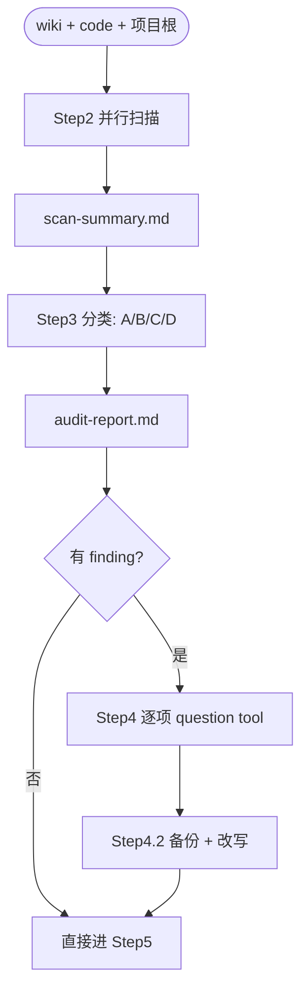

# Audit Protocol（一致性审计协议 / 中文）

本文件由 `audit-wiki` skill 的 Step 2-5 引用，定义如何扫描素材、计算一致性矩阵、产出 `audit-report.md`。

## 总览



## 1. 扫描指引（Step 2）

每个 `@explore` subagent 严格只做扫描与提取，**不做**判断与改写。提取格式如下。

### 1.1 Wiki 扫描 subagent

对每个 wiki 文件输出一段 YAML-ish summary：

```yaml
- path: docs/gameplay/time-system/time-system.md
  frontmatter:
    title: 时间系统
    scope: system
    last_updated: 2026-04-26
    maintained_by: organize-wiki
  overview: <章节 1 一句话>
  intent: <章节 2 一句话>
  terms:
    - name: 时段
      definition: <章节 3 中的定义>
  rules:
    - <章节 5.2 中的一条规则原文>
  params:
    - <章节 5.3 中的参数原文>
  interactions:
    depends_on: [<...>]
    depended_by: [<...>]
    shared_state: [<...>]
    events: [<...>]
  open_questions:
    - <章节 10 中的 Q1 原文>
```

如某章节为空（`*（暂无）*`），对应字段写 `[]` 或 `null`，**不要**编造内容。

### 1.2 Code 扫描 subagent

针对 `src/` 提取**事实**而非解释。重点对象：

- **System 文件**（`timeSystem.ts` / `eventSystem.ts` / `crewSystem.ts` / `diarySystem.ts`）：
  - 顶层导出的 `type` / `interface` / `enum` / `const`
  - 默认值（例如 `const DAY_LENGTH = 24`）
  - 关键函数签名 + 一行作用注释（来自代码本身的注释，不是推测）
- **Page 文件**（`pages/*.tsx`）：
  - 用户可见的中文 / 英文术语（按钮文字、状态标签、事件名）
  - 状态字段（`useState` 的字段名）
  - 行动选项数组（如有 `actions: [...]`）
- **数据文件**（`data/gameData.ts`）：
  - 初始数据结构（资源 / 队员 / 地图地块 / 事件等）
  - 关键常量

输出格式：

```yaml
- path: src/timeSystem.ts
  exports:
    - kind: const
      name: DAY_LENGTH
      value: "24"
    - kind: type
      name: TimeOfDay
      members: ["dawn", "day", "dusk", "night"]
    - kind: function
      name: advanceTime
      signature: "(state: GameState, hours: number) => GameState"
      doc: <函数自身的注释，如有>
  user_facing_terms:
    - <代码字符串中出现的 UI 文字>
```

### 1.3 项目根扫描 subagent

输出格式：

```yaml
agents_md:
  rules:
    - <每条规则原文>
readme_md:
  sections:
    - heading: 技术栈
      bullets: [...]
    - heading: 功能概览
      bullets: [...]
    - heading: 目录结构
      tree: |
        <ascii 树>
    - heading: 设计文档
      links: [...]
opencode_json:
  agents: [...]
  permissions: {...}
```

### 1.4 汇总写入

由本 skill 自身把三个 subagent 的产出原样拼接到 `docs/plans/audits/<YYYY-MM-DD-HH-MM>/scan-summary.md`。**不要**总结 / 重述 / 过滤——后续 Step 3 需要原始事实做对比。

## 2. scan-summary.md 结构

```markdown
---
audit_workspace: docs/plans/audits/<YYYY-MM-DD-HH-MM>
date: <YYYY-MM-DD HH:MM>
---

# Scan Summary

## 1. Wikis
<!-- 来自 Step 2 wiki 扫描 subagent 的逐文件输出，按路径字典序 -->

## 2. Code
<!-- 来自 Step 2 code 扫描 subagent 的逐文件输出 -->

## 3. Project Root
<!-- 来自 Step 2 项目根扫描 subagent 的输出 -->
```

## 3. 一致性矩阵（Step 3）

按下表的轴生成 finding。每条 finding 走「定位 → 摘要 → 建议」三段：

### 3.1 类别 A：wiki ↔ wiki

触发条件：

- 同一术语在两个不同 wiki 中定义不同（按 `terms[].name` 字典）
- 同一参数 / 数值在两个不同 wiki 中不同
- A wiki 的「依赖于」列了 X，X wiki 的「被依赖于」却没列 A
- 同一 wiki 内章节 5（机制）与章节 7（场景）描述自相矛盾

### 3.2 类别 B：wiki ↔ code

触发条件：

- wiki 章节 3 定义术语 X，src 中找不到 X 对应的 type / const / enum
- wiki 章节 5.3 写参数默认值 = 24，src 中 `DAY_LENGTH = 36`
- wiki 章节 5.1 状态机有 4 个状态，src `enum` 只有 3 个
- wiki 章节 6 列「事件 / 信号」E，src 没有任何代码 emit / listen E
- src 用户可见 UI 文字与 wiki 章节 3 / 4 中的术语写法不一致（例如 wiki 写「时段」，UI 写「Time of Day」且无对应中文）

判定要点：

- **代码即事实**：当 wiki 与 code 矛盾时，**默认建议**采用 code（除非用户明确表示 wiki 是目标设计、代码尚未跟上）
- **用户可见文案**：UI 文案与 wiki 不同 → 一定升级为 finding，由用户决定哪边是规范

### 3.3 类别 C：wiki ↔ design principles

触发条件：

- 子系统 wiki 中的描述违反 `docs/ui-designs/ui-design-principles.md` 中明文写下的原则
- 子系统 wiki 中的描述违反 `docs/core-ideas.md` 中的恒定设计意图

注意：违反"原则"通常是**故意取舍**或**遗漏更新**，不要直接判矛盾，先看 wiki 章节 8 是否已经写明「我们选了 X 而非 Y」。如果有理由，记录为「可疑」而非「矛盾」。

### 3.4 类别 D：缺口（gaps）

触发条件：

- src 已实现的 system 在 wiki 中**完全不存在**（例如 `src/diarySystem.ts` 存在但 `docs/gameplay/diary/` 没有 wiki）
- wiki 列出的核心机制在 src 中**完全没有任何对应代码**
- AGENTS.md / README.md 引用了已不存在的文件
- `docs/index.md` 没收录某个已存在的 wiki

### 3.5 优先级

每条 finding 标一个 priority：

| Priority | 含义 |
| --- | --- |
| `P0` | 用户可见行为或核心规则的硬矛盾（数值不同、状态机不同） |
| `P1` | 术语不一致 / 章节自相矛盾 / 缺口 |
| `P2` | 风格 / 注释 / 可疑（未必矛盾） |

`P0` 必问，`P1` 必问，`P2` 可在 audit-report.md 中提示但不强求修复。

## 4. audit-report.md 结构

```markdown
---
audit_workspace: docs/plans/audits/<YYYY-MM-DD-HH-MM>
date: <YYYY-MM-DD HH:MM>
scope: <来自 scope.md：full | partial:<system> | project-only>
---

# Audit Report

## 0. 总计

| 类别 | 数量 |
| --- | --- |
| A. wiki ↔ wiki | <n> |
| B. wiki ↔ code | <n> |
| C. wiki ↔ principles | <n> |
| D. 缺口 | <n> |

## 1. 类别 A：wiki ↔ wiki

### A-1: <一句摘要>
- **优先级**：P0 | P1 | P2
- **涉及文件**：
  - `docs/...` 章节 X
  - `docs/...` 章节 Y
- **wiki 1 原文**：
  > <片段>
- **wiki 2 原文**：
  > <片段>
- **建议处理**：<...>

### A-2: ...

## 2. 类别 B：wiki ↔ code

### B-1: <一句摘要>
- **优先级**：P0 | P1 | P2
- **涉及文件**：
  - wiki：`docs/...` 章节 X
  - code：`src/...:行号`
- **wiki 原文**：
  > <片段>
- **code 现状**：
  ```ts
  <片段>
  ```
- **建议处理**：<采用 wiki / 采用 code / TODO / Open Question>

### B-2: ...

## 3. 类别 C：wiki ↔ principles
<!-- 同上结构 -->

## 4. 类别 D：缺口
<!-- 同上结构 -->

---

## 5. 冲突决议（Step 4 写入）

### A-1
- **决议**：选项 B（采用 wiki 2）
- **理由**：<用户简述>
- **修改文件**：`docs/...`
- **修改时间**：<HH:MM>

### A-2 / B-1 / ...

---

## 6. 待代码处理（Step 4 类别 B 选项 A 写入）
<!-- 这是给后续 coding agent 看的；本 skill 不修改 src -->
- [ ] <文件路径> <一句话描述：把 X 从 24 改为 36 以匹配 wiki>
- [ ]

---

## 7. 索引页缺口（Step 5 写入）
<!-- index.md 重生成时发现的 wiki frontmatter 缺字段 -->
- `docs/.../<wiki>.md` 缺 `last_updated` 字段
- `docs/.../<wiki>.md` 章节 1 概述为空

---

## 8. Step 5 新发现（如有）
<!-- 在 Step 5 审计 core-ideas.md 时新发现、Step 3 报告未覆盖的不一致 -->

---

## 9. 失败记录（如有）
*（暂无）*
```

## 5. 写入与备份

写入 wiki / index.md / AGENTS.md / README.md 之前，**总是**先备份：

```
docs/plans/audits/<YYYY-MM-DD-HH-MM>/backups/<原文件相对路径>.bak
```

例：

- `docs/gameplay/time-system/time-system.md` → `docs/plans/audits/2026-04-26-22-30/backups/docs/gameplay/time-system/time-system.md.bak`
- `AGENTS.md` → `docs/plans/audits/2026-04-26-22-30/backups/AGENTS.md.bak`

**不删备份**——长期保留作为审计轨迹。

## 6. 反模式（不要做的事）

- ❌ 静默改 wiki：每条 finding 都要问
- ❌ 改 src 代码：本 skill 永远不改 `.ts` / `.tsx` / `.css`
- ❌ 把 audit 当 brainstorm：发现需要新决策时，记 Open Question / 升级到 brainstorm，**不**自己拍板
- ❌ 把 audit 当 organize-wiki：发现要把策划案合入 wiki 时，提示用户去用 organize-wiki，**不**自己处理
- ❌ 把 `audit-report.md` 中的 TODO 写进 `docs/todo.md`：`docs/todo.md` 是设计 / 文档体系级 TODO；audit 的 TODO 是临时性的代码对齐项，分开放
- ❌ 一次问多个 finding：每个 finding 单独提问
- ❌ 跳过备份：失去回滚能力
- ❌ 自动 commit：改完等用户决定何时提交
