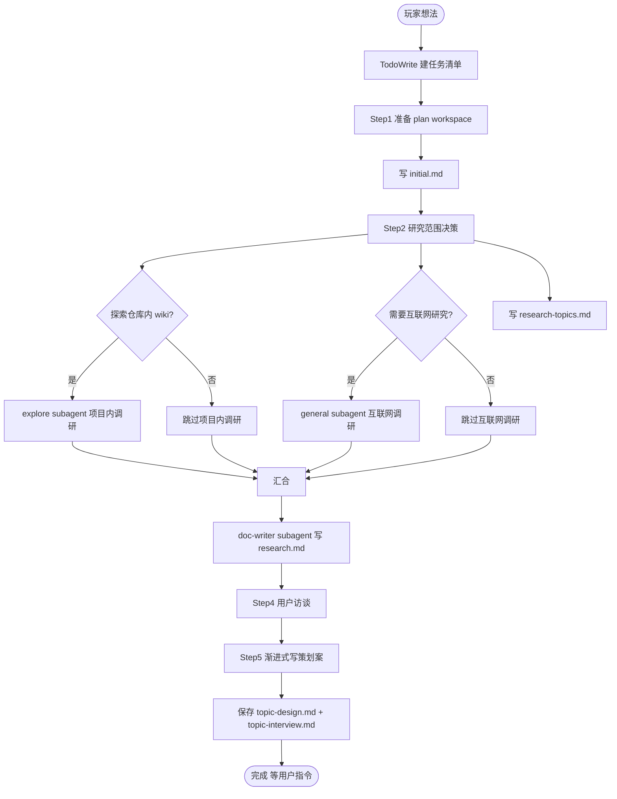

# game-design-brainstorm

## 概述

把玩家或设计者脑中的一个**游戏设计想法**转化为一份结构化的、可逐段确认的**中文增量策划案**。策划案落在 `docs/plans/YYYY-MM-DD-HH-MM/` 目录下，作为后续实施与 wiki 整理的源头。

**重要边界**：

- 这不是 wiki 全量描述（wiki 由 organize-wiki skill 维护）
- 这不是技术实现方案（实现交给后续的 coding agent）
- 这是**单次设计提议**，包含本轮变更视角与阶段化（MVP / Later / 不做）

## 反模式：「这只是个小机制，不需要 brainstorm」

每个游戏机制 / 系统 / 玩法变更都需要走这个流程。

- 机制改动看起来"简单"——通常恰恰是因为大量未经检验的假设隐藏在简单措辞下
- "玩家会觉得有趣" / "和别的系统兼容" / "不会破坏节奏"——这些都是假设，必须明面化
- 简单的设计可以让策划案很短（几段话即可），但**必须**先展示策划案、得到确认，才进入实施

## 流程图



## 强制工作流程

进入本 skill 后**立即**用 todowrite 工具按下面的 Step 1-5 创建任务列表，并按顺序逐项推进。

### Step 1: 准备 plan workspace

1. 检查项目根目录下是否有 `docs/plans/` 文件夹，没有则创建
2. 在 `docs/plans/` 下创建一个 `YYYY-MM-DD-HH-MM` 命名的子目录（用本地时间）
3. 把用户最初输入完整记录到 `docs/plans/YYYY-MM-DD-HH-MM/initial.md`，不做总结、不删信息

**约定**：本次 brainstorm 的所有产物都放在这个 `YYYY-MM-DD-HH-MM` 目录下。后文出现的 `<topic>` 由你与用户在访谈中确定（短横线小写，例如 `time-system`、`crew-call-event`）。

### Step 2: 研究范围决策（用 question tool 提问）

用 question tool 问两个问题：

1. **是否探索仓库内已有 wiki**（单选）：
   ```
   问题：是否需要在动手访谈前，先探索现有 docs（core-ideas、gameplay/、ui-designs/）？
   选项 A：请扫描现有 docs，找出与本次想法相关的部分（避免重复造轮子，对接已有约束）
   选项 B：不用，直接进入访谈
   ```

2. **互联网研究主题**（多选）：根据用户输入识别 2-4 个值得调研的方向，每个方向给出一句话的"为什么需要查"。最后一项始终是"不用探索"。例如：
   ```
   问题：以下哪些方向值得做互联网研究？
   选项 A：参考游戏 X / Y / Z 的 <玩法系统>。理由 ...
   选项 B：<玩法模式>（例如 Roguelike 进度结构）的常见做法与失败案例。理由 ...
   选项 C：<游戏类型> 的设计惯例（节奏、张力曲线、信息密度）。理由 ...
   选项 D：不用探索
   ```

把用户的回答记录到 `docs/plans/YYYY-MM-DD-HH-MM/research-topics.md`。

### Step 3: research（subagent 并行）

根据 Step 2 的结果，**并行**启动两类 subagent：

- **项目内调研**（`@explore` subagent，仅在用户选了 A 时启动）：
  - 已有玩法系统（`docs/gameplay/<system>/`）
  - 现存叙事设定与角色（`docs/core-ideas.md`、`docs/gameplay/crew/`）
  - 现存 UI 设计（`docs/ui-designs/`）
  - 设计原则文档（`docs/ui-designs/ui-design-principles.md`）
  - 最近的 commits（git log）
  - 目的：写出 research.md 中的 **Project Findings** 部分

- **互联网调研**（`@general` subagent，仅在用户选了至少一个互联网方向时启动）：
  - 针对每个选中方向去查官方资料 / 设计师访谈 / 一手文章
  - 优先官方一手资料；二手资料需标注不确定性
  - 目的：写出 research.md 中的 **Best Practice Findings** 部分

两类 subagent 并行 dispatch，等全部返回后，用一个 `@general` subagent 把结果整合写入 `docs/plans/YYYY-MM-DD-HH-MM/research.md`，**严格遵循 `references/research-template.md` 的章节结构**。

如果两类研究都被用户跳过，跳过本 step。

### Step 4: 用户访谈

参考 `references/brainstorm-interview.md` 的协议，对用户进行苏格拉底式访谈。

要点（详见访谈协议）：

- 一次一个问题
- 优先多选题
- 每次涉及决策时给 2-3 种方案 + tradeoff + 你的推荐
- 重点聚焦 design template 章节里"游戏侧"的内容（设计意图 / 核心循环 / 机制 / 关键场景 / 取舍）
- 阶段化部分（章节 10-11）的访谈放在最后，先把设计本身讲清楚再谈本轮范围

明显不适用的章节允许标记 N/A 跳过（例如纯叙事类策划案可能没有"机制与规则"），但要在策划案里显式说明 N/A 的理由。

### Step 5: 渐进式写策划案

用一个 `@general` subagent 严格按 `references/design-template.md` 的章节顺序，**一次只写 1 个 section（或其子节）**，先展示给用户确认，确认后才写入 `docs/plans/YYYY-MM-DD-HH-MM/<topic>-design.md`。

- 简单章节几句话即可；复杂章节控制在 200-300 字
- 用户对一段不满意时退回修改，再继续下一段
- frontmatter 的 `status` 在所有章节都被确认后从 `draft` 改成 `approved`

同时用一个 `@general` subagent 把整个访谈对话**忠实**记录到 `docs/plans/YYYY-MM-DD-HH-MM/<topic>-interview.md`：

- 不做总结、不裁剪
- 包含问题与回答的原文
- 用 markdown 区分提问者与回答

## 完成后

恭喜用户完成本次 brainstorm，简短总结产出：

- 策划案路径
- 访谈记录路径
- research / initial 文件路径

**重要**：

- 不要主动建议进入实施
- 不要主动调用 organize-wiki
- 等待用户的下一条指令

## 文件清单（一次完整会话产出）

```text
docs/plans/YYYY-MM-DD-HH-MM/
+-- initial.md                  # Step 1
+-- research-topics.md          # Step 2
+-- research.md                 # Step 3（如启用研究）
+-- <topic>-interview.md        # Step 4-5（忠实访谈记录）
+-- <topic>-design.md           # Step 5（最终策划案）
```
