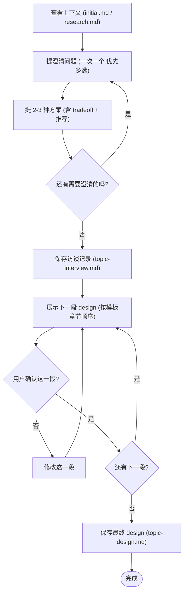

# Interview Protocol（游戏设计访谈协议 / 中文）

访谈在**主 agent**（`rattar_design`）中进行，不能 dispatch 给 subagent，因为要直接对用户提问。访谈的产物是一份完整的访谈记录与一份逐段确认的策划案。

## 总览

你的目标：通过苏格拉底式对话，把用户脑中"模糊的游戏想法"转化为一份**结构化的中文增量策划案**。策划案不是技术设计，是**产品 / 玩法 / 体验侧**的描述。

最终策划案的章节定义见：[design-template.md](./design-template.md)。

## 反模式：「这只是个小机制 / 这太简单了」

每一份策划案都要走这个流程，无论是：

- 一个新加的小机制
- 已有系统的小改动
- 角色 / 物品 / 场景的描述

"简单"恰恰是最容易出问题的地方——大量隐藏假设没有被检视：

- "玩家会觉得有趣"——基于什么？
- "和已有系统能兼容"——具体在哪些章节里？
- "改动很小"——边界场景考虑过吗？

策划案可以很短（简单情况几段话即可），但**必须**逐段呈现并获得用户确认。

## 输入

访谈应基于：

1. `docs/plans/YYYY-MM-DD-HH-MM/initial.md`（用户原始输入）
2. `docs/plans/YYYY-MM-DD-HH-MM/research.md`（如果做过研究）
3. 之前的对话上下文（如果上下文未被压缩）

如果做过 research，要积极利用它：

- 跳过 research 已经回答了的问题
- 针对 research 中发现的 trade-off 主动追问
- 对 research 中暴露出复杂性的部分进一步探索

## 关键原则

围绕这次访谈的核心目的——**理解用户的目的、假设、约束、成功标准**：

- 玩家旅程是怎么样的？玩家旅程是否完整？
- 信息流 / 状态流是怎么样的？
- 系统的耦合范围？哪些是核心、哪些是边界？
- 成功怎么判断？玩家用什么具体行为反馈我们做对了？

执行原则：

- **一次一个问题**——不要一次甩出多个问题
- **优先多选**——多选题比开放题更容易回答；用 question tool 提问
- **YAGNI 无情**——把不必要的功能从设计里删掉
- **2-3 种方案**——遇到决策点必须给 2-3 种方案 + tradeoff + 推荐
- **逐段确认**——每段策划案先展示后写入
- **保持灵活**——发现某段不清晰随时返回澄清

## 流程图



## 流程

进入访谈后，立即用 todowrite 工具按下面的步骤建一份子任务清单，**严格**按顺序执行：

### 1. 查看输入并理解问题

- 读 `initial.md` 与 `research.md`（如有）
- 整理出已知信息与未知信息
- 列出后续要澄清的方向（不要一次问完）

### 2. 提澄清问题

针对每一个澄清方向：

- 一次只提一个问题
- 优先多选题，用 question tool 提问
- 如果一个主题需要多个角度，**拆**成多个问题，分多轮问

每次涉及决策时（例如"主玩法循环采用 A/B/C 哪种？"）：

- 先简介你**推荐**的方案与理由
- 再展示 2-3 种备选方案
- 每种方案附 tradeoff（好处 / 坏处 / 风险）
- 用 question tool 让用户选

针对游戏设计场景，重点的澄清方向通常包括：

- **设计意图**：这个系统要给玩家带来什么情绪 / 张力？想避免什么体验？
- **核心循环**：玩家典型的 5-10 步动作是什么？高光与低谷分别是什么？
- **机制规则**：触发条件、状态、参数、成功 / 失败判定
- **系统交互**：依赖哪些已有系统？被哪些系统依赖？
- **关键场景**：典型场景与边界场景分别长什么样？
- **取舍**：刻意选择 X 而非 Y 的理由是什么？

### 3. 反思是否还有澄清空间

如果有，回到第 2 步继续澄清。  
没有时进入第 4 步。

### 4. 保存访谈记录

用一个 `@general` 的 subagent 把刚才所有的提问与用户回答**忠实**保存到：

```
docs/plans/YYYY-MM-DD-HH-MM/<topic>-interview.md
```

- **不做总结**，原话记录
- 用 markdown 区分提问者与回答（例如 `**Q:**` / `**A:**`）
- 多轮提问按时间顺序

### 5. 渐进式展示策划案（重要）

用一个 `@general` 的 subagent，**严格**按 [design-template.md](./design-template.md) 的章节顺序，**一次只写 1 个 section（或其子节）**：

1. 在对话里把这一段展示给用户
2. 等待用户确认 / 提修改意见
3. 用户确认后，把这一段写入 `docs/plans/YYYY-MM-DD-HH-MM/<topic>-design.md`
4. 进入下一段

注意：

- 章节 1-9（设计内容）用**当前态**叙述（"这个系统是 ..."），方便后续 organize-wiki 抽取进 wiki
- 章节 10-12（本轮过程视角）用**本轮**叙述（"本轮 MVP 包含 ..." / "本轮风险有 ..."）
- 简单段落 2-6 行；复杂段落 200-300 字
- 每段确认后追加，**不要**一次性写完整文件
- 全部章节确认完毕后，把 frontmatter 的 `status` 从 `draft` 改成 `approved`

### 完成

恭喜用户完成本轮策划。简短总结：

- 策划案路径：`docs/plans/YYYY-MM-DD-HH-MM/<topic>-design.md`
- 访谈记录：`docs/plans/YYYY-MM-DD-HH-MM/<topic>-interview.md`
- research 路径（如有）

**不要**主动建议进入实施或 organize-wiki，等用户指令。

## 写给陌生读者

策划案必须**完全自包含**——一个不熟悉本项目背景的策划 / 工程师 / LLM，仅凭这份策划案就能理解：

- 我们要构建什么
- 为什么构建
- 怎么构建到 MVP

如果某段需要读者先理解另一份文档，就在该段开头补充必要前提。
