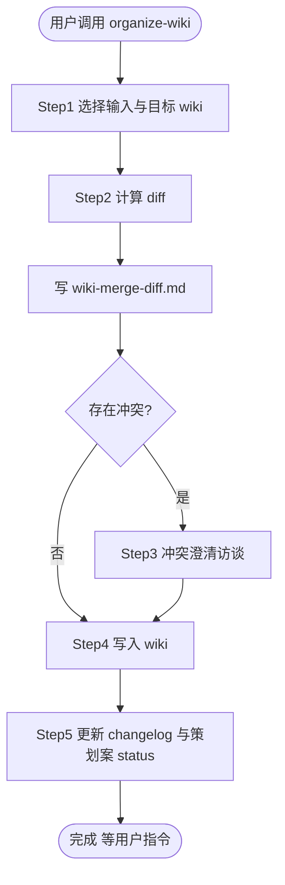

# organize-wiki

## 概述

把已确认的策划案（来自 `game-design-brainstorm` skill 的产出）合并进**全量游戏设计文档**。

**核心边界**：

- **只整理，不创造**：本 skill 不发明任何策划案里没有的设计决策；被用户确认的 game design 是主要信息源，用户提供或策划案引用的 technical design 可作为辅助信息源
- **去阶段化**：策划案的章节 10-11（本轮范围 / 本轮验收 / 本轮风险）**不进 wiki**；章节 1-9 进 wiki，章节 12（Open Questions）合并到 wiki 的 Open Questions
- **双模板维护**：玩法 wiki（`docs/core-ideas.md`、`docs/gameplay/<system>/<system>.md`、feature wiki）使用 `references/wiki-template.md`；数据契约文档（`docs/game_model/<topic>.md`）使用 `references/game-model-template.md`
- **不产备份文件**：本 skill 不创建 `wiki-backup-*`；写入前必须读取目标文件最新内容，失败时停止并让用户基于 git diff / IDE 历史处理
- **冲突先问**：策划案与 wiki 矛盾的部分必须先与用户澄清，不要静默覆盖

## 流程图



## 强制工作流程

进入本 skill 后**立即**用 todowrite 工具按下面的 Step 1-5 创建任务列表，并按顺序逐项推进。

### Step 1: 选择输入与目标 wiki

1. **列出候选策划案**：扫描 `docs/plans/` 下所有 `*-design.md`：
   - 优先列出 frontmatter 里 `status` 为 `approved` 的策划案
   - 如果策划案已存在 `merged_into`，仍可作为候选来源；同一份 game design 可以先合入 gameplay wiki，再抽取 game_model 写入 `docs/game_model/`
   - 展示候选时同时列出已合入目标，避免重复合入同一个目标文档
2. **用 question tool 让用户选**：
   ```
   问题：要 merge 哪份策划案？
   选项 A：docs/plans/2026-04-26-16-00/time-system-design.md（topic: time-system）
   选项 B：docs/plans/2026-04-25-10-30/crew-call-event-design.md（topic: crew-call-event）
   ...
   选项 N：用户自定义路径
   ```
   本轮一次只 merge 一份策划案。
   如果同目录或 frontmatter 中声明了 technical design，并且本轮目标包含 `data-model`，把 technical design 作为辅助输入读取；它只能补充数据字段、类型、schema、状态边界等技术事实，不能覆盖 game design 的玩法决策。
3. **确认目标 wiki 路径**：默认按下面的优先级推断：
   1. 策划案 frontmatter 的 `target_wiki` 字段
   2. 否则按 `scope` 推断：
      - `whole-game` → `docs/core-ideas.md`
      - `system` → `docs/gameplay/<topic>/<topic>.md`
      - `data-model` → `docs/game_model/<topic>.md`
      - `feature` → 由用户指定
   3. 仍不能确定时用 question tool 问用户
4. **如果目标 wiki 不存在**：按目标 scope 创建空骨架（只有章节标题与占位注释）：
   - `whole-game` / `system` / `feature` → `references/wiki-template.md`
   - `data-model` → `references/game-model-template.md`
5. **读取目标最新内容**：编辑前读取目标 wiki / game_model 当前内容；不要创建 `wiki-backup-*` 或其他临时备份文件。

### Step 2: 计算 diff

1. **读取策划案与辅助 technical design**：用一个 `@general` subagent 读取策划案的章节 1-9 与章节 12，**跳过**章节 10-11（不进 wiki）。如果 Step 1 识别到 technical design，同步读取其中与目标文档有关的字段、类型、schema、状态边界。
2. **读取现有 wiki / game_model**：用 `@explore` subagent 读取目标文档当前内容。
3. **按目标 scope 比对**（详见 `references/merge-protocol.md`）：
   - `whole-game` / `system` / `feature`：按 markdown heading `##` / `###` 逐节比对
   - `data-model`：先从 game design / technical design 抽取 `Game Model Delta`，再按模型名、字段名、schema 路径、边界对象等稳定 key 比对；不要要求源设计和 game_model 拥有相同章节标题
   - **新增**：wiki 中没有，策划案有
   - **更新**：wiki 中有，策划案有不同表述（语义可能扩展或重写）
   - **冲突**：策划案与 wiki 描述明显矛盾
   - **保持**：wiki 中有，策划案没有提到（不动）
4. **输出 diff 报告**到 `docs/plans/<策划案所在目录>/wiki-merge-diff.md`，结构包括：
   - 来源策划案路径
   - 辅助 technical design 路径（如有）
   - 目标 wiki 路径
   - 玩法 wiki：按章节列出的「新增 / 更新 / 冲突 / 保持」分类列表
   - game_model：先列出抽取出的 `Game Model Delta`，再按模型 / 字段 / schema / 边界 key 列出「新增 / 更新 / 冲突 / 保持」
   - 每个冲突项的双方原文片段

### Step 3: 冲突澄清访谈

如果 Step 2 发现冲突项，**逐个**用 question tool 提问：

```
问题：[<wiki 章节路径>] <冲突摘要>

wiki 现状：
> <wiki 原文片段>

策划案表述：
> <策划案原文片段>

请选择：
选项 A：保留 wiki 现状（忽略策划案此条）
选项 B：采用策划案（替换 wiki 此条）
选项 C：合并双方（用户输入新表述）
选项 D：跳过本条，留在 wiki 末尾的「待整理」缓冲区
```

每个冲突的解决方案记录回 `wiki-merge-diff.md` 末尾的「冲突决议」段。

如果没有冲突，直接进入 Step 4。

### Step 4: 写入 wiki

1. 用一个 `@general` subagent 严格按目标 scope 对应模板整理目标 wiki：
   - `whole-game` / `system` / `feature`：按 [`references/wiki-template.md`](./references/wiki-template.md) 的章节顺序与映射规则写入
   - `data-model`：按 [`references/game-model-template.md`](./references/game-model-template.md) 的章节顺序写入 Step 2 抽取出的 `Game Model Delta`；只合入字段定义、类型、状态边界、schema 关系等数据契约内容
   - 章节 1-9 来自策划案章节 1-9（应用 Step 3 决议；无冲突项直接合并）
   - Open Questions 合并策划案章节 12 的内容（已在 Step 3 解决的从 wiki 删除，仍未决的追加进去）
2. **去阶段化措辞**：从所有进 wiki 的文字中删除「本轮 / 本次 / MVP / Later」之类与版本相关的措辞，改为**当前态**描述（"系统包含 X、Y" 而非 "本轮新增 X、Y"）。
3. **保持原 wiki 章节顺序**：不要重排；新章节在合理位置插入。
4. **不动末尾的「变更记录 / 来源策划案」段**（Step 5 处理）。
5. 写完后，用 `@explore` subagent 验证：
   - 所有 wiki 章节都覆盖了对应模板要求的章节标题
   - 没有残留「本轮 / MVP / Later」措辞
   - frontmatter 字段完整

如有问题，回到 Step 4 起始重写。

### Step 5: 更新 changelog 与策划案 status

1. **追加 wiki 末尾的「变更记录 / 来源策划案」表格**：在表格末尾追加一行：
   ```
   | <YYYY-MM-DD> | <策划案相对路径> | <一句话变更摘要> |
   ```
   摘要要具体（"新增 7 条机制规则与 2 个边界场景" 优于 "更新机制"）。
2. **更新策划案 frontmatter**：
   - `status: approved` → `status: merged`
   - `merged_into` 记录为目标路径列表；如果旧文件里是单个字符串，先转换为列表，再追加本次目标路径
   - 如果本次目标路径已在 `merged_into` 中，询问用户是否覆盖更新，不要静默重复追加
   - 追加或更新 `merged_at: <ISO datetime>`，表示最近一次合入时间
3. **更新 wiki frontmatter**：
   - `last_updated: <YYYY-MM-DD>`

## 完成后

简短总结产出：

- 目标 wiki 路径
- diff 报告路径
- 策划案 status 变更

**不要**自动 commit、不要自动建议进入下一轮 brainstorm，等用户指令。

## 失败与回滚

任何 step 失败时：

- **不要**留下半成品 wiki
- 立即停止，说明失败发生在哪个 step、哪些文件已经被修改、建议用户基于 git diff / IDE 本地历史回滚或修正
- 如果 `wiki-merge-diff.md` 已经写出，把失败原因追加到末尾的「失败记录」段；不要创建新的备份文件

## 文件清单（一次完整会话产出 / 更新）

```text
docs/plans/<策划案所在的 YYYY-MM-DD-HH-MM>/
+-- wiki-merge-diff.md           # Step 2-3
+-- <topic>-design.md            # Step 5 更新 frontmatter

docs/<...>/<wiki>.md             # Step 4-5 更新玩法 wiki 内容与 changelog
docs/game_model/<topic>.md       # Step 4-5 更新数据契约文档与 changelog
```
