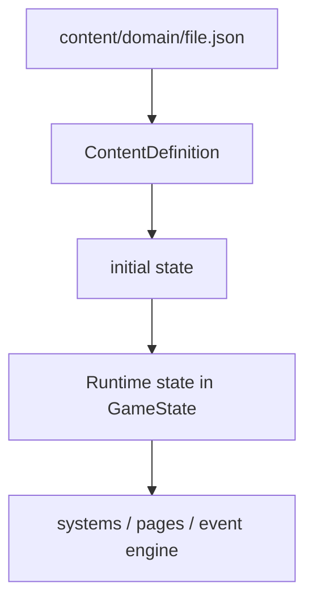

# Game Model Template（数据契约文档 / 中文）

本模板用于 `organize-wiki` skill 的 Step 4，作为 `docs/game_model/<topic>.md` 的章节骨架。它描述代码层数据契约：内容文件、TypeScript 类型、运行时状态、schema 边界和跨系统读写关系。

## 使用约束

- **适用范围**：仅适用于 `scope: data-model`，目标路径为 `docs/game_model/<topic>.md`。玩法 wiki 仍使用 [`wiki-template.md`](./wiki-template.md)。
- **数据契约优先**：正文回答「数据怎么组织、谁读写、如何校验」。玩家体验、设计意图、玩法取舍应写入 `docs/gameplay/<system>/<system>.md`。
- **先抽取再合并**：源 game design / technical design 不需要有本模板的同名章节。`organize-wiki` 必须先抽取 `Game Model Delta`，再按模型名、字段名、schema 路径和边界对象合入本文档。
- **字段表是核心**：字段名、类型 / 约束、来源、读写方和关系必须明确。不要只写自然语言概述。
- **当前态描述**：所有正文用当前态，不保留「本轮 / 本次 / 本版本 / MVP / Later」等策划案措辞。
- **章节可以为空**：如果某章节当前没有内容，保留章节标题与一行 `*（暂无）*`，不要省略章节。
- **末尾保留「变更记录 / 来源策划案」段**：由 `organize-wiki` 自动维护，不要手工覆盖。

## frontmatter 字段定义

`docs/game_model/` 现有文档可能没有 frontmatter。新建或重整时可以按下表补齐；如果用户决定保留旧格式，`audit-wiki` 在索引中按缺字段处理，不要编造。

| 字段 | 含义 | 取值 |
| --- | --- | --- |
| `title` | 文档标题 | 中文标题 |
| `scope` | 文档类型 | `data-model` |
| `last_updated` | 最近一次 `organize-wiki` 整理日期 | `YYYY-MM-DD` |
| `maintained_by` | 维护者标签 | `organize-wiki`（恒定） |

## 从设计文档抽取 Game Model Delta

由 `organize-wiki` skill 的 Step 2-4 应用。来源通常是一份 game design；如果存在用户提供或 frontmatter 引用的 technical design，可以把其中的数据字段、类型、schema、状态边界作为辅助事实。

| 设计文档中的内容 | 抽取到 Game Model Delta | 写入 game_model 章节 | 处理方式 |
| --- | --- | --- | --- |
| 数据契约概述、范围、out_of_scope | `overview` | 1 概述与边界 | 替换 / 合并 |
| 内容文件、TypeScript 类型、运行时状态之间的流转 | `model_layers` | 2 模型分层 | 增量合并；节点关系冲突时询问 |
| 模型清单、类型清单、资产清单 | `models[]` | 3 模型清单 | 按模型代码名增量合并 |
| JSON 内容字段、静态定义字段 | `content_fields[]` | 4 内容文件结构 | 按 `ModelOrFile.field` 增量合并；同 key 类型不同为冲突 |
| `GameState` / runtime instance / save state 字段 | `runtime_fields[]` | 5 运行时状态字段 | 按 `RuntimeModel.field` 增量合并；同 key 类型不同为冲突 |
| 与其他 game_model 或系统的输入 / 输出 / 共享对象 | `boundaries[]` | 6 与其他 game_model 的边界 | 按目标模型 / 系统 union；边界方向矛盾时询问 |
| schema、校验脚本、跨文件引用规则 | `schema_validation[]` | 7 与 schema / 校验的对应关系 | 按 schema / script 路径增量合并 |
| 兼容旧内容、旧存档、版本字段的策略 | `compatibility` | 8 兼容性与版本策略 | 替换 / 合并；兼容策略相反时询问 |
| 样例 JSON、样例 runtime state、关键读写场景 | `examples[]` | 9 关键场景与示例 | 按场景 ID 或短标题增量合并 |
| Open Questions | `open_questions[]` | 10 Open Questions | 增量合并（已解决的删除，新的追加） |
| 玩法动机、玩家情绪、核心循环、UI 表达 | 不抽取 | 不进 game_model | 应写入 gameplay wiki；如果策划案只提供这些内容，询问用户是否更换目标 wiki |
| 策划案章节 10-11（本轮范围 / 验收 / 风险） | 不抽取 | 不进 game_model | 跳过 |

详细的 diff / 冲突 / 写入协议见 [`merge-protocol.md`](./merge-protocol.md)。

## 模板正文

````markdown
---
title: <数据模型中文标题，例如「Crew 模型」或「事件模型」>
scope: data-model
last_updated: <YYYY-MM-DD>
maintained_by: organize-wiki
---

<!--
本文件由 organize-wiki skill 维护。
请不要直接手工修改本文件；改动应当通过：
1. 用 game-design-brainstorm skill 写一份新的策划案
2. 用 organize-wiki skill 把策划案合入本文件
-->

# <数据模型标题>

## 1. 概述与边界（What & Boundary）
<!-- 一句话说明该模型描述哪些内容文件、TypeScript 类型、运行时状态和 schema 边界。 -->

| 规则 | 说明 |
| --- | --- |
| `scope` | <覆盖范围> |
| `out_of_scope` | <明确不覆盖的内容> |

## 2. 模型分层（Model Layers）



## 3. 模型清单（Model Inventory）

| 模型 | 代码名称 | 中文名 | 来源 | 介绍 |
| --- | --- | --- | --- | --- |
| <模型层级> | `<TypeOrFile>` | <中文名> | <路径或模块> | <作用> |

## 4. 内容文件结构（Content File Structure）

| 代码名称 | 中文名 | 类型 / 约束 | 介绍 | 关系 |
| --- | --- | --- | --- | --- |
| `<field>` | <中文名> | <类型 / schema 约束> | <字段含义> | <关联模型或运行时字段> |

## 5. 运行时状态字段（Runtime State Fields）

| 代码名称 | 中文名 | 类型 / 约束 | 介绍 | 读写方 |
| --- | --- | --- | --- | --- |
| `<field>` | <中文名> | <类型 / 约束> | <字段含义> | <读取 / 修改它的系统> |

## 6. 与其他 game_model 的边界（Model Boundaries）

| 对象 | 输入 | 输出 | 共享对象 / 状态 |
| --- | --- | --- | --- |
| `<other-model>` | <从对方读取> | <写给对方> | <共享 ID / 状态> |

## 7. 与 schema / 校验的对应关系（Schema & Validation）

| 路径 / 类型 | 作用 | 校验规则 | 失败处理 |
| --- | --- | --- | --- |
| `<schema-or-script>` | <用途> | <关键约束> | <失败时如何处理> |

## 8. 兼容性与版本策略（Compatibility & Versioning）

| 规则 | 说明 |
| --- | --- |
| `content_version_policy` | <内容版本如何处理> |
| `save_compatibility_policy` | <旧存档如何处理> |

## 9. 关键场景与示例（Scenarios & Examples）

### 9.1 典型读写场景
- **S1**：
- **S2**：

### 9.2 示例片段
```json
{
  "example": "value"
}
```

## 10. Open Questions
<!-- 仍未决的数据契约问题，未来 brainstorm 时处理。已经被新策划案解决的应当被删除。 -->
- **Q1**：

---

## 变更记录 / 来源策划案

<!-- 由 organize-wiki skill 自动维护。每次 merge 追加一行。 -->

| 日期 | 来源策划案 | 变更摘要 |
| --- | --- | --- |
| <YYYY-MM-DD> | docs/plans/<YYYY-MM-DD-HH-MM>/<topic>-design.md | <一句话摘要> |
````

## 反模式（不要做的事）

- ❌ 把玩法设计意图写进 game_model：玩法动机属于 `docs/gameplay/`
- ❌ 只写概念不列字段：game_model 必须能支持代码 / schema 对齐
- ❌ 为了兼容旧格式隐式保留未定义字段：不确定时写 Open Question 或询问用户
- ❌ 把编辑器 UI 布局、页面 PRD、草图引用写进 game_model：这些属于 `docs/ui-designs/`
