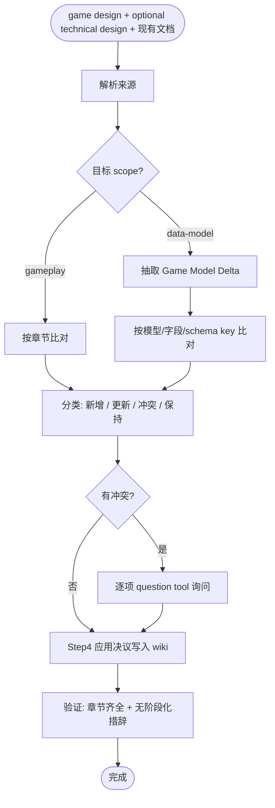

# Merge Protocol（策划案到 wiki 的 diff / merge 协议 / 中文）

本文件由 `organize-wiki` skill 的 Step 2-4 引用，定义如何把策划案合并进 gameplay wiki 或 game_model 文档的具体规则与冲突处理流程。

## 总览



## 1. diff 规则

### 1.1 gameplay wiki 的最小匹配单位

目标 scope 为 `whole-game` / `system` / `feature` 时，以 markdown heading（`##` / `###`）为最小匹配单位。例：

- 策划案 `## 5. 机制与规则` ↔ wiki `## 5. 机制与规则`
- 策划案 `### 5.2 规则与公式` ↔ wiki `### 5.2 规则与公式`

匹配按**章节标题文本**，不是按章节编号。如果策划案的 `### 5.2` 与 wiki 的 `### 5.2` 标题文字不同，视为不同章节，分别处理。

目标 scope 为 `data-model` 时，不使用本规则。game_model 文档不要求与 game design / technical design 拥有同名章节，必须先按 §1.5 抽取 `Game Model Delta`，再做 key-based diff。

### 1.2 跳过规则

策划案的下列章节**不进 wiki**，diff 阶段直接跳过：

- 策划案章节 10「本轮范围与阶段拆分」
- 策划案章节 11「本轮验收与风险」
- 策划案 frontmatter 中与本轮过程相关的字段（`status`、`source.*`）

策划案章节 12「Open Questions」**不**直接对应 wiki 章节 12，而是合并到 wiki 章节 10「Open Questions」。

### 1.3 分类标准

每个被比对的章节判定为以下四类之一：

| 类别 | 判定条件 | 处理方式 |
| --- | --- | --- |
| **新增** | wiki 中没有匹配章节 / 子项，策划案有 | 把策划案内容追加到 wiki 对应位置（按模板章节顺序） |
| **更新** | wiki 中有同标题章节 / 子项，但策划案的表述显然在扩展或重写（**没有**矛盾） | 用策划案内容替换 wiki 内容；如果是 bullet 列表则合并去重 |
| **冲突** | wiki 与策划案对同一章节 / 子项的描述**矛盾**（数值不同、规则相反、术语定义不一致） | 进入 Step 3 询问 |
| **保持** | wiki 中有，策划案没提到 | 不动 wiki |

### 1.4 列表（bullet / table）的合并细节

- **术语表（章节 3）**：按术语名 dedupe；同名术语定义不同 → 冲突
- **依赖列表（章节 6）**：union；语义重复（"依赖事件系统" vs "依赖 event system"）需要在冲突询问中确认
- **场景列表（章节 7）**：保留 wiki 既有场景；策划案的新场景追加；同 ID 场景内容不同 → 冲突
- **取舍（章节 8）**：union；"做了 X" vs "不做 X" → 冲突
- **参考（章节 9）**：按 URL dedupe；URL 相同但描述不同 → 取较详细的，不视为冲突
- **Open Questions（策划案章节 12 → wiki 章节 10）**：union；wiki 中已存在但策划案明确解决的应当从 wiki 删除（识别方式：策划案的章节 1-9 中如果显式写了"Q1 已确认 ..."这类语句，对应 wiki 中的 Q1 删除）

### 1.5 game_model 文档的抽取与 key-based diff

目标 scope 为 `data-model` 时，先从 game design 和辅助 technical design 中抽取一份规范化的 `Game Model Delta`，再和现有 `docs/game_model/<topic>.md` 比对。不要按源文档 heading 逐节匹配。

抽取格式：

```yaml
game_model_delta:
  target: docs/game_model/<topic>.md
  sources:
    - docs/plans/<YYYY-MM-DD-HH-MM>/<topic>-design.md
    - <technical-design path if any>
  overview:
    scope: <数据契约覆盖范围>
    out_of_scope: <不覆盖内容>
  models:
    - key: <code name, e.g. CrewDefinition>
      source: <src/content/contentData.ts 或 content path>
      description: <模型职责>
  content_fields:
    - key: <ModelOrFile.field>
      name: <field>
      type_or_constraint: <类型 / schema 约束>
      relation: <关联模型或运行时字段>
  runtime_fields:
    - key: <RuntimeModel.field>
      name: <field>
      type_or_constraint: <类型 / 约束>
      readers_writers: [<systems>]
  boundaries:
    - key: <target model or system>
      input: <从对方读取>
      output: <写给对方>
      shared_state: <共享对象 / 状态>
  schema_validation:
    - key: <schema path or script path>
      rule: <关键约束>
  examples:
    - key: <scenario id or short title>
      content: <示例摘要>
  open_questions:
    - <问题原文>
```

key-based diff 规则：

- **字段表**：按字段名 dedupe；同名字段的类型 / 约束 / 读写方不同 → 冲突，进入 Step 3 询问
- **模型清单**：按模型代码名称 dedupe；同名模型来源不同或职责相反 → 冲突
- **模型分层图**：按 mermaid 节点 ID 或节点标签 dedupe；同名节点的上下游关系不同 → 冲突
- **schema / 校验表**：按路径 dedupe；同一路径的校验语义不同 → 冲突
- **玩法内容过滤**：策划案中只有玩家体验、玩法动机、UI 表达而没有数据契约内容时，不写入 `docs/game_model/`；询问用户是否更换目标 wiki

## 2. 冲突询问格式

每个冲突项**单独**用 question tool 提问，格式如下：

```
问题：[<wiki 章节路径或 game_model key>] <冲突摘要>

wiki 现状：
> <wiki 原文片段（不超过 200 字，必要时省略号）>

策划案表述：
> <策划案原文片段（不超过 200 字，必要时省略号）>

请选择：
选项 A：保留 wiki 现状（忽略策划案此条）
选项 B：采用策划案（替换 wiki 此条）
选项 C：合并双方（用户自定义新表述）
选项 D：跳过本条，留在 wiki 末尾的「待整理」缓冲区，下次再处理
```

要点：

- **每次只问一个冲突**：不要批量提问
- **冲突摘要要具体**：不是"机制描述不一致"，而是"循环周期参数：wiki 写 24 小时 / 策划案写 36 小时"，或"`CrewDefinition.currentTile` 类型：game_model 写 number / 设计写 tile id string"
- **片段不要剪裁过狠**：保留足够上下文让用户判断
- **选项 D 的兜底机制**：如果用户选 D，把双方原文都贴到 wiki 末尾的「## 待整理（来自 <策划案路径>）」缓冲区，下次 organize-wiki 时再处理

## 3. 写入 wiki 的细则

### 3.1 去阶段化措辞

写入前，对**所有**进 wiki 的文本应用以下替换 / 删除规则：

| 检测 | 处理 |
| --- | --- |
| 「本轮 / 本次 / 本版本」 | 删除该词或改成"系统 / 当前" |
| 「MVP / Later / 不做」 | 整段删除（这本来不应该被映射进 wiki） |
| 「我们要 / 计划 / 将会 / 即将 / 计划中」 | 改成"系统 / 当前态" |
| 「优先级 P0 / P1 / P2」 | 删除（属于本轮排期，不属于 wiki） |
| 「Player Story PS-001」 | 删除（属于本轮验收，不属于 wiki） |

如果删除后段落语义残缺，**不要**保留破碎的句子；要么改写完整，要么整段删除。

### 3.2 章节顺序

按目标 scope 选择章节顺序：

- `whole-game` / `system` / `feature`：严格按 [`wiki-template.md`](./wiki-template.md) 的章节顺序
- `data-model`：严格按 [`game-model-template.md`](./game-model-template.md) 的章节顺序

玩法 wiki 章节顺序：

1. 概述
2. 设计意图
3. 核心概念与术语
4. 核心循环与玩家体验
5. 机制与规则
6. 系统交互
7. 关键场景
8. 取舍与反模式
9. 参考与灵感
10. Open Questions

数据契约文档章节顺序：

1. 概述与边界
2. 模型分层
3. 模型清单
4. 内容文件结构
5. 运行时状态字段
6. 与其他 game_model 的边界
7. 与 schema / 校验的对应关系
8. 兼容性与版本策略
9. 关键场景与示例
10. Open Questions

末尾追加「变更记录 / 来源策划案」段。

### 3.3 frontmatter 处理

写入后必须更新：

- wiki: `last_updated` 改成今天
- wiki: `maintained_by: organize-wiki`（如缺失则补上）
- 策划案: `status: approved` → `status: merged`
- 策划案: `merged_into` 使用目标路径列表；旧格式若是单个字符串，先转换为列表，再追加本次目标路径
- 策划案: 如果本次目标路径已存在于 `merged_into`，先询问用户是否覆盖更新，不要重复追加
- 策划案: 追加或更新 `merged_at: <ISO datetime>`，表示最近一次合入时间

## 4. 失败处理与人工回滚

- **写入前**：读取目标文档最新内容，确认本次编辑基于当前版本。
- **不创建备份文件**：不要生成 `wiki-backup-*` 或其他临时备份文档。
- **写入失败**：立即停止，说明失败 step、已改文件和建议处理方式；如果 `wiki-merge-diff.md` 已经写出，把失败原因追加到末尾的「失败记录」段。
- **人工回滚**：需要回滚时由用户基于 git diff / IDE 本地历史处理；agent 不执行破坏性 git 操作。

## 5. wiki-merge-diff.md 结构参考

每次 merge 都会产出一份 diff 报告，建议结构：

````markdown
---
source_design: docs/plans/<YYYY-MM-DD-HH-MM>/<topic>-design.md
technical_design: <optional technical design path>
target_wiki: docs/<...>/<wiki>.md
date: <YYYY-MM-DD HH:MM>
---

# Wiki Merge Diff: <topic>

## 1. 新增（Added）
- [章节 5.3 参数与默认值] 新增 6 行参数表
- ...

## 2. 更新（Updated）
- [章节 4.1 玩家旅程] 由 5 步扩展为 7 步
- ...

## 3. 冲突（Conflicts）

### Conflict 1: [章节 5.2 规则与公式] 循环周期参数

**wiki 原文**：
> ...

**策划案表述**：
> ...

**决议**：选项 B（采用策划案）

### Conflict 2: ...

## 4. 保持（Kept as-is）
- [章节 7.2 边界场景] 策划案未提及，保留 wiki 既有 3 条
- ...

## 5. Game Model Delta（仅 data-model 目标）
*（非 data-model 目标可省略）*

```yaml
game_model_delta:
  target: docs/game_model/<topic>.md
  models: []
  content_fields: []
  runtime_fields: []
  boundaries: []
  schema_validation: []
```

## 6. 失败记录（如有）
*（暂无）*
````

## 6. 反模式（不要做的事）

- ❌ 静默覆盖 wiki：任何冲突必须问用户
- ❌ 一次性提多个冲突问题：会让用户难以决策
- ❌ 把策划案章节 10-11 的内容写进 wiki：违反去阶段化原则
- ❌ 把"本轮 / MVP"等措辞留在 wiki 里：让 wiki 失去全量当前态语义
- ❌ 为 organize-wiki 创建 `wiki-backup-*`：回滚依赖 git diff / IDE 本地历史，不再维护备份产物
- ❌ 自动 commit：写入完成后等用户决定何时 commit
