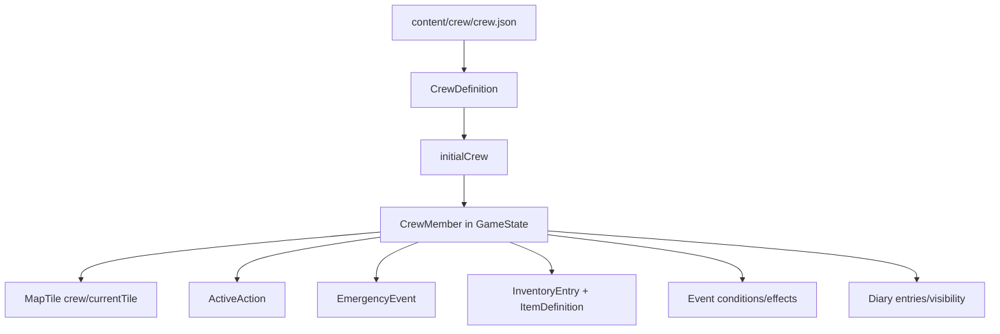

# Crew 模型

本文描述当前代码中的队员模型。`crew` 既是内容配置，也是运行时状态的核心入口：编辑器主要应编辑 `content/crew/crew.json` 中的静态内容定义；游戏运行时会把这些定义转换为 `GameState.crew` 中的 `CrewMember`，再被地图、行动、事件、物品、日记和时间系统共同读取与修改。

## 模型分层



| 模型 | 代码名称 | 中文名 | 来源 | 介绍 |
| --- | --- | --- | --- | --- |
| 内容文件 | `content/crew/crew.json` | 队员内容配置 | JSON | 人物编辑器应主要读写的文件，包含初始队员档案、属性、携带物、初始行动和初始紧急事件。 |
| 内容定义 | `CrewDefinition` | 队员定义 | `src/content/contentData.ts` | TypeScript 对 `content/crew/crew.json` 单个队员条目的描述。字段与 schema 基本对应。 |
| 运行时状态 | `CrewMember` | 队员运行时状态 | `src/data/gameData.ts` | 进入游戏状态后的队员对象，包含派生位置显示、运行中行动、紧急事件实例、状态条件等。 |
| 初始队员列表 | `initialCrew` | 初始队员状态 | `src/data/gameData.ts` | 由 `crewDefinitions.map(createInitialCrewMember)` 生成，是新存档的队员状态来源。 |

## 内容文件结构

| 代码名称 | 中文名 | 类型 / 约束 | 介绍 | 关系 |
| --- | --- | --- | --- | --- |
| `$schema` | Schema 路径 | 字符串，可选 | 指向 `content/schemas/crew.schema.json`。 | 供内容校验工具识别数据格式。 |
| `version` | 内容版本 | 整数，最小 `1` | 队员内容数据版本。 | 当前只作为内容文件版本标记，运行时逻辑未读取版本分支。 |
| `crew` | 队员列表 | `CrewDefinition[]` | 所有可用队员的静态定义。 | 被 `crewDefinitions` 读取，再转换为 `initialCrew`。 |

## CrewDefinition 字段

| 代码名称 | 中文名 | 类型 / 约束 | 介绍 | 和其他模型的关系 |
| --- | --- | --- | --- | --- |
| `crewId` | 队员 ID | 小写字母开头，允许数字和下划线 | 内容层唯一标识，例如 `mike`、`lin_xia`。 | 转为运行时 `CrewMember.id`；被 `MapTile.crew`、通话、测试和部分手写行动逻辑引用。 |
| `name` | 姓名 | 非空字符串 | UI 展示名。 | 通讯录、通话页、地图队员状态、日志文本都会展示。 |
| `role` | 身份 / 职责 | 非空字符串 | 人物短职业或身份标签。 | 通讯录卡片和档案弹窗展示。 |
| `currentTile` | 当前地块 | 形如 `1-1` 的字符串 | 队员初始所在地图格。 | 转为 `CrewMember.currentTile`；和 `MapTile.id` 对应；地图通过 `syncTileCrew` 反向同步每格驻留队员。 |
| `status` | 初始规则状态 | `idle` / `moving` / `working` / `inEvent` / `lost` / `dead` | 内容层枚举状态，用来推导初始显示状态。 | `createInitialCrewMember` 通过 `getInitialStatus` 转为运行时中文 `status`；事件条件中的 `crew.status` 读取运行时规则状态而不是这段原始文本。 |
| `statusTone` | 状态语气 | `neutral` / `muted` / `accent` / `danger` / `success` | UI 色调和风险提示强度。 | 通讯录、档案、地图等用它决定 `StatusTag` 或状态文本样式。 |
| `summary` | 状态摘要 | 非空字符串 | 对队员当前情况的短描述。 | 通讯录卡片、档案通讯语气和通话结果会展示；行动和事件会更新运行时 `summary`。 |
| `attributes` | 五维属性 | `CrewAttributeMap`，每项 `1-6` | 队员轻量数值能力。 | 事件条件可通过 `crew.attributes.<key>` 读取；档案页以 6 格条展示。 |
| `skills` | 技能标签 | `string[]`，ID 格式 | 规则用的自由技能 ID。 | 事件条件支持 `crew.skills.has(skillId)`；目前与 `expertise.expertiseId` 可同名但不是同一个字段。 |
| `inventory` | 初始携带物 | `InventoryEntry[]` | 队员初始背包。 | `itemId` 关联 `ItemDefinition.itemId`；事件条件、事件效果、通话选项道具需求都会读取或修改背包。 |
| `profile` | 背景档案 | `CrewProfile` | 人物背景文本。 | 只用于档案展示，不参与当前规则结算。 |
| `voiceTone` | 通讯语气 | 非空字符串 | 角色说话风格说明。 | 通话页和档案页展示，用于写对白和编辑器参考。 |
| `personalityTags` | 性格标签 | 字符串数组，`3-5` 项 | 角色性格关键词。 | 档案页展示；当前不参与自动规则判定。 |
| `expertise` | 专长 | `ExpertiseDefinition[]` | 角色专长列表，可纯文本，也可带规则效果。 | 档案页展示；带 `ruleEffect` 的专长会在调查完成后结算。 |
| `diaryEntries` | 初始日记 | `DiaryEntryDefinition[]` | 角色关键节点记录。 | 档案页按 `gameSecond` 排序展示；可见性由 `availability` 和日记系统处理。 |
| `canCommunicate` | 是否可通讯 | 布尔值 | 队员初始是否能接收指令和通话。 | 移动预览、日记传回、失联/死亡事件都会读取或更新该值。 |
| `lastContactTime` | 最后联系时间 | 整数，最小 `0` | 初始最后通讯的游戏秒数。 | 行动下达时会更新为当前 `elapsedGameSeconds`；目前主要作为通讯状态数据保留。 |
| `activeAction` | 初始行动 | 可选 `ActiveAction` 内容简化版 | 队员开局正在执行的行动，例如移动或采集。 | `createInitialAction` 会补全运行时计时字段；由 `settleGameTime` 按时间推进和结算。 |
| `emergencyEvent` | 初始紧急事件 | 可选紧急事件简化版 | 队员开局正在等待处理的紧急事件。 | `eventId` 关联 `EventDefinition.eventId`；运行时会补全实例 ID、升级时间和结算状态。 |
| `unavailable` | 不可用 | 布尔值，可选 | 标记队员不可用。 | 通讯按钮、地图同步、移动指令和事件规则状态都会受到影响。 |

## 五维属性

`attributes` 是当前最明确的数值能力模型。schema 要求五项都存在，取值都是 `1-6`。

| 代码名称 | 中文名 | 介绍 | 当前规则关系 |
| --- | --- | --- | --- |
| `attributes.physical` | 体能 | 身体强度、耐力、承受伤害或高强度行动的潜力。 | 当前主要展示；事件系统已支持 `crew.attributes.physical` 条件，但内容中暂未明显使用。 |
| `attributes.agility` | 敏捷 | 速度、反应、闪避和复杂地形行动能力。 | 当前主要展示；事件系统已支持 `crew.attributes.agility` 条件。 |
| `attributes.intellect` | 智力 | 分析、技术判断、复杂信息理解能力。 | 当前主要展示；事件系统已支持 `crew.attributes.intellect` 条件。 |
| `attributes.perception` | 感知 | 观察、发现异常、读取环境细节能力。 | 已被事件 `modifiers` 使用，例如 `crew.attributes.perception >= 3` 会提高调查发现概率。 |
| `attributes.luck` | 运气 | 偶然性、戏剧性转机和不可控收益倾向。 | 当前主要展示；事件系统已支持 `crew.attributes.luck` 条件。 |

事件条件通过 `eventSystem.resolveValue` 读取 `crew.attributes.<key>`，再用比较表达式结算，例如：

```text
crew.attributes.perception >= 3
```

## 背景档案 Profile

| 代码名称 | 中文名 | 类型 / 约束 | 介绍 | 关系 |
| --- | --- | --- | --- | --- |
| `profile.originWorld` | 原世界 | 非空字符串 | 角色来自哪里。 | 只用于档案展示。 |
| `profile.originProfession` | 原职业 | 非空字符串 | 角色加入前的职业或身份。 | 只用于档案展示。 |
| `profile.experience` | 经历 | 非空字符串 | 角色关键过去经历。 | 只用于档案展示，可作为事件对白写作依据。 |
| `profile.selfIntro` | 一句话自述 | 非空字符串 | 角色自我介绍。 | 只用于档案展示，可作为角色语气锚点。 |

## 技能与性格

| 代码名称 | 中文名 | 类型 / 约束 | 介绍 | 关系 |
| --- | --- | --- | --- | --- |
| `skills[]` | 技能标签 | ID 字符串数组 | 偏规则层的标签，例如 `scavenger`、`veteran_miner`。 | 事件条件支持 `crew.skills.has(...)`；如果内容写了不存在于事件中的技能，也不会自动生效。 |
| `personalityTags[]` | 性格标签 | `3-5` 个文本标签 | 偏表达层的角色性格关键词。 | 当前只展示，不参与事件自动判定。 |

注意：`skills` 和 `expertise` 是两套字段。`skills` 是规则条件标签；`expertise` 是档案中展示的专长条目，其中可选 `ruleEffect` 才会产生规则效果。

## 专长 Expertise

| 代码名称 | 中文名 | 类型 / 约束 | 介绍 | 关系 |
| --- | --- | --- | --- | --- |
| `expertise[].expertiseId` | 专长 ID | ID 字符串 | 单个专长的唯一标识。 | 用于 React key 和专长效果随机种子；可与 `skills` 中的标签同名，但代码没有强制绑定。 |
| `expertise[].name` | 专长名 | 非空字符串 | UI 展示名。 | 档案页展示。 |
| `expertise[].description` | 专长说明 | 非空字符串 | 描述该专长的叙事或玩法含义。 | 档案页展示；无 `ruleEffect` 时只作为文本依据。 |
| `expertise[].ruleEffect` | 专长规则效果 | 可选 `ExpertiseRuleEffect` | 当前只支持调查奖励。 | `App.applySurveyExpertiseBonus` 在调查完成时读取并结算。 |

### ExpertiseRuleEffect

| 代码名称 | 中文名 | 类型 / 约束 | 介绍 | 关系 |
| --- | --- | --- | --- | --- |
| `type` | 效果类型 | 当前只能是 `surveyBonus` | 表示调查完成后的额外奖励。 | 只有 `surveyBonus` 会被当前代码识别。 |
| `resourceId` | 奖励物品 ID | ID 字符串 | 奖励加入队员背包的物品。 | 实际通过 `addInventoryItem` 加到 `CrewMember.inventory`；应对应 `ItemDefinition.itemId`。 |
| `amount` | 数量 | 整数，最小 `1` | 奖励数量。 | 影响背包条目数量。 |
| `chance` | 触发概率 | `0-1` 数字 | 专长奖励触发概率。 | 使用确定性随机种子 `member.id + expertiseId + currentTile + elapsedGameSeconds` 结算。 |
| `customLogText` | 自定义日志 | 非空字符串 | 触发成功后写入系统日志的文本。 | 以 `success` 色调加入 `SystemLog`。 |
| `tileId` | 限定地块 | 形如 `1-1` 的字符串，可选 | 限制专长只在指定地块调查完成时触发。 | 和 `CrewMember.currentTile` 比较。 |

## 背包 Inventory

| 代码名称 | 中文名 | 类型 / 约束 | 介绍 | 关系 |
| --- | --- | --- | --- | --- |
| `inventory[].itemId` | 物品 ID | ID 字符串 | 队员携带的物品类型。 | 关联 `content/items/items.json` 中的 `ItemDefinition.itemId`。 |
| `inventory[].quantity` | 数量 | 整数，最小 `1` | 该物品的数量。 | `inventorySystem` 会过滤数量小于等于 0 的条目；事件和专长可增加或消耗。 |

背包和事件系统有三种主要关系：

- 条件判断：事件条件支持 `inventory.has(itemId)`，检查队员背包是否有指定物品且数量大于 `0`。
- 道具响应：通话选项可配置 `usesItemTag`，`CallPage` 会用物品标签检查是否有可用道具。
- 效果结算：事件效果 `addItem` 会给队员或基地背包加物品；`useItemByTag` 会按标签使用队员背包中的可响应道具。

## 行动 ActiveAction

内容层 `activeAction` 是初始行动的简化配置；运行时 `ActiveAction` 会补上开始时间、结束时间、移动路线等计时字段。

### 内容层 activeAction

| 代码名称 | 中文名 | 类型 / 约束 | 介绍 | 关系 |
| --- | --- | --- | --- | --- |
| `activeAction.actionType` | 行动类型 | `move` / `gather` / `build` / `survey` / `standby` / `event` | 初始行动类型。 | 转为运行时 `ActiveAction.actionType`；决定结算逻辑和事件触发来源。 |
| `activeAction.status` | 行动状态 | `pending` / `inProgress` / `completed` / `interrupted` / `failed` | 初始行动状态。 | 只有 `inProgress` 会被时间推进逻辑持续结算。 |
| `activeAction.targetTile` | 目标地块 | 形如 `1-1` 的字符串 | 行动目标或所在地块。 | 转为运行时 `targetTile`；移动行动还会生成初始 `route`。 |
| `activeAction.durationSeconds` | 持续秒数 | 整数，最小 `0` | 初始行动总时长。 | 转为运行时 `durationSeconds` 和 `finishTime`。 |
| `activeAction.resourceId` | 资源 ID | ID 字符串，可选 | 采集行动的资源目标。 | 转为运行时 `resource`；当前 `iron_ore` 会给 Garry 采矿逻辑设置 `perRoundYield`。 |

### 运行时 ActiveAction

| 代码名称 | 中文名 | 介绍 | 关系 |
| --- | --- | --- | --- |
| `id` | 行动实例 ID | 当前行动的运行时标识。 | 通常由队员、行动类型、目标和时间拼出。 |
| `actionType` | 行动类型 | 移动、采集、建设、调查等。 | 决定 `settleGameTime` 使用移动推进还是普通行动完成结算。 |
| `status` | 行动状态 | 当前行动是否进行中或已结束。 | `getCrewActionTiming` 和时间推进只关心 `inProgress`。 |
| `startTime` | 开始时间 | 行动开始的游戏秒。 | 来自当前 `elapsedGameSeconds` 或初始 `0`。 |
| `durationSeconds` | 持续秒数 | 本行动或一轮行动持续时间。 | 用于计算 `finishTime` 和剩余时间。 |
| `finishTime` | 完成时间 | 行动完成的游戏秒。 | `settleGameTime` 用它判断是否结算。 |
| `fromTile` | 出发地块 | 移动行动的起点。 | 移动预览和行动实例记录。 |
| `targetTile` | 目标地块 | 行动目标地块。 | 移动、建设、调查等逻辑使用。 |
| `route` | 移动路径 | 移动时逐格路线。 | `advanceCrewMovement` 按路线逐步更新 `currentTile`。 |
| `routeStepIndex` | 当前路径步数 | 移动中当前推进到第几步。 | 控制逐格移动结算。 |
| `stepStartedAt` | 当前步开始时间 | 当前移动步开始的游戏秒。 | 用于分段移动时间。 |
| `stepFinishTime` | 当前步完成时间 | 当前移动步结束的游戏秒。 | 到点后更新地块并进入下一步。 |
| `totalDurationSeconds` | 总移动时长 | 整条移动路线的总时长。 | UI 预览和状态文本展示。 |
| `resource` | 采集资源 | 采集行动的资源目标。 | Garry 采矿逻辑读取 `iron` / `iron_ore`。 |
| `perRoundYield` | 每轮产量 | 每轮采集产出。 | 当前 `iron_ore` 初始行动会设置为 `5`。 |

行动和其他模型的关系：

- 地图：移动行动根据 `MapTile` 地形寻找路线；抵达后更新 `CrewMember.currentTile`、`coord`、`location`，再通过 `syncTileCrew` 更新 `MapTile.crew`。
- 时间：`elapsedGameSeconds` 驱动 `finishTime`、`stepFinishTime`、紧急事件升级和行动结算。
- 事件：移动完成触发 `arrival`；调查、采集、建设完成分别可触发 `surveyComplete`、`gatherComplete`、`buildComplete`。
- 日记：部分行动完成会追加角色日记，例如 Mike 抵达湖边、Garry 调查矿床。

## 紧急事件 EmergencyEvent

内容层 `emergencyEvent` 是初始紧急事件配置；运行时 `EmergencyEvent` 是某个具体紧急事件实例。

### 内容层 emergencyEvent

| 代码名称 | 中文名 | 类型 / 约束 | 介绍 | 关系 |
| --- | --- | --- | --- | --- |
| `emergencyEvent.eventId` | 事件 ID | ID 字符串 | 初始紧急事件对应的事件定义。 | 关联 `EventDefinition.eventId`，并要求该事件有 `emergency` 配置。 |
| `emergencyEvent.dangerStage` | 初始危险阶段 | 整数，最小 `0` | 开局时紧急事件的危险阶段。 | 转为运行时 `dangerStage`。 |
| `emergencyEvent.deadlineSeconds` | 截止秒数 | 整数，最小 `1` | 开局紧急事件的处理截止时间。 | 转为运行时 `deadlineTime`。 |

### 运行时 EmergencyEvent

| 代码名称 | 中文名 | 介绍 | 关系 |
| --- | --- | --- | --- |
| `instanceId` | 事件实例 ID | 本次紧急事件实例标识。 | 由队员、事件和时间拼出。 |
| `eventId` | 事件 ID | 指向事件定义。 | `getEmergencyEventDefinition` 用它读取 `EventDefinition`。 |
| `createdAt` | 创建时间 | 紧急事件开始的游戏秒。 | 用于记录事件生命周期。 |
| `callReceivedTime` | 来电时间 | 通讯台收到来电的游戏秒。 | 通讯台显示已等待时间。 |
| `dangerStage` | 危险阶段 | 当前危险升级层级。 | 影响紧急选项成功率，超过阶段或超时会自动结算。 |
| `nextEscalationTime` | 下次升级时间 | 下一次危险阶段升级的游戏秒。 | 由 `EventDefinition.emergency.escalationIntervalSeconds` 推进。 |
| `deadlineTime` | 截止时间 | 自动结算的游戏秒。 | 到点后调用 `createAutoEmergencyDecision`。 |
| `settled` | 是否已结算 | 该紧急事件是否完成。 | 已结算后通话页显示事件结束，不再阻止移动。 |

紧急事件和 crew 状态强绑定：未结算紧急事件会让 `hasIncoming` 为 `true`，阻止移动改派；事件效果 `updateCrewStatus` 可把队员置为 `inEvent`、`lost` 或 `dead`，其中 `lost` / `dead` 会把 `canCommunicate` 设为 `false`，并把 `unavailable` 设为 `true`。

## 日记 Diary

| 代码名称 | 中文名 | 类型 / 约束 | 介绍 | 关系 |
| --- | --- | --- | --- | --- |
| `diaryEntries[].entryId` | 日记 ID | ID 字符串 | 单条日记唯一标识。 | `appendDiaryEntry` 用它避免重复添加。 |
| `diaryEntries[].triggerNode` | 触发节点 | 非空字符串 | 这条日记对应的剧情或行为节点。 | 档案页展示。 |
| `diaryEntries[].gameSecond` | 游戏秒 | 整数，最小 `0` | 日记发生时间。 | 档案页按该值排序，并用 `formatGameTime` 显示。 |
| `diaryEntries[].text` | 日记正文 | 非空字符串 | 日记内容。 | 仅在可见时展示。 |
| `diaryEntries[].availability` | 可见状态 | `delivered` / `pending` / `lostBlocked` / `recovered` | 控制日记是否对玩家可见。 | `delivered` 和 `recovered` 可见；`lostBlocked` 显示锁定文本。 |

追加日记时，`appendDiaryEntry` 会根据队员通讯状态决定可见性：如果 `member.canCommunicate` 为 `true` 且未 `unavailable`，新日记是 `delivered`；否则是 `lostBlocked`。

## 运行时独有字段

这些字段不在 `content/crew/crew.json` 的必填静态定义中，主要由代码在游戏运行时维护。

| 代码名称 | 中文名 | 介绍 | 关系 |
| --- | --- | --- | --- |
| `id` | 队员运行时 ID | `crewId` 转换后的运行时字段。 | 类型收窄为当前固定队员联合类型 `CrewId`。 |
| `location` | 位置名称 | 从当前地块资源或地形派生的显示文本。 | `getTileLocation` 优先取 `MapTile.resources[0]`，否则取 `terrain`。 |
| `coord` | 坐标文本 | 从 `MapTile.coord` 派生。 | 地图、通讯录和状态文本展示。 |
| `conditions` | 队员状态条件 | 运行时标签数组，初始为空。 | 事件效果 `addCrewCondition` 添加；事件条件支持 `crew.conditions.has(conditionId)`。 |
| `hasIncoming` | 是否有来电 | 通讯台来电标记。 | 初始由 `emergencyEvent` 推导；紧急事件和状态更新会修改它。 |

## 事件模型关系

事件系统通过以下方式读取或修改 crew：

| 事件侧代码 | 中文名 | 作用于 crew 的方式 |
| --- | --- | --- |
| `conditions[]` / `modifiers[]` | 事件条件 / 概率修正 | 支持 `crew.skills.has(...)`、`crew.conditions.has(...)`、`crew.attributes.<key>`、`crew.status`、`inventory.has(...)`。 |
| `effects[].type = "updateCrewStatus"` | 更新队员状态 | 修改 `status`、`statusTone`、`hasIncoming`、`canCommunicate`、`unavailable`。 |
| `effects[].type = "addCrewCondition"` | 添加队员条件 | 向 `conditions[]` 添加状态标签，例如 `light_wound`、`heavy_wound`。 |
| `effects[].type = "startEmergency"` | 开始紧急事件 | 创建运行时 `emergencyEvent`，并把 `hasIncoming` 设为 `true`。 |
| `effects[].type = "addItem"` | 添加物品 | 默认向队员 `inventory` 添加物品，除非目标是基地背包。 |
| `effects[].type = "useItemByTag"` | 按标签使用物品 | 从队员 `inventory` 中寻找可用于响应的物品，必要时消耗。 |

当前 `crew.status` 条件不是直接读取显示文本，而是由运行时状态推导：`unavailable` 为 `lost`，未结算紧急事件为 `inEvent`，移动行动为 `moving`，其他行动为 `working`，否则为 `idle`。

## 地图模型关系

`CrewMember.currentTile` 是队员位置的权威字段，`MapTile.crew` 是根据队员列表同步出来的反向索引。同步规则是：某个队员的 `currentTile` 等于地块 `id`，且队员没有 `unavailable`，就会出现在该地块的 `crew` 数组中。

移动行动会按地图地形计算路线和时间：

- 水地形不可通行。
- 平原默认 `60` 秒。
- 丘陵 `90` 秒。
- 森林 `120` 秒。
- 沙漠 `150` 秒。
- 山 `180` 秒。

地形耗时按代码中的判断顺序命中：丘陵、森林、山、沙漠、默认值。因此复合地形若同时包含森林和山，会先按森林耗时结算。

## 时间模型关系

队员模型中的时间字段都使用游戏秒：

| 字段 | 中文名 | 时间来源 / 用法 |
| --- | --- | --- |
| `lastContactTime` | 最后联系时间 | 下达移动等指令时写入当前 `elapsedGameSeconds`。 |
| `activeAction.startTime` | 行动开始时间 | 行动创建时写入当前游戏秒。 |
| `activeAction.finishTime` | 行动完成时间 | `startTime + durationSeconds`。 |
| `activeAction.stepFinishTime` | 移动步完成时间 | 逐格移动时每一步单独计算。 |
| `emergencyEvent.createdAt` | 紧急事件创建时间 | 事件触发时写入当前游戏秒。 |
| `emergencyEvent.nextEscalationTime` | 下次升级时间 | 当前时间加 `firstWaitSeconds` 或 `escalationIntervalSeconds`。 |
| `emergencyEvent.deadlineTime` | 紧急截止时间 | 当前时间加 `deadlineSeconds`。 |
| `diaryEntries[].gameSecond` | 日记时间 | 日记生成时写入当前游戏秒。 |

## 编辑器注意事项

- 人物编辑器应优先编辑 `CrewDefinition` 字段，不应直接编辑运行时派生字段 `location`、`coord`、`conditions`、`hasIncoming`。
- `crewId`、`inventory[].itemId`、`expertise[].ruleEffect.resourceId`、`emergencyEvent.eventId` 应做跨文件引用校验。
- `attributes` 五项必须齐全，且范围是 `1-6`。
- `personalityTags` 需要保持 `3-5` 个。
- `activeAction` 和 `emergencyEvent` 是开局状态配置；如果编辑器只负责人物档案，可以先隐藏或放到“初始状态”高级区。
- 当前内容里有些 `skills` 条件示例引用的技能未必出现在队员 `skills` 中；编辑器可以提示“规则可用标签”和“叙事标签”不是同一类字段。
