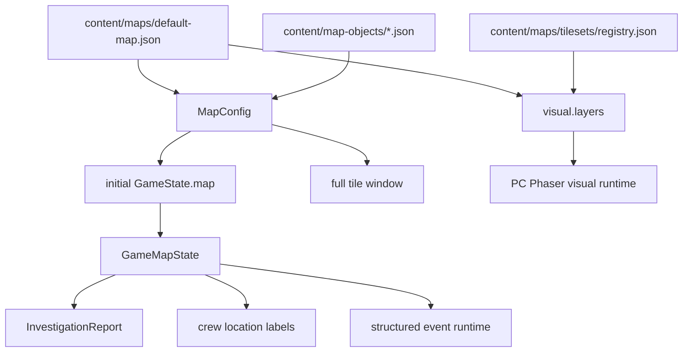

# 地图模型

本文描述可配置地图系统的核心 game model。地图既是静态内容配置、视觉铺设数据，也是运行时调查 / 揭示状态的事实源；UI、队员行动、调查报告、结构化事件、Map Editor 和 PC Phaser runtime 都应从同一套地图模型读取或派生状态。

地图的玩法规则与玩家体验见 `docs/gameplay/map-system/map-system.md`。事件可访问的地块投影边界见 `docs/game_model/event-integration.md`。

## 1. 模型范围与命名

| 规则 | 说明 |
| --- | --- |
| `scope` | 覆盖静态地图配置、视觉层、tileset registry、地图块层级、运行时地图状态、发现 / 调查状态、坐标转换、当前完整地图窗口、调查报告和存档 reset 边界。 |
| `out_of_scope` | 不定义随机地图生成，不实现天气模拟，不定义对象级通用行动菜单，不重构事件系统语义，不定义正式战争迷雾。 |
| `content_source_of_truth` | 地图静态内容来自 `content/maps/*.json`；tileset 元数据来自 `content/maps/tilesets/registry.json`；地块对象定义来自 `content/map-objects/*.json`。地形、区域名、天气、环境属性、地块对象引用、特殊状态与视觉层不保存在运行时状态里。 |
| `runtime_source_of_truth` | 玩家调查状态、揭示对象、揭示状态、活跃状态和调查报告索引来自 `GameState.map`。`discoveredTileIds` 仍存在，但当前 PC 地图展示和移动选点不再用它裁剪范围。 |
| `compatibility_policy` | 研发期不迁移旧地图视图或旧存档；当前事实源统一为地图配置和 `GameState.map`。 |
| `save_policy` | 固定 `4 x 4` 旧存档与配置驱动地图不兼容；读取时应 reset 或使用新的 save 版本 / save key。 |

## 2. 模型分层



| 模型 | 代码名称 | 中文名 | 来源 | 介绍 |
| --- | --- | --- | --- | --- |
| 内容文件 | `content/maps/*.json` | 地图内容配置 | JSON | 地图编辑 / 内容生产应读写的文件，包含尺寸、origin、初始发现地块、完整地图块定义和可选视觉层。当前默认文件为 `content/maps/default-map.json`。 |
| 内容定义 | `MapConfig` | 地图配置 | `src/content/contentData.ts` | TypeScript 对地图内容的描述，运行时初始化和查询 helper 读取它。 |
| 运行时状态 | `GameMapState` | 地图运行时状态 | `GameState.map` | 保存玩家探索进度、调查状态、对象 / 状态揭示和调查报告索引。 |
| 视觉层 | `visual.layers` | 地图视觉铺设 | `content/maps/*.json` | 保存每个视觉 layer 在 tile id 上使用的 tileset id 与 tile index；由 Map Editor 写入，由 PC Phaser runtime 渲染。 |
| Tileset registry | `content/maps/tilesets/registry.json` | 地图素材注册表 | JSON | 保存 tileset 图片路径、tile 尺寸、spacing、margin、分类和 license。 |
| 地块对象库 | `content/map-objects/*.json` | 地块对象定义 | JSON | 保存可复用对象定义；地图 tile 只保存 `objectIds` 引用。 |

## 3. 静态内容模型

### 3.1 `map_config`

`map_config` 定义一张可加载地图的静态内容。默认地图尺寸为 `8 x 8`，但代码逻辑不得假设固定尺寸。

| 字段 | 类型 | 说明 |
| --- | --- | --- |
| `id` | `string` | 地图配置稳定 ID，例如 `default-map`。 |
| `name` | `string` | 地图显示名或内部可读名。 |
| `version` | `number` | 地图内容版本，用于未来内容迁移；不等同于存档版本。 |
| `size.rows` / `size.cols` | `number` | 地图内部边界。默认内容为 `8` 和 `8`。 |
| `originTileId` | `string` | 坠毁点 / 玩家开始点。玩家显示坐标由此派生为 `(0,0)`。 |
| `initialDiscoveredTileIds` | `string[]` | 新游戏开局已发现地块，至少包含 `originTileId`。 |
| `tiles` | `map_tile_definition[]` | 地图块静态定义集合。默认地图应覆盖全部合法格。 |
| `visual` | `map_visual_definition` | 可选视觉层集合；当前 Map Editor 会规范化为 `{ layers: [] }`，PC Phaser runtime 从这里读取视觉 sprite。 |

### 3.2 `map_tile_definition`

| 字段 | 类型 | 说明 |
| --- | --- | --- |
| `id` | `string` | 内部 tile id，继续使用 `row-col`。 |
| `row` / `col` | `number` | 内部坐标，从 `1` 开始；必须与 `id` 一致。 |
| `areaName` | `string` | 区域名。多个 tile 可使用同一区域名；缺失或空值时显示为“野外”。 |
| `terrain` | `string` | 地形中文名，短期继续沿用移动耗时表需要的中文字符串。 |
| `weather` | `string` | 地图配置中的天气；当前 PC 地图完整显示，暂不参与事件结算。 |
| `environment` | `tile_environment` | 结构化环境读数，调查报告使用。 |
| `objectIds` | `string[]` | 地块对象 ID 引用，指向 `content/map-objects/*.json` 中的对象定义。 |
| `specialStates` | `tile_special_state_definition[]` | 特殊状态列表，承载湖泊沸腾、火山爆发、高威胁生物活动等异常。 |

### 3.3 `tile_object_definition`

地块对象统一承载资源点、结构、信号、危险、设施、遗迹和地标。对象定义保存在 `content/map-objects/*.json`，地图 tile 只通过 `objectIds` 引用。对象通过类型、标签和可见性参与结构化地点事件；地图本身不生成资源获取、设施处理、回收或扫描等通用按钮。

| 字段 | 类型 | 说明 |
| --- | --- | --- |
| `id` | `string` | 地图内唯一对象 ID。 |
| `kind` | `resourceNode` / `structure` / `signal` / `hazard` / `facility` / `ruin` / `landmark` | 对象类型。 |
| `name` | `string` | 玩家可见名称。 |
| `description` | `string` | 详情描述，可选。 |
| `visibility` | `onDiscovered` / `onInvestigated` | 对象在发现地块时显示，或调查后显示。 |
| `tags` | `string[]` | 规则和内容标签，供结构化事件、地点条件和调查入口使用。 |

### 3.4 `tile_special_state_definition`

特殊状态代表异常或事件态。状态可以由地图配置预置，也可以由事件系统生成。

| 字段 | 类型 | 说明 |
| --- | --- | --- |
| `id` | `string` | 状态稳定 ID。 |
| `name` | `string` | 玩家可见名称。 |
| `description` | `string` | 详情描述，可选。 |
| `visibility` | `onDiscovered` / `onInvestigated` / `hidden` | 状态可见性。 |
| `severity` | `low` / `medium` / `high` / `critical` | 严重程度。 |
| `tags` | `string[]` | 规则和内容标签。 |
| `startsActive` | `boolean` | 是否开局 active。 |
| `durationGameSeconds` | `number | null` | 可选持续时间。 |

### 3.5 `tile_environment`

环境属性是结构化读数，不在地图详情中常驻显示。调查完成时，系统可生成结构化报告并在日志里提供查看入口。

| 字段 | 类型 | 说明 |
| --- | --- | --- |
| `temperatureCelsius` | `number` | 温度。 |
| `humidityPercent` | `number` | 湿度，范围 `0-100`。 |
| `magneticFieldMicroTesla` | `number` | 磁场强度。 |
| `radiationLevel` | `none` / `low` / `medium` / `high` / `critical` | 辐射等级。 |
| `toxicityLevel` | `string | null` | 毒性等级，可选。 |
| `atmosphericPressureKpa` | `number | null` | 气压，可选。 |
| `notes` | `string | null` | 设计备注或叙事短句，可选。 |

### 3.6 `map_visual_definition`

视觉层用于把 `assets/` 中登记过的 tileset 资源铺到地图格子上。视觉层只负责最终地图画面，不改变地形、对象、移动、事件或调查规则。

```ts
type MapVisualDefinition = {
  layers: MapVisualLayerDefinition[];
};

type MapVisualLayerDefinition = {
  id: string;
  name: string;
  visible: boolean;
  locked: boolean;
  opacity: number;
  cells: Record<string, MapVisualCellDefinition>;
};

type MapVisualCellDefinition = {
  tilesetId: string;
  tileIndex: number;
};
```

| 字段 | 说明 |
| --- | --- |
| `visual.layers` | 视觉层数组。Map Editor 可新增、重命名、排序、隐藏、锁定和调整透明度。 |
| `layer.cells` | 以 tile id 为 key 的稀疏铺设表；未出现的 tile 表示该层没有视觉 sprite。 |
| `tilesetId` | 引用 `content/maps/tilesets/registry.json` 中的 tileset。 |
| `tileIndex` | 引用 tileset 中的 tile frame；必须在 `0 <= tileIndex < tileCount` 范围内。 |

渲染规则：

- Map Editor 的 Final Art 与 PC Phaser runtime 都按 layer 顺序叠加可见视觉层。
- 单个视觉 tile 在本格内完整铺满，视觉 sprite 使用 `TILE_SIZE` 连续排列；格子线、选中框、坐标、origin / discovered 标记、Gameplay Overlay、路线和队员标记都是 overlay，不参与视觉素材布局。
- `spacing` / `margin` 只描述从 source spritesheet 取 frame 的方式，不表示地图格子之间应该有真实间隙。

### 3.7 `map_tileset_registry`

tileset registry 位于 `content/maps/tilesets/registry.json`，由 `content/schemas/map-tilesets.schema.json` 校验。

| 字段 | 说明 |
| --- | --- |
| `id` / `name` | tileset 稳定 ID 与显示名。 |
| `assetPath` | 仓库内 `assets/` 路径，Map Editor helper 通过 `/api/map-editor/assets` 读取。 |
| `publicPath` | PC runtime 可从 public 目录加载的路径。 |
| `tileWidth` / `tileHeight` | source tile frame 尺寸。 |
| `spacing` / `margin` | source spritesheet 内 frame 间距与边距，仅用于切 frame。 |
| `columns` / `tileCount` | tile index 计算与 palette 展示范围。 |
| `categories` | Palette 过滤用分类，如 terrain、water、building、nature、marker。 |
| `license` | 素材 license 名称与仓库路径。 |

## 4. 运行时模型

### 4.1 `GameMapState`

`GameMapState` 是地图运行时事实源。静态地图内容不复制进它，只保存随玩家游玩变化的状态。

```ts
type GameMapState = {
  configId: string;
  configVersion: number;
  rows: number;
  cols: number;
  originTileId: string;
  tilesById: Record<string, RuntimeTileState>;
  discoveredTileIds: string[];
  investigationReportsById: Record<string, InvestigationReport>;
};
```

| 字段 | 说明 |
| --- | --- |
| `configId` / `configVersion` | 指向加载时使用的地图配置。 |
| `rows` / `cols` | 运行时地图边界，初始化自配置。 |
| `originTileId` | 玩家显示坐标原点。 |
| `tilesById` | 每个地图块的运行时状态。 |
| `discoveredTileIds` | 已发现地块集合。 |
| `investigationReportsById` | 调查报告索引。 |

### 4.2 `RuntimeTileState`

```ts
type RuntimeTileState = {
  id: string;
  discovered: boolean;
  investigated: boolean;
  revealedObjectIds: string[];
  revealedSpecialStateIds: string[];
  activeSpecialStateIds: string[];
  specialStateExpiresAt?: Record<string, number>;
  lastInvestigationReportId?: string;
};
```

| 字段 | 说明 |
| --- | --- |
| `discovered` | 是否已发现。当前不裁剪 PC 地图可见范围；保留给内容初始化、事件条件和未来战争迷雾设计。 |
| `investigated` | 是否已调查。旧 `tile.investigated` 由该字段派生。 |
| `revealedObjectIds` | 已揭示对象 ID。`onDiscovered` 对象可在初始化或发现时加入。 |
| `revealedSpecialStateIds` | 已揭示特殊状态 ID。 |
| `activeSpecialStateIds` | 当前仍活跃的特殊状态 ID。 |
| `specialStateExpiresAt` | 特殊状态过期时间，以游戏秒记录。 |
| `lastInvestigationReportId` | 最近一次调查报告 ID。 |

## 5. 坐标系统

### 5.1 内部坐标

- 内部 tile id 继续为 `row-col`。
- `row` 和 `col` 从 `1` 开始。
- 内部边界由 `GameMapState.rows` 和 `GameMapState.cols` 决定。
- 移动、路径和结构化事件可以继续使用内部 `row` / `col`。

### 5.2 玩家显示坐标

玩家坐标以 `originTileId` 为 `(0,0)` 派生：

```ts
displayX = tile.col - origin.col;
displayY = origin.row - tile.row;
```

规则：

- `x` 向右为正，向左为负。
- `y` 向上为正，向下为负。
- 地图 UI 文案显示为 `(${displayX},${displayY})`。
- 普通玩家可见文案不得直接显示内部 `(row,col)`；Debug 工具可选择显示内部坐标。

## 6. 地图窗口模型

当前玩家可见窗口是完整地图窗口：地图页与通话移动目标列表按 `MapConfig.size.rows / cols` 枚举全部合法 tile，并把这些 cell 作为可查看、可点选的目标。`apps/pc-client/src/mapSystem.ts` 中仍保留 `getVisibleTileWindow` 和 `frontier` / `unknownHole` 状态，作为未来战争迷雾设计的候选基础；当前玩家路径使用 `getFullTileWindow`。

当前完整地图窗口：

1. 从 `row = 1..size.rows`、`col = 1..size.cols` 枚举 tile id。
2. 对每个 id 读取静态 tile 定义。
3. 按 `originTileId` 派生玩家显示坐标。
4. 将 cell status 标为 `discovered`，供现有 Phaser 视图复用。
5. 地图页、通话移动选择、路线预览和 Phaser 初始画面都使用这一窗口。

移动目标合法性当前只检查：

- tile id 格式合法。
- row / col 位于地图配置边界内。
- `MapConfig.tiles` 中存在 authored tile。

发现状态不再限制当前移动目标。战争迷雾 / 探索可见性恢复时，需要重新定义这里的窗口状态和移动规则。

### 6.1 预留发现窗口

预留算法中的每个渲染 cell 有三类显示状态：

| 状态 | 说明 | 是否显示真实信息 | 是否可作为移动目标 |
| --- | --- | --- | --- |
| `discovered` | 已发现地块。 | 是，显示区域名、地形、天气、已揭示对象 / 状态、队员位置。 | 是 |
| `frontier` | 合法地图内、与任一已发现格相邻一圈，但尚未发现。 | 否，显示“未探索信号”。 | 预留，当前不作为移动限制 |
| `unknownHole` | 位于外接矩形内，但既非已发现也非外围未探索。 | 否，显示“未探索信号”。 | 否 |

预留发现窗口算法：

1. 从 `GameMapState.discoveredTileIds` 取得已发现 tile 集合。
2. 对每个已发现 tile 枚举 8 邻域，包含上下左右与四个斜向相邻格。
3. 仅保留 `1 <= row <= rows` 且 `1 <= col <= cols` 的合法 tile。
4. 未发现的合法邻居加入 `frontier` 集合。
5. 对 `discovered ∪ frontier` 求 `minRow/maxRow/minCol/maxCol`。
6. 渲染外接矩形内所有合法 tile。
7. 对每格判定：在 `discovered` 中为 `discovered`；否则在 `frontier` 中为 `frontier`；否则为 `unknownHole`。
8. 若开局发现集合异常为空，初始化逻辑应修复为只发现 `originTileId`。

可见扩张使用 8 邻域，移动路径仍使用上下左右相邻的曼哈顿路径。二者是不同规则。当前 PC 页面不使用该窗口裁剪地图。

## 7. 调查报告模型

调查完成时，地图系统将静态环境读数与本次揭示结果打包成结构化报告。

```ts
type InvestigationReport = {
  id: string;
  tileId: string;
  crewId: string;
  createdAtGameSeconds: number;
  areaName: string;
  displayCoord: { x: number; y: number };
  terrain: string;
  weather: string;
  environment: {
    temperatureCelsius?: number;
    humidityPercent?: number;
    magneticFieldMicroTesla?: number;
    radiationLevel?: string;
    toxicityLevel?: string;
    atmosphericPressureKpa?: number;
    notes?: string;
  };
  revealedObjects: Array<{ id: string; name: string; kind: string }>;
  revealedSpecialStates: Array<{ id: string; name: string; severity?: string }>;
};
```

调查完成流程：

1. 找到队员所在地 tile。
2. 标记 `RuntimeTileState.investigated = true`。
3. 将该 tile 中 `visibility = onInvestigated` 的对象加入 `revealedObjectIds`。
4. 将该 tile 中 `visibility = onInvestigated` 且 active 的特殊状态加入 `revealedSpecialStateIds`。
5. 读取静态 tile 的 `environment`，生成 `InvestigationReport`。
6. 将报告写入 `GameMapState.investigationReportsById`。
7. 向系统日志追加一条调查摘要，日志项关联 `reportId`。
8. 保持既有调查完成事件触发逻辑。

## 8. 系统关系

### 队员系统

- `CrewMember.currentTile` 保存队员当前所在地块 ID。
- 队员位置摘要通过地图区域名和玩家显示坐标派生，不使用资源名作为地点。
- 移动目标合法性读取地图边界和 authored tile；当前不再读取发现状态或外围未探索状态。
- 队员抵达目标地块后触发现有抵达事件检查。是否在抵达时改变 discovered 状态属于未来战争迷雾设计。

### 通讯台与通话

- 通讯台和队员卡片展示区域名与行动状态。
- 通话移动目标列表当前包含完整地图中的所有合法 authored tile。
- 目标文案当前显示真实区域名、显示坐标与地形；不再使用“未探索信号（x,y）”作为当前规则。
- 已揭示地块对象可作为结构化地点事件的条件、展示上下文或调查线索；剧情动作由事件选项提供，不由地图对象直接生成通用按钮。

### 事件系统

- 当前事件系统通过地图配置和 `GameState.map` 读取地形、发现状态、调查状态、对象、特殊状态和调查报告。
- 天气、特殊状态、环境属性和地块对象可作为事件条件、概率修正或分支的语义来源。
- 事件系统不应绕过地图模型任意写 `GameState.map`；应通过结构化 effect 修改发现、调查、状态、对象和历史。

### 存档

- 新地图结构与固定 `4 x 4` 旧存档不兼容。
- 推荐使用新 save key，例如 `stellar-frontier-save-v2`；若只有旧 key，视为无可用存档并创建新游戏。
- 备选策略是在存档内新增 `saveVersion: 2`；读取时若缺失或版本过低，则丢弃旧存档并创建新状态。
- reset 内容包括旧 `tiles`、队员旧位置、旧行动目标、旧事件队列、紧急事件和旧日志。

## 9. 校验规则

地图内容校验至少覆盖：

- `content/maps/default-map.json` 必须符合地图 schema。
- `size.rows` 和 `size.cols` 必须为正整数；默认内容为 `8 x 8`。
- `originTileId` 必须存在于 `tiles`。
- `initialDiscoveredTileIds` 中所有 id 必须存在，且包含 `originTileId`。
- 每个 tile 的 `id` 必须等于 `${row}-${col}`。
- tile `row`、`col` 必须在地图边界内。
- 默认地图 `tiles` 覆盖所有合法格；如果未来允许稀疏地图，需要先定义 blocked / void 规则。
- tile `objectIds` 必须引用 `content/map-objects/*.json` 中存在的对象定义。
- 特殊状态 `id` 在单 tile 内唯一。
- `visual.layers` 存在时必须为数组；Map Editor 会规范化为 `{ layers: [] }`。
- visual layer `id` 在单地图内唯一。
- visual cell 的 tile id 必须存在于地图 tile 集合。
- visual cell 的 `tilesetId` 必须引用 `content/maps/tilesets/registry.json` 中存在的 tileset。
- visual cell 的 `tileIndex` 必须是整数，且小于目标 tileset 的 `tileCount`。

## 10. 后续扩展记录

- 事件系统与地图对象联调：事件条件可直接引用 `object.kind`、`object.tags`、`object.id`。
- 事件系统与天气联调：天气参与事件触发、概率修正或行动风险。
- 事件系统与特殊状态联调：明确状态来源、持续时间、过期、刷新、揭示和日志规则。
- 事件系统与环境属性联调：温度、湿度、磁场、辐射等结构化读数可进入事件条件。
- 地点剧情动作元数据扩展：当前基础行动只包含移动、待命、停止和调查；未来如果需要每个对象覆盖耗时、消耗或工具需求，应通过结构化事件或目标模型扩展。
- 战争迷雾 / 探索窗口：当前 PC 地图完整显示并允许选择任意合法 authored tile；后续若恢复探索限制，需要同步更新窗口模型、移动目标规则、信息隐藏、事件触发和 UI 文案。

## 来源

| 日期 | 来源 |
| --- | --- |
| 2026-04-27 | `docs/plans/2026-04-27-17-37/configurable-map-system-design.md` |
| 2026-04-27 | `docs/plans/2026-04-27-17-37/technical-design.md` |
| 2026-04-28 | `docs/plans/2026-04-27-22-56/communication-table-gameplay-design.md` |
| 2026-05-03 | `audit-wiki 一致性审计：按当前代码更新地图视觉层、完整地图窗口和移动目标边界` |
