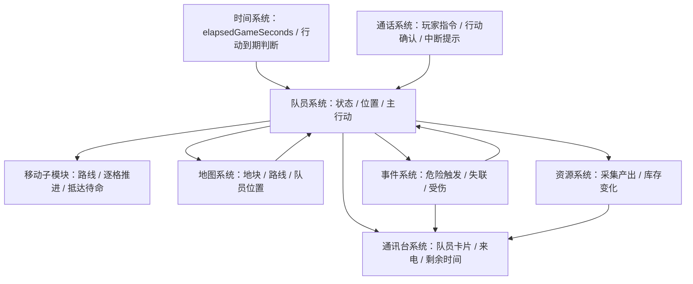

# 队员系统

## 文档目标

本文档说明队员系统的核心玩法规则。队员系统负责管理队员的位置、状态、行动、通话指令和行动结果，是移动、待命、调查、采集、建设、背包、受伤、失联等玩法的上层系统。

当前阶段重点定义队员移动规则：玩家可以在通话中请求队员移动到指定地点，移动需要消耗时间，耗时与经过地块的距离和类型有关；队员抵达目标地点后会原地待命。

本文档是 gameplay 文档，应作为后续实现、数值配置、UI 状态展示和事件设计的共同依据。

## 核心设定

- 队员是玩家在星球表面执行行动的单位。
- 每个队员同一时间只能执行一个主行动。
- 队员主行动包括移动、待命、调查、采集、建设和事件处理。
- 队员行动不会瞬间完成，除明确写为即时结算的通话选择外，行动都需要消耗游戏时间。
- 玩家主要通过通讯台进入通话，再在通话中向队员下达指令。
- 地图用于查看地块、队员位置和行动状态，不直接下达队员指令。
- 队员移动到目标地点后默认进入原地待命状态。
- 游戏时间持续推进时，队员行动持续结算；游戏关闭后，队员行动不继续推进。

## 设计目标

- 让队员成为玩家与地图、资源、事件系统互动的主要媒介。
- 让位置变化有明确时间成本，避免队员在地图上瞬间切换地点。
- 让玩家在通话中做出有代价的调度决策。
- 让通讯台、通话页面和地图对同一个队员状态保持一致显示。
- 为后续调查、采集、建设、背包、伤病和失联规则预留统一模型。

## 约束

以下内容在当前阶段明确不做：

- 队员离线行动补算。玩家关闭游戏后，队员移动、调查、采集、建设和事件处理都不会继续推进。
- 队员多行动并行。同一名队员同一时间只能执行一个主行动。
- 队员瞬间移动。除特殊剧情或未来科技能力外，普通移动必须经过路线和时间结算。
- 地图直接下达指令。地图只展示地点、路线、队员位置和状态；移动、调查、采集、建设等指令必须通过通话确认。
- 移动中直接改派目标。MVP 中需要先停止当前行动，再下达新的移动指令。
- 多队员编队、护送、协同行动。
- 载具、飞行、传送、跨地图移动。
- 复杂寻路权重。MVP 只使用网格相邻移动和可通行判断。
- 移动中实时动画要求。玩法规则只要求按格更新状态，具体动画表现不在本文档约束范围内。
- 完整的经过地块事件表。MVP 默认只在抵达目标地块时触发目标事件。

当前阶段的规则可以概括为：

```text
队员是行动执行者。
玩家通过通话下达队员指令。
地图只读展示队员位置和路线状态。
队员行动消耗全局游戏时间。
移动按逐格路线推进，抵达目标后原地待命。
```

## 系统关系示意图

队员系统是角色行动状态的中心。它不直接推进时间，也不直接绘制 UI，而是接收通话指令，读取地图地块信息，按时间系统结算行动，并把队员位置、状态和行动结果同步给地图、通讯台、资源和事件系统。



关系说明：

- 时间系统提供当前游戏时间和行动到期判断，队员系统根据时间推进移动、待命、调查、采集和建设。
- 通话系统是玩家下达队员指令的确认入口，负责展示行动后果、预计耗时和中断提示。
- 队员系统记录队员当前位置、目标地点、行动状态和行动结果。
- 移动子模块属于队员系统，负责路线生成、逐格推进、移动中断和抵达待命。
- 地图系统提供地块、地形、可通行性和目标选择信息，同时展示队员当前位置、目标和路线。
- 通讯台系统读取队员状态，展示队员卡片、剩余时间、来电状态和失联状态。
- 资源系统在队员采集行动完成时结算产出；队员系统不直接凭空增加资源。
- 事件系统可以由队员进入地块、行动完成、长时间待命或紧急倒计时触发，并可以反向改变队员状态。

## 队员基础字段

每个队员至少需要维护以下字段：

| 字段 | 类型 | 说明 |
| --- | --- | --- |
| `crewId` | 字符串 | 队员唯一 ID。 |
| `name` | 字符串 | 队员显示名，例如 `Amy`、`Garry`。 |
| `role` | 字符串 | 队员身份或职业描述。 |
| `currentTile` | 坐标 | 队员当前所在地块。逐格移动时，该字段会随着移动进度更新。 |
| `status` | 枚举 | 队员总状态，例如 `idle`、`moving`、`working`、`inEvent`、`lost`、`dead`。 |
| `currentAction` | 对象或空 | 当前正在执行的主行动。 |
| `canCommunicate` | 布尔 | 当前是否可被通讯台联系。 |
| `lastContactTime` | 游戏秒 | 最近一次成功通讯时间。 |

## 队员状态

### 总状态

| 状态 | 说明 | 是否可接普通移动指令 |
| --- | --- | --- |
| `idle` | 原地待命，没有执行主行动。 | 是 |
| `moving` | 正在移动到目标地点。 | 否，MVP 需要先停止当前行动。 |
| `working` | 正在调查、采集或建设。 | 是，但会中断当前工作。 |
| `inEvent` | 正在处理紧急事件或剧情事件。 | 否，需先处理事件。 |
| `lost` | 失联，无法正常通讯。 | 否 |
| `dead` | 死亡或不可用。 | 否 |

### 主行动限制

队员同一时间只能执行一个主行动。下达新行动时需要检查当前状态：

| 当前行动 | 新移动指令处理 |
| --- | --- |
| 原地待命 | 直接开始移动。 |
| 移动中 | MVP 不允许直接改派目标，需要先停止当前行动。 |
| 调查中 | 提示会中断调查，玩家确认后开始移动。 |
| 采集中 | 提示当前未完成采集轮不会结算，玩家确认后开始移动。 |
| 建设中 | 提示建设会中断，材料是否返还按建设规则处理；MVP 默认不返还。 |
| 紧急事件中 | 不能下达普通移动指令。 |
| 失联或死亡 | 不能下达移动指令。 |

## 行动模型

队员行动至少需要以下字段：

| 字段 | 类型 | 说明 |
| --- | --- | --- |
| `actionId` | 字符串 | 行动唯一 ID。 |
| `crewId` | 字符串 | 执行动作的队员。 |
| `actionType` | 枚举 | 行动类型，例如 `move`、`standby`、`survey`、`gather`、`build`、`event`。 |
| `status` | 枚举 | `pending`、`inProgress`、`completed`、`interrupted`、`failed`。 |
| `startTime` | 游戏秒 | 行动开始时间。 |
| `durationSeconds` | 整数或空 | 行动总耗时。持续待命等无固定结束时间的行动可为空。 |
| `finishTime` | 游戏秒或空 | 行动预计完成时间。持续待命等无固定结束时间的行动可为空。 |
| `fromTile` | 坐标 | 行动起点。 |
| `targetTile` | 坐标 | 行动目标地块。 |
| `resultPayload` | 对象 | 行动完成后的结果。 |

移动行动需要额外字段：

| 字段 | 类型 | 说明 |
| --- | --- | --- |
| `route` | 坐标数组 | 从起点到目标地块的逐格路线，不包含起点，包含目标。 |
| `routeStepIndex` | 整数 | 当前正在前往的路线节点索引。 |
| `stepStartedAt` | 游戏秒 | 当前格移动开始时间。 |
| `stepFinishTime` | 游戏秒 | 当前格移动完成时间。 |
| `totalDurationSeconds` | 整数 | 整条路线总耗时，应与移动行动的 `durationSeconds` 一致。 |
| `remainingSeconds` | 整数 | 当前时刻距离抵达目标的剩余时间。 |

## 子模块：移动

### 功能说明

移动是队员主行动的一种。玩家在与队员通话时，可以请求队员移动到指定地点。移动不是即时完成，而是按路线逐格推进。

移动完成后：

- 队员 `currentTile` 更新为目标地块。
- 队员 `status` 更新为 `idle`。
- 当前移动行动标记为 `completed`。
- 通讯台显示队员“待命中”。
- 地图显示队员位于目标地块。
- 目标地块可以触发抵达事件。

### 指令入口

移动指令只能通过通话页面确认：

1. 玩家从通讯台主动联系队员，或接通队员来电。
2. 通话页面出现“请求前往”或同类行动按钮。
3. 玩家打开地图查看地块信息。
4. 玩家选择目标地块后返回通话页面。
5. 通话页面展示目标、预计耗时、是否会中断当前行动。
6. 玩家确认后，系统创建移动行动。

地图页面只负责查看地点和辅助选点，不直接向队员下达移动指令。

### 目标选择规则

目标地块必须满足以下条件：

- 地块存在于当前地图范围内。
- 地块不是完全不可达地块。
- 队员当前状态允许接收移动指令。
- 起点和目标之间存在可通行路线。
- 目标不是队员当前所在地块；如果选择当前地块，按钮显示为“已在此处”或保持禁用。

不可达情况示例：

| 情况 | 处理 |
| --- | --- |
| 目标是水域且队员没有渡水能力 | 禁用确认按钮，提示“当前无法前往水域”。 |
| 路线被危险、建筑或事件阻断 | 禁用确认按钮，提示“当前路线不可达”。 |
| 队员失联 | 禁用移动指令，提示“信号中断，无法下达指令”。 |
| 队员处于紧急事件 | 禁用普通移动指令，提示“需先处理当前事件”。 |

### 路线规则

MVP 地图为 `4 x 4` 网格，每个地块用坐标表示，例如 `(1,1)` 到 `(4,4)`。

移动路线按上下左右相邻地块逐格组成，不允许斜向移动。

MVP 路线选择规则：

- 使用曼哈顿路径。
- 路线只能经过可通行地块。
- 如果有多条同等长度路线，优先选择固定顺序，避免同一指令产生不稳定结果。
- 推荐固定顺序为：先横向，再纵向。
- 若固定顺序路线被阻断，则尝试其他同等长度路线。
- 若所有路线都不可通行，则目标不可达。

曼哈顿距离计算：

```text
distance = abs(fromX - targetX) + abs(fromY - targetY)
```

路线示例：

```text
起点：(1,1)
目标：(3,2)
优先路线：(2,1) -> (3,1) -> (3,2)
距离：3 格
```

### 逐格模拟规则

移动按路线逐格推进。队员每走完一格，`currentTile` 立即更新为该格。

示例：

```text
第 1 日 00:00:00，Garry 从 (1,1) 前往 (3,2)。
路线：(2,1) -> (3,1) -> (3,2)。
第 1 日 00:01:00，Garry 抵达 (2,1)。
第 1 日 00:02:00，Garry 抵达 (3,1)。
第 1 日 00:03:00，Garry 抵达 (3,2)，进入原地待命。
```

逐格更新带来的规则影响：

- 通讯台显示的“当前位置”应随当前格更新。
- 地图应显示队员当前所在格和最终目标格。
- 队员如果在移动中被中断，停留在最近已经抵达的地块。
- 经过地块事件未来可以在每次抵达新格时触发。
- MVP 可以暂不触发经过地块事件，只在最终抵达目标地块时触发目标事件。

### 移动耗时

每一步移动的耗时按进入的目标地块计算。

默认地形移动耗时：

| 地形 | 每格耗时 |
| --- | --- |
| 平原 | `60 秒` |
| 丘陵 | `90 秒` |
| 森林 | `120 秒` |
| 山地 | `180 秒` |
| 沙漠 | `150 秒` |
| 水域 | 默认不可步行通过 |

总耗时计算：

```text
totalDurationSeconds = sum(每一步进入地块的移动耗时)
```

示例：

```text
路线：(2,1 平原) -> (3,1 平原) -> (3,2 丘陵)
总耗时 = 60 + 60 + 90 = 210 秒
```

MVP 简化数值可以使用：

```text
每格默认 60 秒
移动耗时 = 曼哈顿距离 * 60 秒
```

如果启用地形耗时表，通话页面和通讯台显示必须使用地形计算后的实际耗时，而不是简化耗时。

### 移动开始

玩家确认移动后，系统执行：

```text
fromTile = crew.currentTile
targetTile = 玩家确认的目标地块
route = 根据 fromTile 和 targetTile 生成逐格路线
startTime = 当前 elapsedGameSeconds
stepStartedAt = startTime
stepFinishTime = startTime + 第一格耗时
finishTime = startTime + totalDurationSeconds
crew.status = moving
crew.currentAction = move
```

如果队员原本正在执行可中断行动，先中断原行动，再创建移动行动。

### 移动推进

游戏运行中，时间系统每秒推进并检查移动行动。

逐格推进逻辑：

```text
if elapsedGameSeconds >= stepFinishTime:
  crew.currentTile = route[routeStepIndex]
  routeStepIndex += 1

  if routeStepIndex >= route.length:
    完成移动
  else:
    stepStartedAt = stepFinishTime
    stepFinishTime = stepStartedAt + 下一格耗时
```

如果一次检查跨过多个格子的完成时间，系统需要连续处理所有已经到期的步骤，直到当前步骤尚未完成或整条路线完成。

### 移动完成

当队员抵达路线最后一个地块时：

```text
crew.currentTile = targetTile
crew.status = idle
crew.currentAction.status = completed
crew.currentAction = null
```

移动完成后，队员原地待命，不会自动调查、采集或建设。

抵达目标地块后可以触发：

- 地块进入事件。
- 危险遭遇。
- 通讯提醒。
- 可调查或可采集提示。

MVP 默认只触发目标地块事件，不触发经过地块事件。

### 移动中断

移动可能被中断。中断来源包括：

- 玩家要求停止当前行动。
- 队员遭遇紧急事件。
- 路线后续地块变为不可达。
- 队员失联、受伤、死亡。

逐格模拟下的中断规则：

| 中断时机 | 队员停留位置 |
| --- | --- |
| 已完成至少一格 | 最近已经抵达的地块，即当前 `currentTile`。 |
| 第一格尚未完成 | 起点地块。 |
| 刚好到达某一格同秒中断 | 先按结算顺序处理移动到格，再处理后续中断。 |

停止行动不是瞬间完成。MVP 中停止当前行动耗时为 `10 秒`，停止完成后队员在当前地块待命。

## 子模块：待命

待命是队员没有执行主行动时的默认状态。

| 行动 | 耗时 | 说明 |
| --- | --- | --- |
| 原地待命 | 持续状态 | 不自动结束，直到玩家下达新指令或事件触发。 |
| 停止当前行动 | `10 秒` | 用于从移动、调查、采集或建设切换到待命。 |

队员移动完成后自动进入原地待命。待命期间，队员仍可能因为地块危险、剧情条件或长时间停留触发事件。

## 与时间系统的关系

队员系统依赖全局时间推进行动，不拥有独立时间。

需要从时间系统读取：

- 当前 `elapsedGameSeconds`。
- 行动开始时间。
- 当前步骤完成时间。
- 整体行动完成时间。

时间系统每秒检查到期行动。移动行动需要同时支持整条路线完成检查和逐格步骤完成检查。

结算顺序建议沿用时间系统规则：

1. 更新全局时间。
2. 结算已经到期的队员行动步骤。
3. 更新队员当前位置和状态。
4. 处理抵达地块后的事件。
5. 刷新通讯台、地图和通话页面显示。

## 与通话系统的关系

通话页面是移动指令的确认入口。

通话页面在玩家确认移动前需要显示：

- 队员当前地点。
- 目标地点。
- 预计路线。
- 预计总耗时。
- 当前行动是否会被中断。
- 目标是否可达。
- 抵达后会进入原地待命。

移动确认文案示例：

```text
请求 Garry 前往 (3,2) 丘陵铁矿床。
预计耗时 03:30。
抵达后 Garry 将原地待命。
```

如果会中断当前行动：

```text
Garry 正在采集铁矿。本次移动会中断当前采集，未完成的一轮不会结算。
确认前往？
```

## 与通讯台的关系

通讯台需要展示队员当前状态和移动剩余时间。

状态显示建议：

| 队员状态 | 显示示例 |
| --- | --- |
| 待命 | `位于 (3,2)，待命中` |
| 移动中 | `位于 (2,1)，正在前往 (3,2)，剩余 02:30` |
| 工作中可改派 | `正在采集铁矿，通话中可请求前往其他地点` |
| 紧急事件中 | `遭遇危险，需先接通处理` |
| 失联 | `信号中断，最后联系：第 1 日 00 小时 12 分钟 30 秒` |

通讯台不直接下达移动指令。玩家需要点击“通话”进入通话页面后确认行动。

## 与地图系统的关系

地图负责展示队员位置、目标和路线状态，不直接发起指令。

地图中队员移动状态建议显示：

- 当前所在地块显示队员标记。
- 目标地块显示目标标记。
- 如果 UI 成本允许，显示路线高亮。
- 坐标详情中显示“正在前往此处”或“从此处经过”。
- 移动剩余时间每秒刷新。

地图状态示例：

```text
Garry 当前位于 (2,1)。
目标：(3,2) 丘陵铁矿床。
状态：移动中，剩余 02:30。
```

当队员逐格移动时，地图上的队员标记应随着 `currentTile` 更新。

## MVP 范围

当前阶段明确包含：

- 队员系统作为 gameplay 顶层文档。
- 队员同一时间只能执行一个主行动。
- 玩家通过通话请求队员移动。
- 地图用于查看和选择地点，不直接下达指令。
- 移动按逐格路线推进。
- 移动耗时按每格计算。
- 移动中队员当前位置随已抵达地块更新。
- 抵达目标后队员原地待命。
- 移动会同步更新通讯台、地图和通话页面状态。

当前阶段暂不包含：

- 队员自动寻路的复杂权重算法。
- 交通工具、飞行、传送或载具。
- 多队员编队移动。
- 移动中实时动画表现要求。
- 移动中经过地块事件的完整事件表。
- 移动中直接改派目标。MVP 需要先停止当前行动。
- 离线移动补算。

## 后续扩展

后续可以在队员系统下继续扩展以下子模块：

- 调查：发现地块资源、危险、异常或剧情线索。
- 采集：按轮消耗时间并产出资源。
- 建设：在地块上建立设施或安装仪器。
- 背包：管理队员携带资源、工具和任务物品。
- 状态：受伤、疲劳、失联、死亡、士气。
- 通讯：通讯距离、信号质量、延迟、干扰。
- 自动行为：循环采集、巡逻、自动撤退或默认待命行为。
