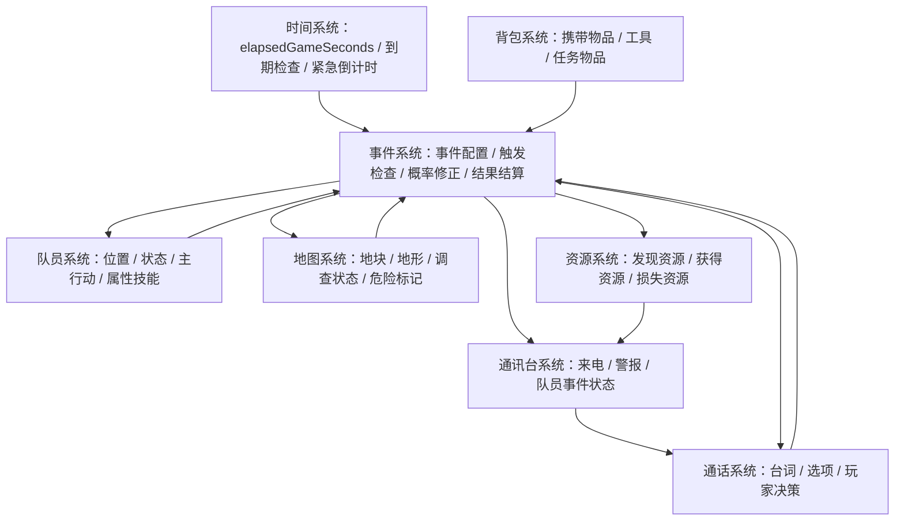

# 事件系统

## 文档目标

本文档说明事件系统的核心玩法规则。事件系统负责管理事件数据、触发条件、概率修正、事件耗时、事件结算、紧急事态和事件反馈，是地图探索、队员调查、资源发现、危险遭遇、通话决策和剧情推进的上层系统。

本文档是 gameplay 文档，应作为后续实现、数值配置、UI 状态展示和事件内容编写的共同依据。

事件系统需要满足以下原始需求：

- 事件数据不应继续硬编码在代码中，应使用独立数据格式保存，方便 review、增量更新和内容扩展。
- 事件系统需要规定一套数据格式来定义事件。
- 每个事件可以有自己的耗时、倒计时或结算时间点。
- 队员可以在地点开展调查，调查会触发或推进事件。
- 大部分事件会根据队员属性、携带物品、状态、技能和随机性决定结果。
- 部分事件会触发紧急事态，让队员主动来电，请求玩家援助或下一步指示。

## 核心设定

- 事件是世界对队员行动的反馈。
- 事件可以来自队员进入地块、完成调查、完成采集、完成建设、长时间待命、通话选择或紧急倒计时。
- 事件数据应与代码解耦，由结构化配置定义。
- 每个事件都可以定义触发条件、基础概率、修正项、耗时、结果和 UI 文案。
- 同一事件可以是一次性的，也可以是可重复触发的。
- 普通事件可以直接结算，也可以只作为见闻、线索或资源发现填充事件池。
- 紧急事件会进入通讯台来电和通话决策流程。
- 游戏关闭后，事件倒计时和事件耗时不会继续推进。

当前阶段的规则可以概括为：

```text
事件由队员行动触发。
事件数据独立配置。
事件结算依赖全局时间。
普通事件用于填充探索反馈。
紧急事件通过通讯台和通话页面处理。
```

## 设计目标

- 让地图探索和调查不只是资源按钮，而是持续产出风险、发现和叙事反馈。
- 让事件内容可以被策划独立 review 和增量添加，减少代码改动成本。
- 让队员属性、技能、装备和状态影响事件结果。
- 让紧急事态形成时间压力和通话决策。
- 让普通事件池提供足够多的低强度反馈，避免重复调查时内容空洞。
- 让事件、队员、时间、通话、通讯台和地图使用同一套状态来源。

## 约束

以下内容在当前阶段明确不做：

- 可视化事件编辑器。
- 复杂剧情树编辑器。
- 多队员协同事件。
- 跨地图事件调度。
- 离线事件补算。玩家关闭游戏后，事件耗时、紧急倒计时和自动结算都不会继续推进。
- 经过每个移动地块都完整触发事件。MVP 默认只在抵达目标地块、调查完成或行动完成时检查事件。
- 大规模全局随机事件。
- 与现实时间相关的固定时间事件。
- 复杂变量脚本语言。MVP 只使用结构化字段和有限条件表达。

当前阶段应优先解决：

- 事件如何被定义。
- 事件何时触发。
- 事件如何根据队员和地块状态结算。
- 普通事件和紧急事件如何区分。
- 事件如何同步到通讯台、通话页面和地图。

## 系统关系示意图

事件系统不直接推进全局时间，也不直接绘制 UI。它读取队员、地图、资源和时间状态，在触发点创建事件实例，并把事件结果同步回相关系统。



关系说明：

- 时间系统提供当前游戏时间、事件耗时到期判断、紧急事件升级和自动结算时间。
- 队员系统提供队员位置、状态、当前行动、属性、技能和可通讯状态。
- 地图系统提供地块类型、调查状态、危险等级、资源点和特殊标记。
- 背包系统提供队员携带物品、工具和任务物品，用于事件条件和概率修正。
- 事件系统筛选候选事件，计算触发概率，创建事件实例并结算结果。
- 普通事件结果可以同步给地图、资源、通讯台和队员系统。
- 紧急事件会同步给通讯台，通讯台再引导玩家进入通话页面处理。
- 通话系统把玩家选择回传给事件系统，由事件系统结算结果。

## 事件类型

| 类型 | 说明 | 常见触发点 | 是否一定需要通话 |
| --- | --- | --- | --- |
| `arrival` | 抵达地块事件。 | 队员移动到目标地块。 | 否 |
| `survey` | 调查事件。 | 队员完成一轮调查。 | 否 |
| `idle` | 待命事件。 | 队员在同一地块停留一段时间。 | 否 |
| `gather` | 采集事件。 | 采集完成或采集中检查。 | 否 |
| `build` | 建设事件。 | 建设完成或建设中检查。 | 否 |
| `emergency` | 紧急事态。 | 危险事件触发或普通事件升级。 | 是 |
| `story` | 剧情事件。 | 剧情条件满足、调查发现线索。 | 视情况 |
| `reminder` | 提醒事件。 | 行动完成、可调查点出现、危险变化。 | 否 |

### 普通事件

普通事件用于给探索和调查提供低强度反馈。普通事件可以奖励少量资源、发现地图信息、增加见闻记录、改变地块描述或轻微影响队员状态。

普通事件原则：

- 不应频繁打断玩家当前流程。
- 不一定要求玩家做选择。
- 可以作为通讯台轻量提醒、地图日志或调查结果文本展示。
- 可以重复出现，但应通过冷却、权重衰减或地块状态避免短时间刷屏。

### 紧急事件

紧急事件用于制造压力和决策。紧急事件通常会改变队员行动状态，并要求玩家通过通讯台接听来电后处理。

紧急事件原则：

- 触发时队员进入 `inEvent` 或其他被事件占用的状态。
- 通讯台显示紧急来电、危险阶段和剩余时间。
- 玩家未处理时，事件会继续倒计时并可能升级。
- 超过最终期限后，事件自动结算。

## 事件数据模型

事件数据使用结构化配置，并通过 JSON Schema 校验。当前内容数据目录位于项目根目录的 `content/`，其中事件、队员和物品分别独立存放；schema 位于 `content/schemas/`。

事件系统文档仍需要完整描述事件字段和规则，不能只依赖外部 schema。JSON Schema 负责数据校验，gameplay 文档负责解释字段语义和玩法规则。

当前事件定义至少需要覆盖以下字段。

| 字段 | 类型 | 说明 |
| --- | --- | --- |
| `eventId` | 字符串 | 事件唯一 ID。 |
| `title` | 字符串 | 事件显示名。 |
| `type` | 枚举 | 事件类型，例如 `survey`、`arrival`、`emergency`。 |
| `priority` | 整数 | 同时满足多个事件时的优先级，数字越高越优先。 |
| `scope` | 枚举 | 事件作用范围，例如 `crew`、`tile`、`global`。 |
| `repeatable` | 布尔 | 是否可以重复触发。 |
| `cooldownSeconds` | 整数 | 重复触发冷却时间。不可重复事件可为 `0`。 |
| `trigger` | 对象 | 触发来源和触发点。 |
| `conditions` | 数组 | 必须满足的条件。 |
| `baseChance` | 数值 | 基础触发概率，范围 `0` 到 `1`。 |
| `modifiers` | 数组 | 根据属性、技能、物品、状态、地块进行概率或结果修正。 |
| `durationSeconds` | 整数 | 事件处理耗时。即时事件为 `0`。 |
| `effects` | 数组 | 事件自动产生的结果。 |
| `choices` | 数组 | 玩家可选项。普通事件可为空。 |
| `emergency` | 对象或空 | 紧急事件的倒计时、危险阶段和自动结算规则。 |
| `resultText` | 对象 | 成功、失败、发现、无结果等展示文案。 |
| `tags` | 字符串数组 | 事件标签，例如 `forest`、`resource`、`danger`。 |

### 触发字段

`trigger` 用于定义事件何时进入候选池。

| 字段 | 类型 | 说明 |
| --- | --- | --- |
| `source` | 枚举 | `arrival`、`surveyComplete`、`gatherComplete`、`buildComplete`、`idleTime`、`callChoice`。 |
| `tileTypes` | 数组 | 允许触发的地形或地点类型。为空表示不限。 |
| `actionTypes` | 数组 | 允许触发的队员行动类型。为空表示不限。 |
| `minIdleSeconds` | 整数 | 待命触发需要的最短停留时间。 |
| `surveyLevel` | 枚举 | `quick`、`standard`、`deep`，用于调查事件。 |

### 条件字段

`conditions` 用于过滤不应触发的事件。

| 条件类型 | 示例 | 说明 |
| --- | --- | --- |
| 队员状态 | `crew.status == idle` | 只允许特定状态触发。 |
| 队员属性 | `crew.attributes.perception >= 3` | 属性达到要求才触发或显示。 |
| 队员技能 | `crew.skills.has(survival)` | 拥有技能才触发或解锁结果。 |
| 携带物品 | `inventory.has(scanner)` | 携带工具才触发或提高成功率。 |
| 地块状态 | `tile.surveyState != fullySurveyed` | 地块未完全调查时触发。 |
| 事件历史 | `notTriggered(eventId)` | 一次性事件尚未触发。 |
| 资源状态 | `tile.resourceRemaining > 0` | 资源未枯竭时触发。 |

### 效果字段

`effects` 用于描述事件结果。事件可以有多个效果，按配置顺序执行。

| 效果类型 | 示例 | 说明 |
| --- | --- | --- |
| `addResource` | 获得 `2 木材` | 增加资源或队员背包物品。 |
| `removeResource` | 损失 `1 食物` | 扣除资源。 |
| `discoverResource` | 地块发现浅层铁矿 | 更新地图资源信息。 |
| `updateTile` | 地块危险等级 +1 | 改变地图地块状态。 |
| `updateCrewStatus` | 队员进入 `lost` | 改变队员状态。 |
| `addCrewCondition` | 队员获得 `轻伤` | 添加受伤、疲劳、恐惧等状态。 |
| `startEmergency` | 创建紧急来电 | 将事件升级为紧急事态。 |
| `addLog` | 添加见闻记录 | 写入事件日志或地块记录。 |

## 事件实例模型

事件定义是静态配置，事件实例是运行时状态。每次触发事件时都需要创建事件实例，用于存档、倒计时、结算和 UI 展示。

| 字段 | 类型 | 说明 |
| --- | --- | --- |
| `instanceId` | 字符串 | 事件实例唯一 ID。 |
| `eventId` | 字符串 | 对应的事件定义 ID。 |
| `crewId` | 字符串或空 | 关联队员。 |
| `tileId` | 字符串或空 | 关联地块。 |
| `status` | 枚举 | `pending`、`active`、`resolved`、`expired`、`cancelled`。 |
| `createdAt` | 游戏秒 | 事件触发时间。 |
| `startedAt` | 游戏秒 | 事件开始处理时间。 |
| `callReceivedTime` | 游戏秒或空 | 通讯台收到来电时间。普通事件为空。 |
| `resolveAt` | 游戏秒或空 | 事件预计结算时间。 |
| `dangerStage` | 整数 | 紧急事件当前危险阶段。普通事件为 `0`。 |
| `nextEscalationTime` | 游戏秒或空 | 紧急事件下一次危险升级时间。普通事件为空。 |
| `deadlineTime` | 游戏秒或空 | 紧急事件最终期限。 |
| `randomSeed` | 字符串或数字 | 本次事件随机种子或随机记录。 |
| `selectedChoiceId` | 字符串或空 | 玩家选择的选项。 |
| `resolvedResultId` | 字符串或空 | 已结算结果。 |

实例化事件时需要记录随机相关信息，保证同一个事件在存档读写、debug 和回放时可以解释。

## 事件触发规则

### 触发来源

事件来源包括：

- 队员抵达目标地块。
- 队员完成一轮调查。
- 队员完成一轮采集。
- 队员完成建设。
- 队员在地块待命达到指定时长。
- 通话中选择某个选项。
- 紧急事件达到升级时间或最终期限。

### 触发流程

事件触发检查建议按以下流程执行：

1. 队员行动、时间系统或通话选择产生触发点。
2. 事件系统根据触发来源筛选候选事件。
3. 检查候选事件的地块、队员、物品、技能、状态和历史条件。
4. 移除不满足条件的事件。
5. 对满足条件的事件计算最终触发概率。
6. 根据概率、优先级和权重选择事件。
7. 创建事件实例。
8. 如果是即时普通事件，立即结算并展示结果。
9. 如果是延迟普通事件，记录 `resolveAt` 并等待时间系统到期结算。
10. 如果是紧急事件，创建通讯台来电并启动倒计时。

### 候选事件选择

同一触发点可能匹配多个事件。MVP 建议使用以下规则：

1. 先处理强制事件，例如剧情事件、教程事件、必定发生的危险事件。
2. 再处理紧急事件候选。
3. 最后处理普通事件候选。
4. 同一触发点 MVP 最多触发 `1` 个主要事件。
5. 轻量提醒可以额外触发，但不能阻塞主要事件。

如果多个事件同时通过条件检查：

| 排序项 | 规则 |
| --- | --- |
| 优先级 | `priority` 高的事件优先。 |
| 剧情锁定 | 必须触发的剧情事件优先。 |
| 地块相关性 | 与当前地块标签更匹配的事件优先。 |
| 冷却时间 | 冷却中的事件不能进入候选。 |
| 随机权重 | 同优先级事件按权重随机。 |

## 调查与重复事件

调查是事件系统的主要入口之一。队员可以在地点开展调查，调查会重复进行，每轮调查在完成时检查事件。

### 调查行动

调查行动沿用时间系统的基础耗时：

| 调查类型 | 耗时 | 事件倾向 |
| --- | --- | --- |
| 快速观察 | `60 秒` | 明显危险、基础描述、低价值发现。 |
| 标准调查 | `180 秒` | 普通资源、地块见闻、一般事件。 |
| 深度调查 | `600 秒` | 隐藏资源、异常信号、高价值剧情线索。 |

MVP 默认使用标准调查：`180 秒`。

### 调查结果类型

每轮调查完成后，可能产生以下结果：

- 发现零散资源。
- 发现资源点。
- 发现危险迹象。
- 获得见闻记录。
- 改变地块描述。
- 触发普通事件。
- 触发紧急事态。
- 没有明显发现。

### 重复调查规则

同一地块可以被重复调查，但需要避免无限刷高价值结果。

建议规则：

- 地块记录 `surveyCount`。
- 高价值事件通常不可重复。
- 资源发现事件触发后，应更新地块状态，避免重复发现同一资源点。
- 低价值普通事件可以重复，但需要冷却时间。
- 每次调查后，普通见闻类事件权重可以下降。
- 如果地块已经完全调查，调查结果更倾向于低价值资源、见闻或无明显发现。

示例：

```text
第 1 次标准调查：发现林间脚印，地图标记轻微危险。
第 2 次标准调查：发现散落木材，获得 2 木材。
第 3 次标准调查：没有明显发现。
深度调查：发现异常信号，触发未知通讯事件。
```

## 紧急事态

紧急事态是需要玩家通过通讯台和通话页面处理的事件。

### 紧急事件字段

紧急事件字段属于事件实例的扩展状态。时间系统只读取这些字段进行到期检查，不单独维护另一套紧急事件状态。

紧急事件需要额外字段：

| 字段 | 类型 | 说明 |
| --- | --- | --- |
| `createdAt` | 游戏秒 | 事件触发时间。 |
| `callReceivedTime` | 游戏秒 | 通讯台收到来电时间。 |
| `dangerStage` | 整数 | 当前危险阶段。 |
| `nextEscalationTime` | 游戏秒 | 下一次危险升级时间。 |
| `deadlineTime` | 游戏秒 | 最迟处理时间。 |
| `autoResolveResult` | 字符串 | 超时后的自动结算结果。 |

推荐数值沿用时间系统：

| 项目 | 数值 |
| --- | --- |
| 紧急事件首次等待时间 | `30 秒` |
| 每次危险升级间隔 | `30 秒` |
| 普通紧急事件最终期限 | `120 秒` |
| 高危紧急事件最终期限 | `60 秒` |

### 紧急事件流程

```text
事件触发
创建事件实例
队员状态进入 inEvent
通讯台显示紧急来电
时间继续推进
玩家接通来电
通话页面展示事件描述和选项
玩家选择处理方式
事件系统按当前危险阶段结算
更新队员、地图、资源和通讯台状态
```

玩家未接通或未做出有效选择时：

```text
当前时间 >= nextEscalationTime：危险阶段 +1
当前时间 >= deadlineTime：自动结算
```

### 通话选项

紧急事件选项可以是即时结算，也可以创建新的队员行动。

| 选项类型 | 是否消耗时间 | 示例 |
| --- | --- | --- |
| 即时决策 | 否 | `立刻撤离`、`保持安静`。 |
| 冒险处理 | 否 | `靠近查看`、`尝试驱赶`。 |
| 拖延选项 | 是 | `先稳住，我想想`，危险阶段可能提升。 |
| 后续行动 | 是 | `继续深度调查`、`返回基地`。 |

## 事件结算规则

### 结算类型

| 结算类型 | 说明 | 示例 |
| --- | --- | --- |
| 即时结算 | 触发后立即应用效果。 | 调查发现 2 木材。 |
| 延迟结算 | 事件需要耗时，到期后结算。 | 采样分析需要 120 秒。 |
| 选择结算 | 玩家选择通话选项后结算。 | 选择逃跑或对抗野兽。 |
| 自动结算 | 达到期限后系统结算。 | 紧急事件超时失败。 |

### 结算顺序

同一时间点出现多个事件相关结算时，建议沿用时间系统的优先级：

1. 更新全局 `elapsedGameSeconds`。
2. 结算队员生死或失联事件。
3. 结算行动中断事件。
4. 结算移动完成并更新队员位置。
5. 结算建设、采集和调查完成。
6. 检查由行动完成触发的新事件。
7. 推进紧急事件危险阶段。
8. 触发通讯台来电、地图标记和普通提醒。

### 行动中断

事件可以中断队员当前行动。

| 当前行动 | 被事件中断后的处理 |
| --- | --- |
| 移动 | 停留在最近已经抵达的地块。 |
| 调查 | 当前调查不产生完整结果，可产生部分线索。 |
| 采集 | 当前未完成采集轮不结算。 |
| 建设 | 建设不完成，材料返还按建设规则处理；MVP 默认不返还。 |
| 待命 | 队员进入事件状态或继续待命。 |

## 概率与修正

事件触发和事件结果都可以使用概率。MVP 建议使用简单加算修正。

```text
finalChance = clamp(baseChance + crewModifier + itemModifier + statusModifier + skillModifier + tileModifier, minChance, maxChance)
```

默认限制：

| 项目 | 数值 |
| --- | --- |
| `minChance` | `0` |
| `maxChance` | `1` |
| 未配置修正 | `0` |

常见修正来源：

| 修正来源 | 示例 |
| --- | --- |
| 队员属性 | 感知高提高发现隐藏资源概率。 |
| 队员技能 | 生存技能降低森林危险事件概率。 |
| 携带物品 | 扫描器提高异常信号发现概率。 |
| 队员状态 | 受伤降低逃跑成功率。 |
| 地块状态 | 高危险等级提高遭遇危险概率。 |
| 建筑设施 | 通讯中继降低失联概率。 |

概率修正示例：

```text
事件：森林调查发现散落木材
baseChance = 0.30
队员感知属性 >= 3：+0.10
携带基础工具：+0.05
地块已经调查 3 次以上：-0.15
最终概率 = 0.30 + 0.10 + 0.05 - 0.15 = 0.30
```

## 与队员系统的关系

事件系统可以读取和修改队员状态。

事件系统需要从队员系统读取：

- 队员当前位置。
- 队员当前行动。
- 队员状态。
- 队员属性和技能。
- 队员是否可以通讯。
- 队员携带物品。

事件系统可以写入：

- 队员状态，例如 `idle`、`working`、`inEvent`、`lost`、`dead`。
- 队员当前行动的完成、中断或失败状态。
- 队员临时状态，例如轻伤、疲劳、恐惧。
- 队员最后联系时间。

队员处于 `inEvent` 时，不能接收普通移动指令，需要先处理事件。

## 与时间系统的关系

事件系统依赖全局时间，不拥有独立时间。

需要从时间系统读取：

- 当前 `elapsedGameSeconds`。
- 事件创建时间。
- 事件预计结算时间。
- 紧急事件下一次升级时间。
- 紧急事件最终期限。

时间系统每秒检查事件实例：

```text
if elapsedGameSeconds >= event.resolveAt:
  结算延迟事件

if elapsedGameSeconds >= emergency.nextEscalationTime:
  危险阶段 +1

if elapsedGameSeconds >= emergency.deadlineTime:
  自动结算紧急事件
```

游戏关闭后不推进事件时间。再次进入游戏时，从存档中的 `elapsedGameSeconds` 和事件实例状态继续。

## 与通话系统的关系

通话系统负责承载紧急事件和部分剧情事件的玩家决策。

通话页面需要展示：

- 事件标题。
- 队员描述。
- 当前危险阶段。
- 剩余处理时间。
- 可选回复或行动。
- 每个选项的预期风险或耗时。

通话系统不直接决定事件结果。玩家选择选项后，通话系统把 `selectedChoiceId` 回传给事件系统，由事件系统按事件配置、当前阶段和概率修正结算。

## 与通讯台的关系

通讯台是玩家发现紧急事件的主要入口。

通讯台需要展示：

| 事件状态 | 显示示例 |
| --- | --- |
| 普通发现 | `Amy 在森林发现了一些可用木材。` |
| 轻量提醒 | `Garry 回报：矿脉附近有不稳定碎石。` |
| 紧急来电 | `Amy 遭遇危险，已等待 00:25。` |
| 危险升级 | `Amy 的情况正在恶化，危险等级提升。` |
| 事件结束 | `事件已处理：Amy 成功撤离。` |

普通事件可以作为日志或轻量提醒展示，不一定要求玩家接听通话。

## 与地图系统的关系

地图用于展示事件对地块的影响，不直接结算事件。

地图需要展示或记录：

- 地块调查状态。
- 已发现资源。
- 已发现危险。
- 异常信号标记。
- 当前进行中的地块事件。
- 已完成事件留下的地块描述。

地图显示示例：

```text
森林 (2,3)
调查状态：已调查 2 次
发现：散落木材、动物脚印
危险：轻微
建议：继续深度调查可能发现更多线索
```

## 与资源系统的关系

事件可以发现、奖励、消耗或损失资源。

事件配置和存档中应使用稳定资源 ID，例如 `iron_ore`、`wood`、`food`、`water`；UI 展示时再转换为“铁矿石”“木材”“食物”“水”等显示名。

资源相关事件规则：

- 发现资源点时，更新地图地块资源信息。
- 获得少量零散资源时，可以直接进入基地库存；如果背包系统已实现，优先进入队员背包。
- 事件造成资源损失时，应明确资源来源，例如队员背包或基地库存。
- 资源点发现事件通常不可重复。
- 零散资源事件可以重复，但需要冷却和低产出限制。

## MVP 范围

当前阶段明确包含：

- 事件系统作为 gameplay 顶层文档。
- 事件数据模型和事件实例模型。
- 事件内容数据使用独立 JSON 文件存放，并通过 JSON Schema 校验。
- 抵达地块触发事件。
- 标准调查触发事件。
- 采集或建设完成触发事件。
- 普通事件即时结算。
- 紧急事件来电、倒计时、危险阶段和自动结算。
- 事件结果改变队员、地图、资源和通讯台状态。
- 普通事件池样例。
- 紧急事件样例。

当前阶段暂不包含：

- 可视化事件编辑器。
- 多队员协作事件。
- 复杂剧情变量系统。
- 经过地块事件完整表。
- 全局大型随机事件。
- 离线事件推进。

## 数据样例

以下样例用于说明事件配置结构。实际内容数据应与 JSON Schema 保持一致；如果样例字段变化，需要同步更新内容数据和 schema。

### 普通事件：发现散落木材

```json
{
  "eventId": "survey_forest_scattered_wood",
  "title": "散落的可用木材",
  "type": "survey",
  "priority": 10,
  "scope": "tile",
  "repeatable": true,
  "cooldownSeconds": 300,
  "trigger": {
    "source": "surveyComplete",
    "tileTypes": ["forest"],
    "surveyLevel": "standard"
  },
  "conditions": [
    "tile.resourceRemaining.wood != 0"
  ],
  "baseChance": 0.3,
  "modifiers": [
    { "condition": "crew.attributes.perception >= 3", "chance": 0.1 },
    { "condition": "inventory.has(basic_tool)", "chance": 0.05 },
    { "condition": "tile.surveyCount >= 3", "chance": -0.15 }
  ],
  "durationSeconds": 0,
  "effects": [
    { "type": "addResource", "resource": "wood", "amount": 2 },
    { "type": "addLog", "text": "队员从倒伏树枝中挑出了可用木材。" }
  ],
  "choices": [],
  "emergency": null,
  "resultText": {
    "found": "在林地边缘找到一些干燥木材，已经整理带回。"
  },
  "tags": ["forest", "resource", "minor"]
}
```

### 普通事件：发现零散矿石

```json
{
  "eventId": "survey_hill_loose_ore",
  "title": "裸露的矿石碎片",
  "type": "survey",
  "priority": 10,
  "scope": "tile",
  "repeatable": true,
  "cooldownSeconds": 600,
  "trigger": {
    "source": "surveyComplete",
    "tileTypes": ["hill", "mountain"],
    "surveyLevel": "standard"
  },
  "conditions": [],
  "baseChance": 0.25,
  "modifiers": [
    { "condition": "crew.skills.has(mining)", "chance": 0.15 },
    { "condition": "inventory.has(scanner)", "chance": 0.1 }
  ],
  "durationSeconds": 0,
  "effects": [
    { "type": "addResource", "resource": "iron_ore", "amount": 1 },
    { "type": "addLog", "text": "岩缝中有几块可以直接收集的矿石。" }
  ],
  "choices": [],
  "emergency": null,
  "resultText": {
    "found": "发现几块裸露矿石，数量不多，但足够带回做样本。"
  },
  "tags": ["hill", "mountain", "resource", "minor"]
}
```

### 普通事件：浅水痕迹

```json
{
  "eventId": "survey_desert_water_trace",
  "title": "潮湿的沙层",
  "type": "survey",
  "priority": 20,
  "scope": "tile",
  "repeatable": false,
  "cooldownSeconds": 0,
  "trigger": {
    "source": "surveyComplete",
    "tileTypes": ["desert"],
    "surveyLevel": "standard"
  },
  "conditions": [
    "tile.discoveredResources.water == false"
  ],
  "baseChance": 0.2,
  "modifiers": [
    { "condition": "crew.attributes.perception >= 4", "chance": 0.15 },
    { "condition": "inventory.has(scanner)", "chance": 0.2 }
  ],
  "durationSeconds": 0,
  "effects": [
    { "type": "discoverResource", "resource": "water", "quality": "shallow" },
    { "type": "updateTile", "field": "survey_note", "value": "沙层下可能存在浅层水源。" }
  ],
  "choices": [],
  "emergency": null,
  "resultText": {
    "found": "沙层下方比预期潮湿，这里可能有浅层水源。"
  },
  "tags": ["desert", "resource", "discovery"]
}
```

### 普通事件：旧营地痕迹

```json
{
  "eventId": "survey_plain_old_campsite",
  "title": "旧营地痕迹",
  "type": "survey",
  "priority": 15,
  "scope": "tile",
  "repeatable": false,
  "cooldownSeconds": 0,
  "trigger": {
    "source": "surveyComplete",
    "tileTypes": ["plain", "forest"],
    "surveyLevel": "standard"
  },
  "conditions": [
    "notTriggered(survey_plain_old_campsite)"
  ],
  "baseChance": 0.18,
  "modifiers": [
    { "condition": "crew.attributes.perception >= 3", "chance": 0.1 }
  ],
  "durationSeconds": 0,
  "effects": [
    { "type": "addLog", "text": "发现一处废弃营地，灰烬已经完全冷却。" },
    { "type": "updateTile", "field": "lore_note", "value": "这里曾有人短暂停留。" }
  ],
  "choices": [],
  "emergency": null,
  "resultText": {
    "found": "队员发现了旧营地的痕迹，没有危险，但说明这里并非第一次有人经过。"
  },
  "tags": ["lore", "minor", "survey"]
}
```

### 普通事件：奇怪的岩面划痕

```json
{
  "eventId": "survey_mountain_scratches",
  "title": "岩面划痕",
  "type": "survey",
  "priority": 15,
  "scope": "tile",
  "repeatable": false,
  "cooldownSeconds": 0,
  "trigger": {
    "source": "surveyComplete",
    "tileTypes": ["mountain"],
    "surveyLevel": "standard"
  },
  "conditions": [],
  "baseChance": 0.22,
  "modifiers": [
    { "condition": "crew.skills.has(survival)", "chance": 0.1 }
  ],
  "durationSeconds": 0,
  "effects": [
    { "type": "updateTile", "field": "danger_hint", "value": "附近可能有大型生物活动。" },
    { "type": "addLog", "text": "岩面上有新的划痕，来源不明。" }
  ],
  "choices": [],
  "emergency": null,
  "resultText": {
    "found": "岩面上有几道新鲜划痕，队员建议之后经过这里时保持警惕。"
  },
  "tags": ["mountain", "danger_hint", "lore"]
}
```

### 普通事件：信号杂音

```json
{
  "eventId": "idle_signal_noise",
  "title": "短暂的信号杂音",
  "type": "idle",
  "priority": 5,
  "scope": "crew",
  "repeatable": true,
  "cooldownSeconds": 900,
  "trigger": {
    "source": "idleTime",
    "tileTypes": [],
    "minIdleSeconds": 180
  },
  "conditions": [
    "crew.canCommunicate == true"
  ],
  "baseChance": 0.12,
  "modifiers": [
    { "condition": "tile.hasTag(signal_interference)", "chance": 0.2 },
    { "condition": "map.hasBuilding(comm_relay)", "chance": -0.1 }
  ],
  "durationSeconds": 0,
  "effects": [
    { "type": "addLog", "text": "通讯频道出现短暂杂音，但很快恢复。" }
  ],
  "choices": [],
  "emergency": null,
  "resultText": {
    "found": "频道里闪过一阵不规则杂音，暂时没有影响通讯。"
  },
  "tags": ["signal", "idle", "minor"]
}
```

### 普通事件：可疑植物

```json
{
  "eventId": "survey_forest_edible_plant_hint",
  "title": "可疑植物群",
  "type": "survey",
  "priority": 10,
  "scope": "tile",
  "repeatable": true,
  "cooldownSeconds": 600,
  "trigger": {
    "source": "surveyComplete",
    "tileTypes": ["forest", "plain"],
    "surveyLevel": "standard"
  },
  "conditions": [],
  "baseChance": 0.2,
  "modifiers": [
    { "condition": "crew.skills.has(survival)", "chance": 0.15 },
    { "condition": "crew.conditions.has(fatigued)", "chance": -0.1 }
  ],
  "durationSeconds": 0,
  "effects": [
    { "type": "addResource", "resource": "food", "amount": 1 },
    { "type": "addLog", "text": "队员确认了一小片可以食用的植物。" }
  ],
  "choices": [],
  "emergency": null,
  "resultText": {
    "found": "队员辨认出一小片可食用植物，只够补充少量食物。"
  },
  "tags": ["food", "forest", "plain", "minor"]
}
```

### 紧急事件：森林野兽遭遇

```json
{
  "eventId": "emergency_forest_beast",
  "title": "森林野兽遭遇",
  "type": "emergency",
  "priority": 80,
  "scope": "crew",
  "repeatable": true,
  "cooldownSeconds": 1200,
  "trigger": {
    "source": "surveyComplete",
    "tileTypes": ["forest"],
    "surveyLevel": "standard"
  },
  "conditions": [
    "crew.status != lost",
    "crew.status != dead"
  ],
  "baseChance": 0.12,
  "modifiers": [
    { "condition": "tile.dangerLevel >= 2", "chance": 0.15 },
    { "condition": "crew.skills.has(survival)", "chance": -0.08 }
  ],
  "durationSeconds": 0,
  "effects": [
    { "type": "startEmergency" },
    { "type": "updateCrewStatus", "status": "inEvent" }
  ],
  "choices": [
    {
      "choiceId": "run",
      "text": "立刻撤离",
      "baseSuccessChance": 0.8,
      "dangerStageModifier": -0.1,
      "successEffects": [
        { "type": "updateCrewStatus", "status": "idle" },
        { "type": "addLog", "text": "队员成功撤离。" }
      ],
      "failureEffects": [
        { "type": "addCrewCondition", "condition": "light_wound" },
        { "type": "updateCrewStatus", "status": "idle" }
      ]
    },
    {
      "choiceId": "fight",
      "text": "尝试驱赶",
      "baseSuccessChance": 0.55,
      "dangerStageModifier": -0.08,
      "successEffects": [
        { "type": "addLog", "text": "队员击退了野兽。" }
      ],
      "failureEffects": [
        { "type": "addCrewCondition", "condition": "heavy_wound" },
        { "type": "updateCrewStatus", "status": "lost" }
      ]
    }
  ],
  "emergency": {
    "firstWaitSeconds": 30,
    "escalationIntervalSeconds": 30,
    "deadlineSeconds": 120,
    "autoResolveResult": "run"
  },
  "resultText": {
    "start": "队员压低声音报告：附近有大型野兽正在靠近。",
    "escalate": "野兽越来越近，队员的声音开始变得急促。",
    "timeout": "队员没有等到指示，只能自行撤离。"
  },
  "tags": ["forest", "danger", "emergency"]
}
```

## 普通事件池建议

普通事件池应覆盖资源、见闻、危险提示和地块变化。以下事件不一定都需要在 MVP 实现，但可以作为后续内容填充方向。

| 事件名 | 类型 | 触发地块 | 基础概率 | 结果 |
| --- | --- | --- | --- | --- |
| 散落的可用木材 | `survey` | 森林 | `30%` | 获得 `2 木材`。 |
| 裸露的矿石碎片 | `survey` | 丘陵、山地 | `25%` | 获得 `1 铁矿石`。 |
| 潮湿的沙层 | `survey` | 沙漠 | `20%` | 发现浅层水源。 |
| 旧营地痕迹 | `survey` | 平原、森林 | `18%` | 增加见闻记录，更新地块描述。 |
| 岩面划痕 | `survey` | 山地 | `22%` | 地图增加危险提示。 |
| 短暂的信号杂音 | `idle` | 任意 | `12%` | 增加通讯见闻记录。 |
| 可疑植物群 | `survey` | 森林、平原 | `20%` | 获得 `1 食物`。 |
| 干涸水道 | `survey` | 沙漠、平原 | `16%` | 地图标记可能的水源方向。 |
| 低空飞行阴影 | `idle` | 平原、沙漠 | `10%` | 增加见闻记录，不产生直接效果。 |
| 松动碎石 | `arrival` | 山地、丘陵 | `15%` | 地块危险提示，低概率造成轻伤。 |
| 废弃工具箱 | `survey` | 旧营地、平原 | `8%` | 获得基础工具或少量铁矿石。 |
| 不明反光点 | `survey` | 山地、沙漠 | `14%` | 解锁深度调查提示。 |

## 示例流程

### 流程一：调查发现零散资源

```text
第 1 日 00:10:00，Amy 在森林开始标准调查。
第 1 日 00:13:00，调查完成。
事件系统检查 surveyComplete 事件。
散落的可用木材通过条件检查和概率判定。
Amy 获得 2 木材。
通讯台显示：Amy 在森林发现了一些可用木材。
地图记录：该森林地块已调查 1 次。
```

### 流程二：调查获得见闻

```text
第 1 日 00:20:00，Garry 在平原完成标准调查。
事件系统触发旧营地痕迹。
事件不需要通话，也不改变队员状态。
地图地块描述增加：这里曾有人短暂停留。
通讯台显示轻量提醒：Garry 发现了旧营地痕迹。
```

### 流程三：普通事件升级为紧急事态

```text
第 1 日 00:30:00，Amy 在森林完成标准调查。
事件系统触发森林野兽遭遇。
Amy 状态变为 inEvent。
通讯台出现紧急来电。
第 1 日 00:30:30，玩家仍未接通，危险阶段升到 1。
第 1 日 00:30:45，玩家接通来电并选择立刻撤离。
事件系统按阶段 1 计算撤离成功率并结算。
```

### 流程四：关闭游戏后事件不推进

```text
第 1 日 01:00:00，Amy 正在处理紧急事件，剩余 60 秒自动结算。
玩家关闭游戏。
现实 10 分钟后，玩家重新进入游戏。
游戏时间仍然是第 1 日 01:00:00。
紧急事件仍然剩余 60 秒。
玩家进入游戏后，事件倒计时继续推进。
```

## 后续扩展

后续可以继续扩展以下方向：

- 事件链：一个事件结果解锁后续事件。
- 地块事件池权重：不同地块根据历史调查动态调整事件权重。
- 队员个性反应：不同队员对同一事件给出不同台词和选项。
- 多队员救援：一名队员陷入紧急事件后，另一名队员可前往协助。
- 派系或阵营事件：事件影响外部组织态度。
- 长期状态：恐惧、感染、创伤、信任等跨事件持续影响。
- 事件内容工具：为策划提供校验、预览和批量检查能力。
