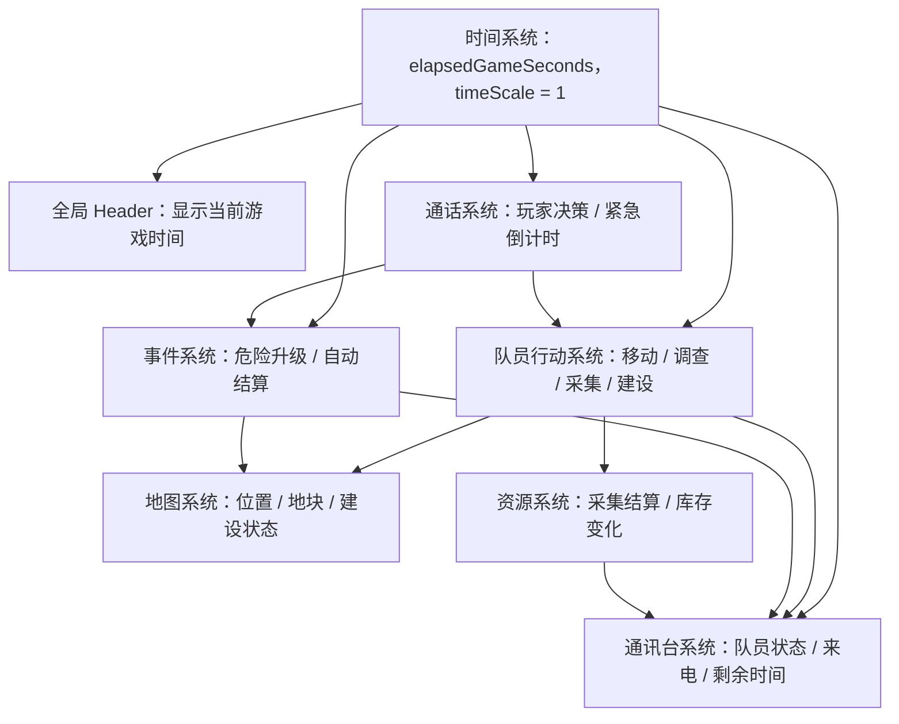

# 时间系统

## 文档目标

本文档说明游戏内时间系统的运行机制。时间系统是所有队员行动、资源产出、通讯事件和地图状态变化的基础系统。

本文档是游戏策划文档，应作为后续实现、数值配置和事件设计的共同依据。

## 核心设定

- 游戏内存在全局时间。
- 游戏时间从玩家开始新游戏的那一刻开始计时。
- 游戏时间默认和游戏运行时的现实时间等速推进：`1 现实秒 = 1 游戏秒`。
- 玩家不进行任何操作时，游戏时间仍然持续推进。
- 玩家在控制中心、通讯台、地图、通话页面或弹窗中停留时，游戏时间都不会暂停。
- 玩家关闭游戏后，游戏时间停止推进；再次进入游戏时，从上次保存的游戏内时间继续。
- 队员的移动、调查、采集、建设、等待、通话和事件处理都会消耗时间。
- 队员与玩家通话时，游戏时间继续流逝；紧急事件不会因为玩家打开通话页面而冻结。
- 所有页面显示同一个全局时间，不存在页面独立时间。

## 设计目标

- 让世界在玩家不操作时也持续运转。
- 让队员行动有明确成本，避免所有指令瞬间完成。
- 让通话和犹豫具有压力，尤其是紧急事件。
- 让地图、通讯台、资源和事件系统可以通过统一时间轴同步状态。
- 让玩家能通过时间显示理解当前游戏已经进行了多久。

## 约束

以下内容在当前阶段明确不做：

- 关闭游戏后的时间流逝。玩家关闭游戏、退出游戏或游戏进程停止后，不计算经过的现实时间。
- 离线补算。再次进入游戏时，不根据关闭期间经过的现实时间推进队员行动、资源产出或事件倒计时。
- 依赖现实世界时间戳计算游戏时间。系统不需要保存“玩家开始新游戏时的现实时间”，只需要保存游戏内已经经过的秒数。
- 后台长时间补偿。若运行环境暂停了游戏循环，恢复时不把暂停期间的现实时间一次性补进游戏时间。
- 昼夜循环。
- 日程表和固定时间事件。
- 季节、天气周期。
- 时间加速、暂停、睡眠。
- 多时间线或局部时间暂停。

当前阶段的规则可以概括为：

```text
只有游戏正在运行时，游戏时间才会推进。
游戏关闭后，世界停止。
再次进入游戏时，从保存的 elapsedGameSeconds 继续。
```

## 系统关系示意图

时间系统是世界状态推进的统一时钟。它不直接决定具体结果，而是为队员行动、资源、事件和 UI 展示提供当前游戏时间与到期判断。



关系说明：

- 全局 Header 从时间系统读取当前游戏时间并展示。
- 队员行动系统使用时间系统判断行动是否完成。
- 通讯台读取队员行动和事件状态，展示剩余时间、来电等待时间和队员状态。
- 通话系统使用时间系统推进通话期间的紧急倒计时。
- 地图系统不直接结算时间，只展示队员行动、地块和事件在当前时间下的状态。
- 资源系统在采集行动完成时结算产出。
- 事件系统根据时间推进危险阶段或触发自动结算。

## 时间模型

### 基础字段

时间系统至少需要维护以下字段：

| 字段 | 类型 | 说明 |
| --- | --- | --- |
| `elapsedGameSeconds` | 整数 | 从开始新游戏到当前时刻经过的游戏秒数。 |
| `timeScale` | 数值 | 时间倍率。MVP 固定为 `1`。 |
| `isTimePaused` | 布尔 | 时间是否暂停。MVP 中正常游玩时固定为 `false`。 |
| `lastTickAt` | 运行时数值 | 上一次游戏循环刷新的运行时刻，只用于本次运行期间计算增量，不需要作为现实时间存档。 |

### 时间换算

MVP 的默认换算规则：

```text
游戏运行中：1 现实秒 = 1 游戏秒
timeScale = 1
```

当前游戏经过秒数由运行时增量累加：

```text
deltaSeconds = floor((currentRuntimeTick - lastTickAt) / 1000) * timeScale
elapsedGameSeconds = elapsedGameSeconds + deltaSeconds
lastTickAt = currentRuntimeTick
```

如果未来支持时间暂停，则暂停期间不计入 `elapsedGameSeconds`。MVP 不提供玩家主动暂停，所以正常情况下无需处理暂停段。

关闭游戏后不运行上述增量计算。存档只需要保存 `elapsedGameSeconds` 和当前世界状态，不需要保存用于补算的现实时间戳。

## 时间显示

### 显示位置

游戏需要有一个全局 Header。当前阶段 Header 先只显示当前游戏时间，后续可以扩展显示资源、警报、基地状态或其他全局信息。

全局 Header 应在以下页面保持可见：

- 控制中心。
- 通讯台。
- 地图。
- 通话页面。
- 队员背包或二级弹窗。

### 显示格式

时间显示格式：

```text
第 x 日 xx 小时 xx 分钟 xx 秒
```

起始显示：

```text
第 1 日 00 小时 00 分钟 00 秒
```

计算方式：

```text
day = floor(elapsedGameSeconds / 86400) + 1
hour = floor((elapsedGameSeconds % 86400) / 3600)
minute = floor((elapsedGameSeconds % 3600) / 60)
second = elapsedGameSeconds % 60
```

示例：

| 经过游戏秒数 | 显示 |
| --- | --- |
| `0` | 第 1 日 00 小时 00 分钟 00 秒 |
| `59` | 第 1 日 00 小时 00 分钟 59 秒 |
| `60` | 第 1 日 00 小时 01 分钟 00 秒 |
| `3600` | 第 1 日 01 小时 00 分钟 00 秒 |
| `86399` | 第 1 日 23 小时 59 分钟 59 秒 |
| `86400` | 第 2 日 00 小时 00 分钟 00 秒 |

### 刷新频率

| 项目 | 规则 |
| --- | --- |
| 时间文本刷新 | 每 `1 秒` 刷新一次。 |
| 行动剩余时间刷新 | 每 `1 秒` 刷新一次。 |
| 行动结算检查 | 游戏运行中至少每 `1 秒` 检查一次。 |
| 存档恢复检查 | 读取存档后按保存的 `elapsedGameSeconds` 渲染，不做关闭期间补算。 |

时间显示只负责展示，不负责推进世界状态。世界状态由时间结算逻辑推进。

## 全局时间状态

### 时间永不因普通 UI 暂停

以下行为不会暂停时间：

- 打开控制中心设施弹窗。
- 查看通讯录。
- 查看队员背包。
- 打开地图。
- 打开通话页面。
- 阅读台词。
- 等待玩家选择回复。

### 特殊暂停

MVP 不设计玩家可用暂停功能。

以下场景可以作为技术暂停，但不属于游戏机制：

- 游戏崩溃恢复前。
- 存档迁移期间。
- 新手教程强制弹窗，如果后续设计要求冻结世界。

技术暂停必须明确记录，不应默默改变玩家可感知的时间规则。

## 队员行动模型

### 行动状态字段

每个队员同一时间只能执行一个主行动。队员行动至少需要以下字段：

| 字段 | 类型 | 说明 |
| --- | --- | --- |
| `crewId` | 字符串 | 队员 ID。 |
| `actionType` | 枚举 | 行动类型，例如 `move`、`standby`、`survey`、`gather`、`build`、`event`。 |
| `status` | 枚举 | `pending`、`inProgress`、`completed`、`interrupted`、`failed`。 |
| `fromTile` | 坐标 | 起点，可为空。 |
| `targetTile` | 坐标 | 目标地块，可为空。 |
| `startTime` | 游戏秒 | 行动开始时间。 |
| `durationSeconds` | 整数或空 | 行动总耗时。持续待命等无固定结束时间的行动可为空。 |
| `finishTime` | 游戏秒或空 | `startTime + durationSeconds`。持续待命等无固定结束时间的行动可为空。 |
| `resultPayload` | 对象 | 行动完成后产生的结果。 |

### 行动开始

玩家通过通话或其他允许下达指令的入口确认行动后，系统记录行动：

```text
startTime = 当前 elapsedGameSeconds
durationSeconds = 根据行动类型和修正值计算
finishTime = startTime + durationSeconds
status = inProgress
```

行动开始后，通讯台和地图立即显示队员的新状态。例如：

```text
Garry：正在前往丘陵铁矿床，剩余 01 分 00 秒。
```

### 行动完成

当当前游戏时间达到行动的 `finishTime` 时，行动自动结算：

```text
if elapsedGameSeconds >= finishTime:
  结算行动结果
  更新队员状态
  更新地图状态
  更新资源或事件状态
```

行动完成不要求玩家停留在对应页面。只要游戏仍在运行，玩家位于控制中心、通讯台、地图、通话页面或其他弹窗时，行动都可以完成。游戏关闭后，行动不会继续推进。

### 行动中断

行动可能被中断。中断来源包括：

- 玩家通过通话命令停止当前行动。
- 队员遭遇紧急事件。
- 目标地块变为不可达。
- 队员受伤、死亡或失联。
- 必要资源不足。

中断规则：

| 行动 | 中断后处理 |
| --- | --- |
| 移动 | 队员停留在最近已经抵达的地块；如果第一格尚未完成，则停留在起点。 |
| 调查 | 不产生完整调查结果，可产生部分线索。 |
| 采集 | 不结算本轮产出。 |
| 建设 | 不完成建筑，已消耗材料不返还或按事件规则返还。MVP 默认不返还。 |
| 通话等待 | 紧急事件继续推进，不视为中断。 |

## 基础行动耗时

### 地图单位

MVP 地图为 `4 x 4` 网格。每个地块可以用坐标表示，例如 `(1,1)` 到 `(4,4)`。

移动距离按曼哈顿距离计算：

```text
distance = abs(fromX - targetX) + abs(fromY - targetY)
```

### 移动耗时

基础移动耗时：

```text
移动耗时 = 地块距离 * 地形移动耗时
```

默认相邻地块移动耗时：

| 地形 | 每格耗时 |
| --- | --- |
| 平原 | `60 秒` |
| 丘陵 | `90 秒` |
| 森林 | `120 秒` |
| 山地 | `180 秒` |
| 沙漠 | `150 秒` |
| 水域 | 默认不可步行通过 |

如果路线经过多种地形，则按每一步进入的目标地块地形计算。

简化规则：

```text
移动耗时 = 曼哈顿距离 * 60 秒
```

当需要表现地形差异时，再启用地形移动耗时表。

### 调查耗时

调查用于发现地块资源、危险、异常或剧情线索。

| 调查类型 | 耗时 | 结果 |
| --- | --- | --- |
| 快速观察 | `60 秒` | 发现基础地形描述或明显危险。 |
| 标准调查 | `180 秒` | 发现普通资源、可建设点、一般事件。 |
| 深度调查 | `600 秒` | 发现隐藏资源、异常信号、高价值剧情线索。 |

MVP 默认使用标准调查：`180 秒`。

调查完成后，地图地块状态从“未调查”变为“已发现”或更新详细字段。

### 采集耗时

采集资源按轮结算。每轮采集完成时才获得资源。

基础采集规则：

| 资源类型 | 每轮耗时 | 每轮基础产出 |
| --- | --- | --- |
| 铁矿 | `300 秒` | `5 铁矿石` |
| 木材 | `240 秒` | `4 木材` |
| 食物 | `300 秒` | `3 食物` |
| 水 | `180 秒` | `3 水` |
| 稀有矿物 | `900 秒` | `1 稀有矿物` |

采集效率公式：

```text
最终产出 = floor(基础产出 * 队员效率 * 工具倍率 * 地块倍率)
```

默认值：

| 修正项 | 默认数值 |
| --- | --- |
| 队员效率 | `1.0` |
| 无工具倍率 | `1.0` |
| 基础工具倍率 | `1.25` |
| 专业工具倍率 | `1.5` |
| 普通地块倍率 | `1.0` |
| 富集地块倍率 | `1.5` |
| 贫瘠地块倍率 | `0.5` |

采集中断时，本轮未完成的产出不结算。

### 建设耗时

建设用于在地块上建立设施或安装仪器。

| 建设类型 | 耗时 | 材料示例 | 完成结果 |
| --- | --- | --- | --- |
| 安装简易仪器 | `120 秒` | 仪器 x1 | 地块获得仪器状态。 |
| 建造临时营地 | `300 秒` | 木材 x5 | 队员可在该地块安全待命。 |
| 建造采矿厂 | `600 秒` | 木材 x10、铁矿石 x10 | 解锁自动采矿或采矿加成。 |
| 修复通讯中继 | `480 秒` | 铁矿石 x6、稀有矿物 x1 | 降低失联风险。 |

材料消耗时机：

- MVP 默认在行动开始时消耗材料。
- 建设中断时材料不返还。
- 如果因为系统错误导致建设无法开始，则不消耗材料。

### 待命与停止

| 行动 | 耗时 | 说明 |
| --- | --- | --- |
| 停止当前行动 | `10 秒` | 队员从当前行动切换为待命。 |
| 原地待命 | 持续状态 | 不自动结束，直到玩家下达新指令或事件触发。 |
| 整理背包 | `30 秒` | 用于未来扩展，MVP 可不实现。 |

停止行动不是瞬间完成，主要用于避免玩家无成本频繁切换行动。

## 通话中的时间机制

### 普通通话

普通通话中，游戏时间继续推进。

普通通话不强制倒计时，但会产生自然时间成本：

- 队员原本正在采集时，采集进度继续推进。
- 队员原本正在移动时，移动进度继续推进。
- 其他队员的行动也继续推进。
- 玩家停留在通话页面阅读或犹豫时，全局时间继续增加。

普通通话示例：

```text
第 1 日 00:05:00，玩家联系 Garry。
Garry 正在采矿，本轮采矿剩余 60 秒。
玩家在通话页面停留 60 秒后仍未下达新指令。
第 1 日 00:06:00，Garry 的本轮采矿完成，资源入库或进入待领取状态。
```

### 紧急通话

紧急通话中，时间是事件压力的一部分。紧急事件可以设置倒计时和危险阶段。

紧急事件基础字段由事件系统的事件实例维护，时间系统只读取这些字段进行升级和自动结算判断：

| 字段 | 说明 |
| --- | --- |
| `createdAt` | 事件触发的游戏秒。 |
| `callReceivedTime` | 通讯台收到来电的游戏秒。 |
| `dangerStage` | 当前危险阶段。 |
| `nextEscalationTime` | 下一次危险升级时间。 |
| `deadlineTime` | 最迟处理时间，超过后自动结算坏结果。 |

推荐数值：

| 项目 | 数值 |
| --- | --- |
| 紧急事件首次等待时间 | `30 秒` |
| 每次危险升级间隔 | `30 秒` |
| 普通紧急事件最终期限 | `120 秒` |
| 高危紧急事件最终期限 | `60 秒` |

危险阶段示例：

| 阶段 | 时间条件 | 描述 | 影响 |
| --- | --- | --- | --- |
| 阶段 0 | 事件刚触发 | 队员发现危险。 | 尚未受伤。 |
| 阶段 1 | `30 秒` 未处理 | 危险逼近。 | 成功率下降。 |
| 阶段 2 | `60 秒` 未处理 | 队员被迫应对。 | 可能损失资源或受轻伤。 |
| 阶段 3 | `90 秒` 未处理 | 情况失控。 | 高概率受伤、失联或死亡。 |
| 自动结算 | `120 秒` 未处理 | 玩家错过处理窗口。 | 系统按最坏或次坏结果结算。 |

### 通话选项耗时

玩家在通话中选择某些回复或指令时，可以立即结算，也可以产生行动耗时。

| 选项类型 | 是否消耗时间 | 推荐耗时 | 说明 |
| --- | --- | --- | --- |
| 简短回复 | 否 | `0 秒` | 只推进台词，不改变行动状态。 |
| 关键决策 | 否 | `0 秒` | 选择瞬间锁定结果或发起行动。 |
| 请求前往 | 是 | 按移动耗时 | 队员开始移动。 |
| 开展调查 | 是 | `180 秒` | 队员开始调查。 |
| 采集资源 | 是 | 按采集轮耗时 | 队员开始采集。 |
| 建设设施 | 是 | 按建设耗时 | 队员开始建设。 |
| 先稳住，我考虑一下 | 是 | `30 秒` | 推进紧急事件危险阶段。 |

“先稳住，我考虑一下”不是安全暂停，而是明确消耗时间的选项。

## 行动结算机制

### 结算顺序

当同一时间点有多个行动、资源和事件需要结算时，按以下顺序处理。该顺序与队员系统和事件系统保持一致，优先保证队员是否还能继续行动，再处理行动完成和新事件触发。

1. 更新全局 `elapsedGameSeconds`。
2. 结算队员生死或失联事件。
3. 结算行动中断事件。
4. 结算移动完成并更新队员位置。
5. 结算建设完成、采集完成和调查完成。
6. 检查由行动完成触发的新事件。
7. 推进紧急事件危险阶段和自动结算。
8. 触发新的通讯、提醒或地图标记。
9. 刷新通讯台、地图、通话页面和全局 Header 显示。

### 同秒多事件规则

如果多个事件在同一秒完成，按优先级处理：

| 优先级 | 类型 | 说明 |
| --- | --- | --- |
| 1 | 队员生死或失联事件 | 先判断队员是否还能继续执行行动。 |
| 2 | 行动中断事件 | 先中断，再判断是否能完成原行动。 |
| 3 | 移动完成 | 更新位置后再处理抵达地块事件。 |
| 4 | 建设完成 | 更新地块设施。 |
| 5 | 采集完成 | 结算资源。 |
| 6 | 调查完成 | 更新地图信息并检查调查事件。 |
| 7 | 紧急事件升级或自动结算 | 根据当前时间推进危险阶段。 |
| 8 | 普通提醒 | 最后显示。 |

### 运行中结算

游戏运行中，时间系统每秒推进并检查到期行动。系统不需要逐帧结算，只需要保证每次检查时处理所有 `finishTime <= elapsedGameSeconds` 的行动。

示例：

```text
当前时间：第 1 日 00:10:00
Garry 正在采铁，本轮剩余 120 秒。
玩家停留在控制中心 120 秒，没有进行任何操作。
当前时间变为第 1 日 00:12:00。
Garry 完成本轮采铁，获得 5 铁矿石。
```

循环采集在游戏运行中按轮结算：

```text
if elapsedGameSeconds >= currentRoundFinishTime:
  结算 1 轮采集产出
  如果资源点未枯竭，则开始下一轮采集
```

关闭游戏后，循环采集不会继续推进，也不会产生离线产出。

## 与通讯台系统的交互

通讯台是玩家查看队员状态和进入通话的主要入口。

通讯台需要从时间系统读取：

- 当前全局时间。
- 队员当前行动。
- 行动开始时间。
- 行动剩余时间。
- 紧急事件剩余处理时间。
- 未接来电已经等待的时间。

队员卡片显示建议：

| 状态 | 显示示例 |
| --- | --- |
| 空闲 | `待命中` |
| 移动中 | `正在前往森林，剩余 01 分 20 秒` |
| 调查中 | `正在调查丘陵，剩余 02 分 10 秒` |
| 采集中 | `正在采集铁矿，本轮剩余 04 分 30 秒` |
| 建设中 | `正在建造采矿厂，剩余 08 分 00 秒` |
| 紧急来电 | `遭遇危险，已等待 00 分 25 秒` |
| 失联 | `信号中断，最后联系：第 1 日 00 小时 12 分 30 秒` |

通讯台不直接暂停时间。玩家打开通讯录查看状态时，所有计时继续推进。

## 与通话系统的交互

通话系统负责承载角色事件和玩家决策。时间系统为通话提供压力和行动成本。

通话页面需要显示或使用：

- 当前全局时间。
- 当前通话事件开始时间。
- 紧急事件剩余处理时间。
- 队员当前行动是否会被新指令打断。
- 玩家选择某项行动后预计完成时间。

通话中的按钮应根据时间和状态动态变化：

| 场景 | 按钮变化 |
| --- | --- |
| 队员正在采集中 | “前往其他地点”应提示会中断采集。 |
| 紧急事件已升级 | 高风险选项成功率降低或文案变危险。 |
| 超过最终期限 | 按钮禁用，显示自动结算结果。 |
| 队员失联 | 只能结束通话或查看记录。 |

示例：

```text
Amy 遭遇野兽，事件最终期限 120 秒。
玩家在通话中等待到第 65 秒。
危险阶段从 1 升到 2。
“快跑”的成功率从 80% 降到 60%。
“跟它拼了”的受伤概率从 40% 升到 65%。
```

## 与地图系统的交互

地图系统只读展示当前时间下的世界状态。

地图需要从时间系统和行动系统读取：

- 队员当前位置。
- 队员移动目标。
- 队员行动剩余时间。
- 地块调查状态。
- 地块建设状态。
- 地块资源采集状态。
- 地块危险是否正在倒计时。

地图显示建议：

| 地图状态 | 显示示例 |
| --- | --- |
| 队员移动中 | `Garry 正在前往此处，预计 01:20 后抵达` |
| 队员采集中 | `Garry 在此采矿，本轮剩余 04:30` |
| 建设中 | `采矿厂建设中，剩余 08:00` |
| 调查中 | `Amy 正在调查，剩余 02:10` |
| 紧急事件 | `危险事件进行中，剩余处理时间 00:45` |

地图不直接发起指令，因此地图上的时间信息只用于帮助玩家判断。玩家如果要下达指令，需要通过通讯台或通话页面。

## 与资源系统的交互

资源不应在玩家点击采集时立即获得，而是在采集行动完成时结算。

资源结算规则：

资源在配置和存档中应使用稳定资源 ID，例如 `iron_ore`、`wood`、`food`、`water`；UI 文案可以显示为“铁矿石”“木材”“食物”“水”。

- 采集行动开始时，不增加资源。
- 每轮采集完成时，资源进入库存。
- 如果队员背包系统已经实现，资源先进入队员背包；如果没有实现，MVP 可以直接进入基地库存。
- 如果采集中断，本轮未完成产出不结算。
- 如果资源点枯竭，采集行动完成后不再自动开始下一轮。

资源点储量建议：

| 资源点 | 初始储量 | 每轮消耗 |
| --- | --- | --- |
| 小型铁矿床 | `50 铁矿石` | `5` |
| 中型铁矿床 | `150 铁矿石` | `5` |
| 森林木材点 | `80 木材` | `4` |
| 浅水点 | `60 水` | `3` |
| 稀有矿脉 | `10 稀有矿物` | `1` |

当资源点储量不足一轮产出时，按剩余储量产出，并将地块状态改为“已枯竭”。

## 与事件系统的交互

事件系统可以通过时间触发或升级。

事件来源包括：

- 队员抵达危险地块。
- 队员完成一轮调查。
- 队员长时间在某地待命。
- 采集或建设行动完成。
- 紧急事件长时间未处理。

事件触发示例：

| 条件 | 触发事件 |
| --- | --- |
| 队员抵达森林地块 | 有概率触发野兽遭遇。 |
| 队员抵达沙漠地块后待命或调查 | 有概率触发缺水或迷路。 |
| 调查异常信号完成 | 触发未知通讯。 |
| 紧急来电 `120 秒` 未处理 | 自动结算坏结果。 |
| 队员失联超过 `300 秒` | 通讯台显示信号中断。 |

事件概率示例：

具体事件概率以事件系统文档和内容数据中的事件配置为准。时间系统只说明概率会随全局时间和行动结算触发，不作为事件数值的权威来源。

| 事件 | 基础概率 |
| --- | --- |
| 森林遭遇野兽 | `12%` |
| 山地移动受伤 | `10%` |
| 沙漠迷路 | `15%` |
| 调查发现隐藏资源 | `25%` |
| 通讯信号干扰 | `10%` |

事件概率可被队员能力、装备、建筑或地块状态修正。


## 紧急事件数值示例

### Amy 森林遇熊

起始状态：

| 项目 | 数值 |
| --- | --- |
| 地点 | 森林 |
| 事件类型 | 野兽遭遇 |
| 事件最终期限 | `120 秒` |
| 危险升级间隔 | `30 秒` |
| 初始危险阶段 | `0` |

选项基础结果：

| 选项 | 阶段 0 成功率 | 每升 1 阶段修正 | 成功结果 | 失败结果 |
| --- | --- | --- | --- | --- |
| 快跑 | `80%` | `-10%` | 脱离危险，停止当前行动。 | 受轻伤并丢失部分资源。 |
| 跟它拼了 | `55%` | `-8%` | 击退野兽，获得事件记录。 | 受重伤或死亡。 |
| 先稳住，我考虑一下 | 不结算 | 危险阶段 +1 | 获得一条额外描述。 | 如果达到最终期限则自动失败。 |

自动结算：

```text
如果 120 秒内玩家没有做出有效决策，Amy 自动尝试逃跑。
自动逃跑成功率固定为 40%。
失败时 Amy 受重伤，并进入失联 300 秒。
```

### Garry 矿床采矿

起始状态：

| 项目 | 数值 |
| --- | --- |
| 地点 | 丘陵铁矿床 |
| 行动 | 采集铁矿 |
| 基础每轮耗时 | `300 秒` |
| Garry 采集效率 | `1.3` |
| 实际每轮耗时 | `231 秒` |
| 每轮基础产出 | `5 铁矿石` |
| 地块倍率 | `1.0` |
| 每轮实际产出 | `5 铁矿石` |

如果玩家在通话中要求 Garry 前往其他地块：

- 当前未完成采集轮取消。
- 已完成的采集轮保留。
- Garry 进入移动状态。
- 通讯台显示新的移动目标和剩余移动时间。

## 页面反馈规范

### 全局 Header

全局 Header 当前阶段只显示时间，每秒更新。推荐文本：

```text
第 1 日 00 小时 12 分钟 35 秒
```

### 行动剩余时间

行动剩余时间推荐使用短格式：

```text
剩余 04:30
```

超过 1 小时时：

```text
剩余 01:12:30
```

### 行动完成提醒

行动完成时应产生明确反馈：

```text
Garry 完成了一轮铁矿采集，获得 5 铁矿石。
```

建设完成时：

```text
丘陵地块的采矿厂已建成。
```

紧急事件升级时：

```text
Amy 的情况正在恶化，危险等级提升。
```


## 示例流程

### 流程一：玩家什么都不做

```text
第 1 日 00:00:00，玩家进入控制中心。
Garry 正在采铁，本轮剩余 300 秒。
玩家不操作，停留在控制中心。
第 1 日 00:05:00，Garry 完成采铁，获得 5 铁矿石。
全局 Header 持续显示最新时间。
```

### 流程二：通话期间行动完成

```text
第 1 日 00:10:00，玩家接通 Amy 的普通通话。
Garry 同时正在建设采矿厂，剩余 30 秒。
玩家在 Amy 通话页面阅读台词。
第 1 日 00:10:30，Garry 的采矿厂完成。
通讯台和地图状态更新。
Amy 通话不中断，但可以出现一条轻量提示。
```

### 流程三：紧急通话拖延

```text
第 1 日 00:20:00，Amy 在森林遭遇野兽并来电。
第 1 日 00:20:30，玩家仍未接通，危险阶段升到 1。
第 1 日 00:21:00，玩家接通但继续犹豫，危险阶段升到 2。
第 1 日 00:21:20，玩家选择“快跑”。
系统按阶段 2 的成功率结算。
```

### 流程四：关闭游戏后再次进入

```text
第 1 日 01:00:00，玩家关闭游戏。
Garry 正在采铁，本轮剩余 120 秒。
现实 10 分钟后，玩家重新进入游戏。
游戏时间仍然是第 1 日 01:00:00。
Garry 仍在采铁，本轮仍剩余 120 秒。
玩家进入游戏后，时间继续按 1 现实秒 = 1 游戏秒推进。
```
