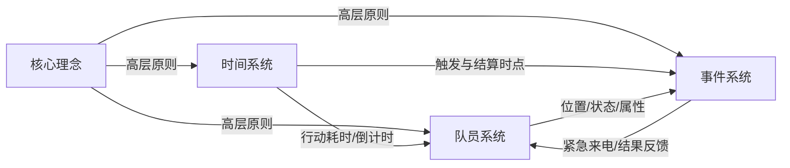

<!--
本文件由 audit-wiki skill 自动重新生成。
请不要手工修改本文件；下一次 audit-wiki 运行时，手工改动会被覆盖。
如果想新增内容，请改写对应的子系统 wiki 或 core-ideas.md。
-->

# Stellar Frontier 设计文档索引

本页是 `stellar-frontier` 项目所有设计文档的入口。**当前实现状态**与**未实现的设计意图**会在表格中区分标注。

## 1. 整体游戏（whole-game）

| 文档 | 一句话概述 | 最近更新 |
| --- | --- | --- |
| [核心理念](./core-ideas.md) | 简短说明通讯调度、只读地图、时间代价、队员人格化和低保真控制台等全局原则。 | 2026-04-27 |

## 2. 子系统（system）

| 文档 | 一句话概述 | 最近更新 | 状态 |
| --- | --- | --- | --- |
| [队员系统](./gameplay/crew/crew.md) | 队员系统负责管理队员作为行动执行者与真实伙伴的双重身份。 | 2026-04-26 | 已实现 |
| [事件系统](./gameplay/event-system/event-system.md) | 事件系统管理事件数据、触发条件、概率修正、耗时、结算、紧急事态和事件反馈。 | *（缺字段：frontmatter.last_updated）* | 已实现 |
| [时间系统](./gameplay/time-system/time-system.md) | 时间系统是所有队员行动、资源产出、通讯事件和地图状态变化的基础系统。 | *（缺字段：frontmatter.last_updated）* | 已实现 |

> 索引页缺口：`docs/gameplay/event-system/event-system.md` 与 `docs/gameplay/time-system/time-system.md` 当前缺少标准 wiki frontmatter，后续应由 `organize-wiki` 按 wiki 模板补齐。

## 3. UI 与设计原则

| 文档 | 一句话概述 |
| --- | --- |
| [UI 设计总览](./ui-designs/ui.md) | 汇总游戏原型中的主要 UI 模块，把草图整理成可开发、可验证的 PRD 式说明。 |
| [UI 设计原则](./ui-designs/ui-design-principles.md) | 约束游戏 UI 原型的低保真控制台美学与系统组织方式。 |
| 页面 PRD | [控制中心](./ui-designs/pages/控制中心.md) ⋅ [通讯台](./ui-designs/pages/通讯台.md) ⋅ [通话](./ui-designs/pages/通话.md) ⋅ [地图](./ui-designs/pages/地图.md) |

## 4. 计划与策划案

进行中或已完成的策划案见 [`./plans/`](./plans/)，按 `YYYY-MM-DD-HH-MM` 子目录组织。最近的 audit 报告见 [`./plans/audits/`](./plans/audits/)。

| 类别 | 路径 | 维护方 |
| --- | --- | --- |
| Brainstorm 策划案 | `docs/plans/<YYYY-MM-DD-HH-MM>/<topic>-design.md` | `game-design-brainstorm` |
| Wiki 合入 diff | `docs/plans/<YYYY-MM-DD-HH-MM>/wiki-merge-diff.md` | `organize-wiki` |
| 一致性 audit 报告 | `docs/plans/audits/<YYYY-MM-DD-HH-MM>/audit-report.md` | `audit-wiki` |

## 5. 系统耦合关系

边的来源：每个 wiki 章节 6「系统交互」中的「依赖于 / 被依赖于 / 事件 / 信号」字段，以及现有旧格式子系统文档中的系统关系示意图。旧格式文档缺 frontmatter 时，边仍可作为临时索引信息保留。

## 6. 设计文档体系约定

- **brainstorm**（产生策划案）：用 `game-design-brainstorm` skill；产物落 `docs/plans/<YYYY-MM-DD-HH-MM>/`
- **organize-wiki**（合入全量 wiki）：用 `organize-wiki` skill；目标是 `core-ideas.md` 或 `gameplay/<system>/<system>.md`
- **audit-wiki**（审计 + 维护索引 + 同步项目根）：用 `audit-wiki` skill；产物落 `docs/plans/audits/<YYYY-MM-DD-HH-MM>/`

详细职责见 [`../AGENTS.md`](../AGENTS.md)。
