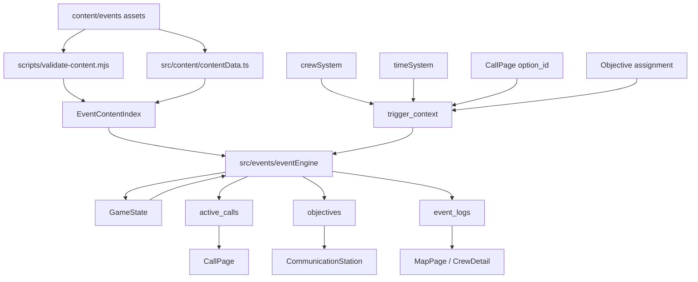

# Event Program Model Player Journey Technical Design

## 技术设计

### 1. 架构概览

本次实施重建事件系统。新系统以全局内容资产库为输入，以 `GameState` 为运行时 source of truth，用纯 TypeScript 事件引擎解释 `event_definition`、`event_graph`、`call_template`、`condition` 和 `effect`。React 页面只展示 runtime `call`、`objective` 和事件摘要，不再承载事件分支逻辑。

当前项目仍是前端单机原型。状态保存在 `localStorage`，无后端、无在线同步。设计明确允许研发期 cutover：旧事件 JSON、旧紧急事件结构、旧通话硬编码和旧存档都可以失效。

#### 1.1 分层与组件职责

**内容资产层**

- `content/events/definitions/<domain>.json` 保存 `event_definition`。
- `content/events/call_templates/<domain>.json` 保存 `call_template`。
- `content/events/handler_registry.json` 保存 condition/effect handler 白名单。
- `content/events/presets/<domain>.json` 保存生产便利 preset。运行时读取前必须展开为结构化字段。
- `content/schemas/events/*.schema.json` 保存事件相关 schema。
- `content/generated/event_index.json` 是构建或校验派生产物，不手写，不作为 source of truth。

内容资产层不保存 runtime 字段，不保存编辑器 layout、notes、review、preview cases。

**内容加载与校验层**

- `src/content/contentData.ts` 继续作为 JSON 内容进入 TypeScript 的入口，但需要改为加载全局事件资产库。
- `scripts/validate-content.mjs` 从单文件 schema 校验扩展为生产级校验入口。
- 校验职责包括 schema、全局 ID、跨文件引用、图结构、option/template 对齐、handler 参数、sample dry-run。
- 校验失败时，资产不能进入运行时。研发期允许直接失败。

**事件领域层**

新建 `src/events/`，集中放置事件系统纯逻辑：

- `contentIndex`：把分散资产编译成运行时索引。
- `conditionEvaluator`：解释结构化 condition。
- `effectExecutor`：按白名单 effect 修改 `GameState`。
- `graphRunner`：推进 `event_graph` 节点。
- `callRenderer`：把 `call_template` 渲染成 runtime `call`。
- `objectiveSystem`：创建、分配、完成 runtime `objective`。
- `eventEngine`：对外提供 trigger intake、call choice、time wakeup、objective completed 等统一入口。

事件领域层不引用 React，不读写 DOM，不直接访问 `localStorage`。

**游戏集成层**

`src/App.tsx` 仍持有全局 `GameState`，但事件相关分支应收敛为调用事件领域层接口：

- 队员抵达、行动完成、长时间待命、通话选择、objective 完成、时间唤醒都生成 `trigger_context`。
- `settleGameTime` 负责时间推进和调用 wakeup/trigger 入口。
- `handleDecision` 不再硬编码紧急事件分支，而是把玩家选项回写到 runtime `call`。
- 旧 `CrewMember.emergencyEvent`、旧 `eventHistory` 和旧 `CallPage` 特判应被替换为 `active_events`、`active_calls`、`event_logs`、`world_history`。

**展示层**

- `CommunicationStation` 展示 active calls、队员通讯状态和由事件产生的 objectives。
- `CallPage` 只读取 runtime `call.rendered_lines` 和 `call.available_options`，点击按钮时提交稳定 `option_id`。
- `MapPage` 展示地块事件标记、危险标签、目标位置和事件摘要。
- `CrewDetail` 展示队员状态、日记、事件摘要和历史影响。
- `DebugToolbox` 可提供重置存档和事件 dry-run 调试入口，但不能成为正式玩法。

#### 1.2 组件通信方式

所有模块在同一浏览器进程中同步调用。事件引擎接收不可变输入，返回新的 `GameState` 和可展示的 engine reports。React 层负责把返回值写回 state 并持久化。

推荐接口风格：

- 内容资产通过 ES module JSON import 进入 `contentData.ts`。
- 运行时事件处理使用纯函数：`nextState = processTrigger(state, index, context).state`。
- 校验器作为 Node 脚本运行，供 `npm run validate:content` 调用。
- 页面组件通过 props 读写 `GameState`，不直接解释 `event_definition`。

#### 1.3 关键数据流

**触发事件**

1. 游戏系统产生 `trigger_context`，例如 `action_complete`。
2. `eventEngine.processTrigger` 按 `trigger_type` 从索引取候选事件。
3. 引擎执行 condition、history、cooldown、mutex、blocking slot 和 priority/weight 筛选。
4. 引擎创建 runtime `event`，写入 `entry_node_id`、触发快照、主队员和主地块。
5. `graphRunner` 进入当前节点。
6. `call` 节点创建 runtime `call`；`wait` 节点写入 `next_wakeup_at`；`objective` 节点创建 runtime `objective`；`end` 节点执行效果并写摘要。

**玩家选择通话选项**

1. `CallPage` 展示 runtime `call.rendered_lines` 和 `available_options`。
2. 玩家点击按钮，UI 只提交 `call_id` 与 `option_id`。
3. 引擎把 `option_id` 写入 runtime `call.selected_option_id` 和 `event.selected_options[node_id]`。
4. 引擎按 `option_node_mapping` 推进到下游节点。
5. 如果到达终点，引擎执行 effect，释放 blocking claim，删除 active call，保留 `event_log` 和 `world_history`。

**时间唤醒**

1. `settleGameTime` 推进 `elapsed_game_seconds`。
2. 引擎扫描 `active_events` 中 `next_wakeup_at <= elapsed_game_seconds` 的事件。
3. 引擎生成 `time_wakeup` 或 `event_node_finished` context。
4. 事件进入下一个节点，可能生成新 call、继续 wait 或结束。

**跨队员目标**

1. `objective` 节点创建 runtime `objective`，关联 `parent_event_id`。
2. 通讯流程允许玩家把目标派给符合条件的队员。
3. 队员行动完成后产生 `objective_completed` context。
4. 引擎推进 parent event，写入 event summary、world history 和后续效果。

#### 1.4 组件图



### 2. 技术决策和选型（ADR）

#### ADR-001: 采用研发期 cutover，不兼容旧事件内容和旧存档

- **状态**: 已决定
- **上下文**: design 明确当前仍处研发期，旧事件 JSON、旧紧急事件路径和旧 `localStorage` 不应限制新模型。
- **选项**:
  - A: 建兼容层迁移旧事件和旧存档。优点是短期页面更稳；缺点是新模型被旧字段拖慢，任务范围扩大。
  - B: 完整 cutover。优点是实现能直接对齐新模型；缺点是现有测试和旧存档会短期失效。
- **决定**: 选择 B。新 save schema 与旧 save schema 不兼容时可以硬失败，并通过 Debug 重置恢复。
- **后果**: 后续任务必须先改 save state 和测试基线；不能在旧 `emergencyEvent` 上叠兼容分支。

#### ADR-002: 静态事件定义与通话模板分离

- **状态**: 已决定
- **上下文**: 新模型要求逻辑选项稳定，展示文案可按队员、性格、状态和压力变化。
- **选项**:
  - A: 单事件文件内嵌所有逻辑和通话文本。优点是单事件 review 直观；缺点是复用差，后续编辑器难以全局索引。
  - B: `event_definition` 与 `call_template` 分目录、用 ID 关联。优点是逻辑和表现边界清楚；缺点是引用校验更复杂。
- **决定**: 选择 B。`option_id` 是逻辑主键，文本 variant 只是展示结果。
- **后果**: 校验器必须检查 `call_template.option_lines` 与节点 `options[].id` 完全对齐。

#### ADR-003: condition/effect 使用结构化 JSON 与白名单 handler

- **状态**: 已决定
- **上下文**: 内容生产需要表单化、可校验、可 dry-run；任意脚本无法静态检查。
- **选项**:
  - A: 允许内容文件写脚本或表达式。优点是表达力强；缺点是不可控、难校验、难做编辑器。
  - B: 固定结构化字段，复杂规则通过 registry 中的 handler 扩展。优点是可校验、可审查；缺点是新增复杂规则时要写代码。
- **决定**: 选择 B。handler 必须声明 kind、参数 schema、允许 target、随机性和 sample fixture。
- **后果**: 新 effect/condition 类型需要同步改 schema、TS 类型、校验器和测试。

#### ADR-004: MVP 事件图只支持有向无环图和单活跃节点

- **状态**: 已决定
- **上下文**: game model spec 固定 MVP 不做 `parallel` / `join`，一个 event 只用 `current_node_id` 表示进度。
- **选项**:
  - A: 第一版支持多活跃节点和 join。优点是表达力强；缺点是 runtime、校验和 UI 都复杂。
  - B: 第一版固定 DAG 与单活跃节点。优点是容易校验、容易调试；缺点是复杂事件需要展开节点或拆 child event。
- **决定**: 选择 B。
- **后果**: 校验器必须拒绝循环、孤儿节点、无终点路径和 `parallel` / `join` 节点。

#### ADR-005: runtime call 保存渲染快照，resolved 后只保留摘要

- **状态**: 已决定
- **上下文**: 旧通话不应因角色状态变化被重新渲染；但长期存档必须克制。
- **选项**:
  - A: 每次打开通话重新渲染模板。优点是存档小；缺点是历史不稳定。
  - B: active call 保存 `rendered_lines` 和 `available_options`。resolved 后删除完整 call，只保留 `event_log` 与 `world_history`。
- **决定**: 选择 B。
- **后果**: `active_calls` 必须进入 save state；事件结束清理 active call 细节。

#### ADR-006: 事件引擎实现为纯 TypeScript 领域模块

- **状态**: 已决定
- **上下文**: 当前 `App.tsx` 已承担过多编排和硬编码分支，事件系统需要可单测和可 dry-run。
- **选项**:
  - A: 在 React 页面和 `App.tsx` 中继续增量扩展。优点是改动少；缺点是事件逻辑难复用，编辑器 dry-run 无法使用。
  - B: 新建 `src/events/`，把引擎、校验辅助、渲染和效果执行做成纯函数。
- **决定**: 选择 B。
- **后果**: UI 不应读取静态 event graph 来决定分支；页面只提交 runtime id 和稳定 option id。

#### ADR-007: 生产级校验由 JSON Schema、引用校验、图校验和 sample dry-run 组成

- **状态**: 已决定
- **上下文**: 五个样例事件必须证明模型可生产，而不是只通过类型检查。
- **选项**:
  - A: 只做 JSON Schema。优点是实现快；缺点是无法发现跨文件引用、图不可达和模板错配。
  - B: Schema 加 imperative validators 加 dry-run。优点是能定位生产错误；缺点是校验脚本更复杂。
- **决定**: 选择 B。
- **后果**: `npm run validate:content` 成为内容资产的必跑门禁。

#### ADR-008: objective 保持轻量，不扩展为完整 quest system

- **状态**: 已决定
- **上下文**: 本轮只需要跨队员推进 parent event，不做正式任务系统。
- **选项**:
  - A: 引入完整 quest/task 系统。优点是未来扩展强；缺点是超出 MVP。
  - B: 只实现 runtime `objective`，字段服务事件后续行动。
- **决定**: 选择 B。
- **后果**: `objective` 不包含奖励、优先级 UI、复杂任务链；完成后只回写 parent event 和世界历史。

### 3. 数据模型

字段级 canonical spec 是 `event-program-model-player-journey-game-model-spec.md`。实现不得另起一套语义相近的字段名。所有 JSON 与 TypeScript 字段使用英文 `snake_case`。

#### 3.1 静态资产实体

- `event_definition`：全局唯一 `id`，包含 `version`、`domain`、`trigger`、`candidate_selection`、`repeat_policy`、`event_graph`、`effect_groups`、`log_templates`、`content_refs`、`sample_contexts`。
- `event_graph`：包含 `entry_node_id`、`nodes`、`edges`、`terminal_node_ids`、`graph_rules`。
- `event_node`：固定 9 类 `call`、`wait`、`check`、`random`、`action_request`、`objective`、`spawn_event`、`log_only`、`end`。
- `call_template`：全局唯一 `id`，通过 `event_definition_id` 与 `node_id` 绑定 call 节点，保存 text variants 和 option line variants。
- `handler_registry`：保存 `handler_type`、`kind`、`params_schema_ref`、`allowed_target_types`、`deterministic`、`uses_random`、`sample_fixtures`。

#### 3.2 运行时实体

- `event`：运行时事件实例。关键字段包括 `id`、`event_definition_id`、`event_definition_version`、`status`、`current_node_id`、`primary_crew_id`、`primary_tile_id`、`active_call_id`、`selected_options`、`random_results`、`blocking_claim_ids`、`next_wakeup_at`、`history_keys`、`result_key`、`result_summary`。
- `call`：运行时通话实例。关键字段包括 `id`、`event_id`、`event_node_id`、`call_template_id`、`crew_id`、`status`、`render_context_snapshot`、`rendered_lines`、`available_options`、`selected_option_id`。
- `objective`：事件生成的轻量目标。关键字段包括 `id`、`status`、`parent_event_id`、`created_by_node_id`、`target_tile_id`、`eligible_crew_conditions`、`required_action_type`、`assigned_crew_id`、`action_id`。
- `event_log`：玩家可见摘要，不保存完整通话。
- `world_history`：结构化历史和冷却事实，不保存长文本。
- `world_flags`：当前世界状态。

#### 3.3 GameState / Save State

`GameState` 需要新增或重塑以下集合：

- `crew_actions: Record<action_id, crew_action_state>`
- `inventories: Record<inventory_id, inventory_state>`
- `active_events: Record<event_id, event>`
- `active_calls: Record<call_id, call>`
- `objectives: Record<objective_id, objective>`
- `event_logs: event_log[]`
- `world_history: Record<history_key, world_history_entry>`
- `world_flags: Record<flag_key, world_flag>`
- `rng_state: object | null`

旧 `eventHistory`、旧 `CrewMember.emergencyEvent` 和通话页面硬编码状态不是新模型的 source of truth。

#### 3.4 关系与生命周期

- 一个 `event_definition` 可以创建多个 runtime `event`。
- 一个 runtime `event` 可在不同节点创建多个 runtime `call`，但同一时刻最多一个 `active_call_id`。
- 一个 runtime `event` 可以创建多个 `objective`，`objective_completed` 回写 parent event。
- `call_template` 服务某个 event definition 的某个 call node；模板不能被 runtime event 修改。
- `event` resolved 后从 `active_events` 移除或压缩为摘要；长期只保留 `event_logs`、`world_history`、`world_flags` 和必要 objective 状态。

### 4. API/接口设计

本项目不引入 HTTP API。这里的 API 指 TypeScript 模块契约。

#### 4.1 内容索引

```ts
type EventAssetBundle = {
  event_definitions: EventDefinition[];
  call_templates: CallTemplate[];
  handler_registry: HandlerDefinition[];
  presets: EventPreset[];
};

function buildEventContentIndex(bundle: EventAssetBundle): EventContentIndex;
```

`EventContentIndex` 至少提供：

- `event_definition_by_id`
- `call_template_by_id`
- `handler_by_type`
- `by_trigger_type`
- `by_domain`
- `by_tag`
- `by_mutex_group`

#### 4.2 校验接口

```ts
function validateEventAssets(bundle: EventAssetBundle, index: EventContentIndex): ValidationReport;
function dryRunEventDefinition(definition_id: string, sample_context: SampleTriggerContext, index: EventContentIndex): DryRunReport;
```

校验报告必须包含 `path`、`code`、`message` 和 `severity`，方便脚本输出定位。

#### 4.3 运行时入口

```ts
function processTrigger(input: {
  state: GameState;
  index: EventContentIndex;
  context: TriggerContext;
}): EventEngineResult;

function selectCallOption(input: {
  state: GameState;
  index: EventContentIndex;
  call_id: string;
  option_id: string;
  occurred_at: number;
}): EventEngineResult;

function processEventWakeups(input: {
  state: GameState;
  index: EventContentIndex;
  elapsed_game_seconds: number;
}): EventEngineResult;

function assignObjective(input: {
  state: GameState;
  index: EventContentIndex;
  objective_id: string;
  crew_id: string;
  occurred_at: number;
}): EventEngineResult;
```

`EventEngineResult` 返回：

- `state: GameState`
- `created_event_ids: string[]`
- `created_call_ids: string[]`
- `updated_objective_ids: string[]`
- `event_log_ids: string[]`
- `reports: EngineReport[]`

#### 4.4 错误处理

- 内容错误应在 `validate:content` 阶段失败。
- 运行到非法节点、缺失引用或 handler 参数错误时，研发期允许抛出 `EventContentError`。
- 玩家操作错误，例如选择不存在的 `option_id`，应返回 `EventRuntimeError` 并让 UI 保持当前 call，不推进事件。
- 旧 save schema 与新模型不兼容时，load 可以失败；Debug 重置是恢复路径。

### 5. 目录结构

```text
content/
  events/
    definitions/          # event_definition assets, split by domain
    call_templates/       # call_template assets, split by domain
    presets/              # optional production presets
    handler_registry.json # condition/effect handler whitelist
  schemas/
    events/               # event-related JSON schemas
src/
  events/
    types.ts              # event program model TypeScript contracts
    contentIndex.ts       # asset indexing and lookup helpers
    validation.ts         # shared validation helpers used by scripts/tests
    conditions.ts         # structured condition evaluator
    effects.ts            # structured effect executor
    graphRunner.ts        # node entry/exit and graph progression
    callRenderer.ts       # call_template to runtime call
    objectives.ts         # runtime objective helpers
    eventEngine.ts        # public event runtime entry points
    sampleFixtures.ts     # dry-run fixtures for sample events
    *.test.ts             # unit tests beside production modules
scripts/
  validate-content.mjs    # content schema, refs, graph, template, handler, dry-run checks
tests/
  e2e/
    app.spec.ts           # user-facing call/objective/event journey smoke tests
```

Existing files will be changed rather than kept as parallel implementations:

- `src/content/contentData.ts` loads the new asset library.
- `src/data/gameData.ts` owns the new `GameState` shape.
- `src/App.tsx` routes triggers and page decisions through `src/events/eventEngine.ts`.
- `src/pages/CallPage.tsx` renders runtime call data.
- `src/pages/CommunicationStation.tsx` displays active calls and objectives.
- `src/timeSystem.ts` persists the new save schema.

### 6. 编码约定

- **命名规范**：内容 JSON 与 TS model 字段使用 `snake_case`，函数和局部变量遵循现有 TypeScript `camelCase`。转换只发生在边界层，不在业务中混用同义字段。
- **内容来源**：事件文本、事件定义、物品、队员和样例事件必须来自 `content/`，不得新增硬编码内容数组。
- **纯逻辑优先**：`src/events/` 不引用 React，不读写 `localStorage`。它接收 state，返回新 state。
- **错误处理**：内容错误使用带 `path` 和 `code` 的错误对象；玩家操作错误不应破坏当前 `GameState`。
- **日志与记录**：玩家可见记录写 `event_logs`；规则查询写 `world_history`；调试细节只在 dry-run/report 中保留，不长期进玩家存档。
- **随机性**：随机分支必须记录到 `event.random_results`。需要随机的 handler 必须使用运行时 random source，不直接调用外部随机。
- **测试策略**：每个事件领域模块有单元测试；`App.test.tsx` 覆盖端到端状态流；Playwright 只保留少量用户旅程烟测。
- **质量门禁**：修改 `content/` 后必须通过 `npm run validate:content`；修改 `src/` 后必须通过 `npm run lint` 和 `npm run test`。

### 7. 风险与缓解（技术层面）

- **R1：一次性重建会打破现有页面和测试。**
  - **影响**：短期出现大量红测，开发任务容易失焦。
  - **缓解**：先落地模型和校验，再接入 5 个样例事件，最后替换 UI；任务按依赖串行执行。
- **R2：内容资产拆分后引用错误增多。**
  - **影响**：事件可能运行到缺失模板、缺失效果或不可达节点。
  - **缓解**：把全局 ID、引用、图结构、option/template 对齐和 dry-run 纳入 `validate:content`。
- **R3：`App.tsx` 现有硬编码行为难以一次清理。**
  - **影响**：新旧模型同时存在会造成状态分裂。
  - **缓解**：以 ADR-001 为准，不保留旧 `emergencyEvent` 分支；页面只调用事件引擎入口。
- **R4：save state 改动导致旧存档无法加载。**
  - **影响**：本地旧数据会阻塞开发体验。
  - **缓解**：明确新 `schema_version`，旧 schema 直接失败；Debug reset 保持可用。
- **R5：condition/effect handler 白名单过小。**
  - **影响**：样例事件需要回退到硬编码。
  - **缓解**：第一批 handler 只服务 5 个样例事件；新增 handler 必须带 params schema 和 fixture。
- **R6：长期不保存 call/debug 细节降低复现能力。**
  - **影响**：玩家存档无法复盘所有中间判定。
  - **缓解**：运行中保存 active call 渲染快照；内容 QA 依赖 sample dry-run 和测试 fixture，不依赖玩家存档。

### 附录：用户技术访谈记录

本轮用户已提供 status 为 `approved` 的 design doc 和 game model spec，并明确要求以 `fox-agent` 流程生成实施计划。未追加新的多轮技术访谈。实施侧采用以下默认技术决策：

- 这是 brownfield 项目，需要基于现有 React/Vite/TypeScript 前端重建事件系统。
- 技术设计采用完整模式，因为任务会同时影响内容资产、运行时状态、事件引擎、UI、存档和测试。
- 研发期允许不兼容旧实现，不为旧事件 JSON、旧 `emergencyEvent` 或旧 `localStorage` 增加迁移层。
