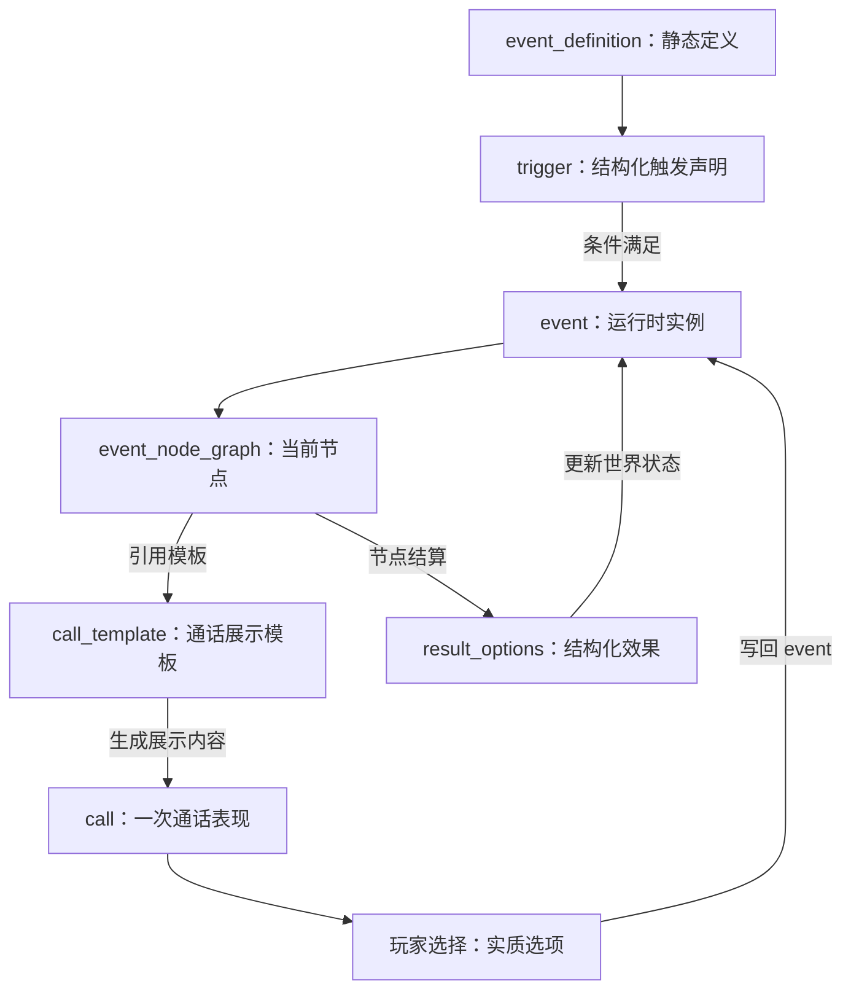

# Initial Input

## 用户原始输入

@.opencode/skills/game-design-brainstorm/SKILL.md 我现在有一个需求：@tmp/init.md ，请进行头脑风暴

## 需求文件

`tmp/init.md`

## 需求文件原文

我希望做一个比较完整的 gameplay 的玩家的旅程。我们要先完善内部的程序模型

# 事件系统的模型：overview 和核心设想

事件系统由六类对象组成：`event_definition`、`event_graph`、`event_node_graph`、`call_template`、运行时 `event`、运行时 `call`。它们需要分清静态内容、运行时状态和编辑器信息，避免把剧情文本、玩家选择、结算效果和调试记录混在同一个字段里。

核心原则：

- `event_definition` 是静态内容资产。它描述事件何时触发、有哪些节点、有哪些实质选项、会产生哪些结果。
- `event_graph` 是事件的阶段结构。它用有向无环图表达节点依赖和分支，不直接保存玩家当前进度。
- `call_template` 是通话展示模板。它把节点上的实质选项转换成队员语气化的台词和按钮文案，但不决定事件分支。
- `event` 是运行时实例。它引用某个 `event_definition`，并用 `current_node_id` 记录自己走到图上的哪个节点。
- `call` 是某个事件节点生成的一次通讯表现。一个 `event` 可以生成多次 `call`；玩家在 `call` 里看到的台词和选项会回写到 `event`，再由 `event` 推进图。
- `trigger`、`condition`、`effect` 都应该 JSON-first。策划语义上它们像函数，但内容数据中只保存结构化声明、handler type、参数和引用；事件引擎负责解释执行。

事件推进关系：



## 核心对象

### event_definition

`event_definition` 是可被 JSON Schema 校验的静态定义。它不保存玩家进度，也不保存运行时随机结果。

主要字段：

- `schema_version`: 内容结构版本，用于 schema 校验和批量迁移。
- `id`: 全局唯一 ID。
- `metadata`: 标题、简介、作者、维护状态、章节、风险等级和编辑器展示分组。
- `trigger`: 结构化触发声明，不直接存任意函数。
- `event_graph`: 事件图，定义节点、分支和终点。
- `result_options`: 结构化 effect 集合，用 `type + target + params` 描述结果。
- `content_refs`: `call_template`、角色语气、UI 标题、日志模板等内容引用。
- `editor`: 编辑器专用字段，例如节点坐标、注释、折叠状态和 review 状态。

### event_graph

`event_graph` 定义事件节点之间的关系。它是有向无环图；如果事件需要多轮尝试，应使用明确的节点、次数上限或新事件实例，不在图里做无限循环。

主要字段：

- `entry_node_id`: 事件实例创建后进入的第一个节点。
- `nodes`: 以 node id 为 key 的 `event_node_graph` 集合。
- `edges`: 节点之间允许的下游关系。
- `terminal_node_ids`: 事件可以结束的节点列表。

### event_node_graph

`event_node_graph` 定义一个事件阶段。节点可以生成通话、等待时间、检查条件、请求行动、生成后续事件或结束事件。

主要字段：

- `id`: 当前 event definition 内唯一的节点 ID。
- `type`: 节点类型，例如 `call`、`wait`、`check`、`action_request`、`spawn_event`、`end`。
- `requirements`: 进入该节点前必须满足的条件。
- `options`: 实质性选项，例如在和熊遭遇战中，可以有战斗、逃避、装死、驯兽；不是描述性台词。
- `option_node_mapping`: 玩家选择到下游节点的映射。
- `auto_next`: 没有玩家选择时的默认推进规则。
- `timeout`: 等待玩家或等待时间结束时的处理。
- `result_refs`: 当前节点会执行的 result option ID。
- `call_template_ref`: 需要通话时引用的描述性文本模板。

### call_template

`call_template` 是静态表达池。它把 `event_node_graph.options` 中的实质选项，转换成玩家在通话中看到的台词和按钮文案。同一个 `option_id` 可以根据队员、语气类型、性格标签、情绪、关系、事件压力或事件历史显示不同文本，但它仍然指向同一个逻辑选项。

主要字段：

- `id`: 通话模板 ID。
- `node_id`: 该模板服务的事件节点 ID。
- `opening_lines`: 进入通话时的开场台词，可以包含多个带条件的 variant。
- `option_lines`: 每个实质选项的展示文案，key 必须对应 `event_node_graph.options[].id`，每个 key 下可以有多个 variant。
- `fallback_order`: 文案选择优先级，例如 `crew_id`、`crew_voice_type`、`default`。
- `tone_rules`: 根据队员语气、性格标签、情绪、关系、危险阶段调整文案的规则。
- `ui_hints`: 按钮排序、风险提示、是否强调紧急等 UI 展示建议。

示例：

```yaml
call_template:
  id: beast_nearby_call
  node_id: beast_nearby
  opening_lines:
    variants:
      - id: opening_default
        text: "附近有东西在靠近。"
        when: []
      - id: opening_amy
        text: "它在下风口，我还能退。"
        when:
          - field: crew.id
            op: equals
            value: amy
  option_lines:
    run:
      variants:
        - id: run_default
          text: "立刻撤离。"
          when: []
        - id: run_cautious
          text: "你先撤，保住通讯和样本。"
          when:
            - field: crew.personality_tags
              op: includes
              value: cautious
        - id: run_pragmatic
          text: "目标不是赢，是活着回来。"
          when:
            - field: crew.personality_tags
              op: includes
              value: pragmatic
        - id: run_amy
          text: "先退，别让它贴近你。"
          when:
            - field: crew.id
              op: equals
              value: amy
    hide:
      variants:
        - id: hide_default
          text: "找掩体，保持安静。"
          when: []
  fallback_order:
    - crew.id
    - crew.personality_tags
    - crew.voice_type
    - default
```

这里的 `run` 和 `hide` 不是按钮文本主键，而是事件图里的 `option_id`。玩家看到的“目标不是赢，是活着回来。”最终仍会回写为 `selected_option = run`，再由 `option_node_mapping.run` 推进事件。

运行时生成通话时，call renderer 会读取当前 crew 的最新状态，包括新获得的性格标签、专长标签、受伤 / 恐惧 / 疲劳等状态、事件危险阶段和历史选择。renderer 从 `variants` 中选择最匹配的一条展示文本；如果没有命中，就按 `fallback_order` 找到默认文本。

### event

`event` 是运行时实例。它保存当前节点、关联对象、玩家已经做出的选择、记录和最终摘要。

主要字段：

- `id`: 事件实例 ID。
- `event_definition_id`: 对应的静态定义 ID。
- `event_definition_version`: 创建实例时使用的定义版本。
- `status`: 运行时状态，例如 `active`、`waiting_call`、`waiting_time`、`waiting_action`、`resolved`、`cancelled`、`expired`。
- `current_node_id`: 当前位于 event graph 的哪个节点。
- `crew_id`: 主要关联队员；跨队员事件可使用 `related_crew_ids`。
- `tile_id`: 主要关联地块。
- `selected_options`: 每个节点上玩家选择过什么。
- `final_option`: 最终决定事件结局的实质选项。
- `event_log`: 玩家可见的事件经过。
- `debug_trace`: 开发和编辑器可见的触发、节点跳转、随机判定和 effect 执行记录。
- `result_summary`: 事件结束后的压缩摘要。

### call

`call` 是事件节点面向玩家的一次通讯表现。它不决定事件结果，只负责承载台词、可见选项和玩家选择。

主要字段：

- `id`: 通话实例 ID。
- `event_id`: 来源事件实例。
- `event_node_id`: 来源事件节点。
- `crew_id`: 发起或参与通话的队员。
- `status`: `incoming`、`missed`、`connected`、`ended`、`expired`。
- `available_options`: 根据节点选项、队员状态、物品、属性和信息可见性计算出的本次可见选项。
- `hidden_options`: 因条件不足隐藏的选项，用于 debug 和编辑器预览。
- `selected_option`: 玩家最终选择的实质选项。
- `dialogue_lines`: 本次已经生成并展示的描述性台词。
- `rendered_options`: 本次实际展示给玩家的选项文案，包含 `option_id`、命中的 `variant_id` 和最终文本。
- `render_context`: 生成本次台词时读取的关键上下文摘要，例如性格标签、状态、危险阶段。
- `call_log`: 接通、挂断、超时、展示选项和玩家选择记录。

台词和选项的运行时映射关系：

```text
event_node.options[].id
  -> call_template.option_lines[option_id]
  -> call.available_options[]
  -> call.selected_option
  -> event_node.option_node_mapping[selected_option]
```

玩家点击的 UI 文案不是逻辑主键。逻辑主键永远是 `option_id`；文案只是 `option_id` 在当前队员和上下文中的展示结果。

`call` 实例必须记录本次已经渲染出的文本和命中的 variant。否则队员在事件后获得新性格标签时，旧通话回放可能被重新渲染成新的态度，造成历史不一致。静态 `call_template` 可以继续演化，但已经发生的 `call` 应以 `rendered_options` 和 `dialogue_lines` 为准。


# 事件系统的典型的 play 流程

## 流程一：普通发现，不打断当前行动

1. Mike 在森林地块完成一次标准调查。
2. 事件系统调用所有 `survey_complete` 类型的 trigger，发现 `forest_trace_small_camp` 满足条件。
3. 系统创建一个 event 实例，把 `current_node_id` 指向事件图的 `start` 节点。
4. `start` 节点是一个普通展示节点，不需要玩家决策。它生成一通简短回报 call：Mike 说这里有冷掉的营火和被压过的草。
5. 玩家接听或稍后查看都可以。该 call 不改变 Mike 的 `current_action`，也不阻塞后续调查。
6. 事件自动推进到 `end` 节点，执行 result option：给地图地块添加 `旧营地痕迹` 标记，给 Mike 的 `event_log` 写入一条玩家可见记录。
7. event 实例进入 `resolved`，长期存档只保留结果摘要、必要的 `event_log`、历史 key 和是否已展示。

这个流程的目标是让普通事件成为世界反馈，而不是每次都要求玩家停下来做选择。

## 流程二：紧急事件，多次通话推进同一个事件

1. Amy 在森林调查时触发 `forest_beast_encounter`。
2. 系统创建 event 实例，`current_node_id` 指向 `beast_nearby` 节点，并把 Amy 的 `current_action` 从 `survey` 改为 `in_event`。
3. `beast_nearby` 节点生成第一通 call。节点的实质选项是 `run`、`hide`、`fight`、`tame`；通话文本由 Amy 的语气表生成，例如她可能说“它在下风口，我还能退。”
4. 玩家选择 `hide`。系统不立刻结束事件，而是根据 `option_node_mapping.hide` 把 event 推进到 `waiting_in_bush` 节点。
5. `waiting_in_bush` 是等待节点，持续 30 秒。等待期间玩家可以挂断，通讯台显示 Amy 仍在事件中。
6. 30 秒后，事件进入 `beast_searching` 节点并生成第二通 call。新的实质选项变为 `stay_hidden`、`throw_item`、`run_now`。
7. 玩家选择 `throw_item`。系统执行一次属性 / 物品 / 随机判定：若 Amy 有诱饵或高敏捷，成功率提高。
8. 成功时事件进入 `escape_success` 终点：Amy 回到 `idle`，地图添加 `大型生物活动` 危险标记。失败时事件进入 `wounded_escape` 终点：Amy 获得 `轻伤`，行动状态变为 `returning_to_base` 或 `resting`。

这个流程说明：一个 event 可以在多个节点之间推进，每个节点可以生成新的 call；call 是事件状态的表现，不是事件本身。

## 流程三：等待节点把玩家选择转化为时间压力

1. Garry 在山地发现异常反光，触发 `mountain_signal_probe`。
2. 第一通 call 给出实质选项：`mark_and_leave`、`approach`、`scan_from_distance`。
3. 玩家选择 `scan_from_distance`。事件推进到 `scanning` 等待节点，节点配置 `duration_seconds = 120`。
4. Garry 的 `current_action` 变为 `event_waiting`。玩家可以切到其他页面，但事件在游戏时间里继续倒计时。
5. 120 秒后，trigger `event_node_finished(scanning)` 生效，事件进入下一个 normal event 节点 `signal_result`。
6. `signal_result` 根据扫描结果生成 call：可能是安全线索，也可能是信号干扰升级。
7. 如果结果是安全线索，事件结束并解锁后续调查点。如果结果是干扰升级，事件进入紧急节点，Garry 的通讯状态变差，通话选项变少。

这个流程让“等待”成为事件图中的一等节点。等待不是空白时间，而是状态、风险和后续分支的容器。

## 流程四：事件结果引出另一个队员的行动

1. Lin Xia 在沙漠发现火山灰沉积，触发 `volcanic_ash_trace`。
2. 玩家在 call 中选择 `ask_for_origin`。事件推进到 `need_volcano_survey` 节点。
3. 该节点的 result option 不直接让 Lin Xia 移动，而是向世界状态写入一个 `available_objective`：前往火山地块调查灰源。
4. 通讯台出现新的建议 call：任意可通讯队员都可以被派去调查火山。玩家选择 Kael 接手。
5. Kael 的移动和调查不是原事件的子步骤，但它会携带 `parent_event_id = volcanic_ash_trace`。
6. Kael 抵达火山并完成调查后，trigger `objective_completed(parent_event_id)` 让原 event 从 `need_volcano_survey` 推进到 `ash_origin_found`。
7. 事件最终结算：火山地块危险等级上升，地图解锁 `火山活动` 标签，Lin Xia 的日记追加“我不该只看脚下的沙层”。

这个流程说明事件可以跨队员推进。event 负责保存目标和依赖关系，crew action 只负责执行具体行动。

## 流程五：最终选项改变人物与长期世界状态

1. Kael 触发 `lost_relic_argument`，他发现一件旧世界遗物，但无法判断该带回基地还是留在原地。
2. 第一通 call 的实质选项是 `bring_back`、`leave_it`、`destroy_it`、`ask_later`。
3. 玩家选择 `ask_later`，事件进入等待节点。Kael 继续守在原地，`current_action` 变为 `guarding_event_site`。
4. 第二次 call 中，Kael 的语气根据等待时间和性格标签变化：等待越久，他越焦躁；如果他有 `怀旧` 标签，更倾向于保留遗物。
5. 玩家最终选择 `destroy_it`。事件进入终点节点 `relic_destroyed`。
6. result option 执行多组效果：删除地块上的遗物对象、降低后续异常事件概率、给 Kael 添加 `更务实` 性格标签，移除或弱化 `怀旧` 标签，并记录一条关键日记。
7. 如果玩家选择 `bring_back`，事件会进入另一个终点：基地获得研究物，Kael 获得 `执念加深` 标签，并解锁后续事件 `relic_signal_night_call`。

这个流程说明最终选项不只是奖励或惩罚。它可以改变队员、地图、后续事件池和玩家对角色的理解。

# 事件系统的存储

事件系统需要按“定义多、实例少、索引清楚、存档克制”的原则设计。最终可能有 1000 个 event definition 和 20 个 crew，但同一时刻活跃的 event 实例应该很少。存储层不能把所有定义都复制进存档，也不能让 call 成为唯一状态来源。

## 静态内容：event_definition

`event_definition` 是内容资产，描述一个事件可以如何发生、如何推进、如何结算。它应放在可被校验和 review 的内容文件中，可以按主题、地形、章节或系统拆分。

建议拆分方式：

- `events/forest.json`
- `events/mountain.json`
- `events/desert.json`
- `events/story/volcano.json`
- `events/crew/kael.json`

每个 `event_definition` 至少包含：

- `id`: 全局唯一 ID。
- `schema_version`: 内容结构版本，用于 JSON Schema 校验和批量迁移。
- `version`: 定义版本，用于存档迁移和 debug。
- `metadata`: 标题、简介、作者、维护状态、章节、风险等级、编辑器展示分组。
- `tags`: 搜索、筛选和触发索引用的标签。
- `trigger`: 结构化触发声明，由引擎解释为可执行判定，用于判断事件是否进入候选池。
- `event_graph`: 有向无环图，定义事件节点、依赖和分支。
- `result_options`: 可复用结果集合，供节点、选项或终点引用。
- `priority`: 多个事件同时满足 trigger 时的优先级。
- `repeat_policy`: 是否可重复、冷却时间、同一 crew / tile / world 的触发限制。
- `content_refs`: call 文本、队员语气表、UI 标题、日志模板等文案引用。
- `editor`: 编辑器专用信息，例如节点坐标、折叠状态、注释、最近编辑人。

`trigger` 可以在策划层看成函数，但存储时必须保持为结构化声明、受限表达式或 handler 引用。这样可以建立索引、做静态检查，也能避免 1000 个事件每秒都执行任意代码。

示例：

```yaml
trigger:
  type: survey_complete
  conditions:
    - field: tile.tags
      op: includes
      value: forest
    - field: crew.attributes.perception
      op: ">="
      value: 3
  probability:
    base: 0.2
    modifiers:
      - when:
          field: crew.conditions
          op: includes
          value: tired
        add: -0.05
```

这个结构可以被 JSON Schema 校验，也可以在编辑器里渲染成表单。复杂判定可以通过 `type` 指向预定义 handler，但 handler 的参数仍需要结构化，不能把任意代码直接存进事件定义。

## 事件图：event_graph

`event_graph` 存储事件的状态机。它是有向无环图，不允许节点形成循环。需要重复等待或多轮尝试时，应显式生成新的 event 实例，或使用带次数上限的节点展开，而不是在图里创建无限循环。

建议结构：

```text
event_graph
- entry_node_id
- nodes: Record<node_id, event_node_graph>
- edges: Record<node_id, node_id[]>
- terminal_node_ids: []
```

每个 `event_node_graph` 至少包含：

- `id`: 节点唯一 ID，只在当前 event definition 内唯一。
- `type`: `call`、`wait`、`check`、`action_request`、`spawn_event`、`end` 等。
- `requirements`: 进入节点前必须满足的条件。
- `options`: 实质性选项，例如逃跑、战斗、装死、驯兽。
- `option_node_mapping`: 选项到下游节点的映射。
- `auto_next`: 没有玩家选择时的默认推进规则。
- `timeout`: 等待玩家或等待时间结束时的处理。
- `result_refs`: 当前节点会执行的 result option。
- `call_template_ref`: 如果节点需要通话，用这个字段找到描述性文本模板。

节点的 `options` 只表达实质分叉，不表达角色说法。比如节点选项是 `fight`，Mike 可以说“我能试试把它赶走”，Amy 可以说“我不喜欢这个距离，但我能动手”，Garry 可以说“给我十秒找个角度”。这些文本来自 call 模板和队员语气表，不应该写进图的分支逻辑里。

## 运行时实例：event

`event` 是某个定义在某次游戏中的实例。它保存当前状态、关联对象、已发生记录和最终结算，不复制完整定义。

建议字段：

- `id`: 实例 ID。
- `event_definition_id`: 指向静态定义。
- `event_definition_version`: 创建时使用的定义版本。
- `status`: `active`、`waiting_call`、`waiting_time`、`waiting_action`、`resolved`、`cancelled`、`expired`。
- `current_node_id`: 当前处于哪个 event graph 节点。
- `crew_id`: 主要关联队员。跨队员事件可额外使用 `related_crew_ids`。
- `tile_id`: 主要关联地块。
- `parent_event_id`: 如果该事件由另一个事件生成，记录来源。
- `child_event_ids`: 该事件生成的后续事件。
- `objective_ids`: 事件创建的目标，例如“派任意队员调查火山”。
- `final_option`: 最终决定事件结局的实质选项。
- `selected_options`: 每个节点上玩家选过什么。
- `random_trace`: 随机种子、判定输入和结果，用于 debug、回放和事件查看器。
- `created_at`: 游戏时间。
- `updated_at`: 最近一次推进时间。
- `deadline_at`: 如果事件有最终期限，记录游戏时间。
- `next_wakeup_at`: 下一次需要时间系统唤醒的时间。
- `event_log`: 玩家可见的事件经过。
- `debug_trace`: 开发可见的触发、节点跳转、随机判定和 effect 执行记录。
- `history_keys`: 本事件写入过哪些长期历史 key。
- `result_summary`: 已执行的结果摘要，供 UI、存档和回顾使用。

`event.status` 只描述运行时状态；`current_node_id` 才描述它在事件图中的位置。这样可以同时回答两个问题：这个事件现在是否需要玩家处理，以及它处于剧情 / 机制图的哪个阶段。

## 通话实例：call

`call` 是 event 节点面向玩家的一次通讯表现。一个 event 可以生成多次 call，一个 call 也可以因为玩家挂断、未接或重拨而经历多个状态。

建议字段：

- `id`: call 实例 ID。
- `event_id`: 来源事件。
- `event_node_id`: 来源节点。
- `crew_id`: 发起或参与通话的队员。
- `status`: `incoming`、`missed`、`connected`、`ended`、`expired`。
- `created_at`: 来电出现的游戏时间。
- `connected_at`: 玩家接通时间。
- `ended_at`: 通话结束时间。
- `available_options`: 从 event node 的实质选项计算出的本次可见选项。
- `hidden_options`: 因队员状态、物品、属性、信息不足而隐藏的选项，可用于 debug。
- `selected_option`: 玩家最终选择。
- `dialogue_lines`: 本次已经生成并展示的描述性台词。
- `tone_context`: 生成台词时使用的队员语气、情绪、关系和事件压力。
- `call_log`: 接通、挂断、超时、展示选项、玩家选择等通话过程记录。

call 不负责结算结果。玩家选择后，call 把 `selected_option` 写回 event；event 根据图和 result option 推进。

## 记录系统：log、trace、history

事件系统至少需要四类记录。它们用途不同，不能都塞进一个 `log` 字段。

### event_log

`event_log` 是玩家可见的事件经过，用于通讯台回顾、队员详情、地图记录和事件查看页面。

建议字段：

- `time`: 游戏时间。
- `event_id`: 事件实例 ID。
- `node_id`: 发生在哪个事件节点。
- `crew_id`: 相关队员。
- `tile_id`: 相关地块。
- `summary`: 短文本，例如“Kael 销毁了旧世界遗物”。
- `visibility`: `player_visible`、`hidden_until_resolved`、`debug_only`。
- `refs`: 相关 call、objective、result option 的 ID。

### call_history

`call_history` 记录通话过程，用于复盘玩家为什么走到某个分支。长期存档可以只保存摘要，不必保存每一句生成台词。

建议记录：

- 来电何时出现、何时接通、是否错过。
- 当时展示了哪些实质选项。
- 哪些选项因为属性、物品、信息不足而隐藏。
- 玩家选择了什么。
- 该选择把 event 从哪个 node 推进到哪个 node。

### debug_trace

`debug_trace` 是开发和编辑器使用的记录。它不一定展示给玩家，但对事件编辑器、自动测试和内容 QA 很重要。

建议记录：

- trigger 候选如何被筛选。
- 每条 condition 的判定输入和结果。
- 概率修正、随机种子和最终随机值。
- 节点进入、节点退出和边选择。
- result option 的执行顺序、输入参数、成功或失败。
- schema version 和 definition version。

### world_history

`world_history` 是结构化长期历史，用来支持 trigger、冷却、一次性事件和后续事件解锁。

它不应保存长文本，而应保存可查询事实，例如：

- 某事件是否在本局发生过。
- 某 crew 是否经历过某事件。
- 某 tile 是否触发过某事件。
- 某 objective 是否完成。
- 某世界 flag 是否被设置。

这四类记录可以在运行时互相引用，但存储目的不同：`event_log` 给玩家看，`call_history` 解释选择过程，`debug_trace` 服务开发和编辑器，`world_history` 服务规则判定。

## 结果系统：result_options

`result_options` 是事件结算的效果列表。它需要足够通用，能覆盖现在想到的系统，也能容纳后续扩展。存储层应使用 `type + target + params` 的结构，不直接保存任意函数。

结果类型可以包括：

- `update_crew_location`: 改变队员所在地图位置。
- `update_crew_attribute`: 改变体能、敏捷、智力、感知、运气等属性。
- `add_crew_condition`: 添加受伤、疲劳、恐惧、中毒等状态。
- `update_current_action`: 中断、替换或创建队员当前行动。
- `add_personality_tag`: 添加性格标签。
- `remove_personality_tag`: 移除或弱化性格标签。
- `add_expertise_tag`: 添加或解锁专长标签。
- `update_tile`: 改变地块危险、资源、建筑、描述或可调查状态。
- `add_resource` / `remove_resource`: 改变基地或队员携带资源。
- `create_objective`: 创建需要后续行动完成的目标。
- `spawn_event`: 创建另一个 event 实例。
- `unlock_event_definition`: 解锁新的事件定义或事件池。
- `add_diary_entry`: 追加队员日记。
- `add_world_log`: 追加世界日志。

示例：

```yaml
result_options:
  - id: wound_primary_crew
    type: add_crew_condition
    target:
      type: primary_crew
    params:
      condition: light_wound
      duration_seconds: 600
  - id: mark_tile_danger
    type: update_tile
    target:
      type: event_tile
    params:
      field: danger_tags
      op: add
      value: large_beast_activity
```

每个 result option 都应声明输入、目标、失败处理、记录策略和是否可回滚。复杂效果可以由多个简单效果组合，不要让单个结果 handler 偷偷修改过多系统。

## 索引与触发

1000 个事件不能靠每次 tick 全量扫描。事件内容加载后应建立触发索引。

可用索引：

- `by_trigger_type`: 按 `arrival`、`survey_complete`、`call_choice`、`time_elapsed` 等触发类型索引。
- `by_tile_tag`: 按森林、山地、火山、遗迹等地块标签索引。
- `by_crew_tag`: 按队员性格、专长、状态或阵营索引。
- `by_story_flag`: 按世界 flag、已完成目标、已解锁章节索引。
- `by_parent_event`: 按父事件或 objective 反查后续事件。
- `by_wakeup_time`: 按下一次需要唤醒的游戏时间索引运行中事件。

触发流程建议：

1. 系统事件发生，例如队员抵达、调查完成、玩家选择通话选项、等待节点到期。
2. 根据触发类型从索引取候选 event definition。
3. 用地块、队员、物品、世界 flag 和历史记录缩小候选。
4. 用 trigger evaluator 执行结构化 trigger 声明。
5. 按优先级、权重和互斥规则选择要创建或推进的 event。
6. 创建 event 实例，或把已有 event 推进到下一个节点。
7. 如果节点需要 call，创建 call；如果节点是 wait，写入 `next_wakeup_at`；如果节点是 end，执行 result options。

## JSON Schema 约束

事件内容最终需要由 JSON Schema 约束。Schema 不只校验字段类型，也要帮助编辑器知道每个字段如何展示。

建议拆成多份 schema：

- `event-definition.schema.json`: 校验 event definition 顶层结构。
- `event-graph.schema.json`: 校验节点、边、终点和节点类型。
- `event-trigger.schema.json`: 校验 trigger type、conditions、probability 和 handler params。
- `event-condition.schema.json`: 校验条件表达式。
- `event-effect.schema.json`: 校验 result option / effect。
- `event-call.schema.json`: 校验 call 模板引用、可见选项和通话记录。
- `event-call-template.schema.json`: 校验 `call_template`、`option_lines`、`variants.when`、fallback 和语气规则。
- `event-editor.schema.json`: 校验编辑器布局、注释、折叠状态等非运行时字段。

Schema 需要支持 discriminated union。也就是说，先看 `type`，再根据 `type` 决定需要哪些字段。

示例：

```yaml
effect:
  type: update_tile
  target:
    type: event_tile
  params:
    field: danger_tags
    op: add
    value: volcanic_activity
```

当 `type = update_tile` 时，schema 要求 `target` 必须能解析到 tile，`params.field` 必须是允许被事件修改的地块字段，`params.op` 必须是 `set`、`add`、`remove`、`increment` 等白名单操作之一。

Schema 还需要区分三种字段：

- 运行时必需字段：事件引擎执行时必须存在，例如 `trigger`、`event_graph`、`result_options`。
- 编辑器字段：只服务编辑和查看，例如 `editor.layout`、`editor.notes`。
- 派生字段：由构建步骤或编辑器生成，例如 trigger 索引、节点可达性报告，不应手写。

## 事件编辑器和查看页面

后续会做事件编辑和查看页面，因此内容模型需要从一开始给编辑器留位置。

编辑器需要支持：

- 事件列表：按章节、地形、队员、标签、维护状态筛选。
- 事件详情：查看 metadata、trigger、事件图、结果、记录策略。
- 图编辑：拖动节点、连线、查看每个 option 通向哪个 node。
- 节点编辑：根据节点 `type` 展示不同表单。
- 条件编辑：用表单组合 condition，不要求策划写代码。
- effect 编辑：根据 effect `type` 展示目标、参数和记录策略。
- 通话模板编辑：按节点选项编辑 `option_lines.variants`，预览不同队员、性格标签、语气、状态和 fallback 下的展示文本。
- 预览：选择 crew、tile、world flags 后预览可见选项、隐藏选项和可能结果。
- 校验：保存前检查 schema、图结构、引用、可达性和循环。
- 查看运行中实例：按 event 实例查看 current node、call history、event log、debug trace。

`editor` 字段建议只放编辑器状态，不参与事件运行：

```yaml
editor:
  layout:
    nodes:
      beast_nearby:
        x: 120
        y: 80
      waiting_in_bush:
        x: 420
        y: 160
  collapsed_nodes: []
  notes:
    - node_id: beast_nearby
      text: 这里需要确保 Amy 和 Mike 的语气差异明显。
  review:
    status: draft
    owner: design
    last_checked_at: null
```

编辑器保存时可以更新 `editor` 字段，但事件引擎读取定义时应忽略这些字段。这样可以让策划工具变复杂，而不污染运行时逻辑。

## 静态校验

每次保存事件定义时，编辑器和 CI 都应该执行静态校验。

必须校验：

- `id` 全局唯一。
- `schema_version` 被当前工具支持。
- `trigger.type` 在白名单中。
- condition 的字段路径存在，op 和 value 类型匹配。
- event graph 没有环。
- `entry_node_id` 存在。
- 所有 terminal node 可达。
- 所有非 terminal node 至少有一个退出路径。
- 所有 option 都有 `option_node_mapping`。
- 所有 `result_refs` 都能找到 result option。
- 所有 `call_template_ref` 都能找到文本模板。
- 所有 `call_template.option_lines` 的 key 都能在对应节点的 `options` 中找到。
- 所有 `option_lines[].variants.when` 都使用 schema 支持的 condition 表达式。
- 所有需要展示的 `event_node_graph.options` 至少有一个无条件 variant 或可用 fallback。
- 所有 `fallback_order` 引用的字段都能从 render context 读取。
- 所有 effect target 都能解析到 crew、tile、world、resource 或 objective。
- 编辑器字段不参与运行时判定。

建议校验：

- 是否存在永远不会触发的事件。
- 是否存在永远不可见的选项。
- 是否存在永远不会命中的台词 variant。
- 是否存在多个同优先级 variant 同时命中但没有 tie-break 规则。
- 是否存在没有玩家可见记录的重要 result option。
- 是否存在会写入长期历史但没有声明 history key 的 effect。
- 是否存在过大的 call 文本或过多一次性分支，影响编辑器可读性。

## 存档内容

存档应保存运行时状态，不保存完整静态定义。读取存档时，用 `event_definition_id` 和 `event_definition_version` 找回定义，再恢复事件实例。

存档最小集合：

- `active_events`: 尚未结束的 event 实例。
- `resolved_event_summaries`: 已结束事件的摘要，用于历史、冷却、回顾和后续 trigger。
- `event_logs`: 玩家可见的关键事件记录，可以按 event、crew、tile 查询。
- `world_history`: 事件定义、crew、tile、world scope 的结构化触发历史。
- `active_calls`: 仍在等待、通话中或未过期的 call。
- `call_history`: 可选，保存关键通话摘要，不保存所有生成台词。
- `debug_traces`: 可选，只在 debug 存档、测试回放或编辑器检查中保留。
- `objectives`: 由事件创建但尚未完成的目标。
- `world_flags`: 事件写入的长期世界状态。
- `random_state` 或 `random_trace`: 保证同一次事件可解释。

已结束事件不应该完整保留所有节点、所有 call 和所有台词。长期存档只需要回答这些问题：它是否发生过，最终怎么解决，影响了什么，是否还会影响后续事件。

## 历史记录与冷却

事件历史需要同时支持三类查询：

- 世界级：某个事件是否在本局发生过。
- 队员级：某个 crew 是否经历过该事件。
- 地块级：某个 tile 是否触发过该事件。

建议 key：

```text
world:event_definition_id
crew:crew_id:event_definition_id
tile:tile_id:event_definition_id
crew_tile:crew_id:tile_id:event_definition_id
```

历史值至少包含：

- `first_triggered_at`
- `last_triggered_at`
- `trigger_count`
- `last_result`
- `cooldown_until`

这样可以支持一次性事件、可重复事件、同一队员只触发一次、同一地块冷却 10 分钟等规则。

## 扩展原则

- 新增事件时优先新增 `event_definition`，不要改事件引擎。
- 新增结果类型时要写清楚目标系统、输入字段和存档表现。
- 新增节点类型时要说明它如何进入、如何退出、是否会创建 call、是否需要时间系统唤醒。
- call 文本可以大量扩展，但 call 文本不能决定事件逻辑。
- 事件图必须可静态检查：节点存在、边合法、终点可达、没有环、所有 option 都有去向。
- 存档要允许旧 event definition version 迁移；无法迁移时，至少能把活跃事件安全取消并给玩家一条解释日志。