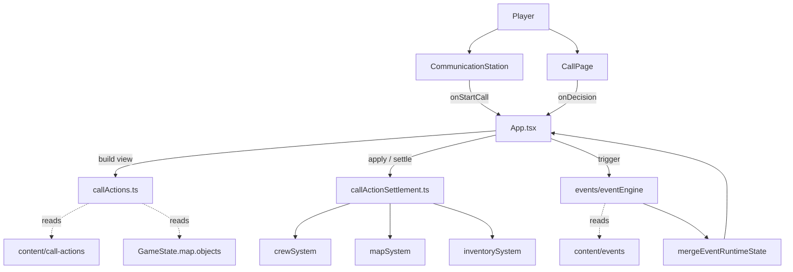

# 通讯台 Gameplay 技术设计

## 1. 架构概览

### 1.1 分层与组件职责

本轮以最小改动改造既有"通讯台 / 通话页 / 队员行动 / 事件 runtime"四层。所有改动围绕一个核心目标：把当前散落在 `App.tsx` 中的"按 crewId 与 tileId 硬编码"的行动结算逻辑，重构为**内容驱动 + 数据流统一**的模型。

| 层 | 现有职责 | 本轮调整 |
|---|---|---|
| **内容层** `content/` | 提供 crew / events / maps / items 的 JSON 数据 | **新增** `content/call-actions/*.json` + `content/schemas/call-actions.schema.json`；为 `crash-site-wreckage` 这类对象补 `candidateActions`；新增 `content/events/definitions/{crash_site,mine}.json` 和对应 `call_templates/`；调整 forest 内容里 `beast_tracks` 触发条件 |
| **领域层** `src/` 顶层模块 | `crewSystem` / `mapSystem` / `eventSystem` / `inventorySystem` / `events/*` | **新增** `src/callActions.ts`：解析 call-actions 内容、查询通用动作目录；**新增** `src/callActionSettlement.ts`：把"动作完成"翻译成 GameState patch（替换 `App.tsx` 里 if-elseif 链）；**扩展** `src/events/effects.ts` 的 `create_crew_action` 让结果能流向 `crew[].activeAction`（与桥接层配合） |
| **桥接层** `App.tsx` 的 `mergeEventRuntimeState` | 当前只投射 `personality_tags / condition_tags / danger_tags / event_marks` | **扩展**：把 `EventRuntimeState.crew_actions` 中由事件创建的、未被 App 层认领的 action 投射成 `crew[].activeAction`，从而事件选项的 `create_crew_action` 效果能真正改变队员状态 |
| **UI 层** `src/pages/CallPage.tsx` / `CommunicationStation.tsx` | 通话页对部分 crew 写死了按钮（`garryActions`、Mike 的湖泊选项）；通讯台对 normal call 走 `crew.hasIncoming`、对 event runtime call 走 `active_calls` | 通话页改为**完全动态生成**按钮：基础动作（待命 → 调查/移动/休息；忙碌 → 停止/原地休息）+ 当前地块已揭示对象的 `candidateActions`；通讯台**统一为"接通"按钮**逻辑：所有事件来电（普通 / 紧急）均显示"接通"，普通通话显示"通话" |

**职责边界**：
- `callActions.ts` 只回答"在 (crew, tile, gameState) 上下文中应当显示哪些按钮"以及"按钮 metadata 是什么"，不直接 mutate state。
- `callActionSettlement.ts` 接收"动作完成"事件 + `(crew, tile, action)`，返回 `{member, tiles, map, logs, resources, baseInventory, triggerContexts[]}` patch；不再按 `crewId === "garry"` 或 `tileId === "3-3"` 分支。
- 桥接层只做投射和合流，不再处理任何"特定队员的特定动作完成"。

### 1.2 组件通信方式

仍然以 React 单向数据流为核心：UI 通过回调向 App 发起意图（`handleDecision(actionId)`、`confirmMove()`），App 把意图翻译为对 `GameState` 的纯函数 patch，然后 setState；事件系统通过 `processAppEventTrigger(state, context)` 在 App 层与领域层之间架设触发桥。

引入两条新桥接路径：
1. **动作完成 → 事件触发**：`settleGameTime` 在 action 完成时已会 emit `triggerContexts: TriggerContext[]`，本轮维持。`action_complete` 的 `context.payload` 里需要新增 `tags`（地块/对象的 tags 合并），让 forest / mine / crash 三类事件可以在不写硬 tile id 的情况下触发。
2. **事件选项 → 真实行动**：`create_crew_action` effect 已把行动写入 `EventRuntimeState.crew_actions`；`mergeEventRuntimeState` 在合流时检查 `crew_actions[*]`，对 `source === "event_action_request"` 且当前 `crew.activeAction` 为空（或可被替换）的项，调用 `crewSystem` 创建对应的 `activeAction`（含 `startTime / finishTime / actionType / params`）。

### 1.3 关键数据流

```
玩家点击通讯台"通话"
    ↓
App.startCall(crewId)
    ↓
CallPage 渲染 → callActions.buildCallView(crew, tile, gameState)
    返回 actions[] = [...universalActions, ...objectActions(tile.objects)]
    ↓
玩家点击按钮 X
    ↓
App.handleDecision("X")
    ├─ 若 X === "move" → 进入选点模式
    ├─ 若 X 为 universal 动作 (survey/standby/...) →
    │     callActionSettlement.applyImmediateOrCreateAction(state, crewId, X)
    ├─ 若 X 为 object 动作 (gather/extract/scan...) →
    │     callActionSettlement.applyImmediateOrCreateAction(state, crewId, X, objectId)
    └─ 若 X 为 event runtime call 选项 → selectCallOption(...)
    ↓
setGameState(nextState)  // 含 activeAction / log / tile patch
    ↓
[游戏循环] settleGameTime 推进到 finishTime
    ↓
callActionSettlement.settleAction(member, action, ...)
    返回 {member: {activeAction: undefined, ...}, tiles, map, ...}
        + triggerContexts: [{trigger_type: "action_complete", tags, ...}]
    ↓
processAppEventTrigger(state, context)
    ↓ (事件命中)
EventRuntimeState.active_calls 出现新 RuntimeCall
    ↓
mergeEventRuntimeState(state, eventState)
    ├─ 投射 active_calls / objectives / event_logs
    └─ 投射 crew_actions[?].source === "event_action_request" → crew[].activeAction
    ↓
通讯台显示新的"接通"按钮（由 active_calls 而非 hasIncoming 驱动）
```

### 1.4 组件图



## 2. 技术决策和选型（ADR）

### ADR-001: 通用动作来源 — 内容驱动

- **状态**: 已决定
- **上下文**: 当前 App.tsx 中 `resolveDecision` 与 `settleCrewAction` 内嵌大量按 crewId / tileId 的 if-else 分支；新增队员或地块对象时必须改代码。设计文档 §10 明确"普通行动生成不再依赖 Mike/Amy/Garry 的角色硬编码分支"。
- **选项**:
  - A: 保留代码内 `UNIVERSAL_ACTIONS` 常量数组 + map object 的 `candidateActions` enum
    - 优点：改动最小，无新 schema
    - 缺点：动作的 metadata（时长、产出、提示文案）仍写死在代码里
  - **B**: 新增 `content/call-actions/*.json` + 对应 schema，动作 metadata 完全在内容中维护
    - 优点：策划可改、与 events / items / maps 风格一致；新增动作类型（如 `extract` "扫描残骸"）只需加内容 + handler
    - 缺点：多一份 schema、validation 步骤；需要额外的 `contentData.ts` import
  - C: 直接走事件图 ActionRequestNode（即所有"通用动作"也是事件）
    - 优点：极致统一
    - 缺点：每个简单按钮都要一张事件图，维护成本与可读性下降
- **决定**: 选 B。
  - 用户在 ADR 访谈中明确选择 B，理由是与 content 驱动一致、便于 later 扩展。
  - 行为（patch 函数 / 时长结算）仍在 `callActionSettlement.ts` 中以白名单 handler 实现；JSON 只承载 metadata 与对 handler 的 ID 引用。
- **后果**:
  - 新增 `content/schemas/call-actions.schema.json`、`scripts/validate-content.mjs` 校验 enum 与 handler 引用一致性。
  - `src/content/contentData.ts` 增加 import 与 export。
  - 新增动作类型必须同时在 schema enum 中扩展 + 在 `callActionSettlement` handlers 表中注册。
- **参考**: design doc §5.2、§10.1；interview 中 dynamic_buttons 选项。

### ADR-002: 事件 runner 与 ActionRequestNode 处理 — 复用现有引擎

- **状态**: 已决定
- **上下文**: 事件系统已有完整的 `eventEngine.ts` / `graphRunner.ts` / `effects.ts`，`ActionRequestNode` 类型已定义但未被任何内容使用。
- **选项**:
  - **A**: 复用现有 runner，仅在 `effects.ts` 的 `create_crew_action` 中确保产出格式可被桥接层消费；本轮不主动使用 `ActionRequestNode`
  - B: 重写 runner、引入 ActionRequestNode 的完整生命周期
- **决定**: 选 A。
  - 用户已确认。
  - 本轮 MVP 三个事件（Mike 残骸、Amy 野兽、Garry 矿床异常）都可以用现有 `CallNode` + `effect: create_crew_action` + `effect: log_only` 表达；不需要 ActionRequestNode 的双向握手。
- **后果**:
  - 不删除 `ActionRequestNode` 定义，但本轮不写内容也不写 runner 路径；后续若引入"事件请求队员去做某事且需玩家确认"才启用。
  - 现有 `graphRunner.ts` 中处理 ActionRequestNode 的 dead branch（如有）保持原状。
- **参考**: `src/events/types.ts:294-308`；interview"普通动作 vs 事件图"讨论。

### ADR-003: 事件 → 真实行动的桥接 — 在 mergeEventRuntimeState 增加投射层

- **状态**: 已决定
- **上下文**: `effects.ts` 的 `createCrewAction` 把行动写入 `EventRuntimeState.crew_actions`，但 `mergeEventRuntimeState` 仅同步 `personality_tags / condition_tags / danger_tags / event_marks`，**不**把 `crew_actions` 投射到 `crew[].activeAction`，导致事件选项创建的行动没有真实效果。
- **选项**:
  - **A**: 在 `mergeEventRuntimeState` 中加投射层：扫描 `eventState.crew_actions`，对 `source === "event_action_request"` 且 `status === "active"` 的项，且对应 crew 当前 `activeAction` 为空（或可被中断），调用 `crewSystem` 构建 `ActiveAction`
  - B: 让 `effects.ts` 直接 mutate App 层的 `crew[].activeAction`（破坏分层）
  - C: 引入第三个 reducer 中间件
- **决定**: 选 A。
  - 用户已确认。
  - 投射在合流点完成，分层清晰。
  - 紧急事件（Amy）通过 effect `set_crew_status: "in_event"` + `update_crew_action` 表达"阻塞"，桥接层把 `status: "in_event"` 投射到 `crew.unavailable / canCommunicate` 与 `crew.activeAction = { actionType: "event", ... }`。
- **后果**:
  - 新增 `bridgeCrewActions(state, eventState)` 内部函数；约 30-60 行。
  - `App.test.tsx` 需要新增覆盖"事件选项 → 队员真的开始 move/survey"的端到端用例。
  - **冲突策略**：若事件创建的 action 与 crew 当前 `activeAction` 冲突，**事件创建动作优先**（事件已经决定要让队员去做这件事）。本轮不实现"先弹窗确认再替换"——记录在 design doc Q4，留 later。
- **参考**: `src/App.tsx:825-871`；`src/events/effects.ts:345-390`。

### ADR-004: 通话页按钮生成 — 完全动态

- **状态**: 已决定
- **上下文**: 当前 `CallPage.tsx` 对 normal call 写死了 `garryActions` 与 `mike` 在湖泊地块的特殊选项，违反 design doc §10.1 第二条 success criteria。
- **选项**:
  - **A**: `CallPage` 完全从 `callActions.buildCallView(...)` 拿到 `actions[]` 渲染
  - B: 局部硬编码与 callActions 共存
  - C: 把按钮定义放进每个 crew 的 profile JSON
- **决定**: 选 A。
  - 用户已确认。
  - 渲染规则：
    1. 若 `member.activeAction` 存在（忙碌）→ 仅显示 `[停止当前行动 / 原地待命]`（universal 中标记 `availableWhenBusy: true`）
    2. 若 `member.activeAction` 不存在（待命）→ 显示 universal 列表 `[调查当前区域, 去往另一个区域, 原地休息]`
    3. 追加：当前 tile 上**已揭示**对象的 `candidateActions` 映射成动态按钮（标签从对象 + action 内容拼成，如"采集 黑松林"、"调查 金属碎片"）
    4. 若存在 active runtime call（事件来电）→ 渲染 runtime call 的 `available_options`（保持现有逻辑）
  - 按钮分组在 UI 上呈现为：基础行动（一组）/ 对象行动（一组，按对象标题分组），由 `callActions.ts` 提供分组结构。
- **后果**:
  - `CallPage.tsx` 变薄；`callActions.ts` 承担大部分纯函数逻辑（无 React 依赖、易测）。
  - "Mike 在湖泊地块的特殊选项"等遗留行为，在删除前需把对应世界变化迁移成对象 `candidateActions` 或事件触发；MVP 期间用 `crash-site-wreckage` 对象的 `candidateActions: ["survey"]` 取代。
- **参考**: design doc PS-001、PS-002；interview show_stop_only_plus_status。

### ADR-005: 本轮 MVP 范围 — Mike 残骸 / Amy 野兽 / Garry 矿床异常

- **状态**: 已决定
- **上下文**: design doc §10.1 与 interview 已锁定三事件。
- **选项**:
  - **A**: 严格按 design 实现这三个事件作为 MVP 验收切片
  - B: 选其中两个作为 MVP，第三个 later
- **决定**: 选 A。
  - 用户已确认。
- **三个事件的内容设计**（详见 §3.3）：
  - **`crash_site_wreckage_recon` (Mike)**：触发器 `action_complete` + `tags: crash_site`；首个 CallNode 报告"残骸内部有信号源"；选项分别"标记残骸 / 撤离"，前者通过 effect `update_tile_state` 揭示新对象，并 `log_only` 写日志。
  - **`forest_beast_emergency` (Amy)**：现有 `forest_beast_encounter` 触发条件改用 `tags: beast_tracks` 或当前的 `danger_tags: beast_tracks`，并把 `beast-approach` 这个 specialState 同时挂上 `danger_tag: beast_tracks`（修复 design doc 提到的 trigger 不匹配）；增设 `severity: "high"` 和 `expires_in_seconds`，以体现紧急（阻塞 + 倒计时）。
  - **`mine_anomaly_report` (Garry)**：触发器 `action_complete` + `tags: mineral_deposit` + `action_type: "gather"`；事件追加 `inventory: ore_sample` 标记和 `log_only` "矿脉空声"。
- **后果**:
  - 新增 `content/events/definitions/crash_site.json` + `mine.json` + 对应 `call_templates/`；同步 import 到 `src/content/contentData.ts`。
  - `default-map.json` 上的 `crash-site-wreckage` 与 `iron-ridge-deposit` / `black-pine-stand` 等对象需补 `tags` 字段，供事件 trigger 匹配。
  - `App.test.tsx` 与 `tests/e2e/app.spec.ts` 各新增三条覆盖用例。
- **参考**: design doc §10.1；interview crash_forest_mine。

## 3. 数据模型

### 3.1 内容层数据：`content/call-actions/`

新增目录与 schema：

```
content/
  call-actions/
    basic-actions.json         # universal: survey / move / standby / stop
    object-actions.json        # gather / extract / scan / build  (引用自 candidateActions)
  schemas/
    call-actions.schema.json
```

**`call-actions.schema.json` 关键字段**：

| 字段 | 类型 | 说明 |
|---|---|---|
| `id` | enum: `move`, `survey`, `gather`, `build`, `standby`, `extract`, `scan` | 与 `maps.schema.json` 的 `candidateActions` enum **必须保持一致**；validate 脚本做交叉校验 |
| `category` | enum: `universal`, `object_action` | universal 出现在待命动作列表；object_action 仅在 tile 对象 `candidateActions` 包含时出现 |
| `label` | string | 中文按钮显示文案（可含占位 `{objectName}`） |
| `tone` | enum: `neutral`, `accent`, `muted`, `danger` | 按钮样式 |
| `availableWhenBusy` | boolean (default false) | true 表示队员忙碌也可显示 |
| `applicableObjectKinds` | string[] (object_action 必填) | 限制只能挂在 `MapObjectKind` 是这些 kind 的对象上 |
| `durationSeconds` | number | 动作时长；0 表示立即生效（如 standby） |
| `handler` | string | 在 `callActionSettlement.ts` 注册表里的 handler id；validate 脚本校验存在 |
| `params` | object（可选） | 透传给 handler 的参数（如 gather 的 `perRoundYieldByResource`） |

**`maps.schema.json` 现有约束**：`candidateActions` 已是 `"move" | "survey" | "gather" | "build" | "standby"` 枚举；本轮**扩展**枚举加入 `extract` 和 `scan`，以支撑 Mike 调查坠毁残骸的"扫描"语义。

### 3.2 GameState 调整

**新增字段**（最小化）：
- `crew[].activeAction` 已存在，无需新增。
- `tile.objects[*].tags?: string[]`（已在 schema 中允许；本轮在 default-map.json 内补齐：`forest`, `mineral_deposit`, `crash_site`, `beast_tracks` 等用于事件匹配的 tag）。

**调整字段**：
- `MapTile.objects[*].candidateActions` 新增 enum 值 `extract`、`scan`（同步 schema）。
- `tile.specialStates` 中 `beast-approach` 的 `dangerTags` 字段加入 `"beast_tracks"`（修 forest_beast_encounter trigger 不命中 bug）。

**桥接层投射**：
- `mergeEventRuntimeState` 调用 `bridgeCrewActions(state, eventState)`，把 `eventState.crew_actions[?]` 中 `source === "event_action_request"` 且 `status === "active"` 的项，按 `type` 映射到 `crew[].activeAction`：
  - `type: "move"` → `crewSystem.startCrewMove`-like 路径
  - `type: "event_waiting"` → `activeAction = { actionType: "event", ... }` + `unavailable: true`（紧急事件阻塞）
  - 其它 → 同 universal 动作走 `callActionSettlement` 的"立即创建" handler

### 3.3 三个 MVP 事件的最小 schema 草图

#### 3.3.1 `crash_site_wreckage_recon` (Mike)

```json
{
  "$schema": "../../schemas/events/event-definition.schema.json",
  "events": [{
    "id": "crash_site_wreckage_recon",
    "scope": "tile",
    "trigger": {
      "trigger_type": "action_complete",
      "match": {
        "action_type": "survey",
        "tags": ["crash_site"]
      }
    },
    "entry_node_id": "report",
    "nodes": [
      {
        "id": "report",
        "type": "call",
        "call_template_id": "mike_crash_site_recon",
        "available_options": ["mark", "withdraw"],
        "next_node_map": { "mark": "after_mark", "withdraw": "end_ok" }
      },
      { "id": "after_mark", "type": "log_only", "effect_refs": ["mark_wreckage_signal"], "next_node_id": "end_ok" },
      { "id": "end_ok", "type": "end", "resolution": "completed", ... }
    ],
    "effects": [{
      "id": "mark_wreckage_signal",
      "type": "update_tile_state",
      "params": { "tile_ref": "context.tile_id", "object_id": "crash-site-wreckage", "set_revealed": true }
    }]
  }]
}
```

#### 3.3.2 `forest_beast_emergency` (Amy) — 紧急

复用现有 `forest_beast_encounter` 框架，但：
- `severity: "high"` → 触发 `expires_in_seconds: 180`（design doc §11.3 R1 提到紧急通过倒计时区分）
- 入口 effect `create_crew_action`：`{ type: "event_waiting", source: "event_action_request", duration: ∞ until call_choice }`
- 对应 default-map.json 的 `2-3` tile 的 `beast-approach` specialState 上加 `dangerTags: ["beast_tracks"]`，使之能被 trigger 匹配

#### 3.3.3 `mine_anomaly_report` (Garry)

```json
{
  "id": "mine_anomaly_report",
  "scope": "tile",
  "trigger": {
    "trigger_type": "action_complete",
    "match": { "action_type": "gather", "tags": ["mineral_deposit"] }
  },
  "entry_node_id": "report",
  "nodes": [
    { "id": "report", "type": "call", "call_template_id": "garry_mine_anomaly", "available_options": ["log_only"], "next_node_map": { "log_only": "end_ok" } },
    { "id": "end_ok", "type": "end", "resolution": "completed", "effect_refs": ["mine_anomaly_log"] }
  ],
  "effects": [{
    "id": "mine_anomaly_log",
    "type": "log_only",
    "params": { "log_template_id": "mine_anomaly_marker" }
  }]
}
```

> 本草图会在 task TASK-007/008/009 执行时落到精确 schema；`event-definition.schema.json` 已支持上述节点类型，无需 schema 改动（除了 §3.1 的 enum 扩展）。

## 4. API/接口设计

### 4.1 `src/callActions.ts`（新增）

```ts
export interface CallActionDef {
  id: string;
  category: "universal" | "object_action";
  label: string;
  tone: "neutral" | "accent" | "muted" | "danger";
  availableWhenBusy: boolean;
  applicableObjectKinds?: MapObjectKind[];
  durationSeconds: number;
  handler: string;
  params?: JsonObject;
}

export interface CallActionGroup {
  title: string;          // "基础行动" | objectName
  actions: CallActionView[];
}

export interface CallActionView {
  id: string;             // 用作 onDecision 的 actionId; 形如 "survey" 或 "gather:black-pine-stand"
  defId: string;          // 对应 CallActionDef.id
  label: string;
  tone: string;
  objectId?: string;      // object_action 时填写
  disabled?: boolean;
  disabledReason?: string;
}

export function loadCallActions(): CallActionDef[];
export function buildCallView(args: {
  member: CrewMember;
  tile: MapTile;
  gameState: GameState;
}): { groups: CallActionGroup[]; runtimeCall?: RuntimeCall };
```

### 4.2 `src/callActionSettlement.ts`（新增）

```ts
export interface ActionSettlementPatch {
  member: CrewMember;
  tiles?: MapTile[];
  map?: GameMapState;
  resources?: ResourceSummary;
  baseInventory?: BaseInventory;
  logs?: SystemLog[];
  triggerContexts?: TriggerContext[];   // 用于 settleGameTime 后的事件触发
}

// 玩家点击按钮时立即调用
export function applyImmediateOrCreateAction(args: {
  state: GameState;
  crewId: CrewId;
  actionViewId: string;     // 来自 CallActionView.id
  occurredAt: GameSeconds;
}): { state: GameState; result: string; settled: boolean };

// 由 settleGameTime 在 finishTime 到达时调用，替换原来的 settleCrewAction 大 if 链
export function settleAction(args: {
  member: CrewMember;
  action: ActiveAction;
  occurredAt: GameSeconds;
  resources: ResourceSummary;
  tiles: MapTile[];
  map: GameMapState;
  logs: SystemLog[];
}): ActionSettlementPatch;

// 注册表（白名单 handler）
type ActionHandler = (ctx: HandlerContext) => ActionSettlementPatch;
export const actionHandlers: Record<string, ActionHandler>;
// 注册键示例: "survey", "gather", "extract", "build", "scan", "standby"
```

### 4.3 桥接层接口（修改 App.tsx）

```ts
function bridgeCrewActions(state: GameState, eventState: GraphRunnerGameState): CrewMember[];
// 在 syncEventRuntimeToViews 中调用，返回值替换 .crew 投射。
```

### 4.4 错误与边界

- **handler 找不到**：`applyImmediateOrCreateAction` 返回 `{state, result: "动作未实现", settled: false}` + log danger；不抛异常（避免 React 树崩溃）。
- **objectId 不存在或对象未揭示**：按钮在 `buildCallView` 阶段就不会出现；若客户端篡改 actionId，服务侧（settle）会 no-op + log。
- **事件创建行动与现有 activeAction 冲突**：bridge 层强制替换并写 log "Amy 的 [移动] 行动被紧急事件中断"。
- **content 校验失败**：启动时 `buildEventContentIndex` 抛错，App 层 ErrorBoundary 显示"内容加载失败"。

## 5. 目录结构

```text
content/
  call-actions/                       # 新增
    basic-actions.json
    object-actions.json
  events/
    definitions/
      crash_site.json                 # 新增
      forest.json                     # 修改：danger_tag 修正
      mine.json                       # 新增
    call_templates/
      crash_site.json                 # 新增
      mine.json                       # 新增
  maps/
    default-map.json                  # 修改：补 tags / candidateActions / beast danger_tag
  schemas/
    call-actions.schema.json          # 新增
    maps.schema.json                  # 修改：candidateActions enum 扩展

scripts/
  validate-content.mjs                # 修改：交叉校验 candidateActions ↔ call-actions.id

src/
  callActions.ts                      # 新增
  callActionSettlement.ts             # 新增
  App.tsx                             # 修改：handleDecision / settleCrewAction 调用调整；bridgeCrewActions
  crewSystem.ts                       # 修改：暴露 createActiveAction(...) 工具，供 settlement 与 bridge 共用
  events/effects.ts                   # 修改：create_crew_action 输出格式与 bridge 对齐
  pages/
    CommunicationStation.tsx          # 修改：所有事件来电统一"接通"按钮
    CallPage.tsx                      # 修改：完全用 callActions.buildCallView 渲染按钮
  content/contentData.ts              # 修改：import call-actions / 新事件 domain

src/
  __tests__ 同目录或同级 .test.ts     # 测试与生产代码同目录

tests/e2e/
  app.spec.ts                         # 修改：新增 MVP 三事件端到端
```

## 6. 编码约定

- **命名**：
  - 内容文件 kebab-case（`basic-actions.json`）；其内部 ID snake_case（`mineral_deposit`）。
  - 代码 camelCase；React 组件 PascalCase；type / interface PascalCase。
  - handler id 用 snake_case，与内容 ID 一致。
- **错误处理**：
  - 领域层（`callActionSettlement`、`callActions`、桥接）以纯函数 + 返回值传递错误（`patch.logs` 写 danger log）；不要 throw。
  - 启动期（content load + event content index 构建）允许 throw，被 React ErrorBoundary 捕获。
- **日志**：
  - 任何状态变更必须 `appendLogEntry`，tone 与设计稿对齐。
  - 紧急事件用 tone `danger`；普通事件 tone `neutral`/`accent`。
- **测试策略**：
  - **纯函数模块**（`callActions`、`callActionSettlement`）：vitest 单测，覆盖 buildCallView 的待命/忙碌/对象揭示三态、各 handler 的成功路径与至少一个错误路径。
  - **集成**：`App.test.tsx` 用现有渲染策略，覆盖"按钮 → action → settle → 触发 → 事件"链路；至少 MVP 三事件各一条。
  - **e2e**：`tests/e2e/app.spec.ts` 用 Playwright 跑通 PS-001 / PS-002 / PS-003。
- **质量门禁**：
  - `npm run lint` 通过；
  - `npm run test` 通过（含新增）；
  - `npm run validate:content` 通过（含 call-actions 与 maps 的 enum 交叉校验）；
  - 新增内容文件必须 import 到 `src/content/contentData.ts`，否则 runtime 不生效（即便 validate 通过）。

## 7. 风险与缓解

- **R1 — 桥接层投射 race**：事件创建 action 与 App 层 settlement 在同一帧发生时，可能出现 `activeAction` 被覆写丢失。
  - **影响**：玩家点击"调查" → 同时触发的事件创建另一个 action → 两者抢占同一 `activeAction` 槽位。
  - **缓解**：约定事件优先；在 `bridgeCrewActions` 中，若 App 层本帧已写过 `activeAction`，事件投射前对比 `started_at`，取后写者；新增单测覆盖该 race。
- **R2 — content/maps 与 content/call-actions 的 enum 不一致**：策划改了 `candidateActions` 但忘改 call-actions 内容。
  - **影响**：UI 上按钮闪现但点击无响应。
  - **缓解**：`scripts/validate-content.mjs` 交叉校验：每一个出现在 `default-map.json` 的 `candidateActions` 必须对应一个 category=`object_action` 的 call-action 定义；CI 在 commit 前阻断。
- **R3 — 删除硬编码分支可能让既有用例回退**：例如 `App.test.tsx` 现有 Garry mining / Mike survey 测试依赖具体 tile id 与 inventory yield。
  - **影响**：测试因为内容驱动改造而失败。
  - **缓解**：先在测试中把"Garry 在 3-3 采矿 → 获得 iron_ore"的断言改为基于"Garry 在含 mineral_deposit tag 的 tile 采集 → inventory 出现 iron_ore"；保留原有验收能力但移除 tile id 硬编码。
- **R4 — 紧急事件阻塞但玩家长期不接通**：超时未处理，可能导致队员状态卡死。
  - **影响**：design doc Q4 提到此风险。
  - **缓解**：紧急事件必须设置 `expires_in_seconds`；超时由 `processEventWakeups` 走 `on_failed_node_id` 解除 `activeAction = "event"` 并写明确日志。MVP 暂用单一默认值（如 180 秒），具体值在 content 层配置。
- **R5 — 引入 call-actions 内容但 contentData.ts 漏 import**：文件存在但运行时不生效。
  - **影响**：开发者误以为"加 JSON 就行"。
  - **缓解**：在 `src/content/contentData.ts` 加注释提示；新增任务 TASK-002 强制要求 import 与 export；测试 `App.test.tsx` 启动时若 call-actions 列表为空则 fail。

## 附录：用户技术访谈记录

> 本附录为 implementation-planning 阶段的访谈记录。

**Q (ADR-1)**: 通用动作来源：
- A 代码内 `UNIVERSAL_ACTIONS` 常量数组 + map object 的 `candidateActions` enum
- B 新增 `content/call-actions/*.json`，把所有动作外置成纯内容
- C 全部走事件图 ActionRequestNode

**A**: 先要求"详细解释 B 的具体形态"。助手补充了 schema 字段、目录结构、validation 与代码侧解耦边界，并指出 MVP 阶段 A 更轻、B 更利长期。

**Q (ADR-1 二选一)**: 最终在 A / B 之间二选一。

**A**: 选 B。

**Q (ADR-2)**: 事件 runner / ActionRequestNode 处理：A 复用现有 runner，仅微调 effect 输出 / B 重写 runner 引入完整 ActionRequestNode 双向握手。

**A**: 选 A。

**Q (ADR-3)**: 事件 → 真实行动桥接：A 在 `mergeEventRuntimeState` 投射 / B 让 effects 直接 mutate App 层 / C 第三方 reducer。

**A**: 选 A。

**Q (ADR-4)**: 通话页按钮生成：A 完全动态由 callActions 提供 / B 局部硬编码 / C 写进 crew profile。

**A**: 选 A。

**Q (ADR-5)**: 本轮 MVP 范围：A 严格三事件 / B 选两个延后一个。

**A**: 选 A。

**Q (ADR-5 衍生提问)**: 游戏 runtime 是否解析所有 `content/events` 下的文件？

**A**（助手回答）: 不是自动遍历，而是显式 import。所有 content 文件需在 `src/content/contentData.ts` 静态 import 才会进 runtime；新增 `crash_site.json` / `mine.json` 必须同时改 contentData.ts；`scripts/validate-content.mjs` 是独立的离线 lint，会遍历整个目录做 schema + 跨文件引用校验，可作为"忘记 import"的反向防御。

**Q (任务调度偏好)**: 后续任务调度风格：A 严格串行（推荐稳健）/ B 三个 MVP 事件作为可并行任务（在桥接 + 动作表完成后并行）。

**A**: 选 B。

---
