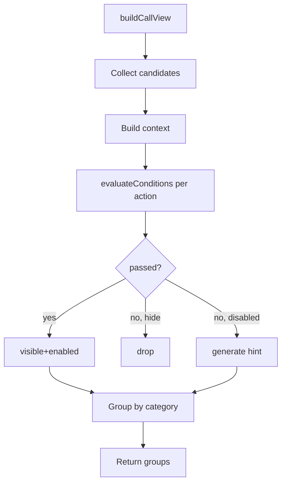

# 技术设计：地图对象与行动系统重构

把策划案落地到代码层面。本设计假定读者熟悉 `events/types.ts` 的 `Condition` / `Effect` 模型，以及当前 `callActions.ts` 的硬编码过滤实现。

## 1. 模块布局与改动一览

| 模块 / 文件 | 类型 | 1 行职责 |
| --- | --- | --- |
| `apps/pc-client/src/content/mapObjects.ts` | 新建 | `MapObjectDefinition` / `ActionDef` / `RuntimeMapObjectsState` 类型；从 `content/map-objects/` glob 导入并构建 `mapObjectDefinitionById`。 |
| `apps/pc-client/src/content/universalActions.ts` | 新建 | 从 `content/universal-actions/` glob 导入 universal `ActionDef[]`。 |
| `apps/pc-client/src/content/contentData.ts` | 修改 | `MapObjectDefinition` 移除（迁出），`MapTileDefinition.objects` 改为 `objectIds: string[]`；删除旧 `CallActionDef`、`MapCandidateAction`、`CallActionId`、`CallActionCategory`、`callActionsContent`。 |
| `apps/pc-client/src/callActions.ts` | 重写 | 收集候选 ActionDef → 调 `evaluateConditions` → 输出 `CallActionGroup[]`；不含任何硬编码过滤。 |
| `apps/pc-client/src/conditions/hintTemplates.ts` | 新建 | 把单条失败 `Condition` 转成中文门槛提示；按 type → template 表分发。 |
| `apps/pc-client/src/conditions/callActionContext.ts` | 新建 | 把 `(member, tile, gameState)` 拼成 `ConditionEvaluationContext`，供 callActions 复用。 |
| `apps/pc-client/src/events/effects.ts` | 修改 | `applyEffect` switch 增加 `case "set_object_status"`；新函数 `setObjectStatus`。 |
| `apps/pc-client/src/events/types.ts` | 修改 | `EffectType` 加 `"set_object_status"`。 |
| `apps/pc-client/src/data/gameData.ts` | 修改 | `GameMapState` 新增 `mapObjects: RuntimeMapObjectsState`；初始化时按 `MapObjectDefinition.initial_status` 填表。 |
| `apps/pc-client/src/mapSystem.ts` | 修改 | `RuntimeMapState` 不动；`deriveLegacyTiles` 改为按 `tile.objectIds[]` + `mapObjectDefinitionById` 查 visibility；`legacyResource/Building/Instrument` 由 def 表读出。 |
| `apps/pc-client/src/pages/CallPage.tsx` | 修改 | 渲染新 `CallActionGroup`（含 `disabled` / `disabledReason`）；不再沿用 `usesItemTag` 旧路径——该 hint 改由 condition 求值产生。 |
| `apps/pc-client/src/callActions.test.ts` | 改写 | 覆盖 condition 求值 / 灰显 / 隐藏分支。 |
| `apps/pc-client/src/events/effects.test.ts` | 修改 | 新增 `set_object_status` 用例。 |
| `apps/pc-client/src/events/effects.set_object_status.test.ts` | 新建 | 单测 effect handler。 |
| `apps/pc-client/src/conditions/hintTemplates.test.ts` | 新建 | 单测模板生成。 |
| `content/map-objects/*.json` | 新建 | 一类对象一文件（或一对象一文件，见 §3）。 |
| `content/universal-actions/universal-actions.json` | 新建 | universal 行动定义。 |
| `content/maps/default-map.json` | 迁移 | `tile.objects` → `tile.objectIds`；`tile.specialStates` 不动。 |
| `content/call-actions/basic-actions.json` | 废弃 | 内容拆到 universal-actions / map-objects；保留 git 历史。 |
| `content/call-actions/object-actions.json` | 废弃 | 同上。 |
| `content/schemas/map-objects.schema.json` | 新建 | 对象定义 schema。 |
| `content/schemas/universal-actions.schema.json` | 新建 | universal 行动 schema。 |
| `scripts/migrate-map-objects.mjs` | 新建（一次性） | 旧 default-map.json 自动拆出对象表与 objectIds。 |
| `docs/game_model/map.md` / `event.md` | 更新（organize-wiki 阶段） | 同步对象表分层与 set_object_status effect 描述。 |

废弃文件原则：保留 git 历史用于回滚，但 import 链路一律切断；本轮不留向后兼容代码（见 §7）。

## 2. 核心类型定义

放置在 `apps/pc-client/src/content/mapObjects.ts`（导出位置见 §10-h）：

```ts
import type { Condition } from "../events/types";

// 直接复用现有可见性枚举；hidden = 仅事件 effect 显式 reveal 才出现。
export type MapVisibility = "onDiscovered" | "onInvestigated" | "hidden";

// 对象大类——保留现有取值，便于 condition 中 has_tag/compare_field 兜底。
export type MapObjectKind =
  | "resourceNode"
  | "structure"
  | "signal"
  | "hazard"
  | "facility"
  | "ruin"
  | "landmark";

/** 行动分组维度。universal = 不属于任何 object；object = 内联在 object.actions[]。 */
export type ActionCategory = "universal" | "object";

/** 条件失败时的展示策略。undefined = 隐藏（默认）；"disabled" = 灰显 + 门槛提示。 */
export type ActionUnavailableDisplay = "disabled";

export interface ActionDef {
  /** 全局唯一字符串 id；object 内联 action 建议带 object id 前缀，universal 建议带 "universal:" 前缀（约定，非强制）。 */
  id: string;
  category: ActionCategory;
  /** 通话页按钮文案；支持 "{objectName}" 占位符。 */
  label: string;
  /** 按钮配色 token，沿用现有 Tone。 */
  tone?: "neutral" | "muted" | "accent" | "danger" | "success";
  /** 行动可见 / 可用条件；空数组 = 无条件可见。求值器：events/conditions.ts。 */
  conditions: Condition[];
  /** 选中后启动的事件 id；引用 events/types.ts 的 EventDefinition.id。 */
  event_id: string;
  /** 失败时的展示模式；省略 = 隐藏。 */
  display_when_unavailable?: ActionUnavailableDisplay;
  /** 灰显时的覆盖文案；不写则按 condition 自动生成。 */
  unavailable_hint?: string;
  /** 预留位：未来共享 action 表引用，本轮不实现，schema 接受但 loader 忽略。 */
  action_ref?: string;
}

export interface MapObjectDefinition {
  /** 全局唯一 id；与 RuntimeMapObjectsState 的 key 相同。 */
  id: string;
  /** 大类，用于 condition / UI 分组兜底。 */
  kind: MapObjectKind;
  /** 玩家可见名称。 */
  name: string;
  /** 可选描述，事件文本可引用。 */
  description?: string;
  /** 静态 tags；运行时 tags 走 RuntimeMapObject.tags。 */
  tags?: string[];
  /** 合法 status 集合；至少 1 项；不锁全局枚举。 */
  status_options: string[];
  /** 初始状态；必须属于 status_options。 */
  initial_status: string;
  /** 该对象的内联 action 列表；category 必为 "object"。 */
  actions: ActionDef[];
  /** 与现有 visibility 同义，决定何时可被通话页看到。 */
  visibility: MapVisibility;
  /** 兼容字段保留以减少 mapSystem.ts 改动面（只读派生展示）。 */
  legacyResource?: string;
  legacyBuilding?: string;
  legacyInstrument?: string;
}

export interface MapObjectRuntime {
  /** 与 definition.id 相同。 */
  id: string;
  /** 当前状态；取值 ∈ definition.status_options（运行时不强制 lint）。 */
  status_enum: string;
  /** 运行时附加 tags；MVP 字段保留但不实际写入（见策划案 Q5）。 */
  tags?: string[];
}

/** 扁平按 id 索引；与 RuntimeMapState.tilesById 同构，便于 save/load。 */
export type RuntimeMapObjectsState = Record<string, MapObjectRuntime>;
```

`Tile` 修改（在 `content/contentData.ts`）：

```ts
export interface MapTileDefinition {
  id: string;
  row: number;
  col: number;
  areaName: string;
  terrain: string;
  weather: string;
  environment: MapEnvironmentDefinition;
  /** 替换原 objects: MapObjectDefinition[]；指向 mapObjectDefinitionById。 */
  objectIds: string[];
  specialStates: MapSpecialStateDefinition[];
}
```

`EffectType` 扩展（在 `events/types.ts`）：

```ts
export type EffectType =
  | /* …现有 */
  | "set_object_status"; // 新增
```

新 effect payload（不需要单独 interface——沿用 `Effect.params` 即可，但约定 schema）：

```ts
// Effect 规约（不是新 interface，而是 set_object_status 的 params 形状）：
// effect.target = { type: "tile_id", id?: <tile id> }  // 仅用于解析，实际写入靠 params.object_id
// effect.params.object_id: string   // 必填
// effect.params.status: string      // 必填；建议属于 def.status_options（运行时只 console.warn）
```

与现有 `Condition` / `Effect` 的关系：**不修改 `Condition` 接口**；ActionDef 使用现成 `Condition[]`。`Effect` 接口不动，只增加 type 字面量与 handler 分支。

## 3. 内容资源布局

### 3.1 `content/maps/default-map.json` 拆分

迁移后 tile 形如：

```json
{ "id": "2-3", "row": 2, "col": 3, "areaName": "黑松林缘", "terrain": "森林 / 山",
  "weather": "薄雾", "environment": { /* 不变 */ },
  "objectIds": ["black-pine-stand", "animal-tracks"],
  "specialStates": [ /* 不变 */ ] }
```

### 3.2 `content/map-objects/`

**推荐：一类对象一文件**（按 mainline / resource / hazard / 等领域分文件），文件内是 `{ "map_objects": MapObjectDefinition[] }`。理由：

- 当前对象量约 30+，一对象一文件会让 PR diff 噪点过大；
- 与 `content/events/definitions/*.json` 现有惯例（一域一文件）一致；
- glob 加载用 `import.meta.glob("../../../../content/map-objects/*.json", { eager: true })`，沿用 `contentData.ts` 已有 `collectContentArray` 工具。

推荐分文件：
- `content/map-objects/mainline.json` — 所有 `mainline_*` 对象。
- `content/map-objects/resources.json` — 木材 / 矿石 / 水域等。
- `content/map-objects/hazards.json` — 危险与遗迹。
- `content/map-objects/legacy.json` — 待清理的 legacy* 对象（迁移期暂存，长期合并）。

### 3.3 `content/universal-actions/`

**推荐：单文件**`content/universal-actions/universal-actions.json`，结构 `{ "universal_actions": ActionDef[] }`。MVP 4 项行动量级太小，无需拆分。

### 3.4 `content/call-actions/*.json` 迁移

- `basic-actions.json` (`survey/move/standby/stop`) → `universal-actions.json`，重写为 ActionDef，`event_id` 指向现有 universal 入口事件（移动 / 调查 / 待命 / 停止四个，若不存在则同时新建占位 EventDefinition；见 §10-d/e）。
- `object-actions.json` (`survey/gather/build/extract/scan`) → 复制粘贴到每个相关 object 的 `actions[]`（依据当前 `applicableObjectKinds` 反推 fan-out；见 §7 与 §10-f）。
- 旧 json 文件迁移完成后保留 git 历史并从 `contentData.ts` 的 import 中删除。

### 3.5 命名约定

- ObjectId：保留现有 kebab-case（如 `mainline-rosetta-device`），全局唯一。
- ActionId：
  - object 内联：`<objectId>:<verb>`（例：`mainline-damaged-warp-pod:install_repair_kit`）。
  - universal：`universal:<verb>`（例：`universal:move`、`universal:survey`）。
- StatusEnum：小写蛇形 `unlocked` / `repaired` / `depleted`，每个对象 def 自定。

### 3.6 JSON Schema

新增 `content/schemas/map-objects.schema.json` 与 `content/schemas/universal-actions.schema.json`，用 JSON Schema Draft-07，沿用现有 schemas 目录风格；validate 不在 MVP 自动跑（与现状一致），靠类型检查兜底。

## 4. 运行时管线（call action 列表生成）

通话页打开时（即 `CallPage.tsx` 进入非-runtime 分支调用 `buildCallView`）：

1. **入口：`buildCallView({ member, tile, gameState })`**（`callActions.ts`）  
   数据来源：crew member、tile（来自 `tiles[]`）、gameState（含 `map.tilesById` / `map.mapObjects` / EventRuntimeState 字段）。

2. **收集候选 ActionDef**：
   - `universal: ActionDef[] = universalActions`（来自 `universalActions.ts`）。
   - 通过 `getRevealedObjectIds(tile.id, gameState)`（沿用 `mapSystem.ts` 现有 reveal 逻辑：`revealedObjectIds[]` ∪ `visibility==onDiscovered && discovered` ∪ `visibility==onInvestigated && investigated`）拿到本 tile 当前可见对象 id 列表。
   - 对每个 objectId 查 `mapObjectDefinitionById.get(id).actions`，全部摊平到 `objectActions: Array<{ action: ActionDef, object: MapObjectDefinition }>`。
   - 输出：`candidates = [...universal.map(a => ({action: a})), ...objectActions]`。

3. **构造 ConditionEvaluationContext**（`conditions/callActionContext.ts`）：
   ```ts
   const context: ConditionEvaluationContext = {
     state: {
       crew: gameState.crew,                  // 数组形式，evaluator 兼容
       tiles: { [tile.id]: tile },            // 至少含当前 tile
       active_events: gameState.active_events,
       active_calls: gameState.active_calls,
       crew_actions: gameState.crew_actions,
       inventories: gameState.inventories,
       world_flags: gameState.world_flags,
       world_history: gameState.world_history,
       elapsed_game_seconds: gameState.elapsedGameSeconds,
       // 自定扩展字段，用于 object_status 条件求值（见下）：
       map_objects: gameState.map.mapObjects,
     },
     trigger_context: {
       trigger_type: "call_choice",
       occurred_at: gameState.elapsedGameSeconds,
       source: "call",
       crew_id: member.id,
       tile_id: tile.id,
     },
   };
   ```

4. **求值每条 candidate**：
   ```ts
   const result = evaluateConditions(action.conditions, context, `actions[${i}]`);
   ```
   输出形状：`{ passed: boolean, errors: ConditionEvaluationError[] }`。

5. **决策渲染状态**（即 §5.1 状态机）：
   - `passed === true && errors.length === 0` → `{ visible: true, disabled: false }`。
   - `passed === false` 或有 errors：
     - `display_when_unavailable !== "disabled"` → drop（不出现）。
     - `display_when_unavailable === "disabled"` → `{ visible: true, disabled: true, disabledReason: <hint> }`。

6. **门槛提示**：调用 `generateUnavailableHint(action, failedConditions)`（`hintTemplates.ts`）：
   - `action.unavailable_hint` 优先；
   - 否则取 first failed condition，按 `condition.type` 走模板表（如 `inventory_has_item` → `"需要 [<itemId>]"`）。

7. **分组**：按 category 输出 `CallActionGroup[]`：
   - `{ title: "基础行动", actions: <universal results> }` 置顶（见 §10-d）。
   - 每个含可见 action 的对象一组：`{ title: object.name, actions: <obj results> }`。

8. **输出**：`{ groups, runtimeCall? }`，`CallActionView` 形状沿用现有 `id / defId / label / tone / objectId / disabled / disabledReason`。



注意：现有 condition evaluator 的 `compare_field` 对 `target` 解析在 `events/conditions.ts:resolveTarget`。**`map_objects` 不是其内置 target 类型**，因此条件 author 写"对象 status = X"有两条路：

- **路 A（推荐）**：在 callActions 求值前，把当前求值的 object 平铺到 `context.state.tiles[<tile_id>].current_object`，然后用 `compare_field { target: "event_tile", field: "current_object.status_enum" }`。略 hack。
- **路 B**：注册一个 `handler_condition` 名为 `object_status_equals`，params `{ object_id, status }`。clean，**推荐采纳**——这是 `events/conditions.ts` 已有扩展点，零侵入。

本轮选 **路 B**，`hintTemplates.ts` 也针对 `handler_type === "object_status_equals"` 做模板。

## 5. 状态变更管线（set_object_status effect）

### 5.1 注册

- 在 `events/types.ts` 的 `EffectType` 字面量加 `"set_object_status"`。
- 在 `events/effects.ts` 的 `applyEffect` switch 增加分支：
  ```ts
  case "set_object_status":
    return setObjectStatus(effect, context, target.target, path);
  ```
- 新函数 `setObjectStatus`：
  ```ts
  function setObjectStatus(effect, context, target, path): ApplyResult {
    const objectId = readString(effect, "object_id", path);
    const status = readString(effect, "status", path);
    if (objectId.errors.length || status.errors.length) {
      return { state: context.state, errors: [...objectId.errors, ...status.errors] };
    }
    const def = mapObjectDefinitionById.get(objectId.value);
    if (!def) {
      return fail(context.state, effect, "missing_target",
        `${path}.params.object_id`, `Object ${objectId.value} not found.`);
    }
    if (!def.status_options.includes(status.value)) {
      console.warn(`[set_object_status] status ${status.value} not in options for ${objectId.value}`);
    }
    const next = { ...context.state.map?.mapObjects ?? {} };
    next[objectId.value] = { ...next[objectId.value], id: objectId.value, status_enum: status.value };
    return {
      state: { ...context.state, map: { ...context.state.map, mapObjects: next } },
      errors: [],
    };
  }
  ```

### 5.2 调用入口

事件 effect 链路；策划写 effect_group 时声明：

```json
{ "id": "fx_door_unlock", "type": "set_object_status",
  "target": { "type": "tile_id", "id": "2-3" },
  "params": { "object_id": "locked-door", "status": "unlocked" },
  "failure_policy": "skip_effect",
  "record_policy": { "write_event_log": true, "write_world_history": false } }
```

`target` 字段对 `set_object_status` 几乎不起作用（写入靠 params.object_id），但 `Effect.target` 是必填，约定填 `{ type: "tile_id", id: <object 所在 tile> }` 以便日志显示。

### 5.3 写入 `RuntimeMapObjectsState`

存储于 `gameState.map.mapObjects: RuntimeMapObjectsState`。`EffectGameState` 已有 `map?: { tilesById?: ... }` 占位，本轮扩展为 `{ tilesById?: ...; mapObjects?: RuntimeMapObjectsState }`。

### 5.4 UI 重渲

事件 effect 跑完后由现有 reducer / state setter 已会触发 React re-render；`buildCallView` 是 `useMemo` 依赖 `gameState`，自动重算。**无需新增信号总线**。

## 6. UI 集成点

### 6.1 `CallPage.tsx` 改动

- 仍调 `buildCallView`，但 `CallActionView` 增加 `disabled?: boolean` / `disabledReason?: string`（已存在）。
- 删除 `getChoiceItemAvailability` 旧逻辑（基于 `usesItemTag` 的）——这套现已被 condition `inventory_has_item` 替代。`renderActionButton` 中只读 `action.disabled` / `action.disabledReason`，不再二次判定。
- 渲染保持现有 `<section className="call-action-group"><h3>{group.title}</h3>...` 结构。

### 6.2 分组渲染规则

- `groups[0]` = 基础行动（universal），固定置顶。
- 之后按 `tile.objectIds` 顺序，每个含可见 action 的对象一组。
- 一个对象若全部 action 都 hide → 不输出该 group（避免空标题）。
- 一个对象若全部 action 都 disabled → 输出 group + 全灰显按钮（玩家能感知"这里有事可做但缺前提"）。

### 6.3 灰显按钮实现

沿用现有 `<button disabled={...}>` + 行内 `<small>{action.disabledReason}</small>`。tone 维持 action 自身的 tone（不强制改 muted），但 `disabled` 属性让 CSS `:disabled` 自然降低不透明度。

### 6.4 门槛提示文案生成调用点

在 `callActions.ts` 内，求值结束后立即生成 hint，写入 `disabledReason`。`hintTemplates.ts` 暴露 `generateHint(action: ActionDef, failedConditions: Condition[]): string`。

## 7. 数据迁移方案

### 7.1 一次性脚本

`scripts/migrate-map-objects.mjs`（Node 脚本，可走 `pnpm tsx` 执行）。形态：读 `content/maps/default-map.json` → 输出 `content/maps/default-map.json`（重写）+ `content/map-objects/{kind}.json`（按 kind 分桶）。

伪代码：

```js
const map = JSON.parse(fs.readFileSync("content/maps/default-map.json"));
const buckets = { mainline: [], resources: [], hazards: [], legacy: [] };
for (const tile of map.tiles) {
  const ids = [];
  for (const obj of tile.objects) {
    const def = transformObject(obj); // 见 §7.2
    ids.push(def.id);
    bucketFor(def).push(def);
  }
  delete tile.objects;
  tile.objectIds = ids;
}
// 写出 4 个 map-objects/*.json + 重写 default-map.json
```

### 7.2 字段映射

| 旧字段 (tile.objects[]) | 新位置 |
| --- | --- |
| `id` | `MapObjectDefinition.id` |
| `kind` | `.kind` |
| `name` / `description` / `visibility` / `tags` | 同名字段 |
| `legacyResource` / `legacyBuilding` / `legacyInstrument` | 保留同名（迁移期；后续清理） |
| `candidateActions: string[]` | 展开为 `actions: ActionDef[]`（见下） |
| **新增** `status_options` | 默认 `["pristine"]`（迁移期占位，后续按对象语义改写） |
| **新增** `initial_status` | 默认 `"pristine"` |

`candidateActions` → `actions` 展开规则：脚本遍历每个旧 candidate id（如 `"survey"`、`"gather"`），从原 `content/call-actions/object-actions.json` 找对应 def，生成 ActionDef：

```ts
{
  id: `${object.id}:${candidate}`,
  category: "object",
  label: oldDef.label,            // 含 {objectName} 占位
  tone: oldDef.tone,
  conditions: [],                 // 迁移期空数组（保持现有可见行为等价）
  event_id: `legacy.${candidate}`, // 占位事件 id；见下
  // display_when_unavailable / unavailable_hint 都不写（默认隐藏）
}
```

`event_id: "legacy.<verb>"` 是迁移期占位，对应 universal 行动的旧入口事件。**MVP 验收点**（PS-005）要求行为等价，所以这 5 个 verb 必须有对应的占位 EventDefinition 或在 `App.tsx` 的 `onDecision` 路径上保留兼容。MVP 选择：在 `App.tsx` 的 action dispatch 处保留按 `defId`/`category` 走旧 handler 的兼容分支（短期过渡），**或** 同时新建 5 个 universal 行动入口事件并由 set_object_status / handler_effect 处理。最终决定见 §10-e。

### 7.3 universal_actions 迁移

把 `content/call-actions/basic-actions.json` 的 4 项整体 mapping 为 ActionDef：

```json
{ "id": "universal:move", "category": "universal", "label": "移动到指定区域",
  "tone": "neutral", "conditions": [
    { "type": "crew_action_status", "target": { "type": "primary_crew" },
      "op": "not_equals", "value": "active" }
  ],
  "event_id": "universal.move" }
```

`availableWhenBusy: true` 等价于"无 crew_action 占用条件"——即不写 `crew_action_status` 这条；`availableWhenBusy: false` 等价于上面这条 not_equals active。

### 7.4 向后兼容

按策划案"不做向后兼容"原则：

- 旧 `MapObjectDefinition.candidateActions` / `applicableObjectKinds` / `tile.objects` 字段在 type 与 loader 中**直接删除**。
- 旧 `content/call-actions/*.json` 不再被 import；保留磁盘文件但 `contentData.ts` 不引用。
- 旧 `getTileObjects(tile)` 兼容回退分支（`callActions.ts:129-136`）删除——所有 tile 对象都走 `objectIds`。
- 测试一并改写（见 §8）。

## 8. 测试策略

### 8.1 单元测试

- `conditions/hintTemplates.test.ts`（新建）
  - `inventory_has_item` 失败 → "需要 [电焊枪]"。
  - `has_tag` 失败 → "需要 工程师 标签"。
  - `handler_condition: object_status_equals` 失败 → "对象需先 unlocked"。
  - `action.unavailable_hint` 覆盖自动生成。
- `events/effects.set_object_status.test.ts`（新建）
  - 基础写入：旧无 entry → 新建。
  - 已有 entry → 仅改 status_enum，不丢 tags。
  - status 不在 status_options → 仍写入 + console.warn（用 `vi.spyOn(console, "warn")` 验证）。
  - 不存在 object_id → fail with `missing_target`。
- `callActions.test.ts`（改写）
  - "条件全过" → visible enabled。
  - "条件失败 + 无 display_when_unavailable" → drop。
  - "条件失败 + display_when_unavailable: disabled" → 灰显 + 正确 disabledReason。
  - "currentTile 未揭示对象" → 仅 universal 组。
  - "universal 行动 conditions=[] → 始终可见"。

### 8.2 集成测试

- `App.test.tsx` 增一条：通话页 → 选择带 set_object_status 的 action → 事件结束 → 再次进入通话 → 该对象的 action 列表按新 status 变化。
- 沿用现有 `mainlineContent.test.ts` 风格：跑完 b589ba6 minimal return-home flow，确认 5 段主线（crash_site / village / medical / hive / ending）所有 action 均可触达，结局未变。

### 8.3 现有测试受影响清单

- `callActions.test.ts` — 大改（旧 candidate 逻辑全删）。
- `mapSystem.test.ts:test(map): 覆盖路过发现持久保留` — `revealedObjectIds` 语义不变，**不应受影响**；但 fixture 使用 `tile.objects` 内联会需改为 `tile.objectIds + map-objects fixture`。
- `App.test.tsx` 中所有依赖 `tile.objects` 或 `applicableObjectKinds` 的断言需改写。
- `mainlineContent.test.ts` — 主线事件触发不变，但若主线引用 candidate 形式的 action id 需重命名。
- `effects.test.ts` — 新增一条用例不影响现有。

## 9. 风险与防御性实现

| 风险 | 防御 |
| --- | --- |
| **R1：迁移漏字段** | 写脚本而非手工迁；脚本输出后 diff `git status` 与 `pnpm test` 双重校验；保留旧 json 在 git 历史。脚本中对每个对象做 invariant assert（status_options 非空、initial_status ∈ status_options）。 |
| **R2：condition evaluator 在 action 场景行为偏差** | callActions 求值前 `console.assert` context 必含 crew/tile；`hintTemplates.ts` 对 `errors.length > 0` 也走"隐藏"路径（视为失败而非 throw）；新 `object_status_equals` 走 `handler_condition` 自定义实现，避免误用 `compare_field` 路径。 |
| **R3：内联 action 重复** | schema 上保留 `action_ref?` 字段不消费；本轮接受重复，单测覆盖率视为兜底。 |
| **R4：UI 按钮顺序不直观** | universal 固定置顶；object 按 `tile.objectIds` 顺序；同 object 内按 ActionDef 数组顺序——即"作者声明顺序 = 渲染顺序"，无隐式排序。 |
| **R5：set_object_status 写非法 status** | handler `console.warn` 但仍写入；不抛错避免事件 effect 链断；后续测试 / lint 工具兜底。 |
| **R6：玩家觉得选项太少** | 灰显是 opt-in（display_when_unavailable: "disabled"）；上线后通过日志 / 反馈观察哪些 action 应该被翻出。 |

新增 R7（迁移期）：universal 行动的占位 event_id 若未实现 → action 点击会 dispatch 不存在的事件。**防御：** App.tsx 中的 onDecision 在 dispatch 前先 lookup eventDefinitionById；若缺失则 fallback 到现有 `legacy.<verb>` 旧 handler 路径，并 console.warn。

## 10. Tech Decisions（已确认，按推荐方案落地）

> 主 agent 在 2026-04-29 与用户确认按全部推荐方案推进；以下保留候选 / 推荐说明作为审计记录，**Decision Log** 中标注 status=accepted。


### a. 门槛提示模板存储位置

- **决策点**：策划案 Q4 留白；研究中提到 `apps/pc-client/src/conditions/hintTemplates.ts`。
- **候选**：
  1. 就近：`apps/pc-client/src/conditions/hintTemplates.ts`（pure function 文件）。
  2. 内容驱动：`content/hint-templates.json` + 渲染器。
  3. 直接合入 `callActions.ts`，不另起文件。
- **推荐：候选 1**。理由：MVP 模板少，且涉及 i18n 与字符串拼接，留在 .ts 文件中比 JSON 更直观；与 `events/conditions.ts` 同目录前缀（`conditions/`）便于关联。后续若量大再升 JSON。

### b. RuntimeMapObjects 表的存储形式

- **决策点**：扁平 `Record<id, MapObjectRuntime>` vs 按 tile 索引。
- **候选**：
  1. 扁平 `Record<objectId, MapObjectRuntime>`，挂在 `gameState.map.mapObjects`。
  2. 按 tile 嵌套：`gameState.map.tilesById[tileId].objects: Record<id, MapObjectRuntime>`。
- **推荐：候选 1**。理由：set_object_status 不需要知道 tile id；与 `inventories: Record<Id, ...>` 风格一致；save / load 序列化扁平。Tile→对象关系由 definition 的 `tile.objectIds` 静态承担。

### c. MapObject id 命名空间

- **决策点**：全局唯一字符串 id vs tile 局部 id。
- **现状**：`tile_object_definition.id` 是全局唯一字符串（如 `mainline-rosetta-device`、`black-pine-stand`）。
- **候选**：
  1. 维持全局唯一。
  2. 改 `<tileId>:<localId>` 复合。
- **推荐：候选 1**。理由：set_object_status 与 condition 引用都靠 id；现状已是全局唯一；改复合 id 会导致 default-map.json 全量改写无收益。

### d. universal action 在 UI 的位置

- **决策点**：策划案 Q1 / R4 留白。
- **候选**：置顶 / 置底 / 玩家可配置。
- **推荐：置顶**。理由：与现状（`基础行动` 始终是 groups[0]）一致；玩家肌肉记忆已建立；R4 默认偏好。

### e. 大爆炸式迁移 vs 分步迁移

- **决策点**：是否在一个 PR 内做完？
- **候选**：
  1. 大爆炸 PR：删旧字段 + 新内容表 + UI 改写 + 测试一次到位。
  2. 分两步：先并行（旧 candidate + 新 actions 同时存在），后切换。
  3. 分三步：a) effect handler + 类型；b) 内容迁移；c) UI 切换。
- **推荐：候选 3（分三步）**。理由：策划要求"不留向后兼容"是终态；但工程上把 type / handler / content / UI 一锅端，PR > 1500 行 diff 难 review。分三步每步可独立测试通过；最后一步删旧 import 即"不留兼容"。**风险**：中间态有两套 action 表共存，需明确"contentData 只 import 新的"以避免双源真相。

### f. 跨多 object kind 的 action 重复粘贴方式

- **决策点**：旧 `survey` 的 `applicableObjectKinds: [resourceNode, structure, signal, hazard, facility, ruin, landmark]` 在迁移时如何展开？
- **候选**：
  1. 复制粘贴每个对象一份 ActionDef。
  2. 引入 `action_ref: "shared:survey"` 立即支持（与策划"本轮不实现"冲突）。
  3. 复制粘贴 + 标记 `// migration:duplicate` 注释，便于未来工具批量替换。
- **推荐：候选 1，并接受重复**。理由：访谈 Q12-Q13 用户已明确接受内联导致重复；脚本 §7 中自动展开，作者层不感知；schema 留 `action_ref?` 占位但 loader 忽略。

### g. 新增 effect handler 的命名与注册位置

- **决策点**：`set_object_status` 走内置 case 还是 handler_effect？
- **现状**：所有内置 effect type 都是 `effects.ts:applyEffect` switch 内置 case；外部扩展走 `handler_effect`。
- **候选**：
  1. 内置 case（与 `set_discovery_state` / `set_survey_state` 同 level）。
  2. handler_effect + 在 `handlerRegistry` 注册。
- **推荐：候选 1（内置 case）**。理由：是 first-class 概念，应有专属 EffectType；handler_effect 用于"插件化"而非 first-class 行为；与现有"地图状态写入"effects 一组（add_tile_tag / set_discovery_state）。注册位置：`effects.ts:applyEffect` switch；类型字面量在 `events/types.ts` 的 EffectType union；测试与现有 effects.test.ts 同目录。

### h. 类型导出位置

- **决策点**：`MapObjectDefinition` / `ActionDef` / `RuntimeMapObjectsState` 放哪？
- **候选**：
  1. 都放 `apps/pc-client/src/content/mapObjects.ts`（新模块）。
  2. 都塞进 `contentData.ts`（保持 single-source）。
  3. ActionDef 放 `events/types.ts`（与 Condition / Effect 同邻居），MapObjectDefinition 放 contentData.ts。
- **推荐：候选 1**。理由：`contentData.ts` 已 280+ 行且杂；新模块 `mapObjects.ts` 拥有清晰边界（types + glob loader + by-id index）；`callActions.ts` / `effects.ts` / `App.tsx` 都从这一处 import。`Condition` 仍 from `events/types`；ActionDef 在新模块里 re-import Condition。

---

## Decision Log

| Status | Date | Who | Decision |
| --- | --- | --- | --- |
| accepted | 2026-04-29 | user | a. 门槛提示模板 → `apps/pc-client/src/conditions/hintTemplates.ts`（pure .ts 函数）。 |
| accepted | 2026-04-29 | user | b. RuntimeMapObjects → 扁平 `Record<objectId, MapObjectRuntime>`，挂在 `gameState.map.mapObjects`。 |
| accepted | 2026-04-29 | user | c. MapObject id → 维持全局唯一字符串（不改复合 id）。 |
| accepted | 2026-04-29 | user | d. universal action 在 UI → 置顶（与现状一致）。 |
| accepted | 2026-04-29 | user | e. 迁移策略 → 分三步 PR（类型/handler → 内容迁移 → UI 切换 + 删旧）；终态不留向后兼容。 |
| accepted | 2026-04-29 | user | f. 跨 kind action → 复制粘贴接受重复；schema 预留 `action_ref?` 占位但 loader 忽略。 |
| accepted | 2026-04-29 | user | g. set_object_status → `effects.ts:applyEffect` 内置 case + `EffectType` union 字面量；不走 handler_effect。 |
| accepted | 2026-04-29 | user | h. 类型导出 → 全部放新建 `apps/pc-client/src/content/mapObjects.ts`。 |
| accepted | 2026-04-29 | agent | 额外：object_status 条件 → `handler_condition` 名 `object_status_equals`（params `{ object_id, status }`），不走 compare_field。 |
