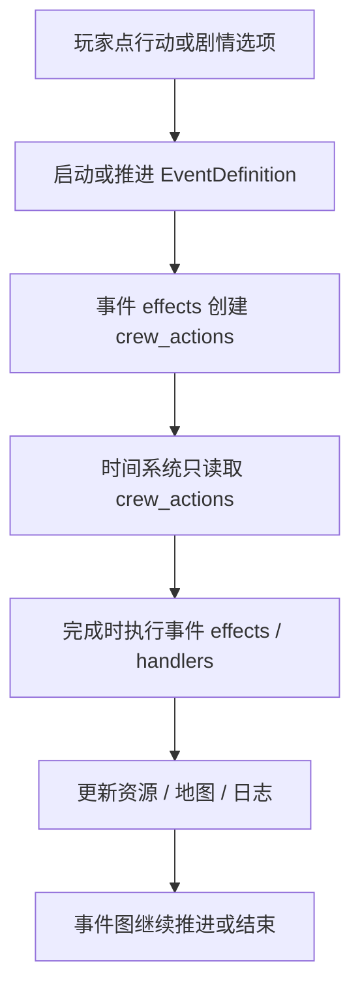
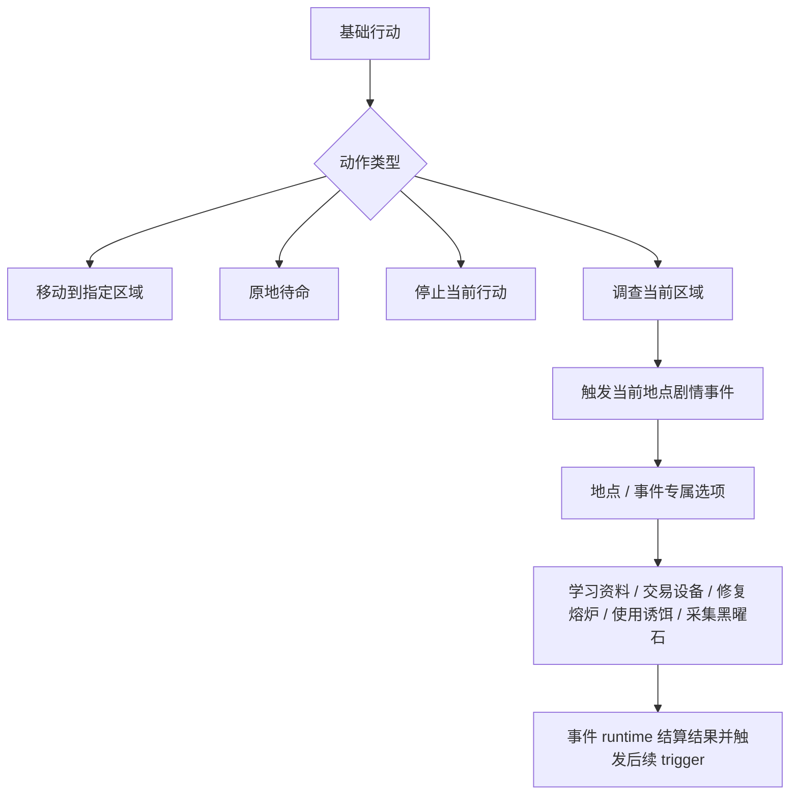
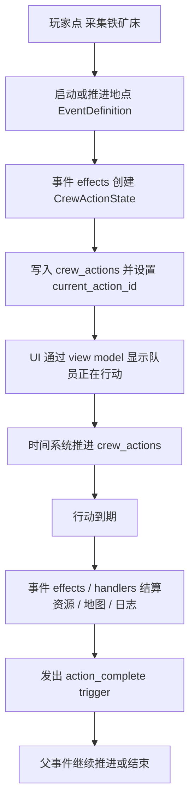

# 游戏系统去 mock 与去 legacy 重构 Technical Design

## 1. 摘要

本轮重构把游戏当前事实源收敛到三个层级：

- `GameState` / event runtime 表达真实运行时状态。
- `content/*.json` 表达正式内容资产。
- UI 只表达页面结构、真实状态、正式内容，以及中性的空状态或调试说明。

实现上，事件系统将接管通话选项背后的行动命令。`crew_actions` 成为角色行动的唯一运行时事实源；旧 `CrewMember.activeAction` 不再作为真实状态保留。基础行动收缩为移动、原地待命、停止当前行动、调查当前区域。采集、修复、交易、使用诱饵、终局确认等动作不再作为通用菜单能力，而是由地点和剧情事件提供专属选项与结算。

本轮同时删除 Lin Xia、Kael、全部 legacy event、legacy dispatch、地图 legacy 投影、无机制 content 文本字段，以及 UI 中的 mock 世界状态。

## 2. 输入与背景

### 2.1 产品输入

本技术方案基于以下文档：

- `docs/plans/2026-04-29-15-29/game-system-demock-design.md`
- `docs/plans/2026-04-29-15-29/game-system-demock-interview.md`
- `docs/plans/2026-04-29-15-29/research.md`
- `docs/plans/2026-04-27-23-17/minimal-use-case-design.md`

### 2.2 当前问题

当前原型混合了真实状态、正式 content、mock 文案和 legacy 兼容层。典型问题包括：

- UI 写死虚构信号、天线、最近通讯、异常数量、脚步声等世界状态。
- `content/crew/crew.json` 中存在没有机制支撑的 `summary` 文本，例如“最近一次通讯”。
- `content/events/events.json` 与结构化事件系统并存。
- `legacy.<verb>` 把通话按钮伪装成事件 id，再翻译回旧行动处理器。
- 地图对象通过 `legacyResource`、`legacyBuilding`、`legacyInstrument`、`legacyDanger` 派生旧 `MapTile` 字段。
- 五人队伍仍散布在 content、事件、地图、测试和正式文档中。

### 2.3 现有技术约束

仓库是 Rush + pnpm monorepo，核心模块如下：

- `content/`：运行时内容资产与 schema。
- `apps/pc-client/`：PC 权威游戏客户端、`GameState`、页面、事件系统、地图系统、测试。
- `apps/mobile-client/`：手机 companion UI。
- `apps/editor/`：事件编辑器与事件内容 manifest 生成脚本。
- `packages/dual-device/`：PC/mobile 双设备共享库。

改动约束：

- 修改 `content/` 后必须通过 `npm run validate:content`。
- 修改客户端、editor 或 dual-device 后必须通过 `npm run lint` 和 `npm run test`。
- 本轮不做旧存档、旧 content、旧 editor 资产兼容。

## 3. 目标与非目标

### 3.1 目标

- 删除 mock 世界状态、硬编码剧情、硬编码台词和假系统数值。
- 删除无机制 content 文本字段及其 schema、类型、UI 读取路径。
- 队伍缩减为 Mike、Amy、Garry。
- 删除所有 legacy 命名路径，包括 legacy event、legacy dispatch、地图 legacy 投影和 legacy schema 字段。
- 让事件系统成为通话选项与剧情动作的统一入口。
- 让 `crew_actions` 成为角色行动的唯一运行时事实源。
- 更新测试和正式文档，使它们表达同一个当前事实。

### 3.2 非目标

- 不新增真实信号质量、天线校准、最近通讯、脚步声或异常探测机制。
- 不迁移 Lin Xia、Kael 的剧情到其他角色。
- 不保留旧存档兼容。
- 不设计复杂并行事件玩法。
- 不引入场景动作生成器。

## 4. 架构决策记录

### ADR-001：事件图统一行动命令

**决策**：通话选项背后的行动命令进入事件系统。移动、调查、修复、交易、使用道具等玩家决策都应由事件图节点、effect 或事件 runtime handler 统一管理。

**理由**：本项目是剧情驱动游戏。玩家真正推动剧情的不是通用“采集/建设”菜单，而是在具体地点中作出的剧情动作选择。旧 `legacy.<verb>` dispatch 把行动伪装成事件 id，再翻译回代码 handler，会让内容事实源不清楚。

**后果**：需要把现有行动开始、行动完成、资源结算、地图状态更新和后续 trigger 收敛到事件 runtime。

### ADR-002：`crew_actions` 是唯一行动事实源

**决策**：`crew_actions` 成为角色行动的唯一 runtime 状态。`CrewMember.activeAction` 不再作为真实状态保留。若 UI 仍需要展示旧形状，可在过渡 task 中做只读 view model，但不能作为存档或逻辑事实源。

**理由**：当前存在两套行动状态：旧 `CrewMember.activeAction` 与事件 runtime 的 `crew_actions` / `CrewState.current_action_id`。双事实源会导致结算、阻塞、UI 和测试互相绕过。

**后果**：时间推进、移动、行动完成、objective completion、event wakeup 和 UI 同步都要读取 `crew_actions`。

**完整重写含义**：事件 runtime 成为唯一行动系统。玩家点下通话选项或基础行动后，系统启动或推进 `EventDefinition`，由事件 effects 创建 `crew_actions`。时间系统只读取 `crew_actions`；行动完成时执行事件 effects / handlers，更新资源、地图和日志，再让事件图继续推进或结束。

### ADR-003：每个角色只允许一个阻塞型主事件或主行动

**决策**：事件可以并行存在，但同一角色同一时间只能被一个阻塞型主事件或主行动占用。非阻塞背景事件可以存在，但本轮不把它发展成复杂并行玩法。

**理由**：当前 event runtime 已有 `blocking_claim_ids`、`occupies_crew_action`、`occupies_communication`、`current_action_id` 等概念。它们适合表达“主行动占用”，不适合本轮扩展成多行动并行系统。

**后果**：事件候选选择、call node、action request、create crew action effect 都必须检查并维护同一套 blocking 规则。

### ADR-004：基础行动收缩为四类控制动作

**决策**：基础行动只保留：

- 移动到指定区域
- 原地待命
- 停止当前行动
- 调查当前区域

采集、修复、交易、学习资料、使用诱饵、获取燃料、终局确认等动作都作为地点或剧情事件的专属选项。

**理由**：`minimal-use-case-design.md` 的主线是地点事件链。把“采集/建设/修复/交易”做成通用行动会误导玩家，以为系统支持一套通用模拟规则。

**后果**：`map-objects` 不再承载通用 cross-object action 菜单。地点对象可以参与事件条件、展示和效果，但不再通过 `legacy.<verb>` 触发通用 handler。

**基础行动极简 + 剧情事件手写**：基础行动只负责导航和最小控制。调查当前区域只负责触发该地点的当前剧情事件。其余动作都来自当前地点或事件的专属选项，例如“学习资料”“交易设备”“修复熔炉”“使用诱饵”“采集黑曜石”。事件 runtime 统一管理阻塞、行动耗时、结果结算和后续 trigger。

### ADR-005：不引入动作生成器

**决策**：本轮不从 map-object action 自动生成事件定义。

**理由**：生成层会增加一个新事实源和调试层。本轮目标是让事实源更清楚，而不是引入新的间接关系。

**后果**：需要保留或新增的剧情动作必须显式写成结构化事件资产。

## 5. 目标架构

### 5.1 Runtime 分层

目标 runtime 分为四层：

1. **Game shell state**：页面、当前通话、调试开关、时间倍率等 UI 壳状态。
2. **Event runtime state**：`active_events`、`active_calls`、`crew_actions`、`objectives`、`event_logs`、`world_history`、`world_flags`。
3. **Domain state**：crew、map、inventories、resources、tiles 等游戏事实。
4. **Derived view state**：页面显示用的列表、标签、行动按钮和空状态。

第 2 层和第 3 层是事实源。第 4 层不能写回逻辑，也不能保存为独立事实。

### 5.2 行动生命周期

行动生命周期统一走 `crew_actions`：

1. 玩家在通话中选择事件选项，或在基础行动中选择移动 / 调查 / 待命 / 停止。
2. 事件图推进到行动节点或 effect。
3. runtime 创建 `CrewActionState`，写入 `crew_actions`，并把对应 crew 的 `current_action_id` 指向该行动。
4. 时间系统推进 `crew_actions`。
5. 行动到期后，runtime 执行对应事件效果或 action completion handler。
6. 系统发出 `action_complete` trigger。
7. 父事件继续推进，或写入结果后结束。

例如玩家在通话中选择“采集铁矿床”时，这不再进入通用 `gather` 菜单或 legacy dispatch。它会启动或推进一个地点剧情事件，由事件 effects 创建 `CrewActionState`，时间推进完成后再由事件 effects / handlers 更新结果。

### 5.3 基础行动与剧情动作

基础行动只解决“玩家如何让队员移动、停止、待命、调查当前区域”。它们必须显式建模为当前事件 runtime 能理解的事件入口或系统事件。

剧情动作由地点事件提供。例如：

- 坠毁现场第三次调查获得维修技术。
- 村落商人用稀有矿石样本交易高温开采设备。
- 医疗舱学习野外急救。
- 火山使用高温开采设备取得黑曜石。
- 巢穴入口使用诱饵引开兵蚁。
- 折跃仓终局依次修复仓体、注入燃料、输入坐标。

这些动作不作为通用 `gather`、`build`、`trade` 系统暴露。

### 5.4 UI 展示规则

UI 文案分为允许和禁止两类。

允许：

- 页面标题、按钮、字段标签。
- 中性空状态，例如“暂无来电”“未选择队员”“暂无可执行事件”。
- 调试说明，例如“当前没有 runtime call”。
- 来自正式 content 且在真实触发后展示的事件台词、日志和结果。

禁止：

- 虚构世界状态，例如信号噪声、天线偏移、脚步声、最近通讯、未知回声。
- 没有模型支撑的静态 summary。
- 用硬编码剧情句填充页面信息密度。
- 用 legacy 名称或旧资产说明当前系统能力。

## 6. 数据模型设计

### 6.1 `CrewMember`

目标：

- 删除 `summary`。
- 删除 `activeAction`。
- `id` 类型只保留 `"mike" | "amy" | "garry"`。
- 保留 `status` / `statusTone` 可作为 view 派生字段；长期应从 `CrewState`、`crew_actions`、active call 和 blocking state 派生。

过渡要求：

- 如果某些 React 组件仍需要 `member.status`，可以先通过 selector 生成，但不能再从 content 或旧 save 读取 mock 状态。
- 不为旧 save 中的 Lin Xia、Kael 或 `activeAction` 做兼容迁移。

### 6.2 `CrewState` 与 `CrewActionState`

`CrewState.current_action_id` 是角色主行动指针。`CrewActionState` 是行动事实：

- `id`
- `crew_id`
- `type`
- `status`
- `source`
- `parent_event_id`
- `target_tile_id`
- `started_at`
- `ends_at`
- `duration_seconds`
- `action_params`
- `can_interrupt`
- `completion_trigger_context`

需要补齐的约束：

- 创建新行动前，如果 crew 已有 active `current_action_id`，必须失败或先走停止流程。
- 阻塞型事件或通话占用 crew 后，不能再创建另一个阻塞型主行动。
- 完成行动后，必须清除 `current_action_id`，并把行动状态更新为 `completed`、`failed`、`cancelled` 或 `interrupted`。

### 6.3 基础行动定义

`content/universal-actions/universal-actions.json` 不再使用 `event_id: "legacy.*"`。目标 schema 应表达基础行动入口：

- `id`
- `category: "universal"`
- `label`
- `tone`
- `conditions`
- `event_definition_id` 或 `system_action_type`
- `params`

如果采用 `event_definition_id`，四个基础行动都应对应显式结构化事件定义。移动需要额外选择目标地块，因此可拆成“进入移动目标选择”和“确认移动”两个 runtime 步骤，但最终创建的仍是 `CrewActionState`。

### 6.4 地点与剧情动作

地点剧情动作优先写入结构化事件资产：

- `content/events/definitions/*.json`
- `content/events/call_templates/*.json`
- `content/events/presets/*.json`
- `content/events/handler_registry.json`

地图对象只表达地点、对象、标签、可见性和状态，不再承载通用 `legacyResource` / `legacyBuilding` / `legacyInstrument` 投影。

### 6.5 地图模型

删除目标：

- `deriveLegacyTiles`
- `legacyResource`
- `legacyBuilding`
- `legacyInstrument`
- `legacyDanger`
- `MapTile.resources`
- `MapTile.buildings`
- `MapTile.instruments`
- `MapTile.danger` 作为旧展示字段

替代方向：

- 地图 UI 读取 `defaultMapConfig.tiles[*].objectIds`。
- 可见对象来自 `RuntimeMapState.tilesById[*].revealedObjectIds` 与 `mapObjectDefinitionById`。
- 特殊状态来自 `specialStates` 与 `activeSpecialStateIds`。
- 危险、资源、建筑等具体含义通过对象 `kind`、`tags`、`status_enum` 和事件结果表达。

### 6.6 事件内容

删除目标：

- `content/events/events.json`
- `content/schemas/events.schema.json`
- `eventDefinitions` legacy 导出
- editor 中的 `legacy_event`

结构化事件仍保留并成为唯一事件内容系统。manifest 中删除 Lin Xia、Kael 相关 domain。

### 6.7 Content 文本字段

删除 `crew.summary` 及其 schema、类型、UI 读取路径。

保留的文本字段必须有清晰语义：

- 角色档案：静态身份、背景、语气、专长说明。
- 事件文本：只在事件触发、通话连接或结果结算后展示。
- 日志文本：只在真实 effect 或 runtime 结果写入后展示。
- UI 文案：只做中性说明。

## 7. 接口与流程设计

### 7.1 通话选项流程

目标流程：

1. `CommunicationStation` 展示 active runtime calls。
2. 玩家接通通话。
3. `CallPage` 展示 runtime call options。
4. 玩家选择 option。
5. `selectCallOption` 推进事件图。
6. 事件图 effect 创建、停止或更新 `crew_actions`。
7. UI 从 event runtime 派生行动状态。

删除流程：

- `translateActionIdToLegacyDispatch`
- `legacy.<verb>`
- `applyImmediateOrCreateAction` 作为通话按钮直接入口

### 7.2 基础行动流程

基础行动可以用事件入口表达：

- 移动到指定区域：进入选点流程，确认后创建 `move` crew action。
- 原地待命：创建或结算 `standby` action，或直接写入 idle 状态。
- 停止当前行动：取消当前 `crew_actions[current_action_id]`，按停止耗时生成 interrupt action 或立即进入停止流程。
- 调查当前区域：触发当前地点的调查事件；如果地点没有可触发调查事件，显示中性空状态。

### 7.3 时间推进流程

`settleGameTime` 应改为读取 `crew_actions`：

1. 扫描 active crew actions。
2. 推进移动类行动的路径和抵达。
3. 对到期行动执行完成结算。
4. 更新 crew、map、inventories、resources、event logs。
5. 发出 `action_complete`、`arrival` 或其他 trigger。
6. 调用 `processTrigger` 或 `processEventWakeups` 推进事件图。

长期目标是删除旧 `settleAction` 对 `CrewMember.activeAction` 的依赖。若保留部分函数，应改名为 runtime action executor，并只接受 `CrewActionState`。

### 7.4 Editor 流程

editor 只展示结构化事件资产：

- definitions
- call templates
- presets
- handlers

删除 `legacy_event` 类型和只读 legacy 展示。若需要保留事件浏览能力，只浏览当前结构化事件。

## 8. 目录与文件影响

### 8.1 Content

预计影响：

- `content/crew/crew.json`
- `content/schemas/crew.schema.json`
- `content/events/manifest.json`
- `content/events/definitions/*.json`
- `content/events/call_templates/*.json`
- `content/events/events.json`
- `content/schemas/events.schema.json`
- `content/maps/default-map.json`
- `content/map-objects/*.json`
- `content/universal-actions/universal-actions.json`
- `content/schemas/map-objects.schema.json`
- `content/schemas/maps.schema.json`
- `content/schemas/universal-actions.schema.json`

### 8.2 PC Client

预计影响：

- `apps/pc-client/src/data/gameData.ts`
- `apps/pc-client/src/App.tsx`
- `apps/pc-client/src/callActionSettlement.ts`
- `apps/pc-client/src/mapSystem.ts`
- `apps/pc-client/src/content/contentData.ts`
- `apps/pc-client/src/content/mapObjects.ts`
- `apps/pc-client/src/events/*`
- `apps/pc-client/src/pages/CommunicationStation.tsx`
- `apps/pc-client/src/pages/CallPage.tsx`
- `apps/pc-client/src/pages/ControlCenter.tsx`
- `apps/pc-client/src/pages/MapPage.tsx`
- PC tests and e2e tests

### 8.3 Mobile Client

预计影响：

- `apps/mobile-client/src/MobileTerminalApp.tsx`
- mobile tests

目标是删除“演示”性质的虚构状态，保留真实连接状态和中性说明。

### 8.4 Editor

预计影响：

- `apps/editor/src/event-editor/types.ts`
- event browser 组件与测试
- `apps/editor/README.md`
- `apps/editor/scripts/generate-event-content-manifest.mjs`

### 8.5 Docs

预计影响：

- `AGENTS.md`
- `docs/game_model/crew.md`
- `docs/game_model/event.md`
- `docs/game_model/map.md`
- `docs/gameplay/*/*.md`
- `docs/ui-designs/**/*.md`
- `docs/todo.md` 如需记录明确延后项

不要修改 `docs/core-ideas.md`，除非先获得人类确认。

## 9. 删除与迁移策略

### 9.1 删除策略

本轮删除优先于兼容：

- 删除文件时同步删除 import、schema、测试和 docs 引用。
- 删除字段时同步删除 schema、TypeScript 类型、运行时读取和 UI 展示。
- 删除 Lin Xia、Kael 时同步删除专属事件、call template、manifest domain、地图引用、fixture 和文档当前事实。

### 9.2 存档策略

不兼容旧存档。实现可以选择在 schema version 变化后重置旧 save，或在加载失败时回到新初始状态。不要写 Lin Xia、Kael、legacy event、legacy map 字段的迁移 shim。

### 9.3 生成文件策略

修改 `content/events/manifest.json` 后，需要重新生成：

- `apps/pc-client/src/content/generated/eventContentManifest.ts`

生成产物应只包含结构化事件 domain。

## 10. 测试与验证策略

### 10.1 自动验证

必须通过：

- `npm run validate:content`
- `npm run lint`
- `npm run test`

涉及端到端流程后，视改动运行：

- `npm run test:e2e`

### 10.2 关键词审计

实现完成后进行全文审计。当前事实代码与正式文档中不应残留：

- `legacy`
- `events.json`
- `deriveLegacyTiles`
- `legacyResource`
- `legacyBuilding`
- `legacyInstrument`
- `legacyDanger`
- `lin_xia`
- `kael`
- `summary` 作为 crew 字段
- “最近一次通讯”
- “天线”
- “信号噪声”
- “脚步声”

允许例外：

- 本轮 `docs/plans/2026-04-29-15-29/*` 作为历史设计材料可以描述被删除对象。
- 测试标题或注释不应保留 legacy 作为当前行为说明。

### 10.3 行为验收

核心行为：

- 通讯台不显示虚构世界状态。
- 角色列表只显示 Mike、Amy、Garry。
- 基础行动只显示四类控制动作。
- 地点剧情动作只在对应事件或地点上下文中出现。
- 同一角色不能同时拥有两个阻塞型主行动。
- 行动完成后通过事件 runtime 推进结果。
- 地图 UI 不依赖 legacy tile 投影字段。

## 11. 风险与缓解

### R1：完整行动重写范围大

缓解：任务拆分时先建立 `crew_actions` 唯一事实源，再迁移移动、调查、停止、待命，最后迁移剧情动作和 UI。

### R2：事件 runtime 与旧 UI view 脱节

缓解：先建立 selector / view model，把 runtime 状态派生为页面需要的数据，再删除旧字段。

### R3：删除 legacy map 投影导致地图页面信息不足

缓解：地图页面改为展示对象、特殊状态、调查状态和中性空状态。不要用假资源、假危险补信息密度。

### R4：结构化事件内容不足以覆盖当前按钮

缓解：只保留四个基础行动和当前真实事件入口。无法追溯到结构化事件的按钮应删除或显示中性空状态。

### R5：docs 与代码事实不同步

缓解：把文档更新作为独立 task，并在最终 task 做关键词审计。

## 12. 任务拆分原则

后续 tasks 应按以下顺序拆分：

1. 建立内容与 schema 删除边界。
2. 三人化 content 与测试基础。
3. 删除 legacy event 和 editor legacy 展示。
4. 建立 `crew_actions` 唯一行动事实源。
5. 迁移基础行动。
6. 删除 legacy dispatch 和旧 action settlement 入口。
7. 删除地图 legacy 投影。
8. 清理 UI mock 文案。
9. 更新正式 docs。
10. 最终验证、生成清单和关键词审计。

每个 task 必须能独立通过相关自动验证，且不得用兼容 shim 恢复被删除的旧行为。
