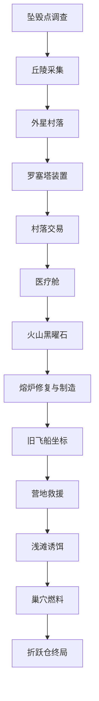

# 最小用例内容边界设计

## 1. 概述（What & Why）

最小用例内容边界定义了当前可玩版本只承载一条“回家主线”：玩家作为远程指挥者，通过通讯调度坠毁小队调查、采集、交易、治疗、修复和处理巢穴风险，最终修复折跃仓并返航。

这份设计不是新的剧情扩展，而是对 `docs/plans/2026-04-27-23-17/minimal-use-case-design.md` 的边界收束：游戏 runtime 只应加载主线所需内容；测试 / 演示剧情不应作为玩家可遭遇内容保留。

## 2. 设计意图（Design Intent）

- 让玩家体验“远程指挥一支落难小队，从混乱中建立返航方案”的完整闭环。
- 保证存在一条稳定保底路线，不依赖高属性、随机掉落或单一队员存活。
- 让内容生产有唯一事实源：事件、物品、地图对象、地点与行动入口都写在 `content/` 静态资产中。
- 避免测试事件、样例剧情和临时演示内容污染正式体验。
- 保留少量捷径，但捷径只能减少绕路或风险，不能替代保底路线。

## 3. 核心概念与术语（Core Concepts & Terminology）

- **最小用例**：当前版本唯一需要完整落地的可玩闭环，从坠毁调查到折跃仓返航。
- **回家主线**：修复折跃仓并完成返航的主目标。
- **保底路线**：任何开局都可完成的稳定路线，不依赖随机掉落、高属性或单一角色。
- **捷径路线**：高社交、高武力或额外探索带来的降风险、降耗时方案，不承担唯一解职责。
- **静态内容资产**：存放在 `content/` 下的 JSON 资产，包括事件、通话模板、地图、地图对象、物品和行动入口。
- **可玩 runtime content**：会被游戏 runtime 加载并可能被玩家遇到的正式内容。
- **测试 / 演示事件**：用于验证系统能力、演示事件图或早期试验的剧情内容，例如森林野兽、矿洞异常、沙漠 / 山地样例。
- **fixture / sample context**：自动化验证使用的数据或事件触发样例，不等同于玩家可遭遇内容。
- **主线知识标签**：通过剧情资料获得的队员状态，例如 `knows_repair_tech`、`knows_field_first_aid`、`knows_alien_language`。

## 4. 核心循环与玩家体验（Core Loop & Player Experience）

### 4.1 玩家旅程

1. 玩家从坠毁后的首次通讯中得知当前目标是“找到回家方法”。
2. 玩家命令队员反复调查坠毁现场，获得基础物资、雷达线索和维修技术。
3. 玩家前往丘陵采集铁矿，并在持续采集后稳定获得稀有矿石样本。
4. 玩家前往外星村落。若未能通过捷径理解语言，则取得罗塞塔线索。
5. 玩家调查罗塞塔装置，保底学会外星语言。
6. 玩家回到村落，用稀有矿石样本交易高温开采设备，并从村民处获得受伤村民营地线索。
7. 玩家调查医疗舱，获得药品和野外急救知识。
8. 玩家前往火山，用高温开采设备取得黑曜石，并获得旧飞船遗迹方向。
9. 玩家修复损坏熔炉，制造折跃仓修复套件。
10. 玩家调查旧飞船遗迹，取得折跃坐标。
11. 玩家救助受伤村民并探索浅滩湿地，稳定取得两个诱饵。
12. 玩家进入外星生物巢穴，入口和孵化室各消耗一个诱饵，取得外星粘液燃料。
13. 玩家命令所有可行动、可通讯队员回到坠毁区。
14. 玩家在坠毁点按顺序修复仓体、注入燃料、输入坐标并启动。
15. 系统展示返航完成，最小用例闭环结束。

### 4.2 典型情境

- **高光时刻**：玩家把分散线索串起来，意识到语言、医疗、采矿、熔炉和巢穴共同服务于返航目标。
- **低谷 / 摩擦点**：玩家缺少关键物品或知识时，系统应明确指出可恢复路径，而不是让玩家误以为流程卡死。
- **不应出现的体验**：玩家在主线推进中突然遭遇与返航目标无关的测试剧情，例如森林野兽或矿洞异常报告。

## 5. 机制与规则（Mechanics & Rules）

### 5.1 主线内容规则

- 可玩 runtime 只加载最小用例主线内容和必要的通用行动。
- 主线内容按领域组织：坠毁点、资源 / 熔炉、村落 / 罗塞塔、医疗 / 诱饵、巢穴、终局。
- 主线推进以“通讯台 -> 通话 -> 行动 / 事件 / 地图发现”为主要交互，不引入地图直接下令。
- 主线信息入口优先使用“调查”。扫描可以作为未来设备玩法保留，但不作为本轮主线必要入口。
- 每个主线必需道具、知识和地点都必须有稳定来源。

### 5.2 内容资产规则

- 游戏内容必须写入 `content/` 静态资产。
- 事件和通话文本属于内容资产，不应硬编码在页面逻辑中。
- 地图地点通过地图与地图对象表达；地点对象再暴露通话行动入口。
- 物品和关键知识分开表达：物品写入 item 资产，知识写入队员 condition tag。
- 内容资产可以包含 `sample_contexts` 以支持 schema 和事件验证，但这些样例不是玩家剧情。

### 5.3 人物与状态规则

- 关键知识使用队员 condition tag 表达：维修技术、野外急救、外星语言。
- 关键知识必须可重复学习，避免单一学习者失效导致主线硬锁。
- `wounded` 表示受伤状态，会带来移动变慢和高风险选项不可用的代价。
- 恢复受伤至少有两条路径：消耗药品，或由具备野外急救的队员处理。

### 5.4 背包与关键物品规则

- 主线关键物品默认进入当前行动 / 通话队员的个人背包。
- 本轮不设计队员间物品转移或共享仓库玩法。
- 内容应通过可重复来源或替代来源降低硬锁风险。
- 前中期关键物品可以重复获得或重新交易；后期关键物品取得后，内容不应强制触发不可恢复失效。

### 5.5 测试 / 演示事件规则

- 森林野兽、Amy 遇到熊、矿洞异常、沙漠 / 山地样例等非主线事件不得作为可玩 runtime content 保留。
- 自动化测试可以构造 fixture 或专用 sample，但这些数据不应通过正式 manifest 或地图对象进入玩家流程。
- 如果某段样例剧情只用于测试事件系统能力，应改为测试 fixture、主线事件测试或纯系统层测试。

## 6. 系统交互（System Interactions）

- **依赖于**：事件系统、人物系统、地图系统、物品系统、通话行动系统。
- **被依赖于**：后续 implementation planning、content 制作、wiki 整理和主线通关验收。
- **共享对象 / 状态**：队员 condition tags、队员个人背包、world flags、world counters、地图对象状态、事件日志。
- **事件 / 信号**：抵达地点、调查对象、采集对象、通话选项、修复 / 制造、终局启动。

最小用例的内容流如下：

## 7. 关键场景（Key Scenarios）

### 7.1 典型场景

- **S1：坠毁点建立主线**：玩家调查坠毁点三次 -> 系统逐步发放物资、雷达线索和维修技术 -> 玩家明确“回家”目标。
- **S2：村落语言保底**：玩家初访村落语言不通 -> 系统给出罗塞塔线索 -> 玩家通过罗塞塔装置稳定学会外星语言。
- **S3：医疗与诱饵串联**：玩家取得药品或野外急救 -> 救助受伤村民 -> 获得诱饵和巢穴提示。
- **S4：巢穴双诱饵**：玩家在入口和孵化室各消耗一个诱饵 -> 稳定取得外星粘液燃料 -> 不进入复杂巢穴迷宫。
- **S5：终局集合**：所有可行动、可通讯队员回到坠毁点 -> 玩家完成折跃仓三步 -> 触发返航完成。

### 7.2 边界 / 失败场景

- **F1：关键知识持有者失效**：玩家仍可派其他队员回到资料来源补学，不应硬锁。
- **F2：缺少高温开采设备**：火山采集不能推进，但系统应提示回村落交易设备。
- **F3：缺少诱饵**：巢穴入口或孵化室不能推进，但系统应提示营地救援与浅滩湿地来源。
- **F4：队员受伤**：高风险选项不可用，但玩家可用药品或野外急救恢复。
- **F5：测试内容误入 runtime**：玩家看到与主线无关的森林野兽、矿洞异常或沙漠 / 山地样例时，视为内容边界错误。

## 8. 取舍与反模式（Design Trade-offs & Anti-patterns）

- **取舍 1**：选择一条稳定主线，而不是多个半成品支线，因为当前目标是验证完整通关闭环。
- **取舍 2**：选择 `content/` 静态资产，而不是代码内硬编码剧情，因为内容需要被校验、编辑和复用。
- **取舍 3**：选择轻量村落对象，而不是专用村落 UI，因为本轮重点是主线通关，不是社会系统。
- **取舍 4**：选择调查作为主线信息入口，而不是调查和扫描并列，因为两个入口职责过近，会增加玩家选择负担。
- **取舍 5**：保留测试 fixture，而不是保留测试剧情，因为测试需要验证系统，但玩家不应遇到验证用内容。
- **要避免的反模式**：为了展示事件系统能力，把森林野兽、矿洞异常、沙漠样例等内容当作正式剧情保留。
- **要避免的反模式**：把主线文本、物品表或地点交互硬编码到页面逻辑里。
- **要避免的反模式**：用随机掉落、高属性检查或单一队员存活作为主线唯一前置。

## 9. 参考与来源（References & Inspiration）

- **最小用例（MVP 可实现版）**：`docs/plans/2026-04-27-23-17/minimal-use-case-design.md`。来源：主线闭环、关键地点、关键道具、危险与恢复、验收标准。
- **Minimal Use Case 技术设计**：`docs/plans/2026-04-27-23-17/technical-design.md`。来源：content 组织、静态资产边界、已确认的实现约束。
- **实施反馈：调查 / 扫描入口过度复杂**：`docs/plans/2026-04-27-23-17/implementation-feedback.md`。来源：MVP 主线只保留调查入口的设计取舍。
- **本轮原始诉求**：`docs/plans/2026-04-30-00-15/initial.md`。来源：去除测试 / 演示可玩事件、所有游戏内容放在 `content/` 的边界要求。

---

## 10. 本轮范围与阶段拆分（Scope & Phasing for This Round）

### 10.1 MVP（本轮必做）

- 写清 Minimal Use Case 是当前唯一可玩主线。
- 写清所有游戏内容必须作为 `content/` 静态资产表达。
- 写清非主线测试 / 演示事件不得作为可玩 runtime content 保留。
- 写清测试 fixture / sample contexts 与可玩 content 的区别。
- 写清主线保底路线、关键地点、关键道具和终局条件。
- 写清不进入本轮的复杂系统与支线。

### 10.2 Later（未来再做）

- 队员间物品转移、共享仓库、找回背包。
- 完整交易系统、村落社会系统、关系与声望。
- 驯兽路线、女王室、巢穴迷宫、蜂群社会知识。
- 雷达升级后的细粒度扫描玩法。
- 更多星球、多星球折跃和跨星球内容。
- 更复杂的支线事件包，但必须在主线边界稳定后再设计。

### 10.3 不做（Out of Scope）

- 本轮不修改代码。
- 本轮不删除 content 文件。
- 本轮不重写测试。
- 本轮不执行 `validate:content`、lint 或自动化测试命令。
- 本轮不把 technical design 中的代码任务复制成实施计划。
- 本轮不把测试 / 演示事件改写成新支线；它们应从可玩内容边界中排除。

## 11. 本轮验收与风险（Acceptance & Risks）

### 11.1 Player Stories / Play Scenarios（验收切片）

#### PS-001：玩家理解唯一主线

- **作为**：第一次进入当前版本的玩家。
- **我能**：通过坠毁现场、雷达线索和后续地点逐步理解“回家”主线。
- **以便**：知道每个关键地点和道具为什么服务于返航目标。
- **验收标准**：
  - [ ] 文档描述了从坠毁点到返航完成的完整路线。
  - [ ] 文档明确主线不依赖随机掉落或高属性。
- **不包含**：复杂支线、开放式村落玩法、多结局。
- **优先级**：P0

#### PS-002：内容作者理解资产边界

- **作为**：后续写 content 的作者。
- **我能**：知道事件、文本、物品、地图对象和行动入口都应写在 `content/`。
- **以便**：避免把剧情写进页面逻辑或临时测试文件。
- **验收标准**：
  - [ ] 文档明确 `content/` 是游戏内容唯一事实源。
  - [ ] 文档区分可玩 content 与 fixture / sample contexts。
- **不包含**：具体 JSON schema 教程。
- **优先级**：P0

#### PS-003：测试内容不污染可玩体验

- **作为**：后续维护自动化测试的开发者。
- **我能**：保留 fixture 和 sample contexts，但不把森林野兽、矿洞异常等 demo 事件放进可玩 runtime。
- **以便**：测试系统能力的同时，保持玩家体验只围绕主线。
- **验收标准**：
  - [ ] 文档列出测试 / 演示事件不得作为可玩内容保留。
  - [ ] 文档说明 fixture / sample contexts 的允许边界。
- **不包含**：本轮删除文件或改测试代码。
- **优先级**：P0

### 11.2 成功标准（Success Criteria）

- [ ] 新 design 文档位于 `docs/plans/2026-04-30-00-15/`。
- [ ] 文档自包含说明 Minimal Use Case 的玩法闭环。
- [ ] 文档明确所有游戏内容应放在 `content/` 静态资产。
- [ ] 文档明确不保留非主线测试 / 演示事件作为可玩 runtime content。
- [ ] 文档区分可玩 content、fixture 和 sample contexts。
- [ ] 文档不包含代码命令清单或任务拆分。

### 11.3 风险与缓解（Risks & Mitigations）

- **R1：文档把设计边界写成代码任务**
  - **缓解**：只记录设计约束和验收口径，不写实现步骤、命令或任务拆分。
- **R2：去除测试 / 演示事件被误解为删除测试能力**
  - **缓解**：明确测试 fixture 和 sample contexts 可以存在，但不能成为玩家可遭遇内容。
- **R3：只保留主线导致世界显得单薄**
  - **缓解**：把额外支线列入 Later，先保证一条完整可通关路线。
- **R4：高属性捷径被误解为主线前置**
  - **缓解**：强调捷径只能降风险或缩短路径，保底路线必须独立成立。

## 12. Open Questions

- **Q1：高社交跳过罗塞塔是否进入首轮 content 实现？** 当前设计允许它作为 P1 捷径，但不允许它成为保底路线的一部分。
- **Q2：后续测试 fixture 是否需要独立目录或命名规范？** 本文只定义“不能进入可玩 runtime content”，具体测试组织留给 implementation planning。
- **Q3：非主线环境素材是否全部删除？** 如果某个对象只提供地形氛围且不会触发剧情，可在实施时保留；若会形成可玩事件或误导主线，应移除。
