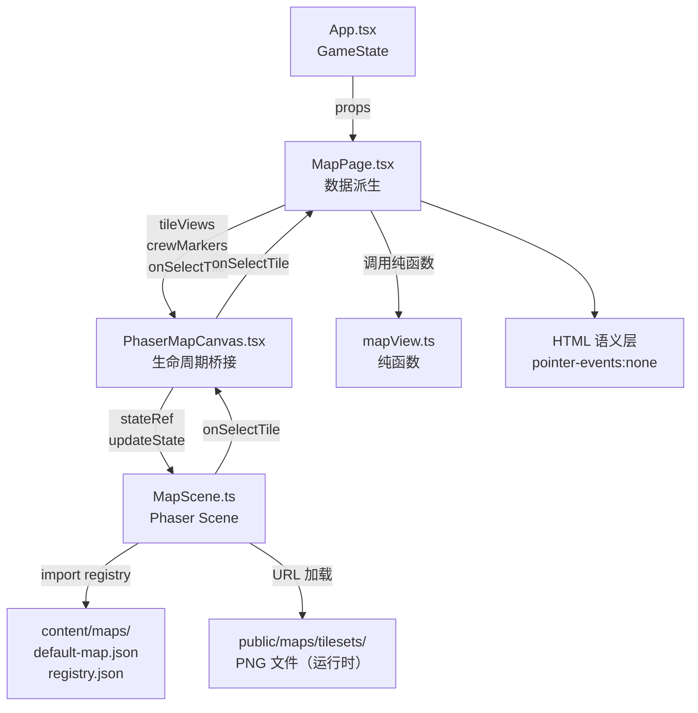

# Phaser 地图系统技术设计文档

地图页面（`MapPage`）将现有 CSS Grid + `<button>` DOM 网格（`apps/pc-client/src/pages/MapPage.tsx`，398 行）替换为 Phaser 4 驱动的 WebGL/Canvas 2D 地图，实现离散缩放、相机拖拽、人物移动动画和悬停 tooltip。地图保持只读态势图定位：玩家查看、选点，指令通过通讯台 → 通话发出。

---

## 1. 架构概览

### 1.1 分层与组件职责

| 层 | 位置 | 职责 |
|---|---|---|
| React 数据层 | `MapPage.tsx` | 从 `GameState` 派生 `PhaserMapTileView[]` 和 `PhaserCrewMarkerView[]`；持有 `selectedId` local state；不写入 `GameState` |
| React 桥接层 | `PhaserMapCanvas.tsx` | 管理 Phaser Game 生命周期（创建、销毁、ResizeObserver）；通过 `stateRef` 向 Scene 推送状态；接收 `onSelectTile` 回调 |
| Phaser Scene | `MapScene.ts` | 全量重绘网格、人物标记、轨迹、tooltip；处理鼠标/键盘输入；通过 `stateRef.current` 访问最新 props |
| 纯函数层 | `mapView.ts` | `buildPhaserTileView`、`buildPhaserCrewMarkers`、`getTerrainFillColor`、`getTileTooltipText`、`getCrewMarkerPosition`、`findTilePath` 等，无 Phaser 依赖，可独立测试 |
| HTML 语义层 | `PhaserMapCanvas.tsx` 内 | `pointer-events: none` 透明覆盖层，提供键盘 a11y 和 e2e 测试钩子；不拦截鼠标事件 |
| 内容数据层 | `content/maps/` | `default-map.json`（地块定义）；`tilesets/registry.json`（贴图元数据，编译时 import）；PNG 文件在 `public/maps/tilesets/`（运行时 URL 加载） |

### 1.2 组件通信方式

**React → Phaser**：`PhaserMapCanvas` 在每次 render 将 props 写入 `stateRef.current`，然后调用 `scene.updateState(stateRef.current)`，Scene 执行全量重绘。使用 `stateRef` 而非直接传参，是为了让 Phaser 事件回调（`pointerdown`、`pointermove` 等）能通过 `stateRef.current` 访问最新 props，避免闭包持有过期值。

**Phaser → React**：Scene 在用户点击地块时调用 `stateRef.current.onSelectTile(tileId)`。`onSelectTile` 应传入引用稳定的回调（React `useState` setter），避免每次 render 都触发不必要的 `updateState`。

**Phaser 不持有任何业务状态**：zoom level index、selectedId 均由 React `useState` 管理，通过 props → stateRef 传入 Phaser。

### 1.3 关键数据流

```
GameState (App.tsx)
  ↓ props
MapPage.tsx
  ├── getVisibleTileWindow(mapConfig, gameMap)
  │     返回已发现 tiles + 外围一圈 frontier 的外接矩形
  ├── buildPhaserTileViews(visibleWindow)
  │     每格调用 getTerrainFillColor / getTileTooltipText 等纯函数
  ├── buildPhaserCrewMarkers(crew, crewActions, tileCenters, elapsed)
  │     每名队员调用 getCrewMarkerPosition 计算插值画布坐标
  └── <PhaserMapCanvas
        columns, tileViews, crewMarkers, onSelectTile
      />
        ↓ stateRef + updateState()
      MapScene (Phaser)
        ├── 全量重绘地形底色层 (depth 1)
        ├── 细节装饰层 (depth 3, zoom ≥ 0.9)
        ├── 地块网格线 (depth 4, zoom ≥ 1.2)
        ├── 待行路线预览 (depth 11, 半透明蓝色折线)
        ├── 已走轨迹 (depth 12, 橙色实线)
        ├── 区域名标签 (depth 13, zoom ≥ 0.7)
        ├── HUD 提示文字 (depth 15, setScrollFactor(0))
        ├── 人物标记 Container (depth 20)
        └── Hover tooltip / 弹出菜单 (depth 30+)
          ↓ onSelectTile(tileId)
      MapPage.tsx
        └── setSelectedId → 右侧面板更新
```

### 1.4 组件图



---

## 2. 技术决策和选型（ADR）

### ADR-001：直接替换 DOM Grid，不使用 Feature Flag

**状态**：已采纳

**上下文**：现有 `MapPage.tsx` 是 398 行的 CSS Grid + `<button>` 实现，Phaser 版本需要替换整个渲染方式。有三个选项：
- A：并行运行 + Feature Flag 切换
- B：直接替换
- C：重命名备份旧文件后替换

**选项与 trade-off**：
- 选项 A：可随时回滚，但需要维护两套代码，测试成本翻倍，`MapPage.tsx` 膨胀。
- 选项 B：最小代码量，没有切换逻辑，改动集中。代价是无法在生产中回退（只能 git revert）。
- 选项 C：等价于 B，额外增加一个备份文件，带来命名混乱和 import 路径歧义。

**决定**：选项 B。地图是独立页面，不影响其他功能。git 历史即回滚保障，无需运行时 flag。

**后果**：实现期间地图页无法使用旧版本。接受。

---

### ADR-002：MVP 阶段用程序生成颜色块，同时建立 tileset 空壳

**状态**：已采纳

**上下文**：真实 tileset PNG 尚未制作。三个选项：
- A：程序生成颜色块，同时建立 `registry.json` + `public/maps/tilesets/` 空目录
- B：制作最小化占位 PNG（单色 32×32 像素）
- C：引入开源 RPG tileset

**选项与 trade-off**：
- 选项 A：零外部依赖，`getTerrainFillColor` 颜色语义清晰，后续切贴图只需往 `registry.json` 和 `public/` 填数据，不改代码。
- 选项 B：PNG 制作和维护成本高，且 MVP 阶段视觉上与颜色块无本质区别。
- 选项 C：版权风险，且开源 tileset 风格未必符合游戏美术方向。

**决定**：选项 A。`registry.json` 在 MVP 阶段为空数组 `{"tilesets": []}`，`public/maps/tilesets/` 放 `.gitkeep`。Phaser `preload` 遍历空数组时不加载任何资源，代码路径正确。

**后果**：贴图切换时只需补充 `registry.json` 条目和 PNG 文件，`MapScene.ts` 不需要改动。

---

### ADR-003：React ↔ Phaser 状态同步采用 stateRef + 全量重绘

**状态**：已采纳

**上下文**：React props 变化时如何让 Phaser Scene 获取最新数据：
- A：`stateRef.current = props`，每次 render 后调用 `scene.updateState()`，Scene 全量重绘
- B：事件驱动 diff，只更新变化的 GameObjects
- C：全局 store（Zustand/Redux），Phaser 直接订阅

**选项与 trade-off**：
- 选项 A：实现最简单，状态单向流动，无 diff 逻辑，闭包问题通过 stateRef 解决。64 格网格全量重绘每秒约 1 次，性能可接受。
- 选项 B：减少不必要重绘，但 diff 逻辑复杂，容易遗漏更新，调试困难。
- 选项 C：引入第三方状态库，增加依赖，且 Phaser 订阅 store 的生命周期管理复杂。

**决定**：选项 A。网格上限 64 格（默认 8×8），全量重绘成本低于 diff 实现成本。窗口超过 200 格时再考虑 `StaticGroup` 或脏标记优化。

**后果**：`elapsedGameSeconds` 约 1Hz 驱动 `updateState`，Phaser 每秒重绘一次网格。人物动画由 Phaser 内部 Tween 驱动，不依赖 `updateState` 频率。

---

### ADR-004：人物移动动画由 Phaser 内部 Tween 驱动，`getCrewMarkerPosition` 用于 HTML 语义层

**状态**：已采纳

**上下文**：人物在格间移动时如何实现平滑动画：
- A：React 层计算插值坐标 `(x, y)`，通过 `updateState` 传给 Phaser，Phaser 只负责按坐标绘制
- B：Phaser 内部 Tween 驱动视觉动画，React 层 `getCrewMarkerPosition` 只用于 HTML 语义层的 a11y 定位

**选项与 trade-off**：
- 选项 A：React 控制所有状态，便于调试。但 React render 频率约 1Hz，人物动画会跳帧（不平滑）。
- 选项 B：Phaser Tween 以 requestAnimationFrame 频率运行（60fps），动画平滑。两层分工：Phaser Tween 驱动视觉，`getCrewMarkerPosition` 驱动 HTML 语义层（`pointer-events: none`，不可见，仅供屏幕阅读器和 tabIndex 使用）。

**决定**：选项 B。移动动画每步 Tween duration = 250ms（`STEP_DURATION_MS`），固定时长，不随游戏倍速变化。游戏倍速（1x/2x/4x/8x）影响 `elapsedGameSeconds` 推进速度，不影响视觉 Tween 时长。

**后果**：`getCrewMarkerPosition` 使用 `elapsedGameSeconds` 计算 HTML 语义层位置（可随倍速加快），Phaser Tween 固定 250ms。Phaser 收到新路线时调用 `tweens.killTweensOf(marker)` 取消当前 Tween，snap 到最近已完成格后重新链式启动。

---

### ADR-005：新建 `apps/pc-client/src/phaser-map/` 目录

**状态**：已采纳

**上下文**：Phaser 相关代码放在哪里：
- A：放在 `src/pages/`（与 `MapPage.tsx` 并列）
- B：新建 `src/phaser-map/` 独立目录
- C：放在 `src/components/`

**选项与 trade-off**：
- 选项 A：文件命名容易与现有页面文件混淆，`src/pages/` 目录约定是页面顶层组件，Scene 和纯函数不属于页面。
- 选项 B：职责清晰，`src/phaser-map/` 下所有文件都与地图渲染相关，可独立测试，import 路径直观。
- 选项 C：`src/components/` 适合通用 UI 组件，地图系统是复杂的领域特定模块，不适合放入通用组件目录。

**决定**：选项 B。`MapPage.tsx` 保留在 `src/pages/`，`PhaserMapCanvas.tsx`、`MapScene.ts`、`mapView.ts`、`constants.ts` 全部放在 `src/phaser-map/`。

**后果**：`MapPage.tsx` import 路径为 `../phaser-map/PhaserMapCanvas`，清晰表达依赖关系。

---

### ADR-006：e2e 测试采用机制 A（DOM data-* 属性），机制 B 留后续

**状态**：已采纳

**上下文**：Phaser canvas 是黑箱，Playwright 截图比对维护成本高。可选机制：
- A：Phaser Scene 在状态变化时写入 `.phaser-map-stage` 的 `data-*` 属性
- B：机制 A + `window.__mapTestState`（仅 `import.meta.env.DEV`）
- C：机制 A + B + 截图比对
- D：不修改，沿用现有 e2e

**选项与 trade-off**：
- 选项 A：实现简单，无 baseline 维护成本，覆盖 zoom level 和人物当前格等核心状态。
- 选项 B：额外覆盖相机 scrollX/Y 和轨迹长度，但增加 `window.__mapTestState` 需要 `import.meta.env.DEV` 条件守卫，且测试只能在 `vite dev` 下运行（不能用 `vite preview`）。
- 选项 C：截图 baseline 容易因 UI 微调失效，维护成本过高。
- 选项 D：现有 e2e 测试不覆盖 Phaser canvas 内部状态，无法验证地图功能。

**决定**：MVP 选项 A。机制 B 已记录在 `docs/todo.md` 的"Phaser 地图 e2e 测试策略扩展"条目，Phaser 地图功能稳定后补充。

**后果**：MVP 阶段 Playwright 通过 `toHaveAttribute("data-zoom-level", "1")` 等方式断言 Phaser 内部状态，覆盖 zoom level、人物当前格。摄像机 scroll 位置和轨迹长度的验证暂不覆盖。

---

## 3. 数据模型

### 3.1 核心类型

```typescript
// 地块发现状态
type VisibleTileStatus = "discovered" | "frontier" | "unknownHole";

// React → Phaser 传递的 tile 视图数据（每帧由 MapPage 派生，Phaser 只读）
interface PhaserMapTileView {
  id: string;              // "row-col" 格式，如 "4-4"
  row: number;             // 网格行，0-indexed，用于计算画布坐标
  col: number;             // 网格列，0-indexed，用于计算画布坐标
  displayCoord: string;    // 玩家可见坐标字符串，如 "(0,0)"，以起始地块为原点
  status: VisibleTileStatus;
  fillColor: string;       // 程序生成颜色（十六进制），贴图到位后退为次要
  tooltip: string;         // 悬停文字，如 "草原 | 坠毁带 | (0,0)"
  label: string;           // 格子内短标签
  terrain?: string;        // 地形字符串，如 "草原"、"森林"
  semanticLines?: string[]; // HTML 语义层文本行（屏幕阅读器可见）
  crewLabels: string[];    // 当前格队员首字母，如 ["M", "A"]
  isDanger: boolean;
  isRoute: boolean;        // 是否在候选移动路线上（高亮预览）
  isSelected: boolean;     // 是否为当前选中格
  isTarget: boolean;       // 是否为移动目标格
}

// 队员标记（含实时插值画布坐标，由 MapPage 每帧计算后传入）
interface PhaserCrewMarkerView {
  crewId: string;
  label: string;  // 队员首字母，如 "M" / "A" / "G"
  x: number;      // 画布像素 X（已由 getCrewMarkerPosition 完成插值）
  y: number;      // 画布像素 Y
}

// Phaser Scene 接受的完整状态（stateRef.current 的类型）
interface SceneState {
  columns: number;
  tileViews: PhaserMapTileView[];
  crewMarkers: PhaserCrewMarkerView[];
  onSelectTile: (tileId: string) => void;
}
```

### 3.2 坐标系

```
Tile 内部坐标：(row, col)，row 从上到下，col 从左到右，0-indexed
Tile ID：  "row-col"，如 "4-4"

画布像素坐标（tile 左上角）：
  x = col * (TILE_SIZE + TILE_GAP)
  y = row * (TILE_SIZE + TILE_GAP)

画布像素坐标（tile 中心）：
  x = col * (TILE_SIZE + TILE_GAP) + TILE_SIZE / 2
  y = row * (TILE_SIZE + TILE_GAP) + TILE_SIZE / 2

玩家可见坐标（displayCoord）：
  以起始地块 originTile 为 (0,0)，向东为正 X，向北为正 Y，可出现负数
  目的：避免暴露完整地图大小（玩家看到 "(-2,3)" 而非 "2-5"）
```

### 3.3 常量

```typescript
const TILE_SIZE = 128;
const TILE_GAP = 2;
const ZOOM_LEVELS = [0.35, 0.7, 1.5, 3.0] as const;
const ZOOM_LABELS = ["全局", "区域", "地块", "精细"] as const;
const INITIAL_ZOOM_LEVEL_INDEX = 1;
const STEP_DURATION_MS = 250;
const HOVER_DELAY_MS = 500;
const LOD_DETAIL_THRESHOLD = 0.9;
const LOD_GRID_THRESHOLD = 1.2;
const ZOOM_TWEEN_DURATION_MS = 350;

const CREW_MARKER_OFFSETS = [
  { x: 0, y: 0 },
  { x: 18, y: 0 },
  { x: -18, y: 0 },
  { x: 0, y: 18 },
] as const;
```

`CREW_MARKER_OFFSETS` 支持最多 4 名队员同格（当前队伍 3 人，留 1 槽余量）。第 `i` 名队员取 `CREW_MARKER_OFFSETS[i % 4]`。

### 3.4 图层 depth 表

| depth | 图层 | LOD 可见性 |
|---|---|---|
| 1 | 地形底色层 | 始终 |
| 3 | 细节装饰层 | zoom ≥ 0.9 |
| 4 | 地块网格线 | zoom ≥ 1.2 |
| 11 | 待行路线预览（半透明蓝色折线） | 动态 |
| 12 | 已走轨迹（橙色实线） | 动态 |
| 13 | 区域名标签 | zoom ≥ 0.7 |
| 15 | HUD 提示文字（setScrollFactor(0)） | 始终 |
| 20 | 人物标记 Container | 始终 |
| 30+ | Hover tooltip / 左键弹出菜单 | 动态 |

### 3.5 存储方案

所有状态由 React 持有，Phaser Scene 无持久状态。唯一的运行时内容数据：
- `content/maps/tilesets/registry.json`：编译时 `import registry from "..."` 读取
- `apps/pc-client/public/maps/tilesets/*.png`：运行时 `this.load.spritesheet(id, url, ...)` 加载

MVP 阶段 `registry.json` 为 `{"tilesets": []}`，`public/maps/tilesets/` 只有 `.gitkeep`。

---

## 4. API / 接口设计

### 4.1 PhaserMapCanvas React 组件

```typescript
interface PhaserMapCanvasProps {
  columns: number;
  tileViews: PhaserMapTileView[];
  crewMarkers: PhaserCrewMarkerView[];
  onSelectTile: (tileId: string) => void;
}

export function PhaserMapCanvas(props: PhaserMapCanvasProps): JSX.Element
```

组件内部结构（伪代码）：

```typescript
function PhaserMapCanvas(props) {
  const containerRef = useRef<HTMLDivElement>(null);
  const gameRef = useRef<Phaser.Game | null>(null);
  const stateRef = useRef<SceneState>(buildSceneState(props));

  stateRef.current = buildSceneState(props);

  useEffect(() => {
    // 初始化 Phaser Game，传入 stateRef
    // cleanup: game.destroy(true)
  }, [/* columns, tileViews.length 变化时重建 */]);

  useEffect(() => {
    // ResizeObserver → gameRef.current.scale.resize(el.clientWidth, el.clientHeight)
  }, []);

  useEffect(() => {
    // props 变化时调用 scene.updateState(stateRef.current)
  });

  return (
    <div className="phaser-map-canvas">
      <div className="phaser-map-stage" ref={containerRef} />
      <div className="phaser-map-fallback">
        {props.tileViews.map(tile => (
          <button key={tile.id} tabIndex={0} onKeyDown={...} aria-label={tile.tooltip} />
        ))}
      </div>
    </div>
  );
}
```

### 4.2 MapScene 关键方法签名

```typescript
class MapScene extends Phaser.Scene {
  private stateRef: React.MutableRefObject<SceneState>;
  private zoomLevelIndex: number;
  private zooming: boolean;

  constructor(stateRef: React.MutableRefObject<SceneState>)

  preload(): void
  create(): void
  update(time: number, delta: number): void

  updateState(state: SceneState): void

  private drawTiles(tileViews: PhaserMapTileView[]): void
  private drawCrewMarkers(crewMarkers: PhaserCrewMarkerView[]): void
  private drawTrail(): void
  private drawPendingPath(path: string[]): void
  private applyLOD(zoom: number): void
  private changeZoomLevel(delta: number, pointer?: Phaser.Input.Pointer): void
  private showTooltip(tile: PhaserMapTileView, worldX: number, worldY: number): void
  private hideTooltip(): void
  private writeTestBridgeAttributes(): void
}
```

`updateState` 是主入口，每次 React props 变化时由 `PhaserMapCanvas` 调用，驱动全量重绘。

`writeTestBridgeAttributes` 在状态变化时写入 `.phaser-map-stage` 的 `data-*` 属性，供 e2e 测试读取：

```typescript
private writeTestBridgeAttributes(): void {
  const stage = document.querySelector(".phaser-map-stage") as HTMLElement | null;
  if (!stage) return;
  stage.dataset.zoomLevel = String(this.zoomLevelIndex);
}
```

### 4.3 mapView.ts 纯函数签名

```typescript
function getTerrainFillColor(terrain?: string, status?: VisibleTileStatus): string

function getTileTooltipText(
  displayCoord: string,
  status: VisibleTileStatus,
  terrain?: string,
  areaName?: string
): string

function getCrewMarkerPosition(input: {
  currentTileId: string;
  action?: CrewActionState | null;
  tileCenters: Record<string, { x: number; y: number }>;
  elapsedGameSeconds: number;
}): { x: number; y: number }

function buildTileCenters(tileViews: PhaserMapTileView[]): Record<string, { x: number; y: number }>

function buildPhaserTileView(
  cell: VisibleWindowCell,
  context: {
    selectedId: string | null;
    selectedMoveTargetId: string | null;
    movePreviewRoute: string[];
    crewPositions: Record<string, string>;
  }
): PhaserMapTileView

function buildPhaserCrewMarkers(
  crew: CrewMember[],
  crewActions: Record<string, CrewActionState | null>,
  tileCenters: Record<string, { x: number; y: number }>,
  elapsedGameSeconds: number
): PhaserCrewMarkerView[]

function findTilePath(tiles: MapTile[], fromId: string, toId: string): string[]

function getGridNeighborIds(tile: { row: number; col: number }): string[]
```

`findTilePath` 行为约定：
- 返回空数组 `[]`：不可达（起点或终点不可走，或无连通路径）
- 返回 `[fromId]`：起点等于终点
- 返回 `[fromId, ..., toId]`：有效路径（含两端）

`getTerrainFillColor` 颜色映射（完整表）：

| terrain 关键字 | 返回颜色 |
|---|---|
| "水" | `#2f80ed` |
| "森林" | `#2f8f46` |
| "沙漠" | `#d8b45f` |
| "山" / "岩" / "丘陵" | `#777b82` |
| "草" / "平原" | `#7fbf69` |
| "坠毁" / "设施" / "残骸" | `#8c8174` |
| status = "frontier" / "unknownHole" | `#6f7378` |
| 无匹配 | `#8c8174` |

---

## 5. 目录结构

```
apps/pc-client/
├── src/
│   ├── pages/
│   │   └── MapPage.tsx              ← 保留，替换渲染部分为 <PhaserMapCanvas>
│   └── phaser-map/
│       ├── constants.ts             ← TILE_SIZE、ZOOM_LEVELS 等所有常量
│       ├── types.ts                 ← PhaserMapTileView、PhaserCrewMarkerView、SceneState
│       ├── mapView.ts               ← 所有纯函数（getTerrainFillColor、findTilePath 等）
│       ├── MapScene.ts              ← Phaser.Scene 子类
│       └── PhaserMapCanvas.tsx      ← React 桥接组件
├── public/
│   └── maps/
│       └── tilesets/
│           └── .gitkeep             ← MVP 占位，PNG 后续补充
└── tests/
    ├── unit/
    │   └── phaser-map/
    │       ├── mapView.test.ts      ← 纯函数单元测试（Vitest）
    │       └── findTilePath.test.ts ← BFS 寻路专项测试（Vitest）
    └── e2e/
        └── app.spec.ts              ← 现有 e2e 扩展，增加地图相关场景（Playwright）

content/
└── maps/
    └── tilesets/
        └── registry.json            ← MVP: {"tilesets": []}
```

`MapScene.ts` 在 test 环境不初始化：

```typescript
import("phaser").then(({ default: Phaser }) => {
  if (import.meta.env.MODE === "test") return;
  const game = new Phaser.Game({ ... });
  gameRef.current = game;
});
```

---

## 6. 编码约定

### 6.1 命名规范

| 场景 | 约定 | 示例 |
|---|---|---|
| React 组件文件 | PascalCase | `PhaserMapCanvas.tsx` |
| Phaser Scene 文件 | PascalCase | `MapScene.ts` |
| 纯函数文件 | camelCase | `mapView.ts` |
| 常量 | SCREAMING_SNAKE_CASE | `TILE_SIZE`、`ZOOM_LEVELS` |
| Phaser 内部私有方法 | `private` + camelCase | `private drawTiles()` |
| CSS 类名 | kebab-case，`phaser-map-` 前缀 | `.phaser-map-stage`、`.phaser-map-fallback` |
| e2e data 属性 | `data-` + kebab-case | `data-zoom-level`、`data-char-tile` |
| 测试文件 | `<被测文件名>.test.ts` | `mapView.test.ts` |

### 6.2 错误处理

- `findTilePath` 在起点或终点不存在时返回 `[]`，不抛异常。调用方检查返回数组长度后再使用。
- `getCrewMarkerPosition` 在参数缺失时返回 `tileCenters[currentTileId]` 兜底，不返回 `null`。
- Phaser `preload` 中的资源加载失败由 Phaser 内部错误系统处理；MVP 阶段 `registry.json` 为空数组，不会触发加载。
- `PhaserMapCanvas` 在 `useEffect` cleanup 中调用 `game.destroy(true)` 并将 `gameRef.current = null`，防止 React StrictMode 的二次挂载产生重复 Game 实例。

### 6.3 测试策略

**单元测试（Vitest）**：Phaser 在 `MODE=test` 时不初始化，只测纯函数。

| 测试文件 | 覆盖函数 | 关键场景 |
|---|---|---|
| `mapView.test.ts` | `getTerrainFillColor` | 每种 terrain 关键字 + frontier/unknownHole 状态 |
| `mapView.test.ts` | `getTileTooltipText` | discovered / frontier / unknownHole 三种状态 |
| `mapView.test.ts` | `getCrewMarkerPosition` | progress=0（起点）/ 0.5（中途）/ 1（终点）；无行动时返回当前格中心 |
| `mapView.test.ts` | `buildTileCenters` | 已知 row/col 计算 x/y |
| `findTilePath.test.ts` | `findTilePath` | 有路径（断言 ID 序列）/ 不可达（断言 `[]`）/ fromId=toId（断言 `[fromId]`）|
| `findTilePath.test.ts` | `getGridNeighborIds` | 边界格（row=0 / col=0）的邻居 ID 不包含负数 |

**e2e（Playwright）**：针对 `vite dev` 开发服务器运行，通过机制 A（`data-*` 属性）验证。

| 场景 | 断言方式 |
|---|---|
| 页面加载，地图正常渲染 | `.phaser-map-stage[data-zoom-level="1"]` 存在 |
| 滚轮放大 | `data-zoom-level` 变为 `"2"` |
| 点击画布 tile | 右侧面板标题可见 |
| 导航到某地块后 | `data-char-tile` 变为目标格 ID |

### 6.4 质量门禁

修改 `apps/pc-client/src/phaser-map/` 或 `apps/pc-client/src/pages/MapPage.tsx` 后，必须通过：

```bash
npm run lint          # ESLint + TypeScript 类型检查
npm run test          # Vitest 单元测试（包含 phaser-map/ 下的测试）
npm run validate:content  # content/ 下的 JSON schema 校验
```

---

## 7. 风险与缓解

### 风险 1：Phaser Game 在 React StrictMode 下二次挂载

**描述**：React 18/19 StrictMode 在开发环境下执行 mount → unmount → mount，第一次挂载时创建 Phaser Game，unmount 时 destroy，第二次挂载时再创建。若 cleanup 逻辑不完整，可能创建两个 Game 实例。

**缓解**：`useEffect` 使用 `cancelled` flag：

```typescript
useEffect(() => {
  let cancelled = false;
  import("phaser").then(({ default: Phaser }) => {
    if (cancelled || import.meta.env.MODE === "test") return;
    const game = new Phaser.Game({ ... });
    gameRef.current = game;
  });
  return () => {
    cancelled = true;
    gameRef.current?.destroy(true);
    gameRef.current = null;
  };
}, [worldWidth, worldHeight]);
```

### 风险 2：Phaser canvas 坐标与屏幕坐标不对应

**描述**：CSS 拉伸画布后（`width: 100%; height: auto`），Phaser 内部坐标系不随 CSS 变化，导致点击位置偏移、hover tooltip 位置错误。

**缓解**：挂载 `ResizeObserver`，容器尺寸变化时调用 `game.scale.resize(el.clientWidth, el.clientHeight)`。`.phaser-map-fallback` 必须设 `pointer-events: none`，否则 HTML 透明层会拦截 `pointermove` 和右键 `pointerdown`，导致 Phaser 的 hover 和相机拖拽失效。

### 风险 3：HTML 语义层拦截鼠标事件

**描述**：若 `.phaser-map-fallback` 的 `pointer-events` 未设为 `none`，绝对定位的 HTML 层会遮挡 Phaser canvas，Phaser 无法接收 `pointermove`（hover tooltip 失效）和右键 `pointerdown`（相机拖拽失效）。

**缓解**：在 CSS 中强制声明 `pointer-events: none`，同时对子元素 `.phaser-map-fallback-tile` 也声明 `pointer-events: none`（继承不够可靠，显式声明更安全）。Playwright e2e 点击测试使用 `page.mouse.click(x, y)` 直接向画布坐标发送事件。

### 风险 4：`tileViews.length` 或 `columns` 变化时 Phaser Game 重建引发空白帧

**描述**：当可见窗口扩展（玩家探索新区域）时，`worldWidth` / `worldHeight` 变化，当前实现完全销毁并重建 Phaser Game，产生短暂空白帧。

**缓解**：MVP 阶段默认 8×8 地图尺寸固定，窗口扩展频率低，空白帧可接受。后续优化路径：检测尺寸变化后调用 `game.scale.resize(newWidth, newHeight)` 并重建图层，而非完整重建 Game 实例（已记录在 `initial.md` §3.3 的 Later 条目）。

---

## 附录：用户技术访谈记录

以下为架构决策访谈的完整原始记录，未经编辑。

---

**Q1：地图过渡策略**

> 从旧的 CSS Grid 地图切换到 Phaser 版本，有三个选项：
> - A：并行运行旧版与新版，通过 Feature Flag 切换
> - B：直接替换 MapPage 中的渲染部分
> - C：将旧 MapPage 重命名备份，新建 Phaser 版本
>
> 请问倾向哪个？

**用户**：选 B。

---

**Q2：MVP Tileset 策略**

> Phaser 版本的 MVP 阶段，贴图资源有三个选项：
> - A：先用程序生成的颜色块，建立 registry.json + public/maps/tilesets/ 空壳结构，后续填 PNG
> - B：制作最小化占位 PNG（单色像素块）
> - C：引入现成开源 tileset
>
> 请问倾向哪个？

**用户**：选 A。

---

**Q3：React ↔ Phaser 状态同步**

> 三个同步方案：
> - A：stateRef + 全量重绘（每次 React render 后 updateState，Phaser 全量重建 GameObjects）
> - B：事件驱动 diff（React 计算变化，只更新变化的 GameObjects）
> - C：全局 store（Zustand/Redux），Phaser 直接订阅
>
> 请问倾向哪个？

**用户**：选 A。

---

**Q4：人物移动动画**

> 两个方案：
> - A：React 层计算插值坐标 (x, y)，通过 updateState 传给 Phaser，Phaser 按坐标绘制
> - B：Phaser 内部 Tween 驱动视觉动画，React 层的 getCrewMarkerPosition 只用于 HTML 语义层
>
> 请问倾向哪个？

**用户**：倾向 B，但能解释一下 initial.md 里选 B 的理由吗？两层各自的作用是什么？

**说明（基于 initial.md）**：initial.md 设计了两层机制。第一层：Phaser 内部 Tween 以 requestAnimationFrame（约 60fps）频率驱动视觉动画，每步 250ms，平滑流畅。第二层：`getCrewMarkerPosition` 使用 `elapsedGameSeconds` 计算 HTML 语义层（`pointer-events: none`，不可见）中 `<button>` 的对应位置，供屏幕阅读器和 tabIndex 键盘导航使用，与游戏时间倍速联动。两层分工：Phaser Tween 管视觉，HTML 语义层管 a11y，互不干扰。

**用户**：好的，接受。

---

**Q4-followup：Phaser Tween 时长是否适应游戏倍速**

> Phaser Tween 的 STEP_DURATION_MS = 250ms，这个时长：
> - A：固定 250ms，不随游戏 1x/2x/4x/8x 倍速变化
> - B：根据游戏倍速调整（倍速越高 Tween 越快）
>
> initial.md 是否明确了这一点？

**用户**：重新阅读 initial.md 再回答。

**核查 initial.md**：`STEP_DURATION_MS = 250`（§5.3 常量列表），无"随倍速调整"相关描述；§4.3 仅说 "duration = 250ms（每格移动时长，可配置）"；§11 第 6 条说 `getCrewMarkerPosition` 使用 `elapsedGameSeconds` 与倍速联动，但这是 HTML 层，不是 Tween。

**用户**：那就固定 250ms，选 A。

---

**Q5：代码目录**

> 新建的 Phaser 相关文件放在哪里：
> - A：src/pages/（与 MapPage.tsx 并列）
> - B：新建 src/phaser-map/ 目录
> - C：src/components/

**用户**：选 B。

---

**Q6：e2e 测试策略**

> 四个选项：
> - A：仅机制 A（DOM data-* 属性），覆盖 zoom level 和人物当前格
> - B：机制 A + 机制 B（window.__mapTestState，仅 vite dev 模式），额外覆盖相机 scroll 和轨迹长度
> - C：机制 A + B + 截图比对
> - D：不修改现有 e2e

**用户**：选 A。但要在 docs/todo.md 里记录后续要做 A + B 两种机制。

（已记录在 `docs/todo.md` 的"Phaser 地图 e2e 测试策略扩展"条目。）
