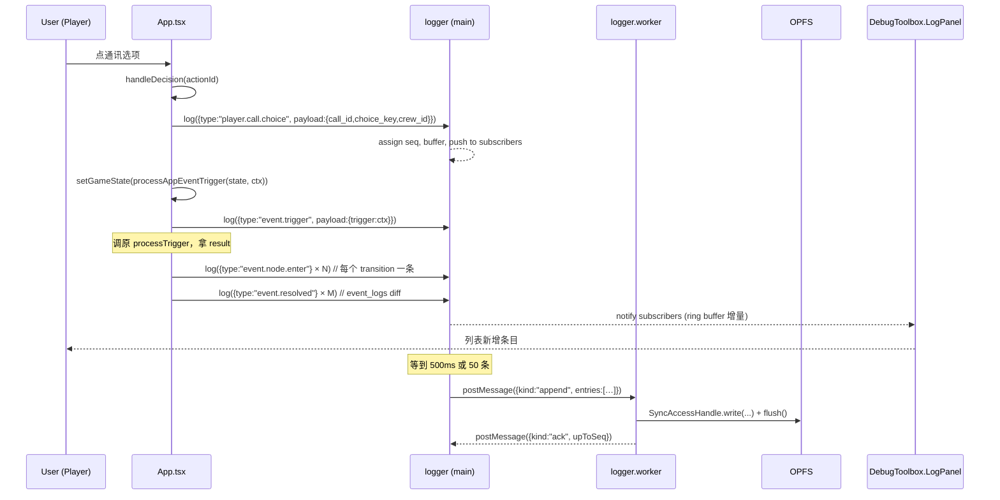
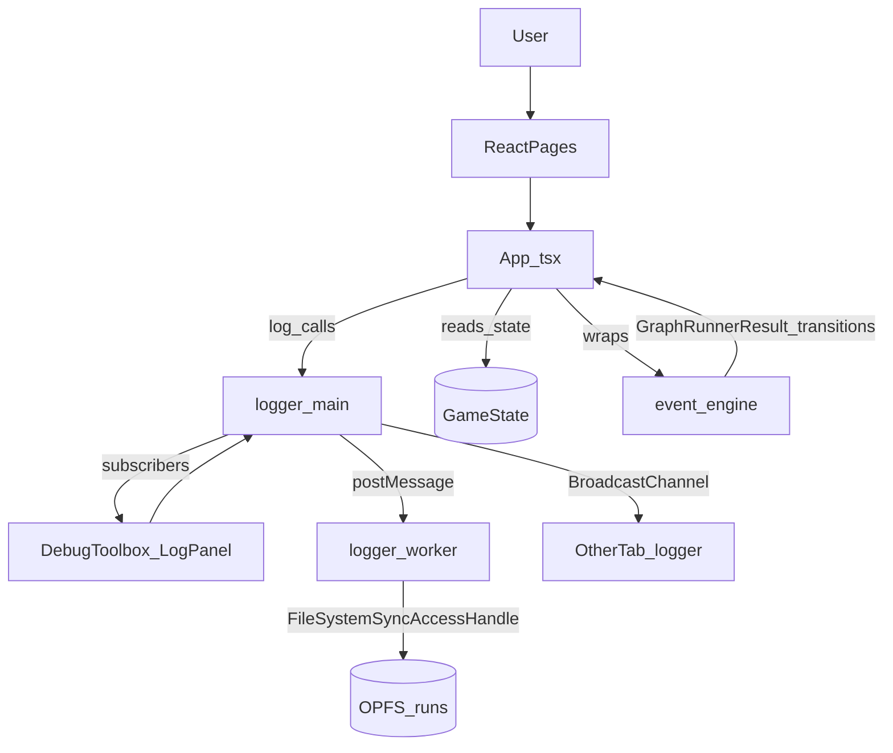

## 技术设计

### 0. 开发背景与现有约束（探索结论）

本节用于把 design doc 中的"打算做什么"落到当前代码库的"在哪里改 / 不能动什么"。所有路径均相对仓库根。

#### 0.1 项目运行环境

- **客户端**：`apps/pc-client/`，React 19 + Vite 8 + TypeScript 6（[apps/pc-client/package.json](apps/pc-client/package.json#L17-L38)）。无 Tauri / Electron 壳。
- **构建注入**：`apps/pc-client/vite.config.ts` 现有 `define: { global: "globalThis" }`，无 `__APP_VERSION__` 等版本字段（[apps/pc-client/vite.config.ts:5-10](apps/pc-client/vite.config.ts#L5-L10)）。
- **TypeScript lib**：当前为 `["DOM", "DOM.Iterable", "ES2020"]`，**未启用 `WebWorker`**（[apps/pc-client/tsconfig.json:5](apps/pc-client/tsconfig.json#L5)）— Worker 文件需要单独 `tsconfig` 或在文件顶部 `/// <reference lib="webworker" />`。
- **测试**：vitest + jsdom，`include: ["src/**/*.test.{ts,tsx}"]`，setupFiles `./src/test/setup.ts`（[apps/pc-client/vite.config.ts:29-33](apps/pc-client/vite.config.ts#L29-L33)）。jsdom 没有 OPFS / Worker，需要自建 mock。
- **现有持久化**：`localStorage` key `stellar-frontier-save-v2`，整 `GameState` 覆盖写（[apps/pc-client/src/timeSystem.ts:35-63]）。日志**绝不能**寄生于此（5 MB 上限，design §C2）。

#### 0.2 关键 hook 点（已实证定位）

| Hook 用途 | 位置 | 关键事实 |
| --- | --- | --- |
| `system.run.start/end` | [apps/pc-client/src/App.tsx:120-128](apps/pc-client/src/App.tsx#L120-L128) `resetGame()` | `clearGameSaves()` 之前写 `run.end`、创建 freshState 后写 `run.start`。 |
| `player.call.choice` / `player.action.dispatch` 入口 | [apps/pc-client/src/App.tsx:161-260](apps/pc-client/src/App.tsx#L161-L260) `handleDecision()` | 五分支：事件选项（`currentCall.runtimeCallId`）/ `universal:move` / `universal:survey` / `universal:standby` / `universal:stop`。 |
| `player.move.target` 完成 | `confirmMoveTarget()` 附近（与 `selectedTargetTileId` 配对） | `universal:move` 只是进入"选择模式"，真正 `tile_id` 在确认时确定，需在确认点埋第二个 hook。 |
| `event.trigger` | [apps/pc-client/src/App.tsx:964-972](apps/pc-client/src/App.tsx#L964-L972) `processAppEventTrigger(state, context)` | 直接拿 `TriggerContext`。 |
| `event.node.enter` | `processTrigger()` 返回的 `EventEngineResult.graph_result.transitions` / `graph_results[].transitions`，每项为 `{ from_node_id, to_node_id }`（[apps/pc-client/src/events/graphRunner.ts:55-60](apps/pc-client/src/events/graphRunner.ts#L55-L60)） | **零侵入**：不需要改事件引擎签名。 |
| `event.resolved` | `event_logs: EventLog[]` 在 [apps/pc-client/src/events/effects.ts:1327-1331](apps/pc-client/src/events/effects.ts#L1327-L1331) `writeEventLog` effect 中 append；`EventLog.id` 由 effect 生成且唯一。 | 在 App 层对 `state.event_logs` 做 id 集合 diff 即可拿到本帧新增日志。 |
| `action.complete` | [apps/pc-client/src/App.tsx:668-743](apps/pc-client/src/App.tsx#L668-L743) `settleGameTime()` 内部多处 mutate `crew_actions`（move 完成 / `completeCrewActionState` / `failed/interrupted` 直接赋值） | **不挂逐点**：在 settleGameTime 整体 before/after 比较 `crew_actions[id].status`，对 `非终态→终态` 写一条。 |
| DebugToolbox | [apps/pc-client/src/pages/DebugToolbox.tsx](apps/pc-client/src/pages/DebugToolbox.tsx) | 已是 `<Modal>` + `<Panel>` 列表（时间倍率 / 重置存档），**没有 Tab 容器**。新增"游戏日志" Panel 与现有两 Panel 平级。 |

#### 0.3 现有事件信封 / 行动状态命名

- `TriggerContext` 字段：`trigger_type / occurred_at / source / crew_id / tile_id / action_id / payload / event_id / event_definition_id / call_id / selected_option_id`（[apps/pc-client/src/events/types.ts:28-50]）。`source` 可取 `"player_command" | "time_system" | "event_engine"` 等——本日志的 `source` 字段直接复用同一命名空间。
- `CrewActionStatus = "queued" | "active" | "paused" | "completed" | "failed" | "interrupted" | "cancelled"`；终态集合 = `{completed, failed, interrupted, cancelled}`。

---

### 1. 架构概览

#### 1.1 分层与组件职责

```
┌─────────────────────────────────────────────────────────────────────┐
│                        主线程 (Main Thread)                          │
│                                                                     │
│  ┌──────────┐   ┌────────────────┐   ┌──────────────────────────┐  │
│  │ React UI │──▶│  App.tsx       │   │ DebugToolbox             │  │
│  │ Pages    │   │  (orchestr.)   │   │  └─ LogPanel             │  │
│  └──────────┘   └─────┬──────────┘   └──────────┬───────────────┘  │
│                       │ logger.log(...)         │ subscribe / cmd   │
│                       ▼                         ▼                   │
│        ┌────────────────────────────────────────────────────┐       │
│        │          logger (主线程 facade)                     │       │
│        │  - 信封自动填充 (seq/version/run_id/timestamps)     │       │
│        │  - 内存 buffer (供 UI tail 与失败降级)              │       │
│        │  - 批量 flush (500 ms / 50 条)                       │       │
│        │  - Worker 通信 (postMessage)                         │       │
│        │  - 多 tab writer 选举 (BroadcastChannel)            │       │
│        └────────────────────┬───────────────────────────────┘       │
│                              │ structured-clone messages              │
└──────────────────────────────┼──────────────────────────────────────┘
                               ▼
┌─────────────────────────────────────────────────────────────────────┐
│                  Logger Worker (Web Worker)                          │
│                                                                     │
│  ┌────────────────────────────────────────────────────────┐         │
│  │  logger.worker.ts                                       │         │
│  │  - 持有 OPFS FileSystemSyncAccessHandle                 │         │
│  │  - 实现 append / flush / rotate / list / read / delete  │         │
│  │  - 维护 runs/<run_id>.jsonl 单 writer                   │         │
│  └────────────────────────────────────────────────────────┘         │
│                              │                                      │
│                              ▼                                      │
│        ┌──────────────────────────────────────┐                     │
│        │ OPFS (origin private file system)    │                     │
│        │ /runs/<run_id>.jsonl  × N (≤10)      │                     │
│        └──────────────────────────────────────┘                     │
└─────────────────────────────────────────────────────────────────────┘
```

**主线程 facade（`src/logger/index.ts`）**：
- 唯一对外 API：`logger.log({ type, source, payload })`、`logger.flush()`、`logger.rotate()`、`logger.subscribe(listener)`、`logger.listRuns()`、`logger.readRun(runId)`、`logger.deleteRun(runId)`、`logger.exportCurrent()`。
- 维护 `seq`（同 run 单调递增）、内存 ring buffer（默认 2000 条，UI tail 与失败降级共用）、订阅者集合。
- 不做 OPFS 直接操作 — 所有持久化通过 Worker。

**logger Worker（`src/logger/logger.worker.ts`）**：
- 启动时调用 `navigator.storage.getDirectory()` 拿到 root，创建/打开 `runs/`；feature detect 不通过则向主线程 postMessage 一条 `{ kind: "fatal", reason: "opfs_unavailable" }` 即退出。
- 单一职责：消息驱动；持有当前 run 文件的 `FileSystemSyncAccessHandle`（同步 API，性能好），按 `append(entries)` 把每个条目 `JSON.stringify(...) + "\n"` 拼为 `Uint8Array` 一次性写入末尾。
- 不做信封填充 / seq 分配 / 批量节流（这些都在主线程完成）— Worker 是无脑写盘机。

**DebugToolbox LogPanel（`src/pages/DebugToolbox/LogPanel.tsx` 新建）**：
- 订阅 `logger.subscribe()` 拿 ring buffer + 增量；展示模式分两个：`current`（实时 tail）/ `archive`（历史 run 只读查看）。
- 内部状态：过滤词（`type` 前缀字符串、`source` 下拉）、当前查看的 `viewingRunId`（默认 = 当前 run）、`runs` 列表。
- 调用 `logger.exportCurrent()` / `logger.readRun(id)` / `logger.deleteRun(id)`。

**App.tsx 中间件（不抽出新文件，仅在原位插入薄包装）**：
- `resetGame()` 前后 +2 行 logger 调用。
- `handleDecision()` 5 个分支入口处各 +1 行 logger 调用（参数已在分支内可见，不需要进一步重构）。
- `processAppEventTrigger()` / `processAppEventWakeups()` 包装：调原函数 → 把 result.transitions / result.events / state.event_logs diff 转成日志。
- `settleGameTime()` 包装：在主调用方（[App.tsx:84](apps/pc-client/src/App.tsx#L84)）做 before/after `crew_actions` diff。

#### 1.2 组件通信方式

- **主线程 → Worker**：`postMessage` 传送 `LogWorkerCommand`（discriminated union）。条目 `payload` 经过 `structuredClone`，所以**调用方放进 `payload` 的对象必须是 cloneable**（不能含函数 / 不可序列化对象）。
- **Worker → 主线程**：`postMessage` 传送 `LogWorkerEvent`，包括 `{ kind: "ready" }` / `{ kind: "fatal", reason }` / `{ kind: "ack", upToSeq }` / `{ kind: "runs", runs }` / `{ kind: "run_data", runId, bytes }`。
- **UI ⇄ logger facade**：`subscribe(listener)` + `unsubscribe`。listener 收到 `{ entries: LogEntry[] }`（含初始 ring buffer + 后续增量）。
- **多 tab 协调**：`BroadcastChannel("stellar-frontier-logger")`。Writer 选举用"先到先得 + 1 s heartbeat"（详见 §2 ADR-008）。

#### 1.3 关键数据流

**主旅程：玩家点选项 → 事件结算 → 日志落盘 → UI 看到**



**侧旅程：reset → 归档轮转 → 新 run**

```mermaid
sequenceDiagram
  participant App as App.tsx
  participant L as logger
  participant W as logger.worker
  participant O as OPFS

  App->>L: log({type:"system.run.end", payload:{reason:"reset"}})
  App->>L: flush() (await)
  L->>W: append + ack
  App->>L: rotate(newRunId)
  L->>W: postMessage({kind:"rotate", newRunId})
  W->>O: close current handle, list runs/, delete oldest if >10, create runs/<newRunId>.jsonl
  W-->>L: postMessage({kind:"ready", runId:newRunId})
  App->>App: clearGameSaves(); setGameState(freshState)
  App->>L: log({type:"system.run.start", payload:{game_version,schema_version}})
```

#### 1.4 组件图



---

### 2. 技术决策（ADR）

#### ADR-001: 日志载体选择 OPFS + Worker（拒绝 FSA / IndexedDB / 仅内存）

- **状态**：已决定
- **上下文**：interview Q2/Q3 用户明确选择"OPFS 文件 + 导出按钮"；design §8 给出对比表。需求是跨浏览器、零授权、append-only 文件、能导出原始 `.jsonl`。
- **选项**：
  - **A：OPFS + Worker Sync Access Handle**（选定） — 跨主流四浏览器 baseline；同步 API 性能好；零授权；不可见但可由 DebugToolbox 导出 / 列表管理。
  - B：FSA（`showSaveFilePicker`） — 仅 Chromium；每次会话需重新授权；底层 copy-swap 非真 append；用户可见但工程脆弱。
  - C：IndexedDB record + 导出拼 Blob — 跨浏览器；但每条日志走 structured clone、导出时还要把全表拉出拼字符串，违背"append-only 文件"语义。
  - D：仅内存 + 一次性下载 — 浏览器崩溃即丢全部，与"增量写入"硬需求矛盾。
- **决定**：A。理由：唯一同时满足 ① 跨主流浏览器 ② 零授权 ③ 真正 append ④ 导出即得 `.jsonl` 的方案。
- **后果**：必须引入一个 Web Worker（项目目前没有 Worker）；必须为 Worker 文件单独配 webworker lib；测试要 mock OPFS API。
- **参考**：[design doc §8](docs/plans/2026-05-01-02-44/global-game-log-design.md)、<https://developer.mozilla.org/en-US/docs/Web/API/FileSystemSyncAccessHandle>

#### ADR-002: 信封采用最小 8 字段

- **状态**：已决定
- **上下文**：interview Q6'。需要 schema 演进能力但不希望引入 CloudEvents 完整规范。
- **选项**：
  - A：最小信封（选定） — `seq / log_version / game_version / run_id / occurred_at_game_seconds / occurred_at_real_time / type / source / payload`（共 9 个，design 表述 8 个不含 `payload`）。调用方只填 `type / source / payload`。
  - B：极简三字段 `type + payload + time` — 上手最快但 upcaster 难补。
  - C：CloudEvents 完整规范 — 重型，本项目单机无收益。
- **决定**：A。
- **后果**：`logger.log()` 入参类型为 `{ type: string; source: LogSource; payload: unknown }`；其余字段在 facade 自动填充。`payload` 必须为 cloneable 对象（无函数 / DOM 节点）。
- **参考**：[design doc §9.LogEntry](docs/plans/2026-05-01-02-44/global-game-log-design.md)、<https://jsonlines.org/>、<https://github.com/cloudevents/spec/blob/main/cloudevents/spec.md>

#### ADR-003: 写入路径 = 主线程批量 + Worker 单 writer

- **状态**：已决定
- **上下文**：design §10.1.1、interview Q7（批量 flush 推荐 500ms / 50 条）。需要 ① 写入失败不阻塞主循环 ② 同 origin 多 tab 不互相覆盖 ③ 性能可接受。
- **选项**：
  - A：主线程 buffer + 定时 flush + Worker 单 writer（选定）。
  - B：每条立即 postMessage 给 Worker — 无 buffer，每次发一条；高频事件帧（settleGameTime 一秒可能十几条）下消息抖动明显。
  - C：纯主线程异步 OPFS（async API，不开 Worker）— 主线程 OPFS 是异步 promise；连续 `await` 会序列化但拖慢渲染帧；且 Worker 内 SyncAccessHandle 的同步 API 性能更好。
- **决定**：A。flush 触发条件：`buffer.length ≥ 50` 或距上次 flush ≥ 500 ms 或显式 `flush()` 或 `rotate()` 或 `beforeunload`。
- **后果**：崩溃时尾部最多丢失 ~500 ms 或 ~50 条（design §13 R6 已接受）。需要在 logger facade 维护 `pendingFlushTimer`、`bufferSinceLastAck`。
- **参考**：[design doc §13.R2](docs/plans/2026-05-01-02-44/global-game-log-design.md)

#### ADR-004: `event.node.enter` 通过 `GraphRunnerResult.transitions` 反推

- **状态**：已决定（OQ-2 决策）
- **上下文**：design 留下 OQ-2，问 hook 点是改事件引擎内部还是 App 层反推。探索发现 `GraphRunnerResult` 已经原生暴露 `transitions: Array<{ from_node_id: Id | null; to_node_id: Id }>`（[graphRunner.ts:55-60](apps/pc-client/src/events/graphRunner.ts#L55-L60)），且 `EventEngineResult` 把它一路向上传递（`graph_result` / `graph_results`）。
- **选项**：
  - A：在 App 层 `processAppEventTrigger()` 包装内读 `result.graph_result.transitions`（选定） — 零侵入、不改事件引擎签名、零运行时开销。
  - B：在 graphRunner 内加 `onNodeEnter` callback option — 需要修改 GraphRunnerOptions 与每个 event engine 调用方；callback 与纯函数模型相违。
  - C：本期不做 `event.node.enter`，仅记 trigger + resolved — 信息缺失，design §11.US-004 要求覆盖三类条目。
- **决定**：A。每次 `processAppEventTrigger` / `processAppEventWakeups` 返回后，遍历 `graph_result.transitions ?? []` 与 `graph_results?.flatMap(r => r.transitions) ?? []`，对每项写一条 `event.node.enter`，`payload = { event_id, from_node_id, to_node_id }`。
- **后果**：事件引擎保持纯函数；如未来 graphRunner 拆分或精简 `transitions` 字段，需要同步更新 logger（在 ADR-004 的"参考"位置加注释指向）。
- **参考**：[apps/pc-client/src/events/graphRunner.ts:55-60](apps/pc-client/src/events/graphRunner.ts#L55-L60)、design §14.OQ-2

#### ADR-005: `action.complete` 通过 `crew_actions` before/after diff 写入

- **状态**：已决定（OQ-3 决策）
- **上下文**：探索发现行动终态写入分散在 `completeCrewActionState`、`advanceCrewMoveAction` 内部、以及若干处 `{...action, status: "failed"|"interrupted"}` 直接赋值。逐点 hook 风险高且易遗漏。
- **选项**：
  - A：在 `settleGameTime()` 主调用方做 before/after diff（选定） — 一处 hook 覆盖全部终态；逻辑：对 `next.crew_actions` 中 `id`，若 `prev.crew_actions[id]` 状态非终态而 `next` 状态为终态，则写一条 `action.complete`，`payload = { crew_id, action_id, status, action_kind }`。
  - B：在每个 mutation 点 inline 调用 logger — 至少 3 处插入，未来新增行动类型容易漏写。
  - C：在自动存档 useEffect 里做 diff — 触发时机晚 1 帧，与"行动完成的瞬时事件"语义错位。
- **决定**：A。
- **后果**：需要把 `setGameState((state) => settleGameTime(...))` 形态改为 `setGameState((state) => { const next = settleGameTime(...); diffActions(state, next); return next; })`。`diffActions` 是同步纯遍历，不阻塞 setState。
- **参考**：[apps/pc-client/src/App.tsx:668-743](apps/pc-client/src/App.tsx#L668-L743)、design §14.OQ-3

#### ADR-006: `game_version` = `__APP_VERSION__`（构建时注入 package.json version）

- **状态**：已决定（OQ-1 决策）
- **上下文**：项目无正式 release 编号，需要为日志条目提供版本字段。
- **选项**：
  - A：vite `define` 注入 `package.json.version`（选定） — 简单稳定；不需要 git；与现有 `define: { global: "globalThis" }` 一致。
  - B：vite `define` 同时注入 git commit hash（通过 `child_process.execSync('git rev-parse --short HEAD')`） — 调试更精确但 CI 中无 git 时易失败；本期 `git_commit` 字段被 design §10.2 列为 Later。
  - C：运行时从 `package.json` import — Vite 支持 `import pkg from "../package.json"` 但增加运行时大小（不大但语义模糊）。
- **决定**：A。在 `vite.config.ts` 增加：`define: { __APP_VERSION__: JSON.stringify(pkg.version) }`，并在 `apps/pc-client/src/vite-env.d.ts` 声明 `declare const __APP_VERSION__: string`。logger 通过 `__APP_VERSION__` 拿到值。
- **后果**：`apps/pc-client/vite.config.ts` 与 `vite-env.d.ts` 各改一处；测试中默认无此 define，需在 `src/test/setup.ts` 用 `globalThis.__APP_VERSION__ = "0.0.0-test"` 注入。
- **参考**：design §14.OQ-1

#### ADR-007: DebugToolbox 接入 = 新增一个 Panel + Panel 内 mode 切换（不引入 Tab 容器）

- **状态**：已决定
- **上下文**：当前 DebugToolbox 是 `<Modal><Panel/><Panel/></Modal>` 结构，没有 Tab。design 用了"日志面板 tab"措辞。
- **选项**：
  - A：新增第三个 `<Panel title="游戏日志">`，Panel 内部用 segmented button 在"实时 tail / 历史 run"两 mode 之间切换（选定） — 与现有结构一致，最小变更。
  - B：在 DebugToolbox 顶部加 Tab 容器（基础工具 Tab / 日志 Tab） — 大幅重构，影响现有 Panel 视觉。
  - C：单独建 `<DebugLogPage>` 路由页面 — 与 design "DebugToolbox 内"措辞不符。
- **决定**：A。Panel 内布局：顶部一行（mode 切换 + `type`/`source` 过滤输入 + 导出按钮），中部虚拟滚动列表，OPFS 不可用时整个 Panel 顶部多一条红色 banner。
- **后果**：Panel 可能比其他两个高，DebugToolbox CSS 需要允许 Panel 自适应高度（已支持）。`LogPanel` 拆出独立组件文件以控制单文件复杂度。
- **参考**：[apps/pc-client/src/pages/DebugToolbox.tsx](apps/pc-client/src/pages/DebugToolbox.tsx)、design §10.1.4

#### ADR-008: 多 tab writer 选举 = BroadcastChannel + 先到先得 + 1 s heartbeat

- **状态**：已决定（OQ-4 决策）
- **上下文**：OPFS Sync Access Handle 在同一文件上不能并发；design §6.F5 与 §11.US-009 要求多 tab 单 writer。
- **选项**：
  - A：先到先得 + heartbeat（选定） — Tab 启动时 BroadcastChannel 广播 `claim`，等待 200 ms 看是否有他 tab 回 `held`；无 → 自己成为 writer，每秒广播 `held`；有 → 进入只读模式并监听他 tab 的心跳，超过 2.5 s 没听到则发起新 claim。
  - B：基于 `document.visibilityState` 让位 — UX 复杂、半夜切 Tab 可能让位失败。
  - C：用 `Web Locks API` `navigator.locks.request("logger", { mode: "exclusive" })` — 单 lock 长期持有跨浏览器行为有差异（部分浏览器在 Tab 暂存时 lock 会被释放）。
- **决定**：A。message schema：`{kind:"claim"|"held"|"yield", tabId, ts}`。only writer tab 真正向 Worker postMessage append；只读 tab 仍可在本地 ring buffer 看自己产生的日志（不写盘，不影响主 run 文件）。
- **后果**：facade 维护 `writerRole: "writer" | "reader" | "pending"` 状态，UI 显示 banner（design §11.US-009 验收点）。
- **参考**：design §14.OQ-4

#### ADR-009: `system.run.start` 不附 startSnapshot

- **状态**：已决定（OQ-5 决策）
- **上下文**：design §4 非目标 E 明确"不做完整 deterministic replay"；OQ-5 留作 implementation 阶段决定。
- **选项**：
  - A：不附 snapshot，仅 `{ game_version, schema_version }`（选定） — 与 §4 一致；payload 体积可控。
  - B：附 GameState 起始快照（数千字段、KB 量级）— 增加单条日志体积一两个数量级；与"不做 replay"非目标矛盾。
- **决定**：A。
- **后果**：未来若回头要做 replay，可在 `log_version` v2 里加 `startSnapshot` 字段，老归档照样能读（tolerant 解析）。

#### ADR-010: payload schema = TypeScript 类型 + 不在运行时校验

- **状态**：已决定
- **上下文**：design §13.R3 提到 tolerant 解析；写侧目前没有 schema 校验需求。
- **选项**：
  - A：写侧用 TS 类型保证，读侧 tolerant 解析（选定）— 零运行时开销。
  - B：用 `ajv` 做 JSON Schema 校验（项目已依赖 ajv）— 写侧每条日志多一次校验调用，无明显收益。
- **决定**：A。在 `src/logger/types.ts` 用 TS discriminated union 定义所有 `LogEntry` 子类型，写侧只允许通过型别正确的工厂函数构造（`logger.log(...)` 入参 `type` 与 `payload` 的关系由 union 类型约束）。
- **后果**：读侧（DebugToolbox）展示与导入 `.jsonl` 时按"type 已知 → 走类型分支；type 未知 → 通用展示并标注 unknown_type"处理。

---

### 3. 数据模型

#### 3.1 实体清单

##### LogEntry（持久化的核心对象）

```ts
// src/logger/types.ts
export type LogSource = "player_command" | "event_engine" | "time_loop" | "system";

export interface LogEntryEnvelope {
  seq: number;                        // 同 run 内单调递增，从 1
  log_version: number;                // 当前 1
  game_version: string;               // __APP_VERSION__
  run_id: string;                     // run-YYYY-MM-DD-HHMM-<rand>
  occurred_at_game_seconds: number;   // gameState.elapsedGameSeconds（system.run.start 取 0）
  occurred_at_real_time: string;      // ISO 8601 wall clock
  type: string;                       // 命名空间式
  source: LogSource;
}

export type LogEntry = LogEntryEnvelope & (
  | { type: "system.run.start"; source: "system"; payload: { game_version: string; schema_version: string } }
  | { type: "system.run.end"; source: "system"; payload: { reason: "reset" | "unload" } }
  | { type: "player.call.choice"; source: "player_command"; payload: { call_id: string; choice_key: string; crew_id: string | null } }
  | { type: "player.move.target"; source: "player_command"; payload: { crew_id: string; tile_id: string } }
  | { type: "player.action.dispatch"; source: "player_command"; payload: { crew_id: string; action_id: string; action_kind: string } }
  | { type: "event.trigger"; source: "event_engine"; payload: { trigger: TriggerContext } }
  | { type: "event.node.enter"; source: "event_engine"; payload: { event_id: string; from_node_id: string | null; to_node_id: string } }
  | { type: "event.resolved"; source: "event_engine"; payload: { event_log_id: string; event_id: string; event_definition_id: string; result_key: string | null; summary: string | null; importance: string } }
  | { type: "action.complete"; source: "time_loop"; payload: { crew_id: string; action_id: string; action_kind: string; status: "completed" | "interrupted" | "failed" | "cancelled" } }
);
```

主键：`(run_id, seq)` 在 `.jsonl` 文件名 + 行内 `seq` 隐式构成；不需要单独 id 字段。

##### RunArchive（OPFS 内运行时元信息，不持久化）

```ts
export interface RunArchive {
  run_id: string;
  created_at_real_time: string;
  updated_at_real_time: string;
  size_bytes: number;
  entry_count?: number;       // 可选；列表展示时按需扫文件统计
  is_current: boolean;        // 是否当前 writer 正在写入
}
```

存储：仅在 Worker 内由 `navigator.storage.getDirectory()` 列举得出，主线程缓存供 UI 用。

#### 3.2 关系

- `LogEntry` 1-N → `run_id`（一个 run 含多条 entry，`seq` 单调递增）。
- `RunArchive` 1-1 → 一个 OPFS 文件 `runs/<run_id>.jsonl`。

#### 3.3 存储方案

- **真相之源**：OPFS 文件 `runs/<run_id>.jsonl`（持久化）。
- **运行期热区**：主线程 ring buffer（默认 2000 条），仅供 UI tail + OPFS 不可用时降级。
- **派生**：`RunArchive` 列表由 Worker 扫 `runs/` 目录得出。
- **不入存档**：日志不写入 localStorage 的 `stellar-frontier-save-v2`（与 design §C2 一致）。

#### 3.4 OPFS 目录结构

```
<origin-private-fs>/
└── runs/
    ├── run-2026-05-01-0244-a3b9.jsonl
    ├── run-2026-05-01-0312-c7d1.jsonl
    └── …               # 至多 10 份
```

---

### 4. API/接口设计

#### 4.1 logger facade（主线程公共 API）

```ts
// src/logger/index.ts
export type LogInput<T extends LogEntry = LogEntry> =
  Pick<T, "type" | "source" | "payload">;

export interface LoggerFacade {
  log(input: LogInput): void;                        // fire-and-forget
  flush(): Promise<void>;                            // 等到 Worker ack
  rotate(reason: "reset"): Promise<string>;          // 轮转到新 run，返回 newRunId
  subscribe(listener: (delta: { entries: LogEntry[] }) => void): () => void; // 返回 unsubscribe
  getCurrentRunId(): string;
  getRingBufferSnapshot(): LogEntry[];
  listRuns(): Promise<RunArchive[]>;
  readRun(runId: string): Promise<Uint8Array>;       // 用于查看与导出
  deleteRun(runId: string): Promise<void>;           // 当前 run 不允许删
  exportCurrent(): Promise<void>;                    // 触发浏览器下载
  exportRun(runId: string): Promise<void>;           // 触发浏览器下载
  getStatus(): { mode: "ok" | "memory_only"; writerRole: "writer" | "reader" | "pending"; reason?: string };
}

export const logger: LoggerFacade;                   // 模块级单例
```

错误处理约定：
- `log()` 永不抛异常；任何内部错误（Worker 故障、buffer 满）记录到 console + 切换 `mode: "memory_only"`，UI 顶部 banner 显示。
- `flush()` / `rotate()` / `readRun()` / `deleteRun()` 在底层失败时 reject 一个 `LoggerError { code: "opfs_unavailable" | "run_not_found" | "writer_busy", message }`。
- 调用方（App.tsx 中间件）的 `log()` 永远不需要 try/catch；UI 调 `flush/rotate` 时需要 catch 并显示提示。

#### 4.2 Worker 协议

```ts
// src/logger/worker-protocol.ts
export type LogWorkerCommand =
  | { kind: "init"; runId: string }
  | { kind: "append"; entries: LogEntry[] }
  | { kind: "flush" }
  | { kind: "rotate"; newRunId: string }
  | { kind: "list_runs" }
  | { kind: "read_run"; runId: string }
  | { kind: "delete_run"; runId: string };

export type LogWorkerEvent =
  | { kind: "ready"; runId: string }
  | { kind: "fatal"; reason: "opfs_unavailable" | "init_failed"; detail?: string }
  | { kind: "ack"; upToSeq: number }
  | { kind: "runs"; runs: RunArchive[] }
  | { kind: "run_data"; runId: string; bytes: ArrayBuffer }
  | { kind: "error"; cmdKind: LogWorkerCommand["kind"]; reason: string };
```

约定：
- `init` 必须在主线程发任何 `append` 之前发；Worker 在拿到 OPFS handle 之后回 `ready`；ready 之前主线程仍可调 `log()`，所有条目堆在内存 buffer，等 ready 后一次性 `append`。
- `append` 的 `entries` 已经包含完整信封；Worker 仅把每个 entry `JSON.stringify` + `"\n"` 写入。
- `rotate` 内部：`flush` → `close` 旧 handle → `list runs/` → 删除最老（直到 ≤9 份）→ 创建 `runs/<newRunId>.jsonl` → 打开 SyncAccessHandle → 回 `ready`。
- `read_run` 返回完整 `ArrayBuffer`，主线程通过 `Blob` + `URL.createObjectURL` 触发下载。

#### 4.3 BroadcastChannel 协议

```ts
// src/logger/broadcast-protocol.ts
export type LoggerBroadcastMessage =
  | { kind: "claim"; tabId: string; ts: number }
  | { kind: "held"; tabId: string; ts: number }
  | { kind: "yield"; tabId: string; ts: number };

export const LOGGER_CHANNEL = "stellar-frontier-logger";
export const HEARTBEAT_INTERVAL_MS = 1000;
export const CLAIM_GRACE_MS = 200;
export const HOLDER_TIMEOUT_MS = 2500;
```

#### 4.4 中间件挂接点（App.tsx）

最小侵入伪码（仅示意，实现见 tasks）：

```ts
// resetGame() 改造
function resetGame() {
  logger.log({ type: "system.run.end", source: "system", payload: { reason: "reset" } });
  logger.flush()
    .then(() => logger.rotate("reset"))
    .finally(() => {
      clearGameSaves();
      const freshState = createInitialGameState();
      setGameState(freshState);
      // ...其余 setState
      logger.log({ type: "system.run.start", source: "system", payload: { game_version: __APP_VERSION__, schema_version: GAME_SAVE_SCHEMA_VERSION } });
    });
}

// handleDecision 各分支前一行 logger.log(...)（非 await）

// processAppEventTrigger 包装
function processAppEventTriggerWithLog(state, ctx) {
  logger.log({ type: "event.trigger", source: "event_engine", payload: { trigger: ctx } });
  const result = processTrigger({ state: toEventEngineState(state), index, context: ctx });
  for (const t of result.graph_result?.transitions ?? []) {
    logger.log({ type: "event.node.enter", source: "event_engine", payload: { event_id: result.event?.id ?? "", from_node_id: t.from_node_id, to_node_id: t.to_node_id } });
  }
  for (const r of result.graph_results ?? []) {
    for (const t of r.transitions) { /* 同上 */ }
  }
  const merged = mergeEventRuntimeState(state, result.state);
  diffEventLogsAndLog(state.event_logs, merged.event_logs);
  return merged;
}
```

---

### 5. 目录结构

```text
apps/pc-client/
├── src/
│   ├── logger/                        # 新增模块
│   │   ├── index.ts                   # facade（公共 API + 单例）
│   │   ├── types.ts                   # LogEntry / RunArchive / LogSource discriminated union
│   │   ├── worker-protocol.ts         # 主线程↔Worker 消息类型
│   │   ├── broadcast-protocol.ts      # 多 tab 选举消息类型与常量
│   │   ├── envelope.ts                # 信封自动填充工具（seq / run_id / timestamps）
│   │   ├── ringBuffer.ts              # 内存环形缓冲与订阅者
│   │   ├── writerElection.ts          # BroadcastChannel 选举状态机
│   │   ├── logger.worker.ts           # Web Worker 入口（OPFS 单 writer）
│   │   ├── opfsRunStore.ts            # Worker 内 OPFS 操作封装（list/create/delete/read/rotate）
│   │   ├── download.ts                # 浏览器 Blob 下载工具
│   │   └── __tests__/                 # 与生产代码同级
│   │       ├── envelope.test.ts
│   │       ├── ringBuffer.test.ts
│   │       ├── writerElection.test.ts
│   │       ├── opfsRunStore.test.ts   # 用 mock OPFS
│   │       ├── facade.test.ts         # 用 mock Worker
│   │       └── middleware.integration.test.tsx  # 接入 App.tsx 后的端到端
│   ├── pages/
│   │   ├── DebugToolbox.tsx           # 修改：插入 LogPanel
│   │   └── DebugToolbox/
│   │       ├── LogPanel.tsx           # 新增：日志面板（实时 tail + 历史 + 导出）
│   │       └── LogPanel.test.tsx
│   ├── App.tsx                        # 修改：reset / handleDecision / settleGameTime / processAppEventTrigger 中间件
│   ├── vite-env.d.ts                  # 修改：声明 __APP_VERSION__
│   └── test/
│       └── setup.ts                   # 修改：注入 __APP_VERSION__、mock OPFS / Worker / BroadcastChannel
├── vite.config.ts                     # 修改：define 注入 __APP_VERSION__
├── tsconfig.worker.json               # 新增：webworker lib 单独 tsconfig（仅 logger.worker.ts）
└── tsconfig.json                      # 修改：references 加 tsconfig.worker.json
```

测试文件组织：与生产代码同目录的 `__tests__/` 子目录；命名 `<file>.test.ts(x)`。集成测试用 `.integration.test.tsx` 后缀以便区分。

---

### 6. 编码约定

#### 6.1 命名规范

- 文件：`camelCase.ts`（与项目现状一致：`crewSystem.ts`、`timeSystem.ts`）。
- React 组件文件：`PascalCase.tsx`（与项目现状一致：`DebugToolbox.tsx`）。
- 测试：`<source>.test.ts(x)`、`<source>.integration.test.tsx`。
- 类型：`PascalCase`，discriminated union 的 tag 用 `kind`（与项目现有 `LogWorkerCommand` 风格一致）。
- 常量：`SCREAMING_SNAKE_CASE`（与项目 `GAME_SAVE_SCHEMA_VERSION` 一致）。
- 日志 `type` 字段命名空间：`<domain>.<entity>.<action>`，全小写、点号分隔。

#### 6.2 错误处理

- **写侧（log() 路径）**：永不抛；catch 一切 → 切 `mode: "memory_only"` + console.warn 一次（避免风暴）。
- **读侧（list/read/delete/export）**：返回 Promise，reject 时抛 `LoggerError`（`{ code, message, cause? }`）。UI 调用方 catch + 红色 toast。
- **Worker 致命错误**：`postMessage({kind:"fatal"})` 后主线程切只读模式，不再发 append；UI banner 显示。
- **BroadcastChannel 不可用**：fallback 为单 tab writer（即假定自己是唯一 tab），不阻塞功能。

#### 6.3 日志与可观测性

- 项目内部 console 输出：仅在三种情况输出 — ① OPFS 不可用首次降级（warn 一次） ② Worker 致命错误（error） ③ logger 内部 assertion 失败（error）。
- 不要在 `logger.log()` 路径里 console.log，避免与开发自己的 console 输出混杂。
- 敏感信息：本项目无用户隐私数据，但 `payload` 不要记录 `gameState` 全量（与 §4 非目标 E 一致）。

#### 6.4 测试策略

- **单测覆盖**：envelope（seq 单调、字段完整）、ringBuffer（淘汰策略 / 订阅）、writerElection（先到先得 / heartbeat 超时晋升）、opfsRunStore（list/rotate/delete）。
- **集成测试**：facade 接 mock Worker，测 `log → flush → ack`、`rotate → 旧 run end + 新 run start` 完整路径。
- **端到端**：在 App.tsx 渲染下做一次 player.call.choice 与 event.trigger，断言 ring buffer 有对应条目。
- **mock 策略**：
  - OPFS：自写 `MockFileSystemDirectoryHandle` + `MockSyncAccessHandle` 内存实现；放在 `src/test/mocks/opfs.ts`。
  - Worker：用 `MessageChannel` 模拟 worker（参考 web.dev pattern）；放在 `src/test/mocks/worker.ts`。
  - BroadcastChannel：jsdom 已支持 `BroadcastChannel`（v22+）；不支持时 fallback 为 noop EventTarget mock。

#### 6.5 质量门禁

- `npm run lint`（= `tsc --noEmit`）必须通过。
- `npm run test` 必须通过。
- 新增文件必须 100% TypeScript（无 `.js`）。
- 不引入新依赖（OPFS / Worker / BroadcastChannel 都是浏览器原生 API）。

---

### 7. 风险与缓解

- **R1：OPFS Sync Access Handle 在 Safari / Firefox 行为不一致**
  - **影响**：Worker 内部抛异常 → fatal 路径 → 整个日志降级为只在内存。
  - **缓解**：Worker 启动做一次 `try { open + write 一字节 + truncate(0) } catch {…}` 自检；失败立即上报 fatal；CI 只在 chromium 跑端到端，但单测对 OPFS 错误路径有覆盖。
- **R2：`event_logs` diff 漏写或重复**
  - **影响**：`event.resolved` 缺失或重复，导致历史归档不可信。
  - **缓解**：用 `EventLog.id` 集合做差集（`new Set(prev.map(e=>e.id))`）；禁止用数组长度判断；单测覆盖"前后等长但 id 不同"的边界。
- **R3：`settleGameTime` diff 把上一秒已完成的 action 重写**
  - **影响**：tick 之间 React state 闭包陈旧，diff 错位 → 同一 action 被记录多次。
  - **缓解**：`settleGameTime` 包装确保 `prev = state` 来自 `setGameState((state) => ...)` 入参；不要在外层闭包读 `gameState`。单测覆盖"两次连续 settleGameTime 同一个 completed action"。
- **R4：Worker 初始化期间 ring buffer 溢出**
  - **影响**：reset 瞬间触发的若干条日志可能丢（buffer 上限 2000 条理论够用，但若 Worker 初始化卡住几秒 + 用户狂点）。
  - **缓解**：buffer 上限提到 5000，超出时 console.warn 并丢最老（design 没有强一致性要求）；ready 之后 buffer 一次性 drain。
- **R5：导出大文件（>10 MB）阻塞主线程**
  - **影响**：`readRun` 返回大 ArrayBuffer 时 transferable 转移会卡顿。
  - **缓解**：postMessage 用 `transfer: [bytes]` 转移所有权；`Blob([bytes])` 直接生成下载，不经 `JSON.parse`；如单 run 真超 50 MB（design A2 估算 < 50 MB 是 10 份合计），在 R6 触发前一定先看到。
- **R6：BroadcastChannel 在某些浏览器 incognito 行为异常**
  - **影响**：writer 选举失败 → 双 writer 同时写文件 → 文件损坏。
  - **缓解**：feature detect `typeof BroadcastChannel === "function"`，不可用时 fallback 假定自己是 writer 但每次启动先尝试拿 OPFS handle，如果拿不到（已被他 tab 持有，浏览器会抛 NoModificationAllowed）就降级为只读。

---

### 附录：用户技术访谈记录

本次 implementation-planning 在 auto 模式下进行，用户已在初始 design 与 interview 阶段确认所有产品决策（见 [global-game-log-interview.md](docs/plans/2026-05-01-02-44/global-game-log-interview.md)）。

用户在本次 planning 启动时明确指示："没问题，不需要询问，请一路干到底"——授权 agent 自主完成 OQ-1..OQ-5 等所有未决问题的技术决策，决策与理由全部落到本文档的 ADR 章节（ADR-004 / ADR-005 / ADR-006 / ADR-008 / ADR-009 分别对应原 OQ-2 / OQ-3 / OQ-1 / OQ-4 / OQ-5）。

无逐题访谈记录。

---
