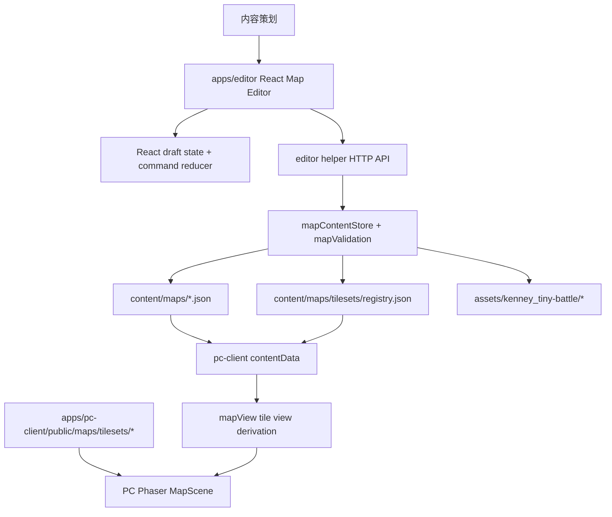

# 地图编辑器与素材库技术设计

## 技术设计

### 1. 架构概览

本轮实现把现有“只读 Event Editor shell”扩展成可切换的本地 Game Editor，并新增独立 Map Editor。Map Editor 是 content authoring tool：它读取 `content/maps/*.json`、`content/maps/tilesets/registry.json` 和 `assets/` 中的 tilesheet，在 React draft state 中完成新建地图、铺视觉层、编辑 gameplay tile、校验和保存。PC Phaser 地图只消费保存后的 JSON，不参与编辑器 authoring 状态。

#### 1.1 分层与组件职责

| 层 | 组件 / 文件范围 | 职责 | 不负责 |
| --- | --- | --- | --- |
| Content schema | `content/schemas/maps.schema.json`, `content/schemas/map-tilesets.schema.json` | 定义地图 gameplay 数据、visual layers、tileset registry 的持久化契约 | UI 状态、编辑器临时状态 |
| Content assets | `content/maps/*.json`, `content/maps/tilesets/registry.json`, `assets/kenney_tiny-battle/*`, `apps/pc-client/public/maps/tilesets/*` | 保存地图内容、tileset 元数据、源资产和 PC runtime 可访问的 public copy | 自动素材分类或导入 Tiled/LDtk |
| Validation | `apps/editor/helper/mapValidation.mjs`, `apps/pc-client/scripts/validate-content.mjs` | 校验 schema、引用、tile 覆盖、visual cell 边界、tileset id、tile index、objectIds | 自动修复内容 |
| Editor helper | `apps/editor/helper/server.mjs`, `apps/editor/helper/mapContentStore.mjs` | 通过 localhost API 读取地图库、校验 draft、保存 JSON、受限服务 `assets/` 图片 | 长期运行 server、鉴权、多用户协作 |
| Editor UI | `apps/editor/src/map-editor/*`, `apps/editor/src/App.tsx`, `apps/editor/src/styles.css` | React workbench、palette、brush/fill/eraser、图层面板、inspector、semantic brush、validation panel、dirty/history | 运行时 crew/action/event 状态 |
| PC runtime | `apps/pc-client/src/content/contentData.ts`, `apps/pc-client/src/phaser-map/*` | 读取 visual layers，在已发现 tile 上渲染 spritesheet，多层按 order/opacity 叠加；无视觉层时保留 terrain 色块 fallback | 地图文件选择、编辑器预览、authoring 工具 |

#### 1.2 组件通信方式

- Editor UI 通过 `fetch` 与 helper HTTP API 通信；helper 默认地址沿用 `http://127.0.0.1:4317`。
- Helper 通过文件系统读写仓库内受控路径。所有写入必须经过 path guard，只允许 `content/maps` 和 `content/maps/tilesets`。
- Editor preview 不从 DOM/canvas 反向导出 JSON；所有用户操作先转成 command，再修改 React reducer 中的 draft。
- PC runtime 静态导入 `content/maps/default-map.json` 和 `content/maps/tilesets/registry.json`。首版不做运行时地图选择，因此 PC 仍只显示 default map。
- Editor 图片预览通过 helper 的 asset endpoint 读取 `assets/` 源文件；PC Phaser 通过 Vite public path 读取 `apps/pc-client/public/maps/tilesets/...`。

#### 1.3 关键数据流

**打开已有地图**

1. Editor UI 调用 `GET /api/map-editor/library`。
2. Helper 读取 `content/maps/*.json`、tileset registry、map objects、schemas，并返回 library。
3. UI 选择地图文件，归一化成 `MapEditorDraft`，初始化图层、palette、selection、history。
4. 策划编辑 draft；validation 可在本地快速运行，也可调用 helper 做保存前 authoritative validation。

**新建并保存地图**

1. 策划输入 `id/name/rows/cols`。
2. UI 生成完整 `rows x cols` gameplay tiles：tile id 为 `${row}-${col}`，默认 `terrain=平原`、`weather=晴朗`、中性 environment，origin 为中心格，initial discovered 只包含 origin。
3. UI 生成空 `visual.layers`；策划手动新增图层并铺视觉 cell。
4. 保存时 UI 调用 `POST /api/map-editor/save`。
5. Helper 先执行 validation；失败不写文件，返回定位信息；成功则稳定格式化并写入 `content/maps/<id>.json` 或原文件。

**PC runtime 展示 visual layers**

1. `contentData.ts` 把 map JSON 中的 `visual.layers` 暴露为 `MapConfigDefinition.visual`。
2. `mapView.ts` 在构建 `PhaserMapTileView` 时，为已发现 tile 派生可渲染 sprite layers；未发现 / frontier tile 不暴露 sprites，避免泄露隐藏地图。
3. `MapScene.ts` preload registry spritesheet，渲染 visual sprites；若 tile 没有可见 sprite，则绘制原 terrain 色块。
4. crew marker、route、selection、area labels 保持现有 depth 和行为。

#### 1.4 组件图



### 2. 技术决策和选型（ADR）

#### ADR-001: Editor preview 使用 React/CSS grid，不引入 Phaser

- **状态**: 已决定
- **上下文**: `map-editor-ux-design.md` 要求 editor 是 authoring tool，且 React draft 是事实源。现有 PC `MapScene` 包含 crew、route、discovered state、tooltip、camera 等运行时逻辑，直接复用会污染编辑器边界。
- **选项**:
  - A: React/CSS grid + CSS sprite preview — 适合表单、图层、validation、undo/redo；大地图性能需验收。
  - B: 复用 PC Phaser `MapScene` — 运行时视觉一致，但会混入 runtime 状态，保存链路复杂。
  - C: 引入 Tiled/LDtk 作为编辑器依赖 — 工具成熟，但与本项目 JSON schema 和 helper 保存流程整合成本高。
- **决定**: 选择 A。Editor 的核心是内容编辑和保存闭环，React 更符合现有 `apps/editor` 模式。
- **后果**: 需要实现 CSS sprite positioning 和基本缩放；用 `16 x 12` 与 `30 x 17` 做手动性能验收。PC Phaser 只消费保存结果。
- **参考**: `research.md` 中 Tiled / LDtk 都采用 palette + brush + layer 的 authoring 模式；本设计保留这些交互，不复刻其运行时。

#### ADR-002: Visual layers 与 gameplay tile 默认分离

- **状态**: 已决定
- **上下文**: 策划访谈已选择“默认分离 + 可选 semantic brush”。普通视觉 brush 不应自动改 `terrain/weather/objectIds/specialStates`。
- **选项**:
  - A: 默认分离 + semantic brush — 安全，避免铺图时误改玩法；需要额外 overlay 检查一致性。
  - B: 强自动联动 — 效率高，但需要维护 tile 分类规则，错误会直接污染玩法数据。
  - C: 完全分离且无 semantic brush — 最安全，但策划要重复维护大量语义。
- **决定**: 选择 A。
- **后果**: 数据模型同时保留 `tiles[]` gameplay 数据和 `visual.layers[]`；UI 需要明确区分 visual brush 与 semantic brush；validation 不要求视觉 tile 与 terrain 自动一致。

#### ADR-003: Visual layer 持久化为 map JSON 顶层 `visual.layers`

- **状态**: 已决定
- **上下文**: 运行时最终消费 `content/maps/*.json`，而不是编辑器本地状态。当前 schema `additionalProperties=false`，必须显式扩展。
- **选项**:
  - A: 每个 map 内保存 `visual.layers[]` — 地图内容自包含，runtime 读取简单；每张地图可能重复图层结构。
  - B: 单独保存 `content/maps/visual/<mapId>.json` — gameplay JSON 小，但读写和校验需要跨文件合并。
  - C: 只保存 editor local storage — 实现快，但 runtime 无法消费，不满足目标。
- **决定**: 选择 A。
- **后果**: `content/schemas/maps.schema.json` 新增可选 `visual`；`validate-content` 和 helper validation 必须同时检查 visual cell 与 gameplay tile 的引用关系。

#### ADR-004: Visual layer cell 使用 tileId 字典

- **状态**: 已决定
- **上下文**: Brush、eraser、fill 都以单格 tile 为粒度，常见操作需要按 `tileId` 读取/覆盖/删除 cell。
- **选项**:
  - A: `cells: Record<tileId, VisualCell>` — 查改 O(1)，JSON diff 局部清晰；顺序由 map tiles 和 layer order 决定。
  - B: `cells: Array<{ tileId, ... }>` — 更接近列表，但查找、去重和覆盖都需要额外处理。
  - C: dense 二维数组 — 渲染快，但空层也占用大量 JSON，尺寸变化麻烦。
- **决定**: 选择 A。
- **后果**: Schema 使用 `propertyNames` 限制 tileId；validation 负责检查每个 key 是否存在于 `tiles[]`。

#### ADR-005: `locked` 与 `opacity` 保存，`solo` 不保存

- **状态**: 已决定
- **上下文**: UX 设计中 open questions 已倾向保存 `locked` 和 runtime 生效 `opacity`。`solo` 是临时检查视图，不是内容表达。
- **选项**:
  - A: 保存 `visible/locked/opacity`，不保存 `solo` — 保留 authoring 意图和 runtime 视觉效果，避免保存临时视图。
  - B: 只保存 `visible/opacity` — JSON 更少，但锁定底图等 authoring 意图丢失。
  - C: 全部保存 — 会把临时 solo 状态误带入协作和 runtime。
- **决定**: 选择 A。
- **后果**: Editor reducer 必须阻止修改 locked layer；PC runtime 应应用 `visible` 和 `opacity`，忽略 `locked`。

#### ADR-006: Kenney registry 分类先写入 tileset registry

- **状态**: 已决定
- **上下文**: Palette 需要基础分类、tile index、最近使用和搜索 index。若分类只存在 editor 代码中，runtime/helper 无法校验素材元数据。
- **选项**:
  - A: 把人工分类写入 `content/maps/tilesets/registry.json` — 内容自包含，可被 helper、editor、runtime 共享。
  - B: 分类写在 editor 内置 metadata — 实现局部，但 registry 不完整，未来多 tileset 迁移困难。
  - C: 不做分类，只显示完整 sheet — 最快，但不满足 UX 设计。
- **决定**: 选择 A。
- **后果**: 需要新增 registry schema；分类只用于 authoring 检索，不代表 gameplay 语义。

#### ADR-007: Helper 保存 API 负责 authoritative validation

- **状态**: 已决定
- **上下文**: Editor 本地校验可以提升体验，但真正写文件前必须由拥有文件系统权限的 helper 做最终校验。
- **选项**:
  - A: UI 本地轻校验 + helper authoritative validation — 体验好且保存安全；校验逻辑需要尽量共享或保持一致。
  - B: 只在 UI 校验 — 保存快，但 helper 可能写入坏文件。
  - C: 只在 helper 校验 — 逻辑集中，但 UI 反馈滞后。
- **决定**: 选择 A。
- **后果**: `mapValidation.mjs` 是 helper 写入前事实；UI 可以实现同构的轻校验函数，但保存结果以 helper 返回为准。

#### ADR-008: PC runtime 不暴露未发现 tile 的 visual sprites

- **状态**: 已决定
- **上下文**: 现有 runtime 对 frontier / unknown tile 使用灰色 fallback，以免泄露地形和区域名。Visual layer 如果无条件渲染，会把未探索地图视觉信息提前暴露。
- **选项**:
  - A: 只为 discovered tile 渲染 visual sprites — 保持现有探索边界；未发现 tile 继续灰色 fallback。
  - B: 所有 visible cells 都渲染 sprites — 最接近 editor Final Art，但破坏探索信息隐藏。
  - C: 根据 layer flag 决定是否隐藏 — 灵活但本轮范围过大。
- **决定**: 选择 A。
- **后果**: Editor Final Art 可看完整地图；PC runtime 仍遵守 `VisibleTileWindow` status。

### 3. 数据模型

#### 3.1 Map content

存储位置：`content/maps/*.json`。Source of truth：文件系统 JSON。

关键字段：

```ts
interface MapConfigDefinition {
  $schema?: string;
  id: string;
  name: string;
  version: number;
  size: { rows: number; cols: number };
  originTileId: string;
  initialDiscoveredTileIds: string[];
  tiles: MapTileDefinition[];
  visual?: MapVisualDefinition;
}
```

约束：

- `id` 必须符合现有 map id pattern。
- `tiles.length` 必须等于 `rows * cols`。
- 每个 tile id 必须等于 `${row}-${col}`。
- 每个坐标必须完整覆盖 `1..rows` 与 `1..cols`。
- `originTileId` 和 `initialDiscoveredTileIds` 必须引用已存在 tile，且 initial discovered 必须包含 origin。

#### 3.2 Gameplay tile

存储位置：`MapConfigDefinition.tiles[]`。

```ts
interface MapTileDefinition {
  id: string;
  row: number;
  col: number;
  areaName: string;
  terrain: string;
  weather: string;
  environment: MapEnvironmentDefinition;
  objectIds: string[];
  specialStates: MapSpecialStateDefinition[];
}
```

新建地图默认值：

- `areaName`: `区域 ${row}-${col}`
- `terrain`: `平原`
- `weather`: `晴朗`
- `environment`: `{ temperatureCelsius: 20, humidityPercent: 40, magneticFieldMicroTesla: 50, radiationLevel: "none", toxicityLevel: "none", atmosphericPressureKpa: 101 }`
- `originTileId`: 中心格，使用 `Math.ceil(rows / 2)` 和 `Math.ceil(cols / 2)`
- `initialDiscoveredTileIds`: `[originTileId]`

#### 3.3 Visual layers

存储位置：map JSON 顶层 `visual.layers[]`。

```ts
interface MapVisualDefinition {
  layers: MapVisualLayerDefinition[];
}

interface MapVisualLayerDefinition {
  id: string;
  name: string;
  visible: boolean;
  locked: boolean;
  opacity: number; // 0..1
  cells: Record<string, MapVisualCellDefinition>;
}

interface MapVisualCellDefinition {
  tilesetId: string;
  tileIndex: number; // 0-based
}
```

约束：

- 图层数组顺序即渲染顺序，先出现的在下方，后出现的在上方。
- `visible=false` 的图层不参与 editor Final Art 和 PC runtime 渲染。
- `locked=true` 阻止 editor 修改该 layer，但 PC runtime 忽略该字段。
- `opacity` 在 editor 和 runtime 都生效。
- `cells` key 必须是当前 map 中存在的 tile id。
- `tileIndex` 必须在对应 tileset 的 `[0, tileCount - 1]` 范围内。
- `solo` 是 editor state，不写入 JSON。

#### 3.4 Tileset registry

存储位置：`content/maps/tilesets/registry.json`。新增 schema：`content/schemas/map-tilesets.schema.json`。

```ts
interface TilesetRegistry {
  tilesets: TilesetDefinition[];
}

interface TilesetDefinition {
  id: string;
  name: string;
  assetPath: string;       // repository path under assets/
  publicPath: string;      // browser path under apps/pc-client/public
  tileWidth: number;
  tileHeight: number;
  spacing: number;
  margin: number;
  columns: number;
  tileCount: number;
  imageWidth: number;
  imageHeight: number;
  categories: TilesetCategory[];
  license?: { name: string; path: string };
}

interface TilesetCategory {
  id: "terrain" | "water" | "road" | "building" | "nature" | "vehicle_unit" | "marker" | "shadow" | "misc";
  name: string;
  tileIndexes: number[];
}
```

首个 registry entry 使用 Kenney Tiny Battle 的 packed spritesheet：

- `id`: `kenney-tiny-battle`
- `assetPath`: `assets/kenney_tiny-battle/Tilemap/tilemap_packed.png`
- `publicPath`: `maps/tilesets/kenney-tiny-battle/tilemap_packed.png`
- `tileWidth`: `16`
- `tileHeight`: `16`
- `spacing`: `0`
- `columns`: `18`
- `tileCount`: `198`
- `imageWidth`: `288`
- `imageHeight`: `176`

#### 3.5 Editor-only state

Editor state 不保存到 content JSON：

```ts
interface MapEditorState {
  library: MapEditorLibrary | null;
  activeFilePath: string | null;
  original: MapConfigDefinition | null;
  draft: MapConfigDefinition | null;
  selectedTileId: string | null;
  activeLayerId: string | null;
  selectedTool: "select" | "brush" | "eraser" | "bucket_fill" | "rectangle_fill" | "eyedropper" | "semantic_brush";
  selectedBrush: { tilesetId: string; tileIndex: number } | null;
  semanticBrush: SemanticBrushPreset;
  previewMode: "final_art" | "gameplay_overlay" | "layer_solo";
  soloLayerId: string | null;
  recentTiles: Array<{ tilesetId: string; tileIndex: number }>;
  validationIssues: MapValidationIssue[];
  history: { past: MapConfigDefinition[]; future: MapConfigDefinition[] };
  dirty: boolean;
  saving: boolean;
}
```

History 可使用 draft snapshot，限制最多 100 步。MVP 地图规模以几十到数百格为主，snapshot 成本可接受。

### 4. API/接口设计

#### 4.1 `GET /api/map-editor/library`

用途：加载地图、tileset registry、map objects、schemas。

响应：

```ts
interface MapEditorLibraryResponse {
  maps: Array<{
    id: string;
    file_path: string;
    data: MapConfigDefinition;
  }>;
  tileset_registry: TilesetRegistry;
  map_objects: Array<{ id: string; name: string; kind: string; visibility: string }>;
  schemas: Record<string, unknown>;
}
```

错误：

- `500 internal_error`: JSON 读取失败或 schema 文件缺失。

#### 4.2 `POST /api/map-editor/validate`

用途：保存前或手动触发 authoritative validation。

请求：

```ts
interface ValidateMapRequest {
  file_path?: string;
  data: MapConfigDefinition;
}
```

响应：

```ts
interface ValidateMapResponse {
  valid: boolean;
  errors: MapValidationIssue[];
  warnings: MapValidationIssue[];
}
```

`MapValidationIssue`：

```ts
interface MapValidationIssue {
  severity: "error" | "warning";
  code: string;
  message: string;
  target?: {
    kind: "map" | "tile" | "layer" | "cell" | "tileset";
    tileId?: string;
    layerId?: string;
    tilesetId?: string;
    field?: string;
  };
}
```

#### 4.3 `POST /api/map-editor/save`

用途：校验并写入 map JSON。校验失败不写文件。

请求：

```ts
interface SaveMapRequest {
  file_path?: string;
  data: MapConfigDefinition;
  overwrite?: boolean;
}
```

规则：

- `file_path` 存在时，只能位于 `content/maps`，且用于更新现有地图。
- `file_path` 不存在时，helper 根据 `data.id` 生成 `content/maps/<id>.json`。
- 如果目标文件已存在且不是当前打开文件，默认拒绝，除非 `overwrite=true`。
- 写入前执行 schema 和引用校验。

响应：

```ts
interface SaveMapResponse {
  saved: boolean;
  file_path?: string;
  errors?: MapValidationIssue[];
  warnings?: MapValidationIssue[];
}
```

错误：

- `400 invalid_json`: 请求 body 无法解析。
- `400 validation_failed`: 校验失败，body 附带 issues。
- `409 file_exists`: 新建地图目标文件已存在。
- `403 path_not_allowed`: path guard 拒绝。

#### 4.4 `GET /api/map-editor/assets?path=<repo-relative-path>`

用途：让 editor preview 读取 `assets/` 中的源图片。

规则：

- 只允许读取 `assets/` 下的文件。
- 只服务 `.png` 文件。
- 根据扩展名返回 `image/png`。
- 找不到文件返回 `404 asset_not_found`。

#### 4.5 CORS 与 HTTP 方法

Helper 需要支持：

- `GET /api/health`
- `GET /api/event-editor/library`
- `GET /api/map-editor/library`
- `GET /api/map-editor/assets`
- `POST /api/map-editor/validate`
- `POST /api/map-editor/save`
- `OPTIONS` preflight

非支持方法返回 `405 method_not_allowed`。

### 5. 目录结构

新增 / 修改的主要结构：

```text
content/
  maps/
    default-map.json                  # 可选增加 visual layers，但首版不强制
    tilesets/
      registry.json                   # Kenney tileset metadata
  schemas/
    maps.schema.json                  # 新增 visual model
    map-tilesets.schema.json          # 新增 tileset registry schema

apps/editor/
  helper/
    mapContentStore.mjs               # map library load / validate / save / asset read
    mapValidation.mjs                 # schema + cross-reference validation
    mapContentStore.test.mjs
    mapValidation.test.mjs
    server.mjs                        # 新增 map editor routes 和 POST body parser
    server.test.mjs
  src/
    App.tsx                           # 顶部导航可切换 Event / Map
    map-editor/
      MapEditorPage.tsx               # map editor workbench shell
      MapFilePanel.tsx                # 文件列表 + New Map
      LayerPanel.tsx                  # visual layers
      TilePalette.tsx                 # tileset palette
      MapGrid.tsx                     # CSS grid preview and pointer commands
      TileInspector.tsx               # single tile gameplay fields
      SemanticBrushPanel.tsx          # semantic brush controls
      ValidationPanel.tsx             # issues and jump targets
      Toolbar.tsx                     # tools, preview modes, undo/redo, save
      apiClient.ts                    # helper client
      mapEditorModel.ts               # draft creation, tile helpers, validation adapters
      mapEditorReducer.ts             # command reducer + history
      visualLayerOps.ts               # brush / eraser / fill / rectangle / eyedropper pure ops
      types.ts
      *.test.ts(x)

apps/pc-client/
  public/maps/tilesets/
    kenney-tiny-battle/tilemap_packed.png
  src/content/
    contentData.ts                    # MapConfigDefinition.visual + registry typing
  src/phaser-map/
    mapView.ts                        # derive visual sprite layers
    MapScene.ts                       # preload spritesheet and render sprites
    *.test.ts
```

测试组织沿用现状：editor 使用 Vitest + Testing Library，helper 测试放在 `apps/editor/helper/*.test.mjs`，PC runtime 测试放在 `apps/pc-client/src/**/*.test.ts(x)`。

### 6. 编码约定

- **命名规范**
  - JSON 字段沿用 content 风格：`snake_case` 仅用于现有 runtime/action 字段；地图 schema 现有字段为 camelCase，新增 visual 字段也使用 camelCase。
  - Editor TS 文件使用 PascalCase component、camelCase 函数，command type 使用小写 snake string，例如 `"paint_visual_cell"`。
  - Layer id 和 tileset id 使用 schema id pattern：小写字母开头，允许数字、`_`、`-`。

- **错误处理**
  - Helper API 统一返回 `{ error: { code, message } }`；validation 失败返回 `errors/warnings`。
  - 保存失败不得覆盖文件；UI 必须保留当前 draft 和 dirty state。
  - Path guard 错误转换为 `path_not_allowed`，不要把绝对路径暴露给 UI。

- **日志与可观测性**
  - Helper 只记录启动地址和保存成功的 repo-relative path。
  - 不打印完整 JSON body，避免日志过大。
  - UI 显示 helper unavailable 时沿用 `npm run editor:helper` 提示。

- **测试策略**
  - `mapValidation` 覆盖 schema、tile 覆盖、objectIds、visual cell tileId、tileset id、tileIndex、duplicate layer id。
  - `visualLayerOps` 覆盖 brush、eraser、bucket fill、rectangle fill、locked layer no-op、eyedropper。
  - UI tests 覆盖 new map、layer controls、palette selection、普通 brush 不改 gameplay、semantic brush 改 gameplay、save validation errors。
  - PC tests 覆盖 discovered tile sprites、unknown tile 不暴露 sprites、多层 order/opacity、terrain fallback。

- **质量门禁**
  - 修改 `content/` 后运行 `npm run validate:content`。
  - 修改 `apps/editor/src` 或 `apps/editor/helper` 后运行 `npm run editor:test`、`npm run lint`、`npm run test`。
  - 修改 `apps/pc-client/src` 后运行 `npm run lint`、`npm run test`。

### 7. 风险与缓解（技术层面）

- **R1: Editor CSS grid 在较大地图上卡顿**
  - **影响**: brush 拖动绘制延迟，影响策划体验。
  - **缓解**: MVP 手动验收 `16 x 12` 和 `30 x 17`；pointer drag 只在 tile id 变化时 dispatch；history 对连续 drag 可以合并为单次 command。若仍卡顿，再做 viewport virtualization 或 canvas preview。

- **R2: Helper save 写坏内容文件**
  - **影响**: runtime 读取失败或内容丢失。
  - **缓解**: 保存前 authoritative validation；path guard；写入失败不覆盖；稳定 JSON 格式；保存测试使用临时 repo root。

- **R3: Editor preview 与 PC Phaser 视觉不一致**
  - **影响**: 策划在 editor 看到的地图与游戏内不同。
  - **缓解**: 共享 registry 字段、tile index、layer order、opacity 规则；PC 使用 packed spritesheet；手动验收 editor 保存后 PC 地图。

- **R4: Visual layer 泄露未探索地图**
  - **影响**: 游戏地图页提前暴露未发现区域。
  - **缓解**: `mapView` 只为 discovered tile 派生 sprite layers；unknown/frontier 保留现有灰色 fallback；补单测。

- **R5: Tileset registry 分类与实际素材不匹配**
  - **影响**: Palette 搜索和分类误导策划。
  - **缓解**: 分类仅作为 authoring aid，不绑定 gameplay；tile index 和 enlarged preview 始终可见；后续 demo 后再修分类。

- **R6: 新建多地图与当前 runtime 只读 default map 的边界混淆**
  - **影响**: 策划以为保存新 map 后游戏自动切换。
  - **缓解**: Editor 支持新建和保存多地图；PC runtime 首版只消费 `default-map.json`，不做地图选择；implementation plan 明确该非目标。

### 附录：用户技术访谈记录

本轮没有新增阻塞性技术问题需要再询问用户。由于当前处于 Default mode，交互式 question tool 不可用；本技术设计基于已批准的 `map-editor-ux-design.md`、访谈记录和代码库探索做了以下保守技术落点：

- 采用完整 technical design 模式，因为实现跨越 content schema、helper API、editor UI、PC Phaser runtime 和验证脚本。
- `locked` 保存进 map JSON，`solo` 不保存。
- `opacity` 在 editor 和 PC runtime 都生效。
- Kenney tile 基础分类写入 tileset registry，而不是只写 editor 内置 metadata。
- 新建地图默认 `areaName` 使用 `区域 row-col`，默认 environment 使用中性模板。
- 不新增 demo map 文件；测试和手动验收通过 editor 新建地图覆盖该路径。
