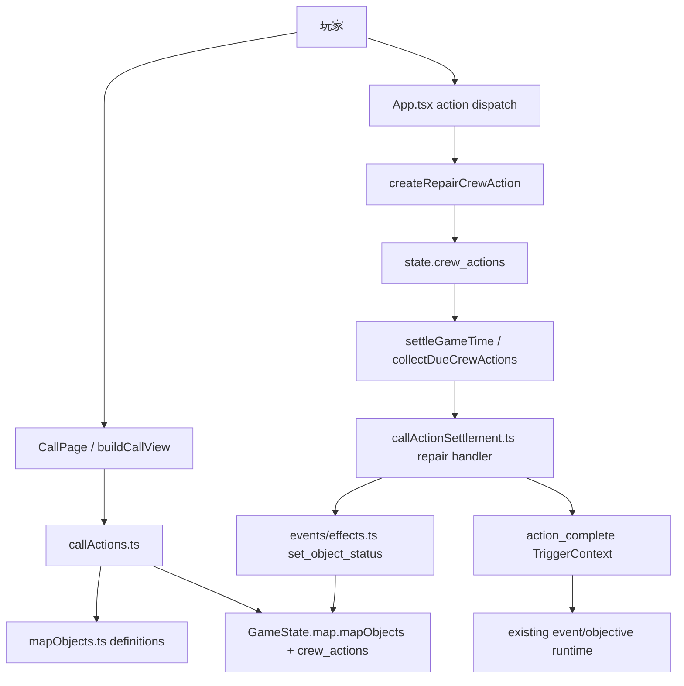

# IAFS 坠毁点开局骨架技术设计

## 技术设计

### 1. 架构概览

本轮实现目标是在现有 PC 权威状态模型上，为 `4-4` 坠毁点接入一条最小但完整的“对象维修”闭环：地图内容声明坠毁点与封锁圈，对象内容声明三个损坏设施与其维修 action，通话页继续走现有对象 action 展示管线，但在提交时对 `repair` 走一条新的“本地 timed crew action”分支，而不是立即触发事件。维修完成后由现有 crew action 结算循环统一收口，成功时复用现有 `set_object_status` 写回对象状态，随后再发出 `action_complete` trigger，为后续接剧情、目标系统、事件系统预留扩展点。

#### 1.1 分层与组件职责

| 层 | 组件 / 文件范围 | 职责 | 不负责 |
| --- | --- | --- | --- |
| Content map | `content/maps/default-map.json`, `content/schemas/maps.schema.json` | 声明 `4-4` 坠毁点、三类对象挂载、周围封锁圈地块 | 运行时锁定状态、维修判定 |
| Content object/action | `content/map-objects/*.json`, `content/schemas/map-objects.schema.json` | 声明对象初始状态、维修 action、timed repair 配置、成功/失败 effect | 直接改 runtime 状态 |
| Content loader | `apps/pc-client/src/content/mapObjects.ts` | 读取 map object 定义并暴露 typed index | 提交 action、处理计时 |
| Call view assembly | `apps/pc-client/src/callActions.ts`, `apps/pc-client/src/conditions/callActionContext.ts` | 继续构建“基础行动 + 对象 action”视图；叠加对象锁定可见性与禁用原因 | 实际创建 crew action |
| Dispatch orchestration | `apps/pc-client/src/App.tsx` | 区分“立即事件型对象 action”和“本地 timed repair action”；创建 repair crew action；维持当前 call page result/log 流程 | 维修结算细节 |
| Runtime action settlement | `apps/pc-client/src/callActionSettlement.ts` | 为 `repair` 新增结算 handler；计算成功率；应用 success/failure effects；生成 log 与 trigger context | 决定 UI 展示 |
| Shared runtime model | `apps/pc-client/src/events/types.ts`, `apps/pc-client/src/data/gameData.ts` | 扩展 `CrewActionType` / `ActionType` / active action bridge，使 repair 成为正式 crew action | 设计规则本身 |
| Existing event/effect system | `apps/pc-client/src/events/conditions.ts`, `apps/pc-client/src/events/effects.ts` | 复用 `object_status_equals` 和 `set_object_status`，让 repaired/damaged 继续走同一数据契约 | 为 repair 引入完整通用公式 DSL |

#### 1.2 组件通信方式

- 地图与对象仍通过静态 JSON + Vite eager import 进入运行时。
- 通话页继续通过 `buildCallView()` 读取对象定义、对象状态、crew action 状态来构建按钮。
- 玩家点击维修按钮后，`App.tsx` 不再统一走 `triggerLocationStoryAction()`，而是先识别该 action 是否带有 `local_action.kind = "timed_repair"`。
- 若是 timed repair，则 `App.tsx` 直接写入 `state.crew_actions` 一条 `type: "repair"` 的 active crew action，并同步更新本轮通话结果文本。
- 游戏主循环现有 `collectDueCrewActions()` / `settleCrewActionState()` 在 action 到期时调用 `callActionSettlement.ts` 的 repair handler。
- repair handler 结算成功率后，复用 `events/effects.ts` 的 `set_object_status` 改写 `state.map.mapObjects[objectId].status_enum`。
- 结算完成后统一发出 `trigger_type: "action_complete"`，让未来对象修复后的剧情、objective、后续事件都可以继续挂在原有 trigger 机制上。

#### 1.3 关键数据流

**场景 A：进入通话并看到维修入口**

1. `default-map.json` 的 `4-4` 携带三个 `objectIds`。
2. `mapObjects.ts` 载入三个对象定义，它们初始状态均为 `damaged`。
3. `callActions.ts` 读取当前 tile 的对象 action。
4. `callActionContext.ts` 把 `state.map.mapObjects` 暴露给 `object_status_equals`。
5. action 条件检查 `status_enum === damaged` 时显示“维修”。
6. `callActions.ts` 额外检查 `state.crew_actions` 中是否已有其他 crew 对同一 `object_id` 的 active `repair` action。
7. 若锁定中，则按钮保留但置灰，并显示“该对象正由其他队员维修”。

**场景 B：玩家发起维修**

1. 玩家在 `CallPage` 选择某对象的“维修”。
2. `App.tsx` 识别该 action 为 `local_action.kind = "timed_repair"`。
3. `App.tsx` 二次校验对象未锁定、状态仍为 `damaged`、当前 crew 可发令。
4. 通过 `createRepairCrewAction(...)` 生成一条 `CrewActionState`。
5. 该 action 写入 `state.crew_actions`，`type = "repair"`，`status = "active"`，`action_params` 中带 `object_id`、维修公式参数、success/failure effects。
6. crew 的 runtime / activeAction bridge 使 UI 立刻进入“正在维修”状态。

**场景 C：维修到时结算**

1. 游戏时间推进，`collectDueCrewActions()` 找到到期的 `repair` action。
2. `settleCrewActionState()` 把该 action 交给 `callActionSettlement.ts`。
3. repair settlement 读取队员 `attributes.agility` 与 action 参数中的 `base/ratio/bias/difficulty/min/max`。
4. 计算 `successRate = clamp(min, max, base + agility * ratio + bias - difficulty)`。
5. 抽样成功则执行 `success_effects`，最小 MVP 只需要 `set_object_status -> repaired`；失败则执行空的 `failure_effects`。
6. 结算 log 写入系统日志；crew 状态改回待命。
7. 构造 `action_complete` trigger，payload 至少带 `action_type: "repair"`、`object_id`、`repair_result`、对象 tags。
8. 后续 event/objective 如有需要，可通过该 trigger 继续扩展；MVP 中不必立即消费。

#### 1.4 组件图



### 2. 技术决策和选型（ADR）

#### ADR-001: 维修 action 采用“本地 timed crew action”，不走“立即事件”也不扩展完整事件等待节点

- **状态**: 已决定
- **上下文**: 当前对象 action 在 `App.tsx` 中默认通过 `triggerLocationStoryAction()` 立即产生 `action_complete` 型 trigger，再交给事件系统即时处理。设计要求维修必须消耗固定时间，并在结束时才结算成功率与对象状态。
- **选项 A**: 保持现有立即事件模型，在事件里直接判定成功/失败。优点是少改 action dispatch。缺点是无法表达“维修中占用对象”和真实的时间流逝。
- **选项 B**: 为 repair 新增本地 timed crew action，在 crew action 到期时结算。优点是完全贴合现有 `crew_actions` 主循环，天然支持对象锁定和时间消耗。缺点是要给对象 action 增加一条非事件型分支。
- **选项 C**: 直接把事件系统扩成支持 timed repair node。优点是长期统一。缺点是本轮范围远大于 MVP，且与设计文档明确的“最小专用实现”相违背。
- **决定**: 选择选项 B。
- **后果**: `App.tsx` 需要从“所有对象 action 都是立即事件”转为“事件型 action + 本地 timed action”双分支；测试也必须覆盖 dispatch 与 due settlement 两段链路。
- **参考**: `iafs-crash-site-bootstrap-design.md` 第 5.5、6 节；`App.tsx` 现有 `triggerLocationStoryAction()` 路径。

#### ADR-002: timed repair 配置挂在对象 action 上，使用新的 `local_action` 契约，而不是硬编码 objectId / actionId

- **状态**: 已决定
- **上下文**: 维修需要时长、公式参数、结算 effect。现有 `ActionDef` 只有 `event_id`，不足以承载本地 timed action 元数据。
- **选项 A**: 在 `App.tsx` / `callActionSettlement.ts` 中按 `objectId === "generator"` 之类硬编码配置。优点是改动最少。缺点是 content 不再是事实源，后续加第四个对象会继续堆分支。
- **选项 B**: 在 `ActionDef` 上新增 `local_action`，声明 `kind`、`duration_seconds`、`success_check`、`success_effects`、`failure_effects`。优点是 repair 仍是内容驱动；运行时只解释契约。缺点是需要扩 schema 和 loader type。
- **选项 C**: 在对象根节点新增 `repair_config`，由 actionId 约定映射。优点是比硬编码好。缺点是 action 与执行元数据分散，未来一个对象多种 timed action 时会很快变形。
- **决定**: 选择选项 B。
- **后果**: `content/schemas/map-objects.schema.json` 与 `apps/pc-client/src/content/mapObjects.ts` 需要扩展类型；`event_id` 对 timed repair action 不再必填，但事件型 action 仍必填。
- **参考**: `content/schemas/map-objects.schema.json` 当前只支持 `event_id`；设计要求“每个维修对象后续可独立配置参数”。

#### ADR-003: 对象锁定直接从 active `crew_actions` 推导，不引入新的 `objectLocks` runtime 表

- **状态**: 已决定
- **上下文**: 设计要求同一对象同时只允许一名队员维修，且用户明确要求“use active crew_actions as the source of truth for object lock”。
- **选项 A**: 新增 `map.objectLocks` 或 `world_flags` 记录锁。优点是查询快。缺点是双写，最容易出现 action 已结束但锁未释放。
- **选项 B**: 每次从 `state.crew_actions` 派生：查找 `status === "active"` 且 `type === "repair"` 且 `action_params.object_id === targetObjectId` 的 action。优点是单一事实源，无需释放逻辑。缺点是每次视图构建都要扫描 action 集合。
- **选项 C**: 在 `map.mapObjects[objectId]` 上写 `locked_by_crew_id`。优点是对象上下文集中。缺点是仍然是重复状态，且需要额外清理。
- **决定**: 选择选项 B。
- **后果**: `callActions.ts` 和 `App.tsx` 都要复用同一个 helper 做锁检查；UI 展示与真正 dispatch 前都必须做二次校验，避免竞态。
- **参考**: 用户附加约束；现有 `crew_actions` 已是 timed action 主事实源。

#### ADR-004: 对象状态写回复用 `set_object_status`，repair 结算后再统一发 `action_complete`

- **状态**: 已决定
- **上下文**: 现有运行时已有 `object_status_equals` 条件与 `set_object_status` effect，设计要求“Object status conditions/effects already exist and should be reused”。
- **选项 A**: repair settlement 手写 `map.mapObjects[objectId].status_enum = "repaired"`。优点是简单。缺点是绕过了现有效果执行路径，未来 success effect 扩展会分叉。
- **选项 B**: repair settlement 直接执行 `success_effects` / `failure_effects`，最小 success effect 就是 `set_object_status`。优点是复用既有 effect 契约，并可自然扩展其他写回。缺点是 settlement 要引入 effect 执行桥。
- **选项 C**: repair 完成后立即再触发一个 event，让 event 里的 effect 写状态。优点是更纯粹。缺点是多一次 runtime hop，MVP 增复杂度且不必要。
- **决定**: 选择选项 B。
- **后果**: `callActionSettlement.ts` 需要拿到 effect executor；结算顺序必须是“先应用 effect 写状态，再生成 `action_complete` trigger”，保证未来消费方读到的是修复后的状态。
- **参考**: `apps/pc-client/src/events/effects.ts`、`apps/pc-client/src/events/conditions.ts`。

#### ADR-005: 维修公式只做 repair 专用纯函数，不抽象成通用表达式系统

- **状态**: 已决定
- **上下文**: 当前事件 content 并不能直接消费“属性参与公式后的动态成功率”；设计文档明确要求本轮不要扩成通用系统。
- **选项 A**: 直接把公式写死在 settlement 内部。优点是最短。缺点是测试不便，后续对象参数化也更脆。
- **选项 B**: 提取一个 repair 专用纯函数，例如 `resolveRepairRoll(actionParams, crew.attributes.agility, random)`。优点是可测、最小、只服务 repair。缺点是多一个小型 helper。
- **选项 C**: 设计通用公式解释器，支持任意属性与表达式。优点是未来复用强。缺点是明显过度设计。
- **决定**: 选择选项 B。
- **后果**: repair 结算逻辑可做确定性单测，随机源可以通过参数注入或测试 stub 控制；但该 helper 的命名与位置都必须明确标注为 repair-specific，避免被误用成通用 DSL 起点。
- **参考**: `iafs-crash-site-bootstrap-design.md` 第 5.5 节。

#### ADR-006: 山体封锁圈必须落成“不可通行地形”，不能只改成含“山”字样的高耗时地形

- **状态**: 已决定
- **上下文**: 现有 `crewSystem.ts` 中 `isTilePassable(tile)` 只检查 `terrain.includes("不可通行")`；而 `terrain.includes("山")` 仅意味着移动耗时 180 秒，不会阻挡路径。
- **选项 A**: 只把环形地块改成现有 `"森林 / 山"`。优点是只改 content。缺点是玩家仍然能走出去，违反设计。
- **选项 B**: 扩 `maps.schema.json` 的 terrain enum，新增一个同时包含“山”和“不可通行”的合法 terrain 值，例如 `"山体 / 不可通行"`，并在 `default-map.json` 使用它。优点是最小改动即可复用现有通行规则与 map 语义线索。缺点是要改 schema。
- **选项 C**: 新增 special state 控制通行。优点是语义更独立。缺点是需要同时改路径判断、schema、视图，超出本轮需求。
- **决定**: 选择选项 B。
- **后果**: map schema 与默认地图要同步更新； Phaser 语义显示仍能从 `terrain.includes("山")` 获得正确视觉标签。
- **参考**: `apps/pc-client/src/crewSystem.ts` 第 735 行附近；`content/schemas/maps.schema.json` 当前 terrain enum。

### 3. 数据模型

#### 3.1 地图内容

存储位置：`content/maps/default-map.json`  
Source of truth：地图 JSON。

本轮对 `default-map.json` 的必要改动：

| 字段 | 改动 |
| --- | --- |
| `tiles["4-4"].areaName` | 改成与坠毁点一致的玩家可读名称 |
| `tiles["4-4"].objectIds` | 追加三个对象 id：发电机、维生装置、穿梭机核心 |
| 周围一圈相邻地块 | terrain 改为新的不可通行山体 terrain |
| 相关 environment/notes | 可最小更新为坠毁语义，但不影响逻辑 |

建议封锁圈使用 `4-4` 的曼哈顿相邻 8 格中的可用邻格。如果边界或路径体验需要，只以一圈为准，不扩大到第二圈。

#### 3.2 Map object / action content 契约

存储位置：`content/map-objects/iafs-crash-site.json`  
Source of truth：对象 JSON。

建议新增的 action 契约如下：

```ts
interface ActionDef {
  id: string;
  category: "universal" | "object";
  label: string;
  tone?: "neutral" | "muted" | "accent" | "danger" | "success";
  conditions: Condition[];
  event_id?: string;
  display_when_unavailable?: "disabled";
  unavailable_hint?: string;
  action_ref?: string;
  local_action?: LocalTimedActionDef;
}

interface LocalTimedActionDef {
  kind: "timed_repair";
  duration_seconds: number;
  success_check: {
    attribute: "agility";
    base: number;
    ratio: number;
    bias: number;
    difficulty: number;
    min: number;
    max: number;
  };
  success_effects: Effect[];
  failure_effects: Effect[];
}
```

三个对象的最小定义约束：

| 对象 | `status_options` | `initial_status` | action id |
| --- | --- | --- | --- |
| 发电机 | `["damaged", "repaired"]` | `damaged` | `<objectId>:repair` |
| 维生装置 | `["damaged", "repaired"]` | `damaged` | `<objectId>:repair` |
| 穿梭机核心 | `["damaged", "repaired"]` | `damaged` | `<objectId>:repair` |

维修 action 的最小 conditions 建议：

- `crew_action_status primary_crew not_equals active`
- `handler_condition object_status_equals object_id=<self> status=damaged`

由于当前 `object_status_equals` 参数是静态字符串，MVP 中直接在 content 里写对象自身 id，不引入 `self` 变量解析。

维修 action 的最小 `local_action` 默认值：

| 字段 | 值 |
| --- | --- |
| `kind` | `timed_repair` |
| `duration_seconds` | `180` |
| `success_check.attribute` | `agility` |
| `success_check.base` | `0` |
| `success_check.ratio` | `0.2` |
| `success_check.bias` | `0` |
| `success_check.difficulty` | `0` |
| `success_check.min` | `0` |
| `success_check.max` | `1` |
| `success_effects` | `[{ type: "set_object_status", object_id: "<self object id>", status: "repaired" }]` |
| `failure_effects` | `[]` |

#### 3.3 Runtime crew action

Source of truth：`state.crew_actions`。

本轮新增正式 crew action type：

```ts
type CrewActionType =
  | "move"
  | "survey"
  | "standby"
  | "stop"
  | "gather"
  | "build"
  | "extract"
  | "repair"
  | "return_to_base"
  | "event_waiting"
  | "guarding_event_site";
```

repair action 关键字段：

```ts
interface RepairCrewActionState extends CrewActionState {
  type: "repair";
  target_tile_id: string;
  action_params: {
    object_id: string;
    action_def_id: string;
    local_action_kind: "timed_repair";
    duration_seconds: number;
    success_check: {
      attribute: "agility";
      base: number;
      ratio: number;
      bias: number;
      difficulty: number;
      min: number;
      max: number;
    };
    success_effects: Effect[];
    failure_effects: Effect[];
    tags?: string[];
  };
}
```

说明：

- 不新增 `object_lock_id`。
- 不新增 `repair_attempts` 持久状态。
- 对象是否被占用完全由是否存在 active `repair` crew action 推导。

#### 3.4 Runtime map object 状态

现有结构继续沿用：

```ts
interface MapObjectRuntime {
  id: string;
  status_enum: string;
  tags?: string[];
}
```

状态生命周期：

1. 初始：`createInitialMapObjectsState()` 从对象定义写入 `damaged`
2. 通话展示：`object_status_equals` 读取 `status_enum`
3. 维修成功：`set_object_status` 改为 `repaired`
4. 维修失败：保持 `damaged`

#### 3.5 结算触发上下文

repair 结算后统一发出：

```ts
interface RepairActionCompletePayload {
  action_type: "repair";
  object_id: string;
  repair_result: "success" | "failure";
  tags: string[];
}
```

约束：

- trigger type 固定为 `action_complete`
- 发送时机在 success/failure effects 应用之后
- `repair_result` 作为未来剧情和 objective 的扩展钩子加入 payload，但本轮不强制消费

### 4. API/接口设计

本轮没有新增 HTTP API；接口设计全部发生在前端运行时模块之间。

#### 4.1 `callActions.ts` 视图构建接口

建议新增两个内部 helper：

```ts
function isObjectLockedByActiveRepair(
  gameState: GameState,
  objectId: string,
  actingCrewId?: string,
): { locked: boolean; crewId?: string };

function decorateTimedObjectAvailability(
  candidate: ActionCandidate,
  view: CallActionView,
  gameState: GameState,
  member: CrewMember,
): CallActionView;
```

行为约定：

- `buildCallView()` 先跑现有 condition 流程，再对 `candidate.action.local_action?.kind === "timed_repair"` 叠加锁定判断。
- 若对象由其他 crew 锁定，则返回 `disabled = true` 与明确 `disabledReason`。
- 若当前 crew 自己已经在修该对象，则按钮也置灰，理由应体现“正在维修中”。

#### 4.2 `App.tsx` dispatch 接口

建议新增一个显式入口，而不是把 repair 逻辑继续散在 `handleCallAction` 中：

```ts
function dispatchTimedObjectAction(
  state: GameState,
  crewId: CrewId,
  actionId: string,
  occurredAt: number,
): {
  state: GameState;
  resultText: string;
  accepted: boolean;
}
```

内部步骤：

1. 用现有 `findVisibleLocationStoryAction()` 风格找到 `member/object/action`
2. 检查 `action.local_action?.kind === "timed_repair"`
3. 检查对象状态仍为 `damaged`
4. 检查对象未被其他 active repair action 锁定
5. 生成 `CrewActionState`
6. 写入 `state.crew_actions`
7. 调用现有 `settleGameTime(nextState)`，保持和 standby/stop 一致的时间同步入口
8. 返回通话结果文本

错误处理约定：

- 校验失败不抛异常，返回 `accepted: false` 与面向玩家的结果文本
- 结果文本必须覆盖三类失败：对象已修复、对象被占用、对象 action 定义不完整

#### 4.3 `callActionSettlement.ts` 结算接口

新增 repair handler：

```ts
function settleRepair(ctx: HandlerContext): ActionSettlementPatch;
```

建议再配一个纯函数：

```ts
function resolveRepairAttempt(args: {
  agility: number;
  base: number;
  ratio: number;
  bias: number;
  difficulty: number;
  min: number;
  max: number;
  random: number;
}): {
  successRate: number;
  success: boolean;
};
```

结算顺序：

1. 读取 object 和 repair config
2. 计算成功率并判定
3. 执行 `success_effects` 或 `failure_effects`
4. 更新 member 状态与 log
5. 生成 `action_complete` trigger
6. 返回 patch

幂等性与错误处理：

- 同一条 due action 在一次 tick 内只能结算一次，沿用现有 `collectDueCrewActions()` 行为
- 若 repair config 缺失，视为结算失败并写危险日志，但仍将该 crew action 置完成，避免卡死
- 若 effect 执行报 schema/参数错误，记录日志并尽量保留 member 解锁，不能把队员永久锁在 active 状态

#### 4.4 effect 执行桥

为复用 `set_object_status`，需要让 settlement 能调用 effect executor。建议方式：

```ts
function applyLocalEffects(
  state: GraphRunnerGameState,
  effects: Effect[],
  context: TriggerContext,
): GraphRunnerGameState;
```

实现上可复用现有 effect 执行函数最小桥接，不重新发 event graph。MVP 中只要求支持 repair 所需 effect 集；当前实际只会用到 `set_object_status`。

### 5. 目录结构

```text
content/
  maps/
    default-map.json                  # 在 4-4 放置坠毁点对象，并加封锁圈 terrain
  map-objects/
    blank.json                        # 保持现有空白对象示例
    iafs-crash-site.json              # 新增三个 repairable 对象
  schemas/
    maps.schema.json                  # 新增不可通行山体 terrain enum
    map-objects.schema.json           # 扩 ActionDef.local_action 契约

apps/pc-client/src/
  content/
    mapObjects.ts                     # 扩展 ActionDef / LocalTimedActionDef 类型
  conditions/
    callActionContext.ts              # 继续桥接 object_status_equals，无需重构
  callActions.ts                      # 叠加 timed repair 锁定可见性
  callActionSettlement.ts             # 新增 repair settlement 与公式 helper
  App.tsx                             # dispatch timed repair，接入 due settlement
  data/
    gameData.ts                       # 扩 ActionType；必要时补 activeAction 展示枚举
  events/
    types.ts                          # 扩 CrewActionType = "repair"

apps/pc-client/src/**/*.test.ts[x]
  callActions.test.ts                 # repair action 显示/禁用/锁定
  callActionSettlement.test.ts        # 成功/失败/trigger/effect
  data/gameData.test.ts               # 初始 map object status
  可能新增 App repair dispatch test    # 从通话选择到 crew_action 写入
```

测试组织方式：

- 内容契约测试仍以 `validate-content` 为 authoritative check。
- 运行时逻辑测试优先放在现有同名模块测试文件中，不新建孤立测试目录。
- repair 若需要专门 dispatch 测试，可新增 `App.repair.test.tsx` 或补现有相关集成测试；以最少文件数为准。

### 6. 编码约定

#### 6.1 命名规范

- 对象 id 使用稳定 ASCII slug，例如 `iafs_generator`、`iafs_life_support`、`iafs_shuttle_core`。
- 对象 action id 使用 `<objectId>:repair`。
- timed 本地 action 契约字段统一使用 `snake_case`，与现有 content JSON、`CrewActionState.action_params` 保持一致。
- 纯函数命名用动词，建议 `resolveRepairAttempt`、`isObjectLockedByActiveRepair`、`dispatchTimedObjectAction`。
- 不把 repair 专用 helper 命名成 `evaluateFormula`、`applyGenericAction` 这类暗示通用能力的名字。

#### 6.2 错误处理

- 面向玩家的失败反馈走通话 result 文本，不弹异常。
- 面向开发的异常路径写系统日志或 console warning，但必须保证队员不会卡在不可恢复的 active action。
- timed repair 配置缺失、effect 参数不合法、objectId 不存在都按“内容错误”处理，表现为危险日志 + 本轮 action 结束。
- 对象锁定必须“双重校验”：`buildCallView()` 阶段校验一次，真正 dispatch 前再校验一次。

#### 6.3 日志与可观测性

最少新增一类玩家动作日志：

- `player.action.dispatch` 的 `action_kind` 新增 `"repair"`

最少新增一类系统日志文本：

- 开始维修：`<name> 开始维修 <object name>。`
- 维修成功：`<name> 修复了 <object name>。`
- 维修失败：`<name> 尝试维修 <object name>，但未能完成。`

trigger payload 中保留 `repair_result`，便于后续日志系统或事件系统追踪。

#### 6.4 测试策略

必须覆盖的自动化测试：

- `callActions.test.ts`
- damaged 对象显示 repair action
- repaired 后不再显示 repair action
- 被其他 crew active repair 锁定时按钮置灰且有原因
- `callActionSettlement.test.ts`
- 敏捷 5、默认参数时成功率为 100%
- 失败时只消耗时间，不改对象状态
- 成功时通过 `set_object_status` 改为 `repaired`
- 成功与失败都发 `action_complete`
- `App` 相关测试
- 选择 repair action 后写入 `state.crew_actions`
- 已锁定或已修复对象不能重复 dispatch
- `validate-content`
- 新 terrain enum 合法
- 新 `local_action` 契约合法
- map object 引用完整

按仓库约定，本轮至少应跑：

- `npm run validate:content`
- `apps/pc-client` 包级 `lint`
- `apps/pc-client` 包级 `test`

#### 6.5 质量门禁

- 不新增第二套对象状态表
- 不引入 repair 专用 React state 作为事实源
- 不把 repair 结果先写到临时字段再同步回 `map.mapObjects`
- 不为本轮引入完整公式 DSL、脚本系统或新 server

### 7. 风险与缓解（技术层面）

- **R1**：对象锁定只做 UI 禁用，dispatch 时未重检，可能被并发点击绕过  
影响：两个队员可能同时写入同一对象的 active repair action，破坏单对象唯一占用约束。  
缓解：`callActions.ts` 和 `App.tsx` 共用同一锁检查 helper；dispatch 前强制二次校验，并为失败路径补测试。

- **R2**：封锁圈只改成“山”而非“不可通行山体”，玩家仍可走出坠毁点  
影响：直接破坏开局空间边界，玩法失焦。  
缓解：显式扩 `maps.schema.json` 的 terrain enum，并在 `default-map.json` 使用包含“不可通行”的合法值；补一个 move preview / route test 验证封锁圈不可达。

- **R3**：repair settlement 手写状态写回，未来 event/objective 看到的状态与 effect 系统不一致  
影响：后续扩展时会出现某些地方读 repaired，某些地方仍读 damaged 的分叉。  
缓解：统一通过 `set_object_status` effect 落状态；effect 后再发 `action_complete` trigger；补测试验证 trigger 之后读到的是新状态。

- **R4**：repair 专用公式若混入通用抽象，容易在本轮范围外膨胀  
影响：implementation 周期拉长，且会把未确定的玩法提前固化。  
缓解：helper 名称、文件注释、ADR 都明确“repair-specific”；只支持敏捷和当前 6 个参数，不提供任意字段路径或表达式。

- **R5**：`ActionDef` 从“必有 event_id”变成“可能是 local_action”后，旧逻辑若未全部分支化，可能在某处访问空 `event_id`  
影响：对象 action 触发时可能走到空事件 id 或出现运行时异常。  
缓解：将“是否 local timed action”识别逻辑收敛到单一 helper；对 immediate event path 保留 `event_id` 必需校验；补内容加载与 dispatch 测试。

## 附录：用户技术访谈记录

### A. 访谈事实记录

**User Initial Request**

让我们从头开始一步一步实现IAFS吧。首先让我们在4-4放一个坠毁地点，地点上几个对象：发电机，维生装置，穿梭机核心。然后我们在坠毁地点周围围一圈山阻挡玩家出去。以上三个对象都处于损坏状态，具有维修的action。在通话时选择维修后将进入维修事件。这几个维修事件都不需要额外的维修技能，而是根据人物的敏捷来做检定。（请跟我确认鉴定的计算公式）检定失败不会有负面效果，仅仅消耗了时间，玩家也可以再次进行维修。（请跟我确认如果有队员正在维修，另外的队员会如何跟该对象交互？）维修成功后暂时不提供新的功能，我们后续再加，仅仅改变对象的状态

**Clarification Round 1**

Assistant: 是否需要在动手访谈前，先探索现有 docs（core-ideas、gameplay/、ui-designs/）？  
User: 先扫描 docs

Assistant: 以下哪些方向值得做互联网研究？  
User: 不用探索

Assistant: 先确认敏捷检定公式。你更倾向哪种？  
User: 敏捷决定成功率，默认敏捷*20%-难度的概率，不同事件可单独配置ratio和bias，默认20%ratio与0的难度，即5点属性可保证100%成功。如果当前系统无法实现请告知我

Assistant: 如果一个队员正在维修该对象，其他队员应该如何交互？  
User: 对象锁定，其他人不可修

**Follow-up Clarification**

Assistant: 说明当前事件系统现状：类型与校验层存在 `probability` 结构，但运行时没有直接消费“属性参与公式后的动态成功率”；建议在本轮 IAFS 中按最小专用实现落地维修公式，而不是单开通用系统能力。  
User: ok,按你这么来吧。

Assistant: 展示第 2 节《设计意图（Design Intent）》供确认。  
User: 好的

User Follow-up: 建议强调一下软失败只是说无状态改变，损耗的时间是指事件本身就需要的时间。  
Assistant: 展示更新后的第 3 节与软失败措辞供确认。  
User: ok

Assistant: 展示第 10 节《Open Questions》供确认，并准备将策划案状态改为 approved。  
User: ok

Assistant: 展示第 5 节《机制与规则（Mechanics & Rules）》供确认。  
User: OK

Assistant: 展示第 9 节《参考与灵感（References & Inspiration）》供确认。  
User: ok

Assistant: 展示第 8 节《取舍与反模式（Design Trade-offs & Anti-patterns）》供确认。  
User: OK

Assistant: 展示第 7 节《关键场景（Key Scenarios）》供确认。  
User: OK

Assistant: 展示第 6 节《系统交互（System Interactions）》供确认。  
User: OK

Assistant: 展示第 4 节《核心循环与玩家体验（Core Loop & Player Experience）》供确认。  
User: ok

### B. 因用户放弃中间确认而在本技术设计中直接采纳的隐含决策

- 本次 technical design 采用完整模式，而不是轻量模式，因为本轮已经跨越 content schema、runtime dispatch、crew action settlement、地图可达性四个边界。
- 维修入口不再真的“进入一个现成事件图”，而是进入一个新的本地 timed crew action 路径；完成后再发 `action_complete` trigger 作为未来事件扩展挂点。这是对“进入维修事件”的最小工程化翻译。
- 维修 action 的运行时元数据采用 `ActionDef.local_action` 承载，而不是按 object id 在 `App.tsx` 里硬编码。
- 本轮 repair 默认时长直接定为 `180` 游戏秒，三个对象先共用同一时长；这是为了让实现可落地，并与仓库中现有常见工作型 action 时长保持接近。
- 山体封锁圈不会只用现有 `"森林 / 山"` terrain，因为当前代码里那只代表高耗时不代表阻挡；本轮会新增一个包含“山”和“不可通行”语义的新合法 terrain 值，并让封锁圈使用它。
- 维修成功与失败的结果文本、系统日志、trigger payload 会一次性定稿，不再等待单独的文案确认；MVP 先追求状态和调度反馈清晰。
- 对象锁定不新建任何额外 runtime 表，而是完全从 active `crew_actions` 派生；这既是用户要求，也是避免双写状态的明确工程决策。
- repair settlement 会直接复用 `set_object_status` effect，而不是手写对象状态变更；这是为了让本轮之后的扩展仍能挂在同一 effect / condition 体系上。
