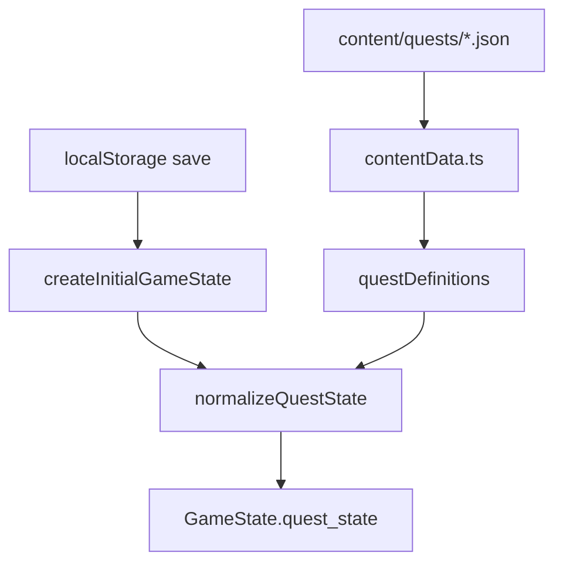
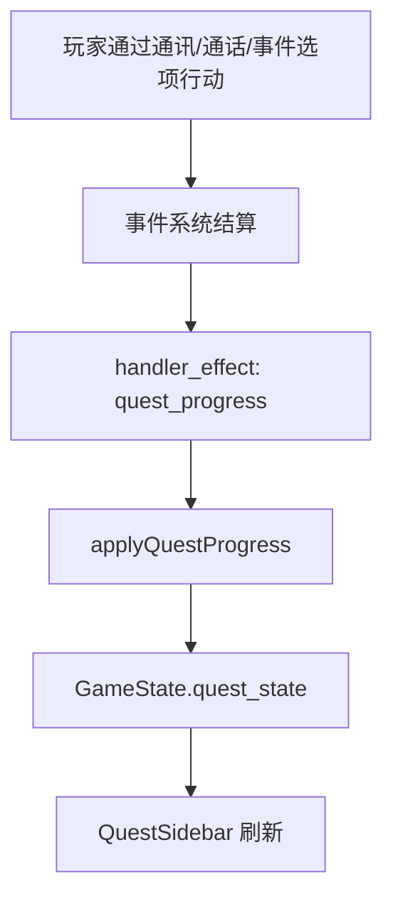
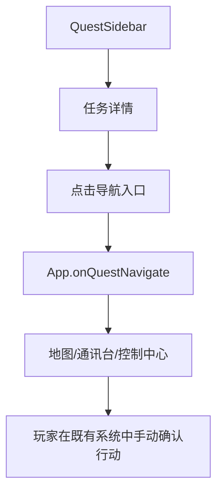
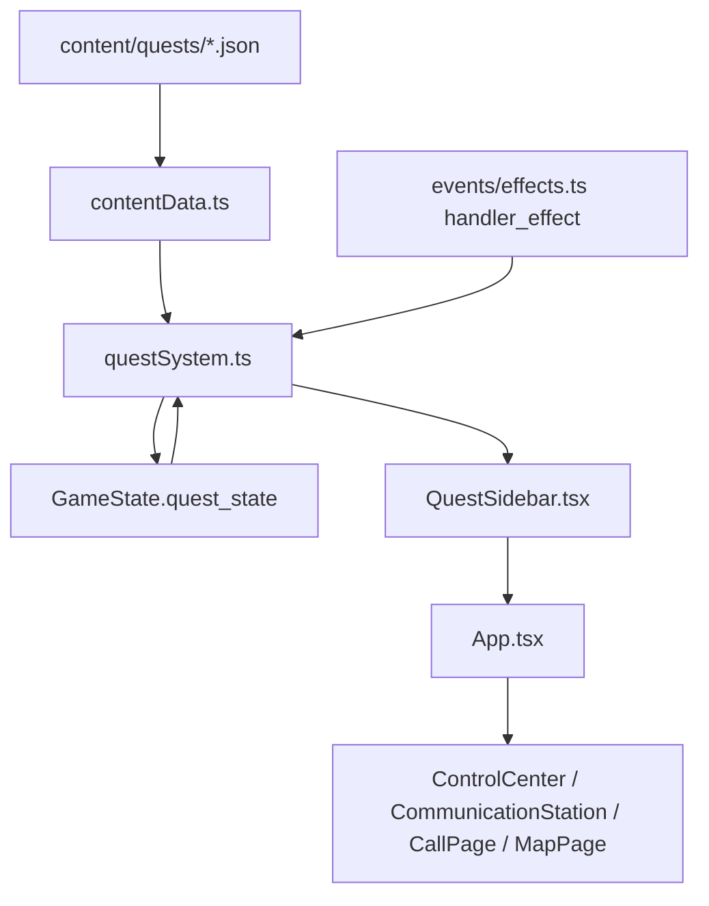

# Quest System Technical Design

## 1. 架构概览

### 1.1 目标

任务系统是 PC 端的常驻叙事行动面板。它让玩家追踪主要任务、次要任务、子任务和待办事项，并理解当前剧情下一步应关注什么。

本轮 MVP 的技术目标：

- 新增独立任务内容数据，任务文案和层级不写死在 UI 或事件代码中。
- 新增 `GameState.quest_state`，保存任务、子任务、待办事项的运行时进度。
- 通过结构化事件的 `handler_effect` 推进任务状态，不新增一等 `update_quest` effect。
- 在控制中心、通讯台、通话页、地图页等 PC 主要页面常驻显示任务侧边栏，并支持手动折叠。
- 支持任务列表、详情、主 / 次任务筛选、未完成 / 已完成筛选和导航入口。
- 任务 UI 只解释、提醒和导航，不直接执行移动、调查、通话选项或事件结算。

### 1.2 分层与组件职责

#### 静态内容层：`content/quests`

`content/quests` 保存任务定义，是任务标题、描述、三层结构、作者固定当前节点描述、主 / 次任务分类和导航入口的 source of truth。

它负责：

- 定义任务、子任务、待办事项。
- 定义任务类型：主要任务或次要任务。
- 定义任务与子任务的描述节点 `nodes`。
- 定义可选导航入口，例如打开地图、通讯台或定位相关队员。

它不负责：

- 保存运行时完成状态。
- 判定事件是否成功。
- 自动推导父任务是否完成。
- 直接创建队员行动或事件选项。

#### 运行时状态层：`GameState.quest_state`

`GameState.quest_state` 保存当前存档中的任务进度，是任务 UI 的 runtime source of truth。

它负责：

- 保存任务、子任务、待办事项的 `incomplete` / `completed` 状态。
- 保存任务与子任务的 `current_node_id`。
- 保存更新时间和完成时间。
- 在刷新页面后恢复任务展示。

它不负责：

- 保存完整静态任务定义。
- 保存侧边栏折叠状态、筛选条件或选中任务。
- 代替 `objective`、`event`、`world_flags` 做规则判定。

#### 领域逻辑层：`questSystem.ts`

`questSystem.ts` 是任务系统的纯逻辑模块。

它负责：

- 从静态定义创建初始 `QuestRuntimeState`。
- 从旧 / 缺失 runtime state normalize 出当前定义需要的状态。
- 应用任务推进 payload。
- 保证重复推进幂等。
- 合并静态定义与 runtime state，生成 UI view model。
- 根据状态和任务类型筛选任务。

它不负责：

- 读取 React 组件 state。
- 执行页面跳转。
- 调用通讯、移动、调查或事件选择逻辑。

#### 事件集成层：`handler_effect`

本轮不新增一等 `update_quest` effect。事件系统复用现有 `handler_effect`，通过白名单 effect handler 推进任务，例如 `quest_progress` 或 `quest_update`。

它负责：

- 在事件结算时显式调用任务推进 handler。
- 把 handler payload 转交给 `questSystem.applyQuestProgress`。
- 遵守现有 effect `failure_policy`。

它不负责：

- 自动扫描 objective 状态。
- 从 event log 文本推导任务进度。
- 让任务状态反向驱动事件图。

#### UI 展示层：`QuestSidebar`

`QuestSidebar` 是 PC 主要页面常驻任务侧边栏。

它负责：

- 折叠 / 展开。
- 展示未完成摘要、最近更新提示、任务列表和任务详情。
- 支持主 / 次任务筛选。
- 支持全部 / 未完成 / 已完成筛选。
- 展示任务、子任务、待办事项三层结构。
- 触发导航请求。

它不负责：

- 直接执行行动。
- 自动接通队员。
- 选择事件选项。
- 修改任务 runtime 状态。

#### App 集成层：`App.tsx`

`App.tsx` 持有权威 `GameState` 和页面路由。

它负责：

- 初始化和保存 `quest_state`。
- 把任务 view model 传给 `QuestSidebar`。
- 管理侧边栏 UI-only 状态：折叠、筛选、选中任务。
- 把任务导航请求转换为现有页面跳转。

它不负责：

- 在导航时执行 gameplay action。
- 把侧边栏 UI 状态写入存档。

### 1.3 关键数据流

#### 初始化与存档恢复



新存档创建时，系统从 `questDefinitions` 创建完整初始 `quest_state`。读取存档时，系统检查 `quest_state` 是否存在并与当前任务定义合并。由于本轮确认允许研发期旧存档失效，`isCompatibleGameSaveState` 可以把 `quest_state` 作为兼容性要求。

#### 事件推进任务



事件只通过显式 `handler_effect` 推进任务。任务系统不监听 UI 点击、地图打开、通讯台展开等展示行为来改变进度。

#### 任务导航



导航只改变页面或选中上下文，不创建 `crew_action`，不选择通话选项，不自动接通队员。

### 1.4 组件图



## 2. 数据模型

### 2.1 静态任务内容文件

建议新增：

```text
content/quests/quests.json
content/schemas/quests.schema.json
```

MVP 可以先使用单个 `quests.json` 文件。未来任务数量增加后，再按章节或剧情域拆分文件。

### 2.2 静态内容结构

```ts
type QuestCategory = "main" | "side";
type QuestEntryStatus = "incomplete" | "completed";

interface QuestContentFile {
  schema_version: "quests.v1";
  quests: QuestDefinition[];
}

interface QuestDefinition {
  id: string;
  category: QuestCategory;
  title: string;
  summary: string;
  description: string;
  initial_node_id: string;
  nodes: QuestNodeDefinition[];
  subquests: SubquestDefinition[];
  navigation?: QuestNavigationEntry[];
}

interface QuestNodeDefinition {
  id: string;
  description: string;
}

interface SubquestDefinition {
  id: string;
  title: string;
  summary: string;
  initial_node_id: string;
  nodes: QuestNodeDefinition[];
  todos: QuestTodoDefinition[];
  navigation?: QuestNavigationEntry[];
}

interface QuestTodoDefinition {
  id: string;
  title: string;
  description?: string;
  navigation?: QuestNavigationEntry[];
}
```

约束：

- `quest.id` 全局唯一。
- `subquest.id` 在所属任务内唯一。
- `todo.id` 在所属子任务内唯一。
- `category` 只允许 `main` 或 `side`。
- `initial_node_id` 必须引用同层 `nodes[].id`。
- `nodes` 是隐藏技术层，只用于切换当前节点描述，不作为 UI 第四层展示。
- UI 固定只展示任务 → 子任务 → 待办事项三层结构。
- 静态内容不保存 `status`、`completed_at`、`updated_at` 等 runtime 字段。

### 2.3 运行时任务状态

建议在 `GameState` 增加：

```ts
interface GameState extends EventRuntimeState {
  quest_state: QuestRuntimeState;
}

interface QuestRuntimeState {
  quests: Record<string, QuestProgress>;
  updated_quest_ids: string[];
}

interface QuestProgress {
  id: string;
  status: QuestEntryStatus;
  current_node_id: string;
  updated_at: number;
  completed_at?: number | null;
  subquests: Record<string, SubquestProgress>;
}

interface SubquestProgress {
  id: string;
  status: QuestEntryStatus;
  current_node_id: string;
  updated_at: number;
  completed_at?: number | null;
  todos: Record<string, TodoProgress>;
}

interface TodoProgress {
  id: string;
  status: QuestEntryStatus;
  updated_at: number;
  completed_at?: number | null;
}
```

运行时规则：

- 初始状态全部为 `incomplete`。
- 任务、子任务、待办事项只允许 `incomplete` 和 `completed`。
- 完成同一条目必须幂等。已完成条目再次收到完成 payload 时，不刷新 `completed_at`。
- 完成待办事项不会自动完成子任务。
- 完成子任务不会自动完成父任务。
- 父任务 / 子任务只有收到针对自身的显式推进 payload 才会完成。
- `updated_quest_ids` 只驱动 UI 最近更新提示，不参与规则判定。

### 2.4 UI View Model

UI 不直接遍历 raw `quest_state`。`questSystem.ts` 应输出 view model。

```ts
interface QuestSidebarView {
  collapsedSummary: QuestCollapsedSummary;
  list: QuestListItemView[];
  selectedQuest?: QuestDetailView;
  emptyText: string;
}

interface QuestCollapsedSummary {
  incompleteCount: number;
  mainIncompleteCount: number;
  recentlyUpdatedTitles: string[];
}

interface QuestListItemView {
  id: string;
  category: QuestCategory;
  title: string;
  summary: string;
  status: QuestEntryStatus;
  currentDescription: string;
  updated: boolean;
  completedAt?: number | null;
}

interface QuestDetailView extends QuestListItemView {
  description: string;
  navigation: QuestNavigationEntry[];
  subquests: SubquestView[];
}

interface SubquestView {
  id: string;
  title: string;
  summary: string;
  status: QuestEntryStatus;
  currentDescription: string;
  navigation: QuestNavigationEntry[];
  todos: TodoView[];
}

interface TodoView {
  id: string;
  title: string;
  description?: string;
  status: QuestEntryStatus;
  navigation: QuestNavigationEntry[];
}
```

## 3. `handler_effect` 推进方案

### 3.1 决策

本轮确认不新增一等 `update_quest` effect。任务推进复用现有 `handler_effect` 机制，并新增一个明确的 effect handler，例如 `quest_progress` 或 `quest_update`。

推荐命名：`quest_progress`。

理由：

- 改动面小，不需要扩展 `EffectType` enum 和 effect schema 的一等分支。
- 符合现有事件系统“复杂效果通过白名单 handler 扩展”的机制。
- 可以让任务系统先完成 MVP 闭环，未来若任务规则变复杂，再评估是否提升为一等 effect。

代价：

- 类型和 schema 校验弱于一等 `update_quest` effect。
- handler payload 的字段级约束不能完全依赖现有 `effect.schema.json`。
- 必须在 `validate-content` 中补充跨引用校验，确保 quest/subquest/todo/node 引用真实存在。

### 3.2 Handler registry

`content/events/handler_registry.json` 增加 effect handler：

```json
{
  "handler_type": "quest_progress",
  "kind": "effect",
  "description": "Apply explicit quest progress updates to GameState.quest_state.",
  "allowed_target_types": ["world_flags"],
  "deterministic": true,
  "uses_random": false
}
```

`allowed_target_types` 需要选一个现有合法 target。推荐使用 `world_flags` 作为占位 target，因为 handler 实际通过 `context.state.quest_state` 更新任务状态，不读取 target value。技术上也可新增更语义化 target，但那会扩大 schema 改动，不建议进入 MVP。

实现时必须在 handler 文档和代码中说明：`quest_progress` 的 target 只是满足现有 `handler_effect` 结构，不代表任务状态保存在 `world_flags`。

### 3.3 Handler payload

```ts
type QuestProgressOperation =
  | "complete_quest"
  | "complete_subquest"
  | "complete_todo"
  | "set_quest_node"
  | "set_subquest_node"
  | "mark_updated";

interface QuestProgressHandlerParams {
  operation: QuestProgressOperation;
  quest_id: string;
  subquest_id?: string;
  todo_id?: string;
  node_id?: string;
}
```

示例：完成一个待办事项。

```json
{
  "id": "quest_repair_generator_done",
  "type": "handler_effect",
  "target": { "type": "world_flags" },
  "handler_type": "quest_progress",
  "params": {
    "operation": "complete_todo",
    "quest_id": "regroup_after_crash",
    "subquest_id": "repair_ship_systems",
    "todo_id": "repair_generator"
  },
  "failure_policy": "fail_event",
  "record_policy": {
    "write_event_log": false,
    "write_world_history": false
  }
}
```

示例：切换任务当前节点描述。

```json
{
  "id": "quest_regroup_node_power_restored",
  "type": "handler_effect",
  "target": { "type": "world_flags" },
  "handler_type": "quest_progress",
  "params": {
    "operation": "set_quest_node",
    "quest_id": "regroup_after_crash",
    "node_id": "power_restored"
  },
  "failure_policy": "fail_event",
  "record_policy": {
    "write_event_log": false,
    "write_world_history": false
  }
}
```

### 3.4 Operation 语义

| operation | 必填字段 | 行为 |
| --- | --- | --- |
| `complete_quest` | `quest_id` | 完成任务本体，不自动完成子任务和待办事项。 |
| `complete_subquest` | `quest_id`、`subquest_id` | 完成指定子任务，不自动完成父任务。 |
| `complete_todo` | `quest_id`、`subquest_id`、`todo_id` | 完成指定待办事项，不自动完成子任务。 |
| `set_quest_node` | `quest_id`、`node_id` | 切换任务当前描述节点，不改变完成状态。 |
| `set_subquest_node` | `quest_id`、`subquest_id`、`node_id` | 切换子任务当前描述节点，不改变完成状态。 |
| `mark_updated` | `quest_id` | 标记任务最近更新，不改变完成状态。 |

### 3.5 错误处理与幂等

`quest_progress` handler 应把以下情况转为 effect error，并遵守 `failure_policy`：

- `operation` 缺失或不是白名单值。
- `quest_id` 不存在。
- `subquest_id` 在对应任务下不存在。
- `todo_id` 在对应子任务下不存在。
- `node_id` 在对应任务或子任务下不存在。
- `GameState.quest_state` 缺失或结构不合法。

幂等规则：

- 已完成条目再次收到完成 payload，返回 success，不改变 `completed_at`。
- 当前节点已经是目标 `node_id` 时，返回 success，不刷新 `updated_at`，除非 payload 同时要求 `mark_updated`。
- 同一事件重复执行不应造成重复 UI 历史或重复完成时间。

## 4. GameState / Save 集成

### 4.1 GameState 字段

`GameState` 增加 `quest_state: QuestRuntimeState`。

新字段应与 `active_events`、`objectives`、`event_logs` 等 runtime state 一样保存在 PC 权威状态中。

### 4.2 初始状态

`createInitialGameState` 新存档分支调用：

```ts
createInitialQuestState(questDefinitions, 0)
```

如果任务内容新增了任务，新游戏应自动拥有对应初始 runtime state。

### 4.3 存档恢复

读取存档时调用：

```ts
normalizeQuestState(saved.quest_state, questDefinitions, saved.elapsedGameSeconds)
```

normalize 规则：

- 当前定义中存在但存档缺失的任务，补初始状态。
- 当前定义中存在但存档缺失的子任务 / 待办，补初始状态。
- 存档中存在但当前定义已删除的任务，不在 UI 展示。
- `current_node_id` 不存在时回退到对应 definition 的 `initial_node_id`。

### 4.4 Save 兼容策略

本轮确认允许旧 `localStorage` 存档按研发期策略失效。因此：

- `isCompatibleGameSaveState` 可以要求 `quest_state` 存在且结构基本合法。
- 旧存档没有 `quest_state` 时可以被判定不兼容并回到新游戏初始状态。
- 不需要写 v2 到 v3 的迁移器，除非后续人类另行要求。

### 4.5 UI 状态不进入存档

以下状态不保存到 `GameState`：

- 侧边栏是否折叠。
- 当前状态筛选。
- 当前主 / 次任务筛选。
- 当前选中的任务 ID。
- 侧边栏滚动位置。

这些状态只属于本次页面会话。刷新后可以回到默认：侧边栏展开、显示全部状态、显示全部类型、选中第一个未完成主要任务或空状态。

## 5. Content / Schema / Validate-content 方案

### 5.1 Schema 校验

新增 `content/schemas/quests.schema.json`，校验：

- 顶层 `schema_version` 为 `quests.v1`。
- `quests` 是数组。
- `quest.id`、`title`、`summary`、`description`、`category`、`initial_node_id`、`nodes`、`subquests` 必填。
- `category` 只允许 `main` / `side`。
- `nodes[].id`、`nodes[].description` 必填。
- `subquests[].id`、`title`、`summary`、`initial_node_id`、`nodes`、`todos` 必填。
- `todos[].id`、`title` 必填。
- `navigation` 如存在，必须匹配白名单类型。

Schema 能保证结构形状，但不能充分保证跨文件引用。因此需要脚本校验。

### 5.2 跨引用校验

扩展 `apps/pc-client/scripts/validate-content.mjs`：

- 加载 `content/quests/*.json`。
- 校验 quest id 全局唯一。
- 校验 subquest id 在同一 quest 内唯一。
- 校验 todo id 在同一 subquest 内唯一。
- 校验 `initial_node_id` 引用同层 `nodes[].id`。
- 校验导航中的 `crew_id` 存在于 `content/crew/crew.json`。
- 校验导航中的 `tile_id` 存在于所有加载地图或默认地图中。MVP 可先要求默认地图存在该 tile。
- 校验事件内容中的 `handler_effect` 如果 `handler_type === "quest_progress"`，则其 `params` 引用真实 quest/subquest/todo/node。
- 校验 `quest_progress` 的 operation 与必填字段匹配。

这一步是 `handler_effect` 方案的关键补强。因为 `handler_effect` 的 schema 不知道每个 handler 的具体 payload，必须由 `validate-content` 做任务跨引用校验。

### 5.3 Content loader

`apps/pc-client/src/content/contentData.ts` 增加 quest JSON 加载。

MVP 可先直接 import 单文件：

```ts
import questsContent from "../../../../content/quests/quests.json";
```

如果希望未来更容易拆分，可以从一开始使用：

```ts
const questModules = import.meta.glob("../../../../content/quests/*.json", {
  eager: true,
  import: "default",
});
```

推荐 MVP 使用 `import.meta.glob`，与事件 definitions 的加载风格一致，后续拆文件成本更低。

## 6. QuestSidebar UI 方案

### 6.1 常驻布局

在 `App.tsx` 增加统一布局组件，例如 `QuestLayout`：

```tsx
<QuestLayout sidebar={<QuestSidebar ... />} collapsed={questSidebarCollapsed}>
  <ControlCenter ... />
</QuestLayout>
```

控制中心、通讯台、通话页、地图页都包裹在该布局内。Ending 页可不显示任务侧边栏，避免结局页被任务 UI 干扰。

### 6.2 折叠状态

侧边栏支持手动折叠 / 展开。

折叠态展示：

- 未完成任务数。
- 未完成主要任务数。
- 最近更新任务标题，最多 1-2 条。
- 展开按钮。

展开态展示：

- 筛选按钮：全部 / 未完成 / 已完成。
- 类型筛选：全部 / 主要 / 次要。
- 任务列表。
- 任务详情。
- 导航入口。

折叠、筛选和选中任务都不进入存档。

### 6.3 任务列表

列表项显示：

- 标题。
- 主要 / 次要标签。
- 未完成 / 已完成状态。
- 当前节点描述摘要。
- 最近更新标记。

排序建议：

1. 未完成在前。
2. 主要任务在次要任务前。
3. 最近更新在较前。
4. 静态内容顺序作为稳定 fallback。

### 6.4 任务详情

详情显示：

- 任务标题。
- 任务类型与状态。
- 任务描述。
- 当前节点描述。
- 子任务列表。
- 每个子任务的当前描述。
- 待办事项列表。
- 已完成待办使用明确完成样式，不再作为当前行动建议突出显示。
- 导航入口按钮。

详情不显示：

- 事件图节点。
- handler payload。
- debug ID，除非 Debug toolbox 未来需要。
- 自动生成的数字进度条。

### 6.5 空状态与异常状态

空状态：

- 没有任何任务：显示“暂无已登记任务。”
- 筛选后为空：显示“当前筛选下没有任务。”

异常状态：

- 缺少当前节点描述：显示“当前任务情报缺失。”
- 导航目标无效：禁用按钮并显示“目标不可用”。
- runtime state 缺失：normalize 后兜底，不让 UI 崩溃。

### 6.6 响应式约束

桌面宽屏：侧边栏与主页面并排。

窄屏：侧边栏默认可折叠，展开时可覆盖部分页面，但必须保留关闭 / 折叠按钮。

地图页：侧边栏常驻显示，但玩家可手动折叠；地图 canvas 不应被侧边栏永久遮挡。

## 7. 导航方案

### 7.1 导航类型

```ts
type QuestNavigationEntry =
  | { type: "page"; label: string; page: "control" | "station" | "map" }
  | { type: "tile"; label: string; tile_id: string }
  | { type: "crew"; label: string; crew_id: string };
```

### 7.2 行为规则

`page: "control"`：切换到控制中心。

`page: "station"`：切换到通讯台。

`page: "map"`：切换到地图页。

`tile`：切换到地图页，并尽可能选中 / 高亮对应地块。不会发出移动指令。

`crew`：打开 / 定位通讯台，并高亮或提示对应队员。不会自动接通，不会调用 `onStartCall`。

### 7.3 禁止行为

任务导航入口禁止：

- 自动接通队员。
- 自动创建移动行动。
- 自动创建调查行动。
- 自动选择事件通话选项。
- 自动完成任务。
- 自动修改 objective。

### 7.4 App 集成状态

为了支持 `tile` 和 `crew` 导航，`App.tsx` 可新增 UI-only 状态：

```ts
const [questNavigationHint, setQuestNavigationHint] = useState<QuestNavigationHint | null>(null);
```

该状态不进入存档。

`MapPage` 可接收 `highlightTileId` 或 `initialSelectedTileId`。

`CommunicationStation` 可接收 `highlightCrewId`。

如果实现成本需要控制，MVP 也可以只跳转页面并显示顶部提示，不做高亮动画。

## 8. 测试与验收策略

### 8.1 单元测试

`questSystem.test.ts` 覆盖：

- 从静态定义创建初始 `quest_state`。
- normalize 缺失任务、子任务、待办和 node。
- `complete_todo` 只完成待办，不自动完成子任务和任务。
- `complete_subquest` 只完成子任务，不自动完成任务。
- `complete_quest` 只完成任务本体。
- 重复完成保持幂等，不刷新 `completed_at`。
- `set_quest_node` 切换任务当前描述。
- `set_subquest_node` 切换子任务当前描述。
- 筛选全部 / 未完成 / 已完成。
- 筛选全部 / 主要 / 次要。

### 8.2 Effect / handler 测试

`effects.test.ts` 或新增 quest handler 测试覆盖：

- `handler_effect` + `handler_type: quest_progress` 能更新 `quest_state`。
- 无效 `quest_id` 返回 effect error。
- 无效 `operation` 返回 effect error。
- 缺少必填字段返回 effect error。
- `failure_policy: fail_event` 时错误中止 effect group。
- handler 不修改 `crew_actions`、`objectives`、`event_logs`，除非事件另有独立 effect。

### 8.3 Content validation 测试

内容校验覆盖：

- quest id 重复失败。
- subquest/todo id 重复失败。
- `initial_node_id` 不存在失败。
- navigation crew / tile 引用不存在失败。
- `quest_progress` 引用不存在 quest/subquest/todo/node 失败。
- `quest_progress` operation 缺少必填字段失败。

### 8.4 组件测试

`QuestSidebar.test.tsx` 覆盖：

- 折叠态显示未完成数量。
- 展开态显示任务列表和详情。
- 主 / 次筛选只改变展示。
- 完成状态筛选只改变展示。
- 已完成待办使用完成样式。
- 导航按钮只调用 `onNavigate`。

### 8.5 App 集成测试

`App.test.tsx` 或现有集成测试覆盖：

- 新游戏显示任务侧边栏。
- 存档恢复后已完成任务不回退。
- 任务导航到通讯台时不自动接通队员。
- 任务导航到地图时不创建移动行动。

### 8.6 E2E 验收

涉及 PC 页面流和任务常驻侧边栏，建议增加或扩展 Playwright e2e：

- 玩家进入控制中心，看到任务侧边栏。
- 玩家折叠 / 展开侧边栏。
- 玩家切换未完成 / 已完成筛选。
- 玩家通过现有事件链触发 `quest_progress`，看到待办完成。
- 玩家刷新页面后任务完成状态仍保留。
- 玩家点击 crew 导航进入通讯台，但不会自动进入通话页。
- 玩家点击 tile 导航进入地图，但不会创建行动。

### 8.7 必跑验证

本轮实现完成后建议运行：

```bash
npm run validate:content
cd apps/pc-client && node ../../common/scripts/install-run-rushx.js lint
cd apps/pc-client && node ../../common/scripts/install-run-rushx.js test
cd apps/pc-client && node ../../common/scripts/install-run-rushx.js test:e2e
```

如果 Playwright 浏览器环境阻塞，需要在最终实现说明中记录阻塞原因和替代验证。

## 9. 风险与缓解

### R1：`handler_effect` payload 类型弱

**影响**：内容作者可能写错 quest id、operation 或必填字段，运行时才失败。

**缓解**：在 `validate-content` 中补充 `quest_progress` 专项跨引用校验；测试覆盖错误 payload；事件内容默认使用 `failure_policy: fail_event`。

### R2：任务状态成为第二套剧情事实源

**影响**：任务显示与事件 / objective 状态不一致，玩家看到错误目标。

**缓解**：任务只由显式 `quest_progress` 更新；任务系统不自动扫描 objective；任务 UI 不修改事件状态；父任务不自动由子项汇总完成。

### R3：侧边栏影响地图和通话页面操作

**影响**：地图 canvas、通话选项或移动确认被遮挡，核心操作变难。

**缓解**：侧边栏可手动折叠；窄屏使用覆盖式布局并保留折叠按钮；e2e 或手动视觉验证控制中心、通讯台、通话页、地图页。

### R4：`nodes/current_node_id` 被误用成任务图

**影响**：MVP 膨胀为复杂 quest graph，与事件图职责重叠。

**缓解**：技术设计明确 `nodes` 只用于作者固定描述切换；不定义边、条件、parallel/join；所有推进仍由事件显式 handler 指定。

### R5：任务文案与事件 / 通话文案重复

**影响**：同一剧情事实多处维护，内容不一致。

**缓解**：任务文案只写行动目标、当前状态和已知事实摘要；具体对话和结算仍留在事件 / 通话 / event log。

### R6：旧存档失效影响本地调试

**影响**：开发者或测试者现有 localStorage 进度被重置。

**缓解**：已确认研发期允许旧存档失效；Debug toolbox 已提供重置入口；最终实现说明中提示 save schema 变化。

## 10. 已确认技术决策记录

### D1：任务推进机制

- **决定**：不新增一等 `update_quest` effect；复用 `handler_effect`，通过 `quest_progress` / `quest_update` 这类明确 handler 推进任务。
- **原因**：改动较小，符合现有 handler 扩展机制，适合 MVP。
- **取舍**：类型和 schema 校验弱于一等 effect；必须在 `validate-content` 中补跨引用校验。

### D2：`GameState.quest_state`

- **决定**：新增 `GameState.quest_state` 字段。
- **原因**：任务状态需要进入 PC 权威存档，刷新后恢复。
- **取舍**：旧 `localStorage` 存档可按研发期策略失效，不做迁移器。

### D3：隐藏描述节点

- **决定**：接受 `nodes/current_node_id` 作为隐藏技术层。
- **原因**：需要支持作者固定文案随事件推进切换。
- **取舍**：UI 仍只展示任务 → 子任务 → 待办事项三层结构；`nodes` 不作为第四层展示，也不表达任务图。

### D4：侧边栏常驻范围

- **决定**：侧边栏在控制中心、通讯台、通话、地图等主要页面常驻显示，可手动折叠。
- **原因**：任务系统定位为常驻叙事行动面板。
- **取舍**：需要重点处理地图和通话页布局，避免遮挡核心操作。

### D5：Crew 导航

- **决定**：crew 导航只打开 / 定位通讯台并高亮或提示对应队员，不自动接通。
- **原因**：通讯和通话仍必须由玩家明确确认。
- **取舍**：操作多一步，但符合“任务 UI 只导航、不执行”的边界。

### D6：侧边栏 UI 状态不存档

- **决定**：折叠、筛选、选中任务等 UI 状态不进入存档。
- **原因**：本轮只持久化任务进度，减少 save shape 和迁移复杂度。
- **取舍**：刷新后 UI 状态回到默认，但任务进度保留。

## 11. 开放问题

- `quest_progress` 还是 `quest_update` 作为最终 handler_type 命名需要实现前定稿。本文推荐 `quest_progress`。
- `handler_effect` 的 target 是否固定使用 `{ "type": "world_flags" }` 作为占位 target，需要实现时结合现有 schema 与 handler target 校验确认。
- `tile` 导航在 MVP 中是只跳转地图并选中地块，还是额外做视觉高亮动画，可由实现复杂度决定。
- 初始 MVP 任务内容应接入哪条现有事件链，需要实施前选择一个最小、稳定、可测试的事件闭环。
