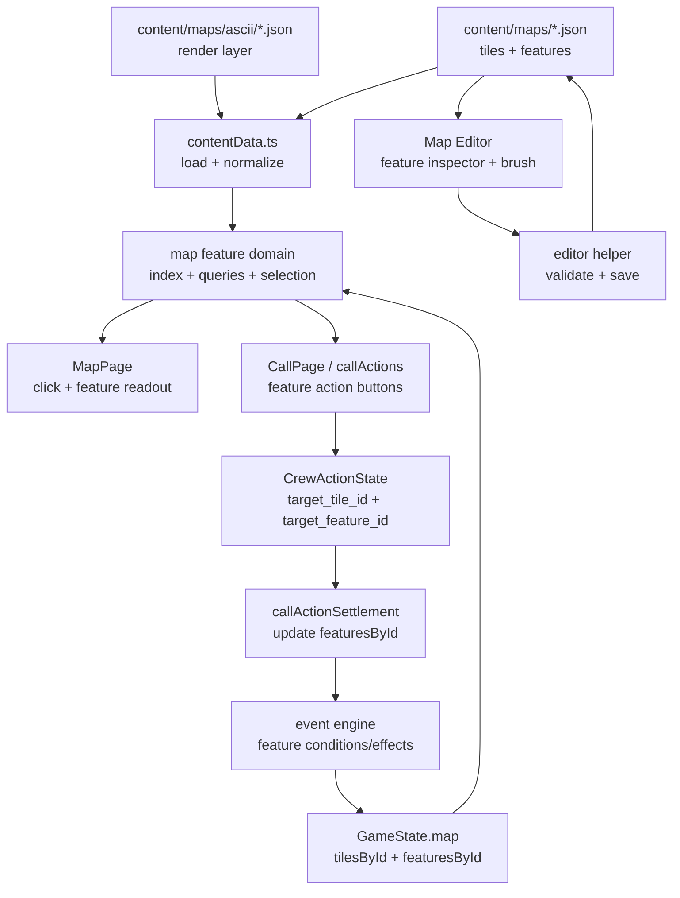

# region-based-map-system Technical Design

## 技术设计

### 1. 架构概览

本技术设计把 256 x 256 地图的玩法语义从 tile 上移到 `MapFeature`。tile 仍是坐标、移动路径、队员当前位置和事件锚点；`MapFeature` 承担玩家可见语义、点击命中、调查目标、状态字符串和 Feature 级去重。

本轮只做玩法层迁移，不改 `radar.regions` 渲染层同步问题，不让 Feature 参与移动耗时、危险概率、天气或调查难度计算。

#### 1.1 分层与组件职责

**Content 层**

- `content/maps/*.json` 是新版玩法语义 source of truth。
- map JSON 新增 `features`，每个 Feature 自带 `footprint`、`priority`、`kind`、`visibility`、`tags` 和可选调查配置。
- `tiles` 保留 `id`、`row`、`col`、`terrain`、`weather`、`environment`、`specialStates` 等底层 tile 数据；新版玩法模型移除 `tile.areaName` 和 `tile.objectIds`。
- `content/map-objects/*.json` 不再作为新内容 source of truth。现有 IAFS 对象定义迁移到 `features` 后，旧 map object runtime 只允许作为旧存档兼容输入。
- `content/maps/ascii/*.json` 继续负责渲染层，不要求和 `features` 同步。

**Content loading / normalization 层**

- `apps/pc-client/src/content/contentData.ts` 加载 map JSON 并导出 `MapFeatureDefinition` 类型。
- normalization 只补齐兼容字段，不生成持久索引，不把 `features` 回写到 JSON。
- 旧存档 normalization 可以读取 legacy `mapObjects`，将同 id 的旧状态迁移到 `featuresById`，然后运行时只读 `featuresById`。

**Map feature domain 层**

- 新增或扩展地图系统纯函数，负责：
  - 校验和展开 `row_spans` footprint。
  - 构建 tile -> Feature ids 的 runtime index。
  - 查询某个 `tileId` 覆盖的全部 Feature。
  - 根据 `visibility` 和 runtime state 过滤可见 Feature。
  - 根据 `investigatable` 和 `priority` 计算调查候选。
  - 生成玩家可见地点 label。
- 该层不依赖 React，不写 localStorage，不直接触发事件。

**Runtime state 层**

- `GameState.map.tilesById` 继续保存 tile 级发现、调查报告、队员位置投影和特殊状态。
- `GameState.map.featuresById` 保存 Feature 级 runtime state，包括 `status`、`revealed`、`investigated` 和调查历史时间。
- Feature index 是派生缓存，不进入 save data。

**Call / action / event 层**

- 通话页按队员当前 tile 查询可见可调查 Feature。
- 只为最高 `priority` 的可调查 Feature 生成调查行动；若最高优先级并列，则按 Feature 分别生成按钮。
- 行动参数使用 `target_feature_id`，事件 payload 使用 `feature_id` / `feature_kind` / `feature_tags`。
- 事件系统新增 Feature condition/effect，取代 `object_status_equals` / `set_object_status` 在新内容里的职责。

**MapPage UI 层**

- 点击地图仍先由坐标映射出底层 `tileId`。
- MapPage 使用 `tileId` 查询命中的 Feature 列表，展示全部重叠 Feature，并区分背景 Feature 和可调查 Feature。
- 从通话进入地图时，MapPage 仍只返回 `tileId` 给通话；正式移动指令仍在通话页确认。

**Editor / helper 层**

- Map Editor 新增 Feature list、Feature inspector 和 footprint brush。
- MVP brush 支持选中 Feature 后单格/拖拽添加或擦除 tile；每次 stroke 写入 history。
- helper validation 校验 `features`、row spans、Feature id/status/action 引用和 footprint 连续性。

#### 1.2 组件通信方式

- 内容数据通过 JSON 文件和 Vite eager imports 进入 PC client / Editor。
- PC runtime 通过 React state 和纯函数同步读取 `GameState.map`。
- Call action 和 event engine 通过现有 `CrewActionState`、`TriggerContext`、condition/effect contract 通信。
- Editor 前端通过现有 helper HTTP endpoints 读取、校验、保存 map JSON。
- Feature index 通过同步纯函数生成，生命周期是进程内缓存或 React memo，不持久化。

#### 1.3 关键数据流

**地图点击**

1. 玩家点击 MapPage。
2. `stagePointToWorld` 将屏幕坐标映射为 radar/world 坐标。
3. world 坐标转换为 `tileId`。
4. `getFeaturesAtTile(tileId)` 从 runtime index 读取覆盖 Feature。
5. MapPage 展示 `tileId`、地形/天气，以及全部可见 Feature。
6. 如果当前是从通话进入地图，玩家点击“标记当前坐标”后只把 `tileId` 传回通话。

**通话调查**

1. 通话页拿到队员当前 `tileId`。
2. `getVisibleInvestigatableFeaturesAtTile(tileId, mapState)` 返回可调查 Feature。
3. `selectTopInvestigatableFeatures` 只保留最高 `priority` 候选。
4. 单个候选时显示一个调查按钮；多个同优先级候选时显示多个 Feature 目标按钮。
5. 玩家选择后创建 `CrewActionState`，写入 `target_tile_id` 和 `action_params.target_feature_id`。
6. 行动结算读取 Feature 定义和 runtime state，更新 `featuresById[featureId]`。
7. 结算产生 `TriggerContext.payload.feature_id`，事件系统可根据 Feature 状态和行动 id 触发后续事件。

**内容编辑**

1. 内容作者在 Editor 新建或选择 Feature。
2. 在地图网格上拖拽添加/擦除 footprint tile。
3. Reducer 将 footprint 规范化为 sorted row spans。
4. helper validation 校验 spans 边界、重叠格式、连续性和 investigatable 字段。
5. 保存时 map JSON 写入 `features`；不写派生索引。

**旧存档加载**

1. `normalizeSavedMap` 读取旧 save 中可能存在的 `mapObjects`。
2. 对每个同 id Feature，把 `mapObjects[id].status_enum` 迁移为 `featuresById[id].status`。
3. 运行时后续只读写 `featuresById`。

#### 1.4 组件图



### 2. 技术决策和选型（ADR）

#### ADR-001: `map.features` 成为玩法语义事实源

- **状态**: 已决定
- **上下文**: 产品设计要求 tile 只负责移动和坐标，雪原、村庄、遗骸、设备等上层语义统一由 Feature 承担。现有 `tile.areaName` 和 `tile.objectIds` 在 256 x 256 地图下造成重复配置、点击困难和跨 tile 对象难以去重。
- **选项**:
  - A: `map.features` 作为 source of truth，移除 `tile.areaName` / `tile.objectIds` 的正式地位。优点是语义、点击、调查和去重统一；缺点是迁移范围大。
  - B: 保留 tile 字段并新增 Feature overlay。优点是短期兼容；缺点是两套 source of truth 会持续分叉。
  - C: 只给旧 map object 增加 footprint。优点是对象迁移少；缺点是背景区域、重叠语义和点击命中仍没有统一模型。
- **决定**: 选择 A。`features` 是新版玩法语义唯一事实源，tile 不再承载 area/object 语义。
- **后果**:
  - `content/schemas/maps.schema.json` 要新增 `features`，并从 tile required fields 中移除 `areaName` / `objectIds`。
  - PC client 的 location label、visible object/action 查询、调查结算、事件投影都要改为 Feature 查询。
  - Editor 要从 tile inspector 扩展为 Feature authoring。
  - `radar.regions` 不参与本决策，继续是渲染层。
- **参考**: `region-based-map-system-design.md` 第 3、7、8、10 节。

#### ADR-002: Footprint 使用 row spans 作为 canonical storage

- **状态**: 已决定
- **上下文**: Feature 本质是连续 footprint/mask。地图固定为 256 x 256，玩家和编辑器都需要处理较大的区域。
- **选项**:
  - A: Row spans。按行保存 `[colStart, colEnd]` 区间。优点是精确、紧凑、适合 brush 后规范化；缺点是手写 JSON 不如 tileId 列表直观。
  - B: Tile IDs。保存全部 tileId。优点是直观；缺点是大区域文件膨胀，diff 噪音大。
  - C: Shape hybrid。保存 box/circle/tiles 等多种 shape。优点是表达灵活；缺点是 MVP 查询、编辑和验证分支多。
- **决定**: 选择 A。所有 Feature footprint 在 JSON 中保存为 `row_spans`。
- **后果**:
  - schema 定义 `footprint.type = "row_spans"`，`spans[] = { row, colStart, colEnd }`。
  - row/col 均使用现有 tile 的 1-based 坐标。
  - validation 必须校验 spans 排序、边界、非空、同一 Feature 内无重叠区间，并校验 footprint 连续。
  - Editor brush 内部可以用 tile set 编辑，但保存前必须规范化为 row spans。
- **参考**: 产品访谈 Q3；技术访谈“技术决策1”。

#### ADR-003: Feature hit index 运行时派生，不持久化

- **状态**: 已决定
- **上下文**: 点击、调查、MapPage readout、CallPage 按钮和 Editor overlap preview 都需要从 `tileId` 查询覆盖 Feature。
- **选项**:
  - A: Runtime 生成 tile -> Feature index。优点是 JSON 只有一个 source of truth，查询快；缺点是加载时要生成缓存。
  - B: JSON 预生成 index。优点是加载最快；缺点是 footprint 和 index 容易不同步。
  - C: 每次扫描所有 Feature。优点是代码少；缺点是多处重复逻辑，后续 Feature 数量增长后不稳。
- **决定**: 选择 A。PC client 和 Editor 加载 map 后各自从 `features[].footprint` 派生索引。
- **后果**:
  - `tileFeatureIndex` 不进入 save data，不写回 map JSON。
  - 查询结果按 `priority desc`、再按 `id asc` 稳定排序。
  - 256 x 256 地图、每 tile 约 4 层 Feature 的规模下，索引内存和生成成本可接受。
- **参考**: 技术访谈“技术决策3”。

#### ADR-004: 可调查 Feature 完整替代 map object 状态链

- **状态**: 已决定
- **上下文**: 当前 IAFS 内容大量使用 `mapObjects[id].status_enum`、`object_status_equals`、`set_object_status` 和 `payload.object_id`。产品设计要求可调查内容是特殊 MapFeature，静态定义和 footprint 都在 map JSON 内。
- **选项**:
  - A: 完整迁移到 Feature。新增 feature condition/effect/action payload；旧 mapObjects 只用于旧存档迁移。优点是新模型清晰；缺点是迁移面大。
  - B: 兼容适配。`featuresById` 和 `mapObjects` 双写一段时间。优点是短期风险低；缺点是长期债务和状态分叉。
  - C: 只包一层 footprint。Feature 只定位，状态/actions 仍在 map object。优点是改动小；缺点是不符合 map 文件内定义 source of truth。
- **决定**: 选择 A。
- **后果**:
  - 新增 `feature_status_equals` condition 和 `set_feature_status` effect。
  - 新增 `set_feature_revealed` effect，用于替代旧 `update_tile_state` 中 `object_id/revealed` 的对象揭示能力。
  - Feature inline actions 使用 `category: "feature"`，action id 约定为 `${featureId}:<verb>`。
  - `CrewActionState.action_params.target_feature_id` 成为 Feature 行动目标。
  - `TriggerContext.payload` 增加 `feature_id`、`feature_kind`、`feature_tags`、`action_def_id`。
  - 旧 `object_status_equals` / `set_object_status` 不用于新内容；是否保留实现只服务 legacy save/content fallback，由实施阶段按测试迁移顺序决定。
- **参考**: 产品访谈 Q5、Q9、Q10、Q11；技术访谈“技术决策2”。

#### ADR-005: 调查行动只暴露最高优先级候选

- **状态**: 已决定
- **上下文**: 一个 tile 可同时属于多个 Feature。产品要求低优先级可作为背景可见，但调查目标默认由 `priority: 1-100` 决定，同最高优先级并列时通话中选择。
- **选项**:
  - A: Top candidates。只为最高 priority 的可调查 Feature 生成行动。优点是按钮少且符合产品规则；缺点是低优先级不能手动越级调查。
  - B: 全部可选。所有可调查 Feature 都生成按钮。优点是控制强；缺点是 UI 容易拥挤，削弱 priority 语义。
  - C: 通用按钮后选。先点“调查当前区域”，并列再选择。优点是保留旧入口；缺点是状态流和 UI 更复杂。
- **决定**: 选择 A。
- **后果**:
  - Call action generation 需要先查询 Feature，再生成候选按钮。
  - 单个最高优先级 Feature 可以显示为“调查当前区域”或“调查 <Feature name>”，但 action params 必须携带 `target_feature_id`。
  - 多个同优先级 Feature 必须生成多个按钮，避免一次调查结算全部内容。
  - 低优先级 Feature 只在上下文区域展示，不生成调查按钮。
- **参考**: 产品访谈 Q6、Q7；技术访谈“技术决策4”。

#### ADR-006: `MapFeature.kind` 是 JSON 自定义字符串，不做硬编码枚举

- **状态**: 已决定
- **上下文**: 用户明确要求 `MapFeature` 中的值应该放在 JSON 中，是可自定义内容。
- **选项**:
  - A: 扩展旧枚举。schema 严格限制 kind。优点是验证强；缺点是新增内容类型必须改 schema/代码。
  - B: 极简语义枚举。只保留少量 kind。优点是抽象稳定；缺点是丢掉现有 object kind 信息。
  - C: 自定义字符串。schema 只校验字符串格式，Editor 提供已有值快捷输入。优点是内容灵活；缺点是不能靠 kind 做强规则判断。
- **决定**: 选择 C。
- **后果**:
  - `kind` 只用于展示、筛选和内容组织，不承载硬编码玩法规则。
  - schema 对 `kind` 做字符串和格式校验，不做 enum。
  - Editor 可从当前 map 已有 kind 和迁移初始值中提供 datalist。
  - 玩法逻辑必须使用显式字段，如 `investigatable`、`priority`、`visibility`、`actions`、`tags`，不能写死某个 kind 一定可调查。
- **参考**: 技术访谈“技术决策6”。

#### ADR-007: Editor brush MVP 为单格/拖拽添加与擦除

- **状态**: 已决定
- **上下文**: 产品要求 Map Editor 支持 Feature footprint brush，但不要求 polygon、自动生成或高级填充。
- **选项**:
  - A: 单格/拖拽。选中 Feature 后添加/擦除 tile。优点是实现小、可验证；缺点是大区域绘制效率一般。
  - B: 笔刷半径。支持 1/3/5 等 size。优点是效率更高；缺点是预览和边界处理更多。
  - C: 填充工具。支持 flood fill/box fill。优点是制作快；缺点是编辑复杂度明显上升。
- **决定**: 选择 A。
- **后果**:
  - 每次 pointer stroke 作为一个 history entry。
  - `row_spans` 的规范化在 reducer 或 model helper 中完成。
  - 连续性校验可以在 ValidationPanel 显示错误，不要求 brush 实时阻止所有非法形状。
- **参考**: 产品设计第 10、13、14 节；技术访谈“技术决策5”。

### 3. 数据模型

#### 3.1 MapConfigDefinition

`MapConfigDefinition` 继续表示单张地图的静态内容。

关键字段：

- `id: string`
- `name: string`
- `version: number`
- `size: { rows: number; cols: number }`
- `originTileId: string`
- `initialDiscoveredTileIds: string[]`
- `radarPath: string`
- `tiles: MapTileDefinition[]`
- `features: MapFeatureDefinition[]`

约束：

- `features[].id` 在同一 map 内唯一。
- `originTileId` 和 `initialDiscoveredTileIds` 必须引用合法 tile。
- 默认地图仍必须完整覆盖 `256 x 256` tile。
- `radarPath` 继续引用独立 radar JSON。

#### 3.2 MapTileDefinition

Tile 保留底层坐标和移动相关数据，不再承载 area/object source of truth。

关键字段：

- `id: string`
- `row: number`
- `col: number`
- `terrain: string`
- `weather: string`
- `environment: MapEnvironmentDefinition`
- `specialStates: MapSpecialStateDefinition[]`

移除字段：

- `areaName`
- `objectIds`

保留 `terrain`、`weather`、`environment` 的原因：本轮 Feature 不进入移动、天气或环境规则；这些字段继续服务现有 tile 级环境读数和移动/展示逻辑。未来若 Feature 参与规则，再单独设计迁移。

#### 3.3 MapFeatureDefinition

`MapFeatureDefinition` 是上层玩法语义、点击命中和调查目标的统一静态定义。

基础字段：

- `id: string`
- `name: string`
- `description?: string`
- `kind: string`
- `priority: number`，范围 `1-100`
- `tags?: string[]`
- `visibility: "always" | "onDiscovered" | "onInvestigated" | "hidden"`
- `footprint: FeatureFootprint`
- `investigatable?: boolean`

可调查 Feature 额外字段：

- `status_options: string[]`
- `initial_status: string`
- `actions: FeatureActionDef[]`

约束：

- `investigatable === true` 时，`status_options`、`initial_status`、`actions` 必填。
- `initial_status` 必须属于 `status_options`。
- `actions[].id` 建议使用 `${featureId}:<verb>`。
- 非可调查 Feature 不应定义 `status_options`、`initial_status`、`actions`。
- `kind` 是内容字段，不允许代码根据特定 kind 推断是否可调查。

#### 3.4 FeatureFootprint

MVP 只支持 row spans。

```json
{
  "type": "row_spans",
  "spans": [
    { "row": 129, "colStart": 129, "colEnd": 132 },
    { "row": 130, "colStart": 128, "colEnd": 133 }
  ]
}
```

约束：

- `spans` 非空。
- `row`、`colStart`、`colEnd` 都是 1-based map 坐标。
- `colStart <= colEnd`。
- 每个 span 必须在 map 边界内。
- 同一 Feature 内的 spans 应按 `row asc, colStart asc` 保存。
- 同一 Feature 同一行内 spans 不允许重叠。
- footprint 必须是连续区域；MVP 使用四方向邻接判断。

#### 3.5 FeatureRuntimeState

`FeatureRuntimeState` 是 `GameState.map.featuresById[featureId]` 的值。

关键字段：

- `id: string`
- `status?: string`
- `revealed?: boolean`
- `investigated?: boolean`
- `investigatedAt?: number`
- `lastTriggeredAt?: number`
- `historyKeys?: string[]`

约束：

- 可调查 Feature 初始化时写入 `status = initial_status`。
- 非可调查 Feature 可以没有 `status`。
- `revealed` 控制 `visibility: "hidden"` 的 Feature 是否可见。
- `investigated` 是 Feature 级调查去重标记，不等同于 tile 全部调查。
- `historyKeys` 只记录 Feature 级去重需要的 key，不替代全局 `world_history`。

#### 3.6 RuntimeMapState

新版 `RuntimeMapState` 关键字段：

- `configId: string`
- `configVersion: number`
- `rows: number`
- `cols: number`
- `originTileId: string`
- `discoveredTileIds: string[]`
- `investigationReportsById: Record<string, InvestigationReport>`
- `tilesById: Record<string, RuntimeMapTileState | undefined>`
- `featuresById: Record<string, FeatureRuntimeState | undefined>`

移除/降级字段：

- `mapObjects` 不再是新运行时事实源。
- `tilesById[].revealedObjectIds` 不再用于新内容；旧存档读取时只用于迁移或忽略。

#### 3.7 FeatureActionDef

Feature inline action 复用当前 action contract 的大部分结构，但 category 从 `"object"` 迁移为 `"feature"`。

关键字段：

- `id: string`
- `category: "feature"`
- `label: string`
- `tone?: "neutral" | "muted" | "accent" | "danger" | "success"`
- `conditions: Condition[]`
- `event_id?: string`
- `display_when_unavailable?: "disabled"`
- `unavailable_hint?: string`
- `local_action?: LocalActionDef`

Feature local action effect 使用 `feature_id`：

```json
{
  "type": "set_feature_status",
  "feature_id": "iafs_generator",
  "status": "repaired"
}
```

#### 3.8 关系与生命周期

- `MapFeatureDefinition` 与 tile 是 N-N 关系，由 footprint 派生。
- `MapFeatureDefinition` 与 `FeatureRuntimeState` 是 1-1 关系，以 `featureId` 对齐。
- `MapTileDefinition` 与 `RuntimeMapTileState` 是 1-1 可选关系，以 `tileId` 对齐。
- `CrewActionState` 可以同时引用 `target_tile_id` 和 `target_feature_id`；tile 是行动地点，Feature 是调查/维修对象。
- `TriggerContext` 保留 `tile_id`，新增 `payload.feature_id` 等 Feature payload。

### 4. API/接口设计

本项目没有外部后端 API。这里的“接口”指模块间 TypeScript contract、事件 condition/effect contract 和 Editor helper endpoints。

#### 4.1 Map feature domain functions

建议新增 `apps/pc-client/src/mapFeatureSystem.ts`，或在 `mapSystem.ts` 中分区实现。为避免 `mapSystem.ts` 继续膨胀，推荐新文件。

核心函数：

```ts
export function buildFeatureTileIndex(config: MapConfigDefinition): TileFeatureIndex;

export function getFeaturesAtTile(
  config: MapConfigDefinition,
  index: TileFeatureIndex,
  tileId: string,
): MapFeatureDefinition[];

export function getVisibleFeaturesAtTile(
  config: MapConfigDefinition,
  index: TileFeatureIndex,
  map: RuntimeMapState,
  tileId: string,
): MapFeatureDefinition[];

export function getInvestigatableFeaturesAtTile(
  config: MapConfigDefinition,
  index: TileFeatureIndex,
  map: RuntimeMapState,
  tileId: string,
): MapFeatureDefinition[];

export function selectTopInvestigatableFeatures(
  features: MapFeatureDefinition[],
): MapFeatureDefinition[];

export function getFeatureLocationLabel(
  config: MapConfigDefinition,
  index: TileFeatureIndex,
  tileId: string,
): string;
```

错误处理：

- 未知 `tileId` 返回空数组或 `tileId` fallback label，不抛出。
- invalid footprint 不应在 runtime 静默修复，应由 content validation 阻断。
- 查询结果必须稳定排序：`priority desc`，同优先级 `id asc`。

#### 4.2 Event conditions

新增 condition handler：

```json
{
  "type": "handler_condition",
  "handler_type": "feature_status_equals",
  "params": {
    "feature_id": "iafs_generator",
    "status": "damaged"
  }
}
```

语义：

- 若 `featuresById[feature_id]` 不存在，返回 false。
- 若目标 Feature 不是 investigatable，但 condition 仍引用它，validation 应报错。
- `status` 必须属于对应 Feature 的 `status_options`。

#### 4.3 Event effects

新增 effects：

```json
{
  "type": "set_feature_status",
  "feature_id": "iafs_generator",
  "status": "repaired"
}
```

```json
{
  "type": "set_feature_revealed",
  "feature_id": "iafs_generator",
  "revealed": true
}
```

语义：

- `set_feature_status` 写 `state.map.featuresById[feature_id].status`。
- `set_feature_status` 应保留已有 `revealed`、`investigated`、history 字段。
- `set_feature_revealed` 只改 `revealed`，不自动改 status。
- 未知 Feature id 在 validation 阶段报错；runtime 可警告并写入最小状态以避免事件崩溃，但测试应覆盖 validation。

#### 4.4 Call action contract

新增或扩展 call action view：

```ts
interface CallActionView {
  id: string;
  defId: string;
  label: string;
  tone?: Tone;
  featureId?: string;
  disabled?: boolean;
  disabledReason?: string;
}
```

创建 crew action 时写入：

```ts
action_params: {
  target_feature_id?: string;
  action_def_id?: string;
}
```

规则：

- Feature action 必须同时有 `target_tile_id` 和 `target_feature_id`。
- `target_tile_id` 表示队员行动发生地点。
- `target_feature_id` 表示调查、维修、搜索等对象。
- 如果当前位置没有可调查 Feature，旧的“调查当前区域”仍可做 tile 级调查报告，但不更新任何 Feature state。

#### 4.5 TriggerContext payload

Feature 行动结算应产生：

```ts
payload: {
  action_type: string;
  action_def_id?: string;
  feature_id?: string;
  feature_kind?: string;
  feature_tags?: string[];
  tags: string[];
}
```

兼容策略：

- 新内容使用 `payload.feature_id`。
- 旧 `payload.object_id` 不在新内容中使用；如保留代码，只作为 legacy fallback。

#### 4.6 Editor helper endpoints

沿用现有 endpoints：

- `GET /api/map-editor/library`
- `POST /api/map-editor/validate`
- `POST /api/map-editor/save`

契约变化：

- library 返回的 map draft 包含 `features`。
- map object library 可以保留给旧地图显示，但 Feature authoring 不依赖它。
- validate 结果新增 `target: { kind: "feature", featureId, field }`。
- save 写入 map JSON 时保留 `features`，不写 runtime index。

### 5. 目录结构

目标是在现有模块边界内实现，不新增 package。

```text
content/
  schemas/
    maps.schema.json                 # 新增 features/footprint schema，移除 tile.areaName/objectIds
    events/
      condition.schema.json          # 新增 feature_status_equals params
      effect.schema.json             # 新增 set_feature_status / set_feature_revealed
  maps/
    default-map.json                 # 新增 features，迁移 IAFS 地点和对象
  map-objects/
    *.json                           # legacy content；新内容不再从这里读取玩法对象

apps/pc-client/src/
  content/
    contentData.ts                   # MapFeatureDefinition / map JSON loader
    mapObjects.ts                    # legacy only；实施后可逐步删除引用
  mapSystem.ts                       # tile id、坐标、移动合法性等底层函数
  mapFeatureSystem.ts                # Feature footprint/index/query/selection 纯函数
  data/
    gameData.ts                      # RuntimeMapState.featuresById 初始化和 save normalize
  events/
    conditions.ts                    # feature_status_equals
    effects.ts                       # set_feature_status / set_feature_revealed
    types.ts                         # effect type union / TriggerContext payload typing
  callActions.ts                     # Feature action generation and top candidate selection
  callActionSettlement.ts            # Feature action settlement and payload creation
  pages/
    MapPage.tsx                      # Feature readout
    CallPage.tsx                     # Feature target labels/buttons
  *.test.ts / tests/e2e/*.ts         # 与改动模块贴近放置

apps/editor/
  helper/
    mapValidation.mjs                # Feature validation
    mapContentStore.mjs              # load/save features
  src/map-editor/
    types.ts                         # Editor MapFeature types
    mapEditorModel.ts                # create/normalize features and row spans
    mapEditorReducer.ts              # Feature commands + brush history
    MapGrid.tsx                      # Feature overlay / brush target
    FeatureInspector.tsx             # 新增 Feature 属性编辑
    TileInspector.tsx                # 移除 area/object 编辑入口，保留 tile env/special state
    ValidationPanel.tsx              # 支持 feature issue target
```

测试组织：

- PC unit tests 与生产文件同目录或现有 `*.test.ts` 风格保持一致。
- Editor tests 继续使用 Vitest，贴近 `apps/editor/src/map-editor` 或 `apps/editor/helper`。
- E2E 继续放在 `apps/pc-client/tests/e2e/app.spec.ts`，只覆盖一个核心 Feature 点击/通话调查旅程。

### 6. 编码约定

#### 6.1 命名规范

- TypeScript 类型使用 `MapFeatureDefinition`、`FeatureFootprint`、`FeatureRuntimeState`、`TileFeatureIndex`。
- JSON 字段沿用 map JSON 的 camelCase：`colStart`、`colEnd`、`initialDiscoveredTileIds`。
- 事件/action 内容沿用现有 snake_case：`target_feature_id`、`feature_id`、`set_feature_status`。
- Feature action id 使用 `${featureId}:<verb>`，例如 `iafs_generator:repair`。
- `kind` 使用内容自定义字符串；推荐内容值使用小写 snake_case，但 schema 不依赖固定枚举。

#### 6.2 错误处理

- content/schema/validation 阶段阻断无效 Feature：重复 id、footprint 出界、不连续、status 非法、action 引用未知 Feature。
- runtime 查询函数对未知 `tileId` 返回空结果，不抛出。
- runtime effect 遇到未知 Feature 可以 `console.warn` 并返回原 state；但对应 validation 必须能提前报错。
- save migration 读取旧 `mapObjects` 时不应破坏新 `featuresById`；新状态优先于 legacy 状态。

#### 6.3 日志与可观测性

- 继续使用现有 action/event logging 机制。
- Feature action 开始/完成日志应使用 Feature `name`，不是裸 `featureId`。
- `TriggerContext.payload` 必须包含 `feature_id`，便于事件日志和调试。
- 不记录完整 footprint 到 runtime logs，避免日志膨胀。

#### 6.4 测试策略

基础覆盖：

- `mapFeatureSystem.test.ts`
  - row spans 展开。
  - tile -> Feature 查询。
  - visibility 过滤。
  - top priority selection。
  - 不连续 footprint validation helper。
- `gameData.test.ts`
  - `featuresById` 初始化。
  - legacy `mapObjects.status_enum` 迁移到同 id Feature status。
- `callActions.test.ts` / integration tests
  - 单最高优先级 Feature 生成一个调查 action。
  - 同优先级 Feature 生成多个按钮。
  - 低优先级 Feature 不生成按钮但可作为上下文显示。
- `callActionSettlement.test.ts`
  - target feature 调查后更新 Feature runtime state。
  - 同一 Feature footprint 内换 tile 不重复触发一次性内容。
- `events/*.test.ts`
  - `feature_status_equals`。
  - `set_feature_status`。
  - `set_feature_revealed`。
- Editor tests
  - Feature create/update/delete。
  - brush add/erase -> row spans。
  - validation issue target。

必跑验证：

- 修改 `content/`、schema 或 validation 后：`npm run validate:content`。
- 修改 PC runtime / pages / events 后：PC client lint/test；涉及 MapPage/CallPage 旅程时加 e2e。
- 修改 Editor 后：`npm run editor:test`，涉及保存内容时加 `npm run validate:content`。
- 文档-only 变更至少跑 `git diff --check`。

#### 6.5 质量门禁

- 不新增硬编码地图内容数组；所有 Feature 内容来自 JSON。
- 不持久化派生 index。
- 不让 Feature 规则影响移动耗时、通行或危险概率。
- 不把 `radar.regions` 当作玩法 Feature fallback。
- 不恢复 npm workspaces，不新增 root `package-lock.json`。

### 7. 风险与缓解（技术层面）

- **R1：旧 object 事件链迁移遗漏**
  - **影响**：IAFS inspect/repair/search 内容无法触发，或状态读写仍落到 legacy `mapObjects`。
  - **缓解**：以 IAFS 四个对象为迁移样本；新增 feature condition/effect tests；迁移后跑 `npm run validate:content` 和 PC tests。

- **R2：Feature footprint 查询和 UI 展示不同步**
  - **影响**：MapPage 显示某 Feature，但 CallPage 调查不到，或反之。
  - **缓解**：MapPage、CallPage、settlement 共用同一 `mapFeatureSystem` 查询函数；不在组件内复制 shape 判断。

- **R3：row spans 编辑产生不连续 footprint**
  - **影响**：内容作者以为是一个区域，但运行时实际是多个断裂块，调查去重范围不符合预期。
  - **缓解**：validation 以错误提示不连续 Feature；Editor ValidationPanel 跳转到 Feature；brush MVP 不负责复杂自动修复。

- **R4：save migration 破坏旧存档**
  - **影响**：已有玩家存档丢失 IAFS 维修状态。
  - **缓解**：`normalizeSavedMap` 明确读取 legacy `mapObjects` 并迁移同 id Feature；添加旧 save fixture 测试。

- **R5：一次迁移影响文件过多**
  - **影响**：单个开发任务难以 review，测试失败定位困难。
  - **缓解**：tasks 按 schema/domain/runtime/events/UI/Editor/content/e2e 拆分，每个任务保持可编译或可验证。

- **R6：自定义 `kind` 被误用为规则开关**
  - **影响**：内容新增 kind 后行为不一致，schema 无法保护。
  - **缓解**：编码约定规定规则必须依赖显式字段；测试覆盖 `investigatable` 而非 kind。

### 附录：用户技术访谈记录

问题：Map Feature 的 footprint 在 map JSON 里用哪种存储格式作为 canonical source of truth？

选项：

- Row spans(推荐)：按行保存连续区间，适合画刷、连续 mask 和 256x256 大区域，运行时初始化时展开索引。
- Tile IDs：直接保存 tileId 列表，最直观但大区域文件会膨胀，编辑器每次画刷会产生大量重复整理。
- Shape hybrid：同时支持 box/circle/tiles 等多种 shape，文件可读但查询、编辑和验证分支更多。

用户：可以展开说明一下1 和 2 吗

回答：`Row spans` 是把 footprint 存成“每一行从第几列到第几列”的连续片段，例如第 120 行覆盖 10-40，第 121 行覆盖 9-42。它仍然是精确 mask，不是矩形；画刷/擦除后由 Editor 把选中的 tile 合并成 spans。优点是大区域很省空间，也方便连续性校验；缺点是人手直接编辑 JSON 没有 tileId 列表直观。

`Tile IDs` 是直接存 `["120-10", "120-11", ...]`。优点是最容易理解和调试，写查询也简单；缺点是 `256 x 256` 下一个雪原可能就是几千到几万条字符串，JSON 会膨胀，diff 很吵，Editor 每次刷一片区域会改动很多离散项。

追问：在这个解释下，footprint canonical storage 选择哪种？

用户：Row spans(推荐)

问题：现有 map object 的状态/actions/事件条件，技术上应该怎么迁移到 Feature？

选项：

- 完整迁移(推荐)：把对象定义并入 map.features，新增 feature 状态 condition/effect/action payload，旧 mapObjects 只保留存档兼容读取。
- 兼容适配：featuresById 和 mapObjects 双写一段时间，旧 object_status_equals/set_object_status 继续可用，改动小但债务更长。
- 只包一层：Feature 只负责 footprint，actions/status 仍读旧 map-objects；迁移最小但不符合 map file 内定义 source of truth。

用户：完整迁移(推荐)

问题：Feature footprint 到 tile 的命中索引应该在哪里生成？

选项：

- Runtime生成(推荐)：map JSON 只存 features/spans，PC 和 Editor 加载时各自构建 tileFeatureIndex，避免存储同步问题。
- JSON预生成：在 map JSON 同时保存 featureTileIndex，运行时更快但容易和 footprint 不同步。
- 每次扫描：不建索引，每次点击或调查扫描所有 features，代码最少但后续 feature 数量上来会不稳。

用户：1. 你认为会有性能问题吗？我们地图应该不会超过 256*256，然后我现在预估一个 tile 最多只会有 4 层 feature map

回答：我不认为会有明显性能问题。`256 x 256` 只有 65,536 个 tile；如果每个 tile 最多 4 层 Feature，展开后的引用量上限约 26 万条，放在浏览器内存里是很小的量。

这里推荐 `Runtime 生成索引` 主要不是为了性能，而是为了降低同步风险：map JSON 只保存 `features[].footprint.spans`；加载时用纯函数生成 `tileFeatureIndex`。这样点击/调查是 O(1) 查当前 tile，保存文件也不会多一份容易过期的派生数据。即使每次扫描所有 Feature 在目前规模下也可能够用，但后续 MapPage、CallPage、事件投影、Editor 重叠预览都会查同一件事，统一索引会更干净。

追问：在这个解释下，Feature 命中索引选择哪种？

用户：Runtime生成(推荐)

问题：当当前位置命中可调查 Feature 时，通话页应该怎样生成调查行动？

选项：

- Top candidates(推荐)：只为最高 priority 的可调查 Feature 生成行动；单个时显示一个按钮，并列时按 Feature 分按钮。
- 全部可选：所有可调查 Feature 都生成按钮，按 priority 排序；控制权强但按钮容易拥挤。
- 通用按钮后选：先点“调查当前区域”，若并列再弹选择；保留旧入口但状态流更复杂。

用户：Top candidates(推荐)

问题：Map Editor 的 Feature footprint 画刷 MVP 做到哪一层？

选项：

- 单格/拖拽(推荐)：选中 Feature 后，点击或拖拽添加/擦除 tile；每次 stroke 写入历史，先不做填充和笔刷半径。
- 含笔刷半径：支持 1/3/5 等 brush size，更好画大区域，但需要更多预览和边界处理。
- 含填充工具：支持 flood fill/box fill，制作最快但编辑复杂度明显上升。

用户：单格/拖拽(推荐)

问题：`MapFeature.kind` 的枚举应该怎么定？

选项：

- 扩展旧枚举(推荐)：使用 biome/place/site 加旧 object kind，如 facility/resourceNode/signal/hazard/ruin/landmark，迁移 IAFS 最顺。
- 极简语义枚举：只用 biome/place/site/object/signal/hazard，更抽象但会丢掉现有 object kind 信息。
- 自由字符串：内容最灵活，但 schema、Editor 筛选和后续规则校验更弱。

用户：3. 首先支持 1 中的内容

追问：这里我需要确认一下你的意思：你是选择“扩展旧枚举”，还是选择“自由字符串，但 Editor 先提供选项 1 里的预设值”？这两个技术后果不同：前者 schema 会严格拦截未知 kind；后者内容能随时新增 kind，但验证和筛选更弱。

用户：我明确说明一下，我认为 MapFeature 中的值也应该放在 json 中，是一个可以被自定义的内容

问题：以下技术决策是否可以冻结并进入 technical design：row spans、完整迁移 Feature 状态、runtime 索引、Top candidates 调查、单格/拖拽画刷、自定义 kind？

用户：确认(推荐)

问题：本次 technical design 采用哪种深度？

选项：

- 完整模式(推荐)：输出全部 7 节，明确数据模型、接口设计和目录结构，适合这次跨模块迁移。
- 轻量模式：跳过数据模型、API/接口设计、目录结构，文档更短但实现风险更高。

用户：完整模式(推荐)
