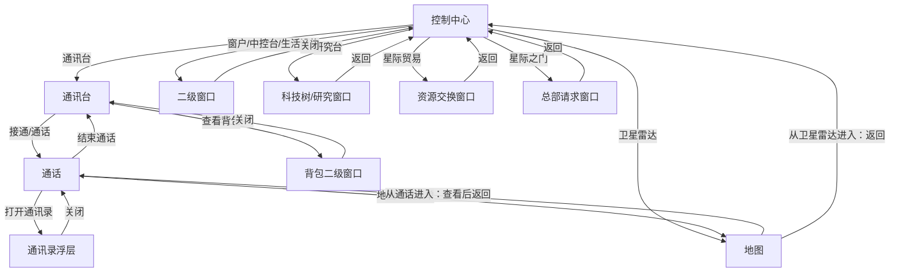

# UI 设计总览

本文档汇总游戏原型中的主要 UI 模块，目标是把草图整理成可开发、可验证的 PRD 式说明。`docs/ui-designs` 下的内容自包含，所有引用图片都位于 `assets` 目录。

## 页面与职责

| 页面 | 主要职责 | 关键操作 |
| --- | --- | --- |
| [控制中心](pages/控制中心.md) | 基地总入口，承载日常设施与主要系统入口。 | 查看窗外、使用生活设施、打开通讯台、查看资源状态、进入研究/贸易/星际之门等模块。 |
| [通讯台](pages/通讯台.md) | 角色通讯与任务入口，展示队员状态和可接通事件。 | 展开/收起通讯录、查看队员、接通来电、查看背包。 |
| [通话](pages/通话.md) | 承载基础行动确认、剧情选择和紧急事件决策。 | 选择回复、打开地图查看坐标信息、打开通讯录浮层、请求队员移动、待命、停止或调查；剧情动作由事件选项提供。 |
| [地图](pages/地图.md) | 展示星球地块、地块对象、特殊状态和队员状态。 | 选择坐标点、查看地形 / 天气 / 对象 / 状态 / 队员位置，不直接发起指令。 |

## 模块关系

控制中心是 UI 的主入口。页面内的设施分为三类：跳转到独立页面、打开二级窗口、预留后续系统入口。

| 起点 | 模块 | 目标 | 关系说明 |
| --- | --- | --- | --- |
| [控制中心](pages/控制中心.md) | 窗户 | 二级弹窗 | 点击后展示外部观察图片和环境描述，关闭后回到控制中心。 |
| [控制中心](pages/控制中心.md) | 通讯台 | [通讯台](pages/通讯台.md) | 点击后进入通讯台独立页面，用于查看通讯录、队员状态和来电。 |
| [控制中心](pages/控制中心.md) | 卫星雷达 | [地图](pages/地图.md) | 点击后进入地图页面，用于查看星球地块、地块对象、特殊状态和队员位置。 |
| [控制中心](pages/控制中心.md) | 中控台 | 二级弹窗 | 点击后展示资源、库存、基地状态和生产情况。 |
| [控制中心](pages/控制中心.md) | 咖啡机 | 二级弹窗 | 点击后展示喝咖啡交互，用于提供短文本反馈和沉浸感。 |
| [控制中心](pages/控制中心.md) | 音频终端 | 二级弹窗 | 点击后展示音乐切换交互。 |
| [控制中心](pages/控制中心.md) | 冰箱 | 二级弹窗 | 点击后展示吃东西交互，用于提供短文本反馈和沉浸感。 |
| [控制中心](pages/控制中心.md) | 研究台 | 科技树/研究窗口 | 点击后进入研究相关 UI，用于解锁后续设施、仪器或行动能力。 |
| [控制中心](pages/控制中心.md) | 星际贸易 | 资源交换窗口 | 点击后进入贸易 UI，用于资源交换。 |
| [控制中心](pages/控制中心.md) | 星际之门 | 总部请求窗口 | 点击后进入总部请求或人员获取相关 UI。 |
| [通讯台](pages/通讯台.md) | 通讯录 | 通讯录浮层 | 通讯录可展开/收起，展开后悬浮在通讯台页面上。 |
| [通讯台](pages/通讯台.md) | 队员卡片 | [通话](pages/通话.md) | 点击“接通”或“通话”后进入对应角色的通话页面。 |
| [通讯台](pages/通讯台.md) | 查看背包 | 背包二级窗口 | 点击后展示对应队员携带物。 |
| [通话](pages/通话.md) | 地图二级菜单 | [地图](pages/地图.md) | 通话中可以打开地图查看坐标、地形、对象、状态和队员位置；指令仍在通话页发起。 |
| [通话](pages/通话.md) | 通讯录 | 通讯录浮层 | 通话中可以打开通讯录查看其他队员状态；关闭后回到当前通话。 |
| [地图](pages/地图.md) | 坐标点 | 坐标详情面板 | 点击坐标后展示地形、天气、地块对象、特殊状态和队员状态。 |
| [地图](pages/地图.md) | 返回按钮 | [控制中心](pages/控制中心.md) 或 [通话](pages/通话.md) | 从卫星雷达进入时返回控制中心；从通话进入时返回当前通话。 |

页面之间的主要返回关系：

## 素材索引

- [控制中心草图](assets/控制中心.png)
- [通讯台通讯录草图](assets/通讯台-通讯录.png)
- [Garry 通话草图](assets/通讯录-通话.png)
- [Amy 通话草图](assets/通讯录-通话2.png)
- [地图草图](assets/地图.png)
